This weekend I've been on the Apex Challenge, which is a competition for teams of four (this time
in Castleton in the Peak District) where the teams involved have to navigate through a large
geographical area racking up points from taking part in various activities at bases set up all round
the mapped area. My team, Team Toe, went out to try and win the competition, and got off to a great
start...

Friday night was the start of the competition, where we had to all compete in a mini competition in
order to decide the starting positions (i.e. the team finishing first would set off first, the
second team a minute later and so on) and we finished third, which was a good start. The activity
was called The Glow Company Challenge, where (in the dark) we had to throw glow sticks to a member
of our team to catch in a fishing net, and they had to catch one of each colours. We finished in
under 3 minutes, and came third, so we were given our starting time of 10:02 for Saturday.

Saturday's event, the main part of the competition, which was to last 7 hours, from 10:02 to 5:02
(points deducted per minute late). We planned our route and completed a variety of bases and made
our way to several control points along the way to rack up the points total. At 4:00 (and hour
before we finished) we came across a guy who had broken his leg in a gully between the hills. Since
our team consisted of two qualified lifeguards, another one in training (all 3 trained by Richard
Garrett, a senior member of Woodseats Venture Unit with us), one with an SPA for climbing, and we
all have general first aid qualifications, so we sorted him out, got him into some warm clothes and
put a survival blanket round him, gave him some chocolate for the sugar and checked his leg out. His
ankle was quite bruised, so we carefully removed his shoe and sock, and gave him another sock.

We phoned the Mountain Rescue, as he needed to be taken out of there, and got cut off after
reporting the incident, without having told them our position, so we tried to reach them again, and
after unsuccessful attempts, a member of our group headed to the closest base to inform an organiser
so that he could contact the main Apex people on the walkie talkie and they could ring Mountain
Rescue with our grid reference. While he was gone we called 999 to try to get through to M.R. but
for some reason they said they couldn't put us through to them. Anyway, we had been talking with
the casualty, he was a first year student called Liam, studying History and English at Sheffield
Hallam University, originally from Nottingham. He was in shock, and shaking quite badly, so we
ensured he was warm enough and had the sugar inside him. He seemed alright under the circumstances.
The M.R. guys came along with their stretchers and sorted him out and took him to hospital.

We must have been waiting with him for over 2 hours, so we were obviously late returning for the
competition, and had missed out on a fair amount of points in our final hour of that part of the
contest, but they didn't penalise us for being late, and thanked and congratulated us for stopping
to help him out. We found out later that we were 2nd in the leaderboard up to then, so we did very
well considering we lost an hour!

Everyone else had had a long rest at the finish site before the Saturday night part of the
challenge, but we had to set off straight away when we got back, we did ok in it, but would have
done much better after a rest.

Sunday morning's activity was from 10:00 'til 1:00-ish, which consisted of a race completing two
bases; one canoeing (canadian open boat), which was cool, with 3 keen canoeists in our group
(well...kayakers, near enough) and then a walk back to the man base to complete an assault course,
and since parkour means that I practise that sort of thing (on different terrain lol) all the time,
I was loving it! An assault course made up of ladders, rope and things in between piles of bales of
hay. Great!

Anyway, we came 6th in total, out of 36 teams, which was pretty good, all things considered. We were
completely knackered on Saturday night and Sunday morning, so we couldn't really give it our all.
Regardless, we had a fantastic weekend, and although we came home prizeless, we enjoyed it and
actually dealt with a real life casualty in an actual real situation, which will add to our
experience.

I'm off to the Yorkshire Dales next weekend for my Duke of Edinburgh Gold expedition, which I've
been looking forward to for some time, it'll be a great way to spend the half term. We start at
skipton on Sunday morning (I'll be in Southport on Saturday for my Gran's 90th birthday! :O ). See
this page for a write-up (and vLog) of the 4-day expedition.

The Apex site has now been updated and now includes all the details of what happened on the event,
including an article about the rescue.

<dl class="gallery-item">
<dt class="gallery-icon portrait">
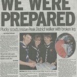
</dt></dl><dl class="gallery-item">
<dt class="gallery-icon landscape">
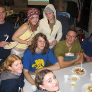
</dt></dl><dl class="gallery-item">
<dt class="gallery-icon landscape">
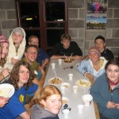
</dt></dl> <dl class="gallery-item">
<dt class="gallery-icon landscape">
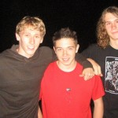
</dt></dl><dl class="gallery-item">
<dt class="gallery-icon landscape">
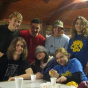
</dt></dl><dl class="gallery-item">
<dt class="gallery-icon landscape">
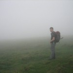
</dt></dl> <dl class="gallery-item">
<dt class="gallery-icon landscape">
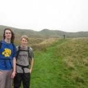
</dt></dl><dl class="gallery-item">
<dt class="gallery-icon landscape">
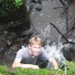
</dt></dl><dl class="gallery-item">
<dt class="gallery-icon landscape">
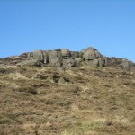
</dt></dl> <dl class="gallery-item">
<dt class="gallery-icon landscape">
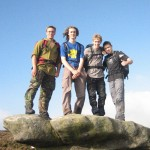
</dt></dl><dl class="gallery-item">
<dt class="gallery-icon portrait">
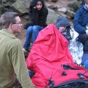
</dt></dl><dl class="gallery-item">
<dt class="gallery-icon portrait">
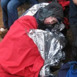
</dt></dl> <dl class="gallery-item">
<dt class="gallery-icon portrait">
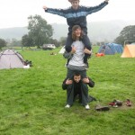
</dt></dl><dl class="gallery-item">
<dt class="gallery-icon portrait">
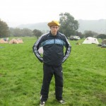
</dt></dl><dl class="gallery-item">
<dt class="gallery-icon landscape">

</dt></dl> <dl class="gallery-item">
<dt class="gallery-icon landscape">
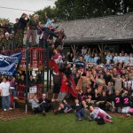
</dt></dl><dl class="gallery-item">
<dt class="gallery-icon portrait">
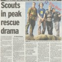
</dt></dl><dl class="gallery-item">
<dt class="gallery-icon landscape">
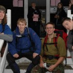
</dt></dl> 

Here are some links to the media coverage of the incident:

- "[Autumn 2006 Event -- Report](http://www.apexchallenge.co.uk/pastevents/autumn2006/report.htm)"
-- Apex Challenge website
- "[Hitting the Headlines](http://www.apexchallenge.co.uk/pastevents/autumn2006/mediacoverage.htm)"
-- Apex Challenge website
- "[Scouts Praised after Rescue
Drama](http://web.archive.org/web/20070812112629/http://www.scouts.org.uk/Features/Weekend/2006/16Oct10WE.htm)"
-- UK Scouts website
- "Scouts in Mountain Rescue Effort" -- Community Newswire
- "Scouts in peak rescue drama" -- Sheffield Star, page 5
- "We Were Prepared" -- Doncaster Star, pages 1 and 2
