[Sam Doyle](http://doylesmisadventures.blogspot.com/) got us the licence to do 'rope training' on
the viaduct at Millers Dale, so we took the chance to have a go at abseiling off the side and
towards the river.

Miles led the evening and him, Burdy, Bob and Batley were in charge of belaying.

<figure class="wp-block-image">
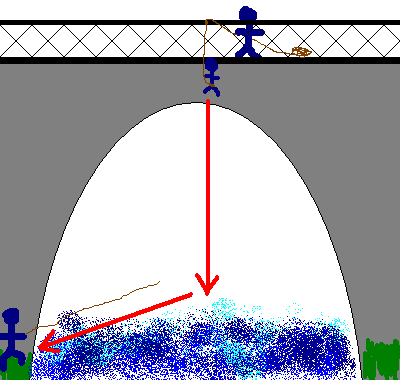
<figcaption>The Millers Dale Viaduct abseil. MS Paint.</figcaption>
</figure>

Basically, what you had to do was abseil the first few meters where there was brick to support them
with your feet, and then as you got to the point where there was no more brick (as seen on the red
line drawn on the picture above), you had to keep your feet on as you let your body drop more so you
didn't swing into the brick when you released your feet and smash your face in! Then once you'd
cleared the brick, you just had to lower yourself with the rope (all your support being in the
harness) until you were close enough to the surface that you could be pulled in from the bank by one
of the helpers. Oh and all this was done at night in pitch black.

Some people got a bit wet...either because they were stupid enough to lower themselves all the way
into the water, or because Miles decided that that person deserved a bit of a splash and hence
released a few extra meters of rope...

Here are some photos:

<dl class="gallery-item">
<dt class="gallery-icon landscape">
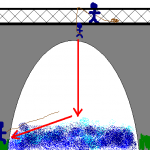
</dt></dl><dl class="gallery-item">
<dt class="gallery-icon portrait">

</dt></dl><dl class="gallery-item">
<dt class="gallery-icon portrait">
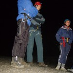
</dt></dl> <dl class="gallery-item">
<dt class="gallery-icon landscape">

</dt></dl><dl class="gallery-item">
<dt class="gallery-icon portrait">
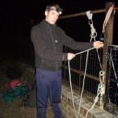
</dt></dl><dl class="gallery-item">
<dt class="gallery-icon landscape">
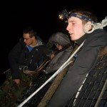
</dt></dl> <dl class="gallery-item">
<dt class="gallery-icon portrait">

</dt></dl><dl class="gallery-item">
<dt class="gallery-icon portrait">
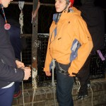
</dt></dl><dl class="gallery-item">
<dt class="gallery-icon portrait">

</dt></dl> <dl class="gallery-item">
<dt class="gallery-icon portrait">

</dt></dl><dl class="gallery-item">
<dt class="gallery-icon landscape">

</dt></dl><dl class="gallery-item">
<dt class="gallery-icon portrait">

</dt></dl> <dl class="gallery-item">
<dt class="gallery-icon landscape">
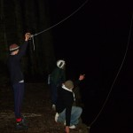
</dt></dl><dl class="gallery-item">
<dt class="gallery-icon landscape">
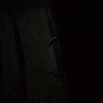
</dt></dl><dl class="gallery-item">
<dt class="gallery-icon landscape">

</dt></dl> <dl class="gallery-item">
<dt class="gallery-icon landscape">
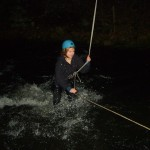
</dt></dl><dl class="gallery-item">
<dt class="gallery-icon landscape">
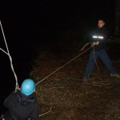
</dt></dl><dl class="gallery-item">
<dt class="gallery-icon portrait">

</dt></dl> <dl class="gallery-item">
<dt class="gallery-icon landscape">
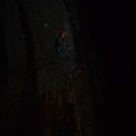
</dt></dl><dl class="gallery-item">
<dt class="gallery-icon landscape">

</dt></dl><dl class="gallery-item">
<dt class="gallery-icon landscape">

</dt></dl> <dl class="gallery-item">
<dt class="gallery-icon landscape">

</dt></dl><dl class="gallery-item">
<dt class="gallery-icon portrait">

</dt></dl><dl class="gallery-item">
<dt class="gallery-icon landscape">

</dt></dl> <dl class="gallery-item">
<dt class="gallery-icon landscape">
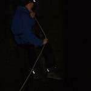
</dt></dl><dl class="gallery-item">
<dt class="gallery-icon landscape">
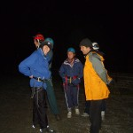
</dt></dl><dl class="gallery-item">
<dt class="gallery-icon portrait">
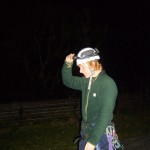
</dt></dl> <dl class="gallery-item">
<dt class="gallery-icon landscape">

</dt></dl><dl class="gallery-item">
<dt class="gallery-icon landscape">
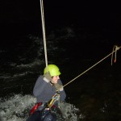
</dt></dl><dl class="gallery-item">
<dt class="gallery-icon landscape">

</dt></dl> <dl class="gallery-item">
<dt class="gallery-icon portrait">
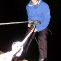
</dt></dl><dl class="gallery-item">
<dt class="gallery-icon portrait">

</dt></dl><dl class="gallery-item">
<dt class="gallery-icon portrait">
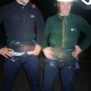
</dt></dl> <dl class="gallery-item">
<dt class="gallery-icon portrait">

</dt></dl><dl class="gallery-item">
<dt class="gallery-icon landscape">
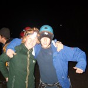
</dt></dl><dl class="gallery-item">
<dt class="gallery-icon landscape">

</dt></dl> 

