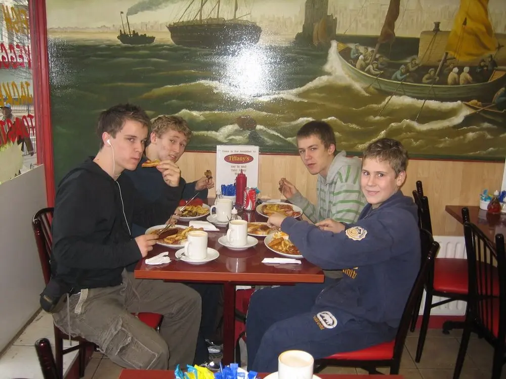

A small group of us had planned to meet up early for breakfast before the jam, and Shane and I had
also planned to make a vLog of the day's training for our blogs, but it turns out the stuff we
filmed of us doing the talking bits like introducing it weren't all that good, and Shane made a
video of the last 2 jams anyway, so there's going to be no vLog this time. We'll make one some other
time.

Paul came to train with us, and he brought Jak Sheen along with him, who (if you didn't already
know) is a 13-year-old masterpiece of an athlete. He's sponsored by UF (don't hold it against him
though), he's been doing parkour for about 18 months now and he's extremely mature about his
training, which is unbelievable for someone so young. He's really good at parkour and he even spends
dedicated sessions working on conditioning. He makes a few brief appearrances in the vid (first seen
at 1.10). Watch out for him: I created his blog for him last night, which he's going to be posting
write-ups, photos and videos of his training, achievements and media experiences lol. Check it out:
<a href="http://jaksheen-parkour.blogspot.com">http://jaksheen-parkour.blogspot.com</a>

<figure class="wp-block-image">

<figcaption>Shane, Me, Grant, Danny</figcaption>
</figure>

So we met up at 09:00 to go for breakfast (although Grant didn't show 'til 10, so we just warmed up
inside the bus station while waiting. Fried breakfast at Tiffany's was amazing, but I don't think we
should do it again, we should find some place healthier. We trained on the Odeon for a bit, in which
time I managed to encounter a pretty bad collision (as seen in slow motion at the very end of the
video).

It was a great day of training, nice to get together with Paul again, and great to meet Jak, the
little maestro. Shane and I, with the intention of vLogging the day, filmed a lot and got people to
film us together, which was cool, and it meant we got this vid out of it. Enjoy it, I did.

<figure>
<iframe width="560" height="315" src="https://www.youtube.com/embed/e6T_uhMTwPk?si=KEm4XKULk54dnXqw" title="YouTube video player" frameborder="0" allow="accelerometer; autoplay; clipboard-write; encrypted-media; gyroscope; picture-in-picture; web-share" referrerpolicy="strict-origin-when-cross-origin" allowfullscreen></iframe>
</figure>