Well, I'm in New York, New York. I frickin' love this place!

<figure class="wp-block-image">
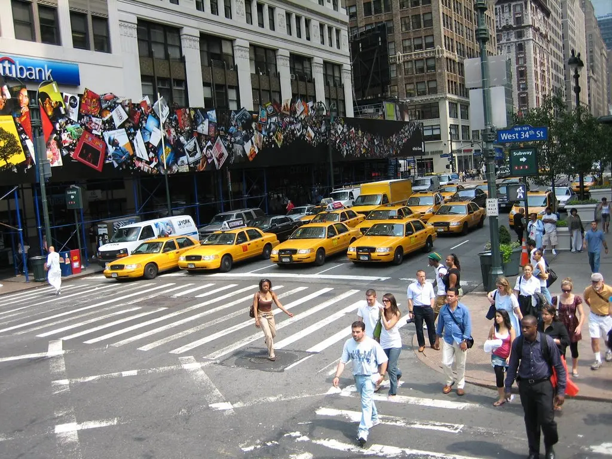
</figure>

Times Square has to be the coolest place I've ever seen in my life.

I haven't got time to write up what I've done so far, so I'll mention a few; today I went to
Grand Central Station and the Morgan Museum, I've also been up the Empire State Building, been to
'Ground Zero' (the World Trade Centre site), been on a helicopter around the edge of the city,
been to Ellis Island and the Statue of Liberty, the Hard Rock Café in Times Square and all the other
cool stuff. I did a bus tour and took many many photos with my new camera (Canon PowerShot SD450)
and went to the world's largest store, Macy's. In my opinion the worst store in the world, boring
as hell.

<figure id="gallery-2">
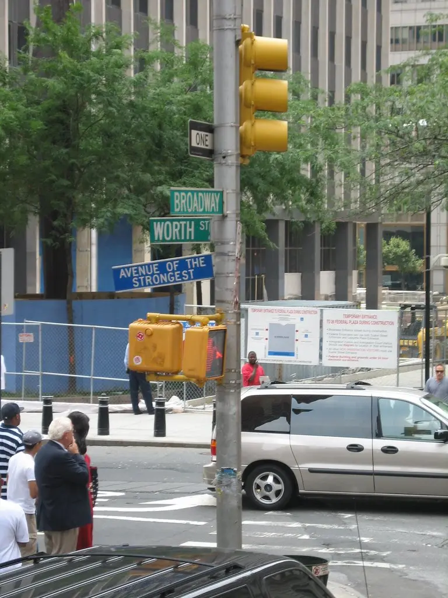
</figure>

<figure id="gallery-3">
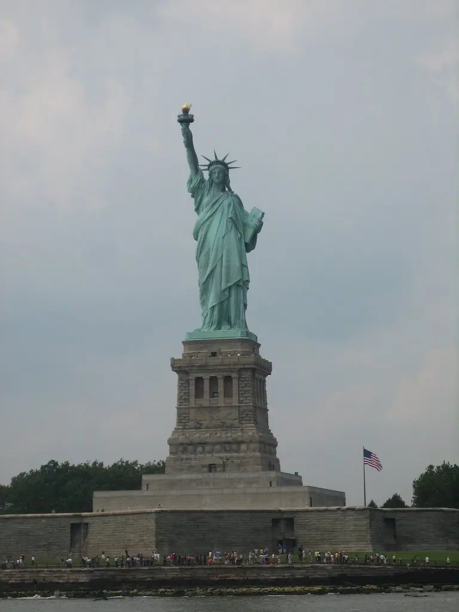
</figure>

<figure id="gallery-4">
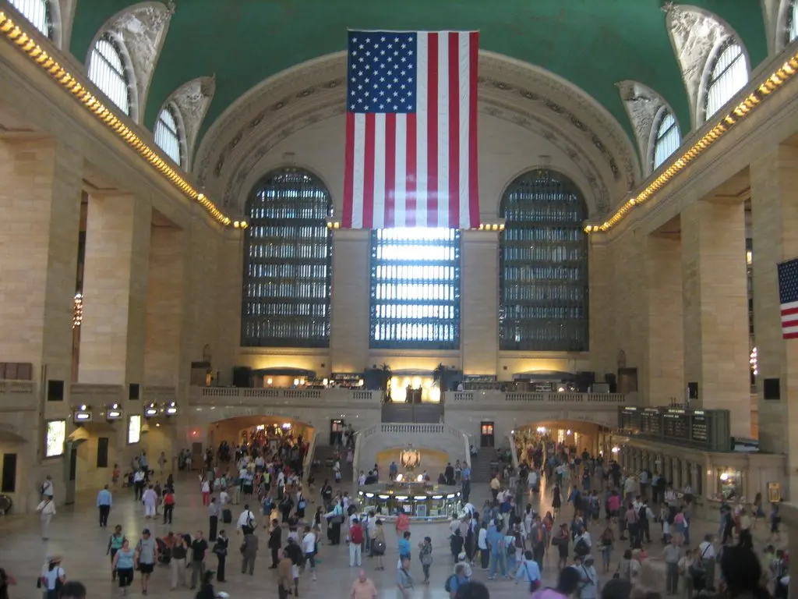
</figure>

<figure id="gallery-5">
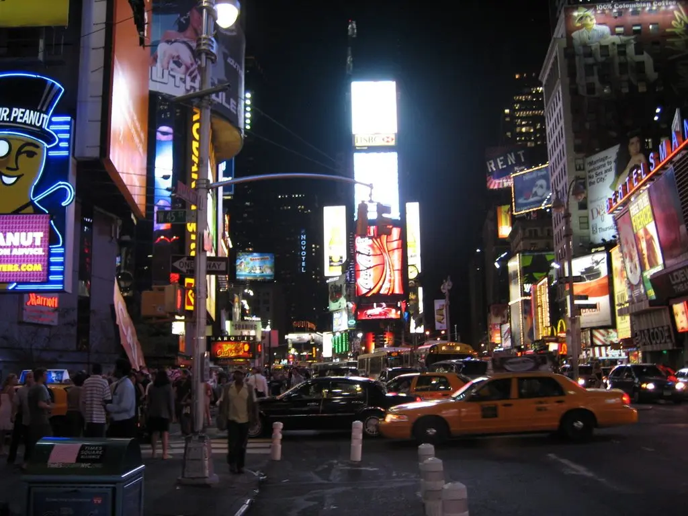
</figure>

<figure id="gallery-6">
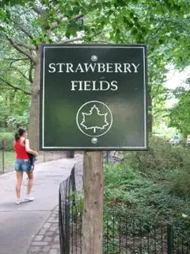
</figure>

<figure id="gallery-7">
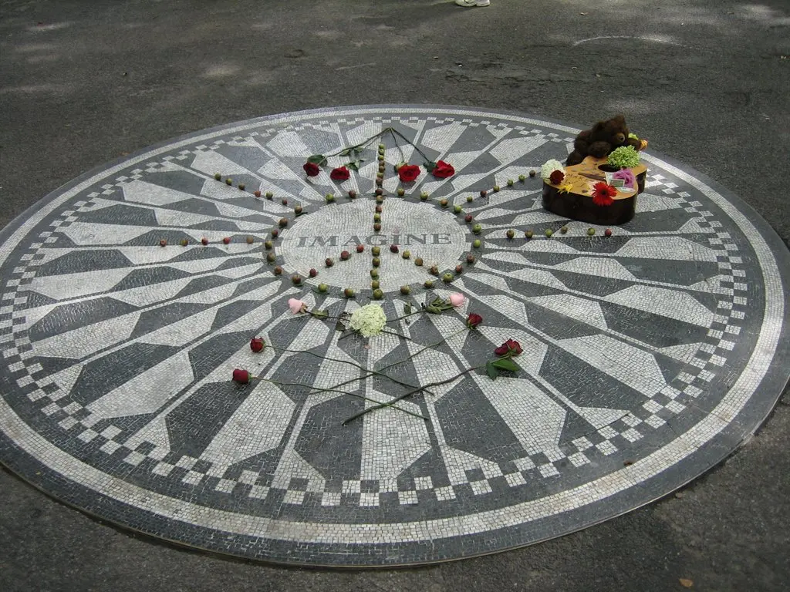
</figure>

<figure id="gallery-8">
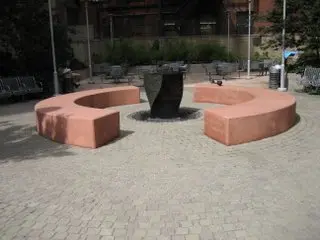
</figure>

<figure id="gallery-9">
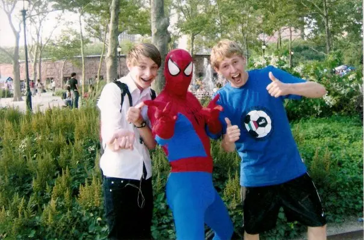
</figure>

<figure id="gallery-10">

</figure>

**Washington, D.C.**

I'm now in Washington for the weekend, came on the train from NY yesterday morning, going back
there on Monday morning, then staying in the Big Apple till Friday night. Woo!

Went for a wander yesterday once we'd located the Hotel and our rooms, and just happened to come
across the White House. It's pretty cool. Got many many photos since I got my camera. My parents
bought it me as an early 18th birthday present, it's a Canon Powershot SD-450. Perfect for what I
want it for. Will be shooting some parkour footage and getting some editing done.

<figure id="gallery2-1">
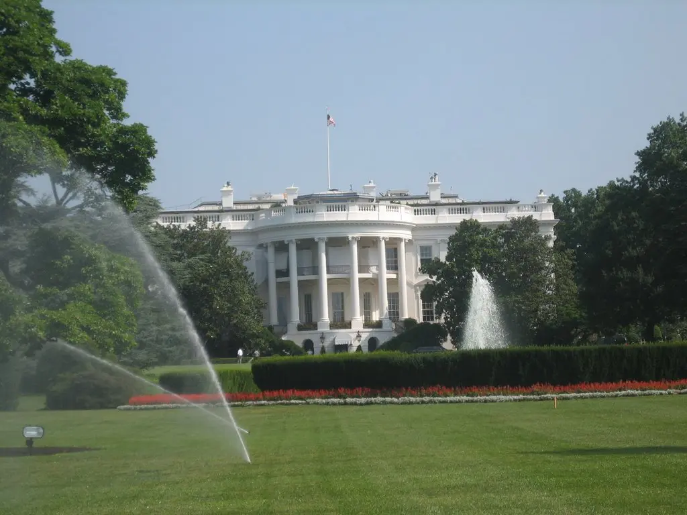
</figure>

<figure id="gallery2-2">
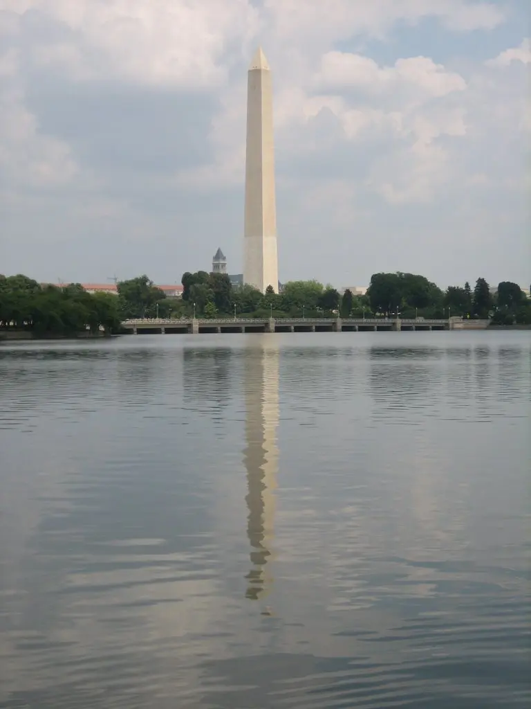
</figure>

**I'm back in the country!**

Got back today (Saturday). To start, here's the list of all the stuff I did in NYC and DC:

NYC:

- Empire State Building
- Statue of Liberty
- Ellis Island
- Times Square
- Chrysler Building
- Rockefeller Centre
- Broadway (I saw Lion King)
- Central Park
- Strawberry Fields (the John Lennon memorial part of CP)
- Dakota Building (where John got shot)
- Chinatown
- Little Italy
- Helicopter ride over NYC skyline
- Macy's (largest store in the world)
- The Hard Rock Café
- Ground Zero (WTC site)
- The Metropolitan Museum of Art
- The Morgan Library and Museum
- Madame Tussuards
- Staten Island Ferry
- Brooklyn Bridge

Washington D.C.:

- Washington Monument
- The White House, and visitors' centre
- JFK Grave in Arlington Cemetery
- The Hard Rock Café
- Senate Building
- FDR Memorial park (Roosevelt)
- Scouts Monument
- Post Office tower with view of Washington
- Lincoln Memorial
- Columbas Monument
- and many many more Monuments...