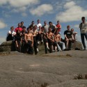

**Thursday in Sheffield**

It's Thursday night now, I'm about to go to bed ready for tomorrow's day in the Peak District.

Today was a brilliant day of parkour; Will and I met up with Jin, Jason and two other traceurs from
Cambridge, we trained from 1:00pm till about 8:00pm, it was fantastic. The four of them had a mound
of camping gear with them, including a six-man tent and all their necessary items for the whole
weekend, we split the load between us and headed up to Hallam to start warming up.

I just happened to bump into my older brother on Hallam as we were warming up, which was nice, and
he enjoyed seeing some parkour in action. We moved on to the Odeon shortly after, where we must have
spent a considerable amount of time training, within which, Jason unfortunately clipped his knee
awkwardly on a wall on his way back from attempting a sizey kong-to-precision (or...'cat precision'
I think they call it...), which kept his mostly out of action the rest of the session, but he still
got to see the Sheffield spots, and took particular liking to one in particular, I'm sure he'll be
out there giving it his all when he next gets the chance.

We went all round from Hallam to Sheffield Uni and the English Department, hitting the spots we knew
we could train on without causing any grief, as it was a weekday. Jin owned everything. Need I say
more?

It was great to train with Jin today, he's great to watch and learn from, and is very inspiring.
He's a nice guy to hang with too, I look forward to training with him on a regular basis. Sheffield
has so much to offer him over the next four years lol...

Tomorrow is training in Hathersage and Grindleford. I'm training from about 2:00pm when my school
trip (in Grindleford...) is over, and everyone else goes home, I get to join the group, tag along
and get on with the rural training.

Saturday will be awesome, and better still if it' some of those amazingly summery days, like
03/03/06. That was fantastic. It will be nice to show others around Sheffield, see what
possibilities they see and what they think of the sort of thing we do here. We love it, so will
they.

**Friday in the Peak District**

Yesterday I joined the group at Padley Gorge, we did some training on the rocks along the stream. It
was fantastic, I was so impressed at what that part of the Peak District had to offer in that
respect.

It was nice to meet those I know from Northern Parkour, but have never actually met; Lee and Psi.
They were both very pleasant and I noticed that after introducing ourselves to each other, in both
cases, we were immediately able to interact in a way that you would expect we train with each other
all the time, it was just that we were both able to train and discuss techniques etc as if we knew
each other well and trained regularly together, but I literally just knew their names, nothing more,
and we were able to share the love for parkour straight off. A bit long-winded, but you know what
I'm trying to say.

Looking forward to today's jam in Sheffield. I set off in about 10 minutes. Should be good training
with Dave and Paul there again, as well as Jin, Jason, Liv and the others.

Sam Corbett from Leek Parkour is coming to stay over as I offered to accommodate him for the night
so that it was possible for him to come to join the action. He's getting the train with me to
Manchester tomorrow too.

Photos courtesy of [Jin's blog](http://jinetics.blogspot.co.uk/2006/07/peak-district-trip.html):

<dl class="gallery-item">
<dt class="gallery-icon landscape">

</dt></dl><dl class="gallery-item">
<dt class="gallery-icon landscape">

</dt></dl><dl class="gallery-item">
<dt class="gallery-icon landscape">

</dt></dl> <dl class="gallery-item">
<dt class="gallery-icon landscape">

</dt></dl><dl class="gallery-item">
<dt class="gallery-icon landscape">

</dt></dl><dl class="gallery-item">
<dt class="gallery-icon portrait">

</dt></dl> 

**Saturday in Sheffield**

Today didn't go as well as it was meant to, but nevertheless I got some good training in with Paul.
Dave and the others at the campsite got up at 5:30am to go train at Padley Gorge, so they were all
exhausted by the time they got to Sheffield and weren't up to much at all. Also, Jason did his knee
in again that morning, unfortunately.

Manchester tomorrow should be good. Hopefully there'll be a nice selection of people there, none of
that messing about sort. Paul really wants to split tomorrow's group into groups so that we all get
more done, he says there's some other stuff he wants to show me that he hasn't taken me to yet.

I was telling Will 2 (from York – 'Razorhelm' on the forums) of how much I love training with Paul,
and that we're really on the same level of ability and skill, and how I realized that I go off and
train and learn in Sheffield, he trains and learns in Manchester, and then we meet up every now and
then and just...synchronize. We show each other what we've learned and the styles we've picked up,
the tips we've found out and all that sort of thing, and just help each other out in that respect.
It works really well.

Me, Sam, Danny, Will, Will and Will will be meeting Will at Manchester station tomorrow, we're all
getting the train together tomorrow and Wings (the fourth Will I mentioned) is meeting us at the
station in Manchester to go to UMIST with us.

Me and Sam have been watching all the parkour videos on my computer since we got back.

**Sunday in Manchester**

A fantastic day of training today!

Parkour in Manchester is a love of mine, and I got the chance to train in a small group of dedicated
practitioners, which is ideal, including Paul, Danny, Will, Will and Will. I think four straight
days (Five out of the past Six days) of solid training is more than I am used to, but it didn't kill
me, it made me stronger. I feel like I was achieving more and more right to the very end, even as
people were thinking of going to get the train, Will (original) and I were still practising and
gaining more out of the day, oh and Paul was with us at that point too (it seems so long ago...). I
was going for a standing rail-kong to precision round the corner from the main meetup with the
benches at UMIST, I hit it two or three times and bounced back, but I'm certain I can make the
distance fully next time. After all, it was at the end of four days' hard training.

Where there's a Will there's a way!

Well we had four Wills with us, so we were alright in that respect. Will (original, from Sheffield),
Will 1 (York) and Will 2 (York – Razorhelm) came with us on the train, and we met Will (Wings) later
on in the day. JK and Sam Corbett came on the train with us too.

The day's parkour started with some wallruns at Castlefield (videos to be posted) after a warm-up at
the Spar. Will decided to go for the wallruns with minimum run up, which I joined him in doing,
which was successful, to the extent that we could get the top hold with about three/four steps.

We visited some nice spots (thanks for that, Paul!) and did some funky shit between the few of us. I
personally enjoyed my standing rail-kong to precisions all over the place, as I've been practising
them for some time now, I rather liked the look of Danny's kong-to-cat attempts, I actually branded
that as a no-go, but he was getting close! Everything of Will's was supernatural as usual, but I
particularly liked his running kongs, and of course his bail! Yes, really. Will couldn't quite get
enough of himself onto the ledge after a rail-kong over a gap, and fell backwards into the gap,
using his arms to break his fall on both sides of the gap, which resulted in him landing softly
enough to have not done himself any harm. He got back up and did it again.

The other Will (Razorhelm)'s speeds were impressive, and I was moved by his catleap onto the rock at
the Geological gardens. Speaking of which, I did my dash again, after about 30 attempts! It took me
soooo long to actually get myself over the wall and perform the vault. I was really showing
tiredness by then.

Thanks to everyone who turned up, especially the ones I trained with today, it was a superb group.

An uber huge thanks to Dave for organising this whole gathering weekend. I know all the people I
spoke to enjoyed it and learned from the other attendees. Well done, Dave. It was a fantastic event!
Thanks.

<iframe width="560" height="315" src="https://www.youtube.com/embed/AYKhO5t6AG0?si=85E8gj__jkpbmrx1" title="YouTube video player" frameborder="0" allow="accelerometer; autoplay; clipboard-write; encrypted-media; gyroscope; picture-in-picture; web-share" referrerpolicy="strict-origin-when-cross-origin" allowfullscreen></iframe>