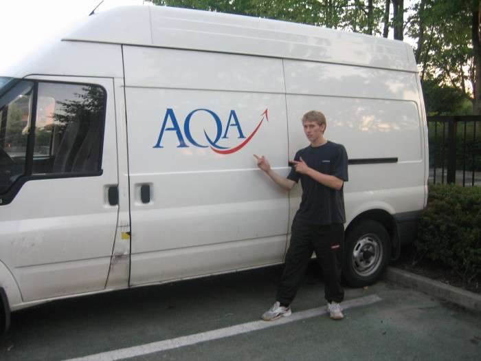

Had an absolutely brilliant time in Manchester this weekend.

Will, Dez and I saw Motion City Soundtrack at the Manchester Academy, and they totally rocked,
supported by OK Go, who were pretty cool too (they even did a dance while we were waiting for MCS to
come on!)

After the gig finished, we realized we had about 20 mins to get back to the station before the last
train, so we made our way straight out, and ended up breaking into a run...  
When we finally got to the station, I ran in to see which platform we were meant to be at, and it
was number 13...right at the back of the station, completely out of the way, we had to go across all
those flat escalator things, get past all the people, and when I finally got to the platform (at
this point I'm feeling like Harry Potter at Platform 9¾) there was a train in but before I could
think twice about it being the right one, it set off. We missed the last train. Will had to catch me
and Dez up anyway, so we wouldn't have been able to get on it, but I was damn close!

Anyway, Will's Mum had offered to give us a lift if we missed it, so we phoned her and she kindly
drove from Macclesfield to collect us.

Saturday, we finally got into Manchester after waiting 45 mins for a train, which turned out to be
packed to the rafters with football fans off to the Man City – West Ham game at the City of
Manchester Stadium, and when we got there, Will decided to ignore me when I stated that UMIST, where
we were meeting Dave and the others, was a mere 5 minute walk out of the station, so we ended up
miles away at the other end of the city centre, until we found a map and I pointed out how far away
from it we actually were, so I directed us back to the Morton Lab where Paul had said they had moved
on to. Half One, we got there.

<figure class="wp-block-image">

</figure>

Despite our late appearance at the jam, we had a great time, did some good training and got lots of
free water from pubs we passed by. Later on in the day I managed to injure my foot, which
unfortunately meant I wasn't upto much the rest of that day, or even for the Sunday, but I did what
I could under the circumstances, we spent a considerable amount of time in trees across the two
days, which was fun, and I picked up a thing or two from treeing with Dave.

I stayed at Dave's on the Saturday night so, inadvertently, we spent the entire evening watching the
archive of parkour videos on his PC, which was a great laugh considering the disgraceful content of
some of the very first footage from Sheffield, one in particular where Paul and Simon had made the
trip to meet up with a few of the Sheffield lot, and filmed throughout the day, it mainly contained
Lewis (in his cap, gloves and infamous UF hoody), Shane, Riccardo and James.

It pissed it down on Sunday morning, so we waited for it to dry up a bit before going back out to
train, which meant my foot got plenty of time for rest. We watched more and more parkour vids, and
also scenes from B13 and Yamakasi, neither of which I have seen in full before. We made our own
muesli for breakfast that morning, which is what Dave does every day, and it was great!

We walked to UMIST from Dave's once it had cleared up, and it was much nicer at this point, and we
warmed up for about half an hour whilst waiting for Paul and Dean. Paul came along at 5:00 as
planned but Dean couldn't make it, and we went on to Morton Lab, then over to the new tic-tac they
wanted to show me, which was sweet. We went to some trees in a park, and headed to Paul's car to get
to the gym.

The gym seemed smaller than I had expected, as I've seen a fair bit of footage in there, but it was
still bigger than Steel City Gym that we go to. We had a great session, drilled kongs for quite some
time, did some strength stuff on the bars, we created a short circuit and aimed to complete ten
rounds; I think Paul and I did 11 but Dave went on to complete 20! They showed me some other
exercise and strength stuff they do, including stuff they picked up from their Lisses trip, which I
found informative and useful. Some of it was really hard to perform, but with repetitive trial and
practise, could turn out to do me a lot of good.

Got the train back as Paul dropped me and Dave off at the station in Stockport, and went home. I'm
resting my foot all this week, but should be fine for Saturday's jam, whether it be in Sheffield
City Centre as usual or up at Tapton flats as was suggested.

Here's the video of the weekend:

<figure class="wp-block-image">
<iframe width="560" height="315" src="https://www.youtube.com/embed/4v09nH-QoBw?si=zE60y1yunuDEEe84" title="YouTube video player" frameborder="0" allow="accelerometer; autoplay; clipboard-write; encrypted-media; gyroscope; picture-in-picture; web-share" referrerpolicy="strict-origin-when-cross-origin" allowfullscreen></iframe>
</figure>