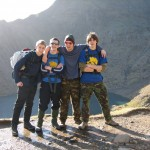
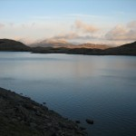
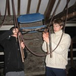

I went to Wales for a weekend in half term with
the [WVU](http://www.woodseatsventureunit.com/) Network. I
summited [Snowdon](http://en.wikipedia.org/wiki/Snowdon) (the highest mountain in Wales) for the
first time, which was great, even though it is a bit touristy.

Photos:

<dl class="gallery-item">
<dt class="gallery-icon landscape">

</dt></dl><dl class="gallery-item">
<dt class="gallery-icon landscape">

</dt></dl><dl class="gallery-item">
<dt class="gallery-icon landscape">

</dt></dl> <dl class="gallery-item">
<dt class="gallery-icon landscape">

</dt></dl><dl class="gallery-item">
<dt class="gallery-icon landscape">

</dt></dl><dl class="gallery-item">
<dt class="gallery-icon landscape">

</dt></dl> <dl class="gallery-item">
<dt class="gallery-icon portrait">

</dt></dl><dl class="gallery-item">
<dt class="gallery-icon portrait">

</dt></dl><dl class="gallery-item">
<dt class="gallery-icon landscape">

</dt></dl> <dl class="gallery-item">
<dt class="gallery-icon landscape">

</dt></dl><dl class="gallery-item">
<dt class="gallery-icon portrait">

</dt></dl>
 

And here's the video:

<figure class="wp-block-image">
<iframe width="560" height="315" src="https://www.youtube.com/embed/0txcqCo9CgY?si=-AF0e9t7QqpYphmL" title="YouTube video player" frameborder="0" allow="accelerometer; autoplay; clipboard-write; encrypted-media; gyroscope; picture-in-picture; web-share" referrerpolicy="strict-origin-when-cross-origin" allowfullscreen></iframe>
</figure>