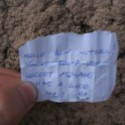

For those of you who don't know, Lisses is a suburb of Paris and it is where Parkour began. David
Belle, the founder of the French discipline, lived there and began to develop the art of movement
from his background in gymnastics, athletics and martial arts.

Me, Danny and Scott met up in Sheffield bus station and got the coach to London, where we met up
with Sam and Kai and got the Eurostar to Paris, where we got a couple of trains (which were double
decker, might I add!) to Evry Courcouronnes and tried to find our way to the hotel in Lisses. After
an hour or so of walking through the Parisian suburbs in the dark, I was starting to get a little
concerned, we went on...and on...and on...until suddenly Danny shouted out in ecstasy "it's there –
the Dame Du Lac!" which I took me be a good sign immediately, seeing as we'd been told that the
hotel was a short walk from the Dame. (Note: the Dame Du Lac (Lady of the Lake) is a man-made
architectural climbing structure in the Park Du Lac (Park of the Lake), which is commonly used to
practise parkour on)

We eventually found the hotel and sorted our rooms out, showered and went out in search for food,
the venture lasted hours and we found nowhere open (this was a Sunday evening) so we went back to
the hotel, depressed and starved, and treated ourselves to one of Sam's cereal bars each. Not a
great start. Our first day of training started with going to the Dame Du Lac and seeing it in
daylight in all its magnificent glory for the very first time. There was something bothering me all
day; I wasn't in the mood for training, I felt tired, aggravated and my ankle wasn't comfortable
with me doing much else than walking. The first day passed and I was surprisingly depressed to say I
was in Lisses.

The second day came and after a warm up and a jog round the town I felt fresh and rearing to go!
After doing a few cat pass precisions I'd seen the day before I was feeling incredible, exactly the
way I knew I should have felt. The whole day's training was great. The next few days went by and we
hit all the spots around the town we were aware of and we were all simply in awe at how perfect the
place was, it's like it was *meant to be* that parkour was created and practised there – everything
about Lisses and its surrounding areas is perfect for practising parkour movements and performing
natural training; the architecture of the flats, the streets, the rocks and trees that were
positioned as though they were meant to be used for this purpose, the forest which has about a dozen
different man-made training resources placed around the course of the path – pull-up bars, monkey
bars, balance beams, stepping-stone tree-stumps – like a £40-a-month gym membership all made from
wood and free for anyone to use anytime day or night!

After a few days of being undecided whether I'd make it to the top of the Dame, I conquered my fear
and went for it, I was shaking like mad when I got to the platform at the top and Sam and Scott met
me up there, I felt awesome for having made it but had an anxious scared feeling of being up there
and having to come down, as I knew it would be even harder to get down than come up. Both up and
down are a huge mental challenge. I'd even go as far to say doing it was one of the hardest things
I've ever done in my life, purely on the mental block factor. Oh and it was bloody windy up there!
Anyway I took it carefully and slowly and obviously since I'm sat here telling you about it I made
it down no problem. I went back up again the next day, which was much easier, as was coming down,
although I still had to be cautious and take it easy. The day after I went up twice more, each time
felt more comfortable. I only went up the left hand side, so next year I think the challenge will be
to try out one or two of the alternative routes.

Half way through the week we went into Evry and saw that the spots there were next to the station we
walked to the hotel from on the first night (it took us about 30 minutes this time, the more direct
route!), and we found the University spot next to the Cathedral (which is the weirdest looking
Cathedral I've ever seen! See picture below). Anyway, Evry has the sickest spots! Just two massive
areas next to each other with a whole range of jumps, vaults and combinations to try out! I managed
to do the famous cat pass precision with the three walls where you clear the middle wall, and I also
made a sizey level cat pass precision next to it.

One night we decided to go and check out the forest, and did some light conditioning on the man-made
structures, we did cat crawls, balances, precisions, runs across the tree stumps, and literally
"hung out" on the monkey bars. We returned the following afternoon to see what it was like by
daylight and had great fun on the exercise equipment, and even joined on the back of a French
running group's workout session!

One day when we started at the Dame, as I was walking along the side of the lake I spotted a dead
fish floating at the side of the water, and decided I wanted to "fish" it out, so I reached in with
sticks and things to try and lure it closer to the edge for me to pick up out, and after a good fuve
minutes' hard work trying to get it close enough to get hold of it, I managed to get it in my hand,
then I decided to take it with me up to the top of the Dame. I put it in a carrier bag, put it in my
pocket and set off for the top! I left it up there for someone else to find it amazed shock and
confusion, and the next evening I was talking to the Portuguese guys from the hotel about how I hate
Urban Freeflow and it turned out 3 of them were part of UF, which sounds like it could have been
awkward but they understood my reasoning, and anyway, one of them mentioned they'd been to the Dame
that afternoon, so I asked if he'd been to the top and he said he couldn't go to the Dame without
going to the top, and I asked if there was anything up there and he said in exclamation "Yeh! There
was a FISH up there!" and I laughed and said I put it there. He said he thought a bird had flown it
there or something. Adventures with me with the fish are featured in the video. I have to say I
think I'm the first person to have taken a fish up to the top of the Dame Du Lac.

On our last day of training, the Saturday, we trained in Lisses in the morning and I managed to pull
off a laché-type manoeuvre that I saw Dave do in the [Northern Parkour Lisses Trip 2006
video](http://uk.youtube.com/watch?v=ujTU2JpuBIY), which you'll see in the video at 01:50. Then we
headed into Evry and bumped into some local traceurs we'd trained with earlier in the week, then saw
a couple of guys who train in Evry with the Yamakasi. I was telling one of them about the guy who
Danny and Paul met last year who claimed to be Yann Hnautra (co-founder of the Yamakasi, as seen in
their films) and that they met him again this year, and he said that they were aware of the fake,
and just then, a bulked up guy came round the corner and he said "oh, here's Yann". It was the real
Yann. His wife came along with their 2 year-old son and I asked him if his son does parkour and he
said he does a bit. Yann played with his son and then got his guitar out and started performing like
a busker.

During a bit of training with the guys we'd met earlier, Danny had done a cat pass precision and the
guy we were with liked it and tried it a few times before making it, and Danny turned to us all with
a smug look on his face and said "I'm better than the Yamakasi" and we all burst out laughing and
explained that this guy wasn't part of the Yamakasi, he just trains with them, he's been training
just a few years like us as opposed to the 20 years the Yamakasi have been practising!

I tried to find the secret message at the Dame, featured in the post before this one, and discovered
that it had been replaced by the guy who found it with his own message, so I took it home as a
keepsake and replaced it with my own message. Cool, eh?

We were gutted to have to leave on the Sunday, but it had been such a rewarding trip – we'd all
learned so much, achieved so much and experienced so much, it was everything we hoped it would be
and more. The only disappointment for me was that we didn't meet and train with many other people.
We briefly trained with the local French guys, the Portuguese UF guys, one Polish guy and the
Yamakasi followers, but no-one else, not even from the UK. I was expecting the place to be flooded
with traceurs from all over Europe. I was hoping that David Belle would come home from the [Airwaves
Parkour Event in Berlin](http://saiyangarden.blogspot.com/2007/08/airwaves-parkour-night.html) and
be out training in Lisses, but we heard from the guy in Evry that he was visiting his sister in
Iceland after the thing in Berlin :(. Maybe next year I'll get to meet him...

We had to head off early on Sunday morning to give us plenty of time to get to Paris to get the
Eurostar back to London, so we didn't get chance to train in Lisses before departing. We were lucky
with the trains and got to Paris with 3 hours to spare so we did some buildering and skimmed rocks
on the river until it was time to go. We then had a couple of hours spare in London before our coach
so we trained around imax and South Bank which made me realise how much I'd love to go to train in
London, it truly is a great place for parkour. We got so carried away with training that the time
flew and when I checked the time we only had half an hour before our coach left, so we had to run
for a taxi...or get the Underground...or anything to get there as soon as we could, and after 15
minutes of trying to work out the quickest way, and then realising there was a huge queue for taxis,
we ran through and bought Underground tickets, sprinted to get on a tube, it was only a few stops
(Piccadilly to Victoria) but included a changeover, and what didn't help was that there was a
closure on the stop we needed to get to, so we had to go an extra stop before changing, and then
when we finally got to Victoria, a couple of minutes after the coach departure time, I saw the coach
to Sheffield down the road, sprinted to catch up with it at the traffic lights and asked if we could
get on, but they'd filled it up, I guess they sold our seats off. We went into the station to see if
we could get on another coach and we could get another one an hour later but we had to pay £15 each
for the tickets, which was more than we'd paid online for the return journey! We managed to get home
on that next coach no problem.

<figure class="wp-block-image">
<iframe width="560" height="315" src="https://www.youtube.com/embed/8nThFKp55zk?si=ZW5ycBHpus71yDLX" title="YouTube video player" frameborder="0" allow="accelerometer; autoplay; clipboard-write; encrypted-media; gyroscope; picture-in-picture; web-share" referrerpolicy="strict-origin-when-cross-origin" allowfullscreen></iframe>
</figure>

<dl class="gallery-item">
<dt class="gallery-icon portrait">

</dt></dl><dl class="gallery-item">
<dt class="gallery-icon landscape">

</dt></dl><dl class="gallery-item">
<dt class="gallery-icon landscape">

</dt></dl> <dl class="gallery-item">
<dt class="gallery-icon landscape">

</dt></dl><dl class="gallery-item">
<dt class="gallery-icon portrait">

</dt></dl><dl class="gallery-item">
<dt class="gallery-icon landscape">

</dt></dl> <dl class="gallery-item">
<dt class="gallery-icon landscape">

</dt></dl><dl class="gallery-item">
<dt class="gallery-icon portrait">

</dt></dl><dl class="gallery-item">
<dt class="gallery-icon landscape">

</dt></dl> <dl class="gallery-item">
<dt class="gallery-icon landscape">

</dt></dl><dl class="gallery-item">
<dt class="gallery-icon landscape">

</dt></dl><dl class="gallery-item">
<dt class="gallery-icon portrait">

</dt></dl> <dl class="gallery-item">
<dt class="gallery-icon landscape">

</dt></dl><dl class="gallery-item">
<dt class="gallery-icon landscape">

</dt></dl>
 

