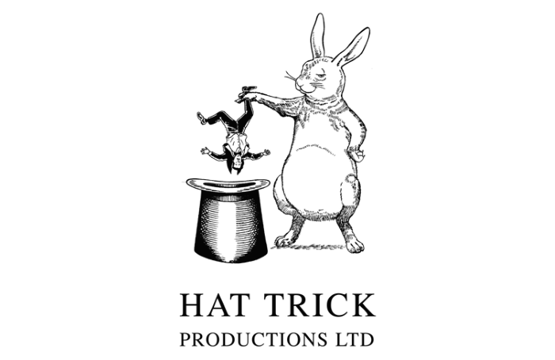
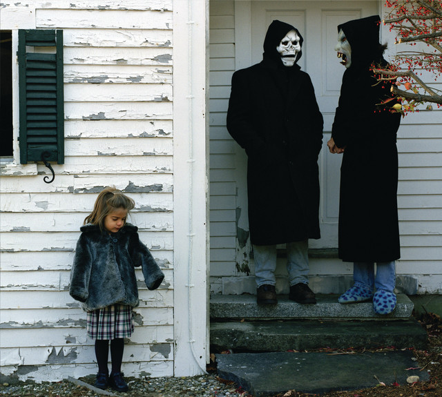

Saturday 3rd February - training and filming in Manchester with
[Hat Trick Productions](http://www.hattrick.com/) for a
[Channel 4 programme](http://en.wikipedia.org/wiki/Channel_4) called 'A Slice of Life', which is not
a programme about parkour, rather it is made up of sections, parkour being one for them. I'm not
sure when it'll be broadcast, I'll keep you posted.

<figure class="wp-block-image">

</figure>

Dave kindly gave me, Will and Jin a lift, and Lukos brought JC in his car with him so there was a
nice sprinkling of Sheffield in there. A great day of training with the Manchester lads. I'm seeing
Paul, Jak, Dean, Freeman and the others all the time these days, it's always nice to see, chat with
and train with them. My ankle's a lot better, but I still felt restricted with it so couldn't do
everything I would have liked, as it was with Will and Paul being injured, we ended up concentrating
mostly on strength training.

The guys from Hat Trick seemed to be more interested in the fact that we put so much effort into
working on strength and conditioning, and that we performed these exercises (which seemed unusual to
them) outdoors in public as a part of our training schedule, so rather than filming spectacular
jumps and eye-catching acrobatics like the media usually capture, they went for the strength
training and dedication side of things.

Tuesday 6th February - Seeing Brand New at the Apollo in Manchester with Shane and Dez. A really
good performance from Brand New, although the supporting band were shocking. Anyway, the reason I'm
blogging this is because at 12:10 that night, 10 minutes before our train, we noticed that on the
info screen at the station, we were getting a bus rather than a train, and to cut a long story
short, after waiting for the bus, it got full, leaving a group of us behind, so after a lot of
waiting they managed to get 5 or so taxis to take the remaining groups back to Sheffield.

<figure class="wp-block-image">

</figure>

Our taxi consisted of Shane, Dez and myself in the back, and some random Chinese guy in the
passenger seat. That guy was kinda weird. The driver asked us if we'd been to a gig, and got talking
to us, then asked the Chinese guy if he'd been to the gig too, to which re replied "Yes,
yes...I come to Manchester to see my sister!", which indicated to me that he blatantly hadn't been
to the gig. He asked the driver "can you get us there?" in quite a panic, and later revealed that he
was "making joke".

What a crazy guy. Anyway, we got back to Sheffield at 2am and had a leisurely 30 minute
jog/walk/jog/walk back to Dez's "pad" where Shane and I had a good five or so hours' sleep before
getting up to go to school/college.

I'd been telling Dez on the way home about the amazing day I had to look forward to, which went: C2,
Mechanics, Tutorial (waste of time), Business, lunch, General Studies (waste of time), then after
hours Business. I went straight to sleep when I got home.

A final word from me is about tomorrow's Hell Night (conditioning session with Jin and Will), my
second session, I'm going to be pushing myself (as well as being pushed to train my ass off by Jin)
and making sure I complete a sufficient number of rounds of each exercise. :D