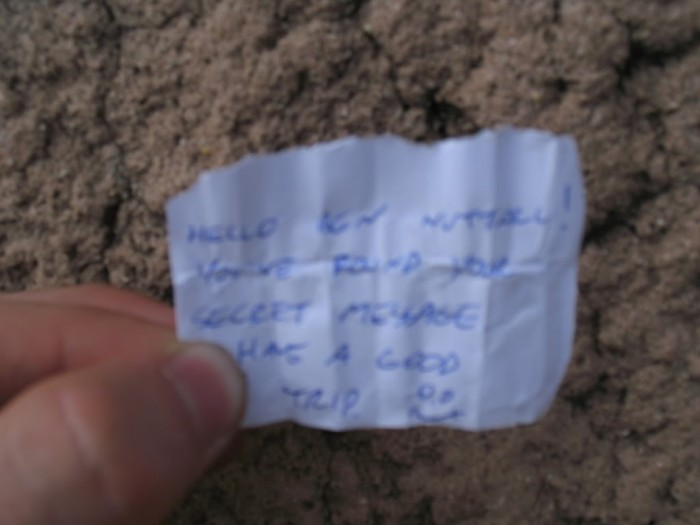

Danny and [Paul](http://www.obsidianpkav.blogspot.com/) went on their Lisses (France) trip last week
and had promised to leave me a sign of some sort that I would see or find when I go next week. Danny
told me that he had left something written on paper in the tunnel part on the Dame Du Lac, and that
I would have to know where it was to come across it.

This evening someone added me on MSN, and I thought it would be the usual "I like parkour – how do I
get started" that I get a lot of, but the guy said "hey – u must be the guy lol – 1 sec.... found
something on the dame du lac..." (at which point I immediately guessed what he was referring to, and
was shocked!) and then sent me this photo he had taken just a few days before:

<figure class="wp-block-image">

</figure>

That is all that was written on the paper so the guy decided to Google my name in search for me, and
he came across this site which contains my msn address.

I explained that Danny had arranged to leave something for me and he said that he put it back where
it was hidden after having removed it for the photo. He said that it would have been nearly
impossible to find unless you knew where it was hidden, and that it was just a coincidence that he
came across it as he was leaning over to pass something to a mate.

I thought it was great of this guy to seek me out to send me the picture. It was weird for me to
have been added by a random guy who just happened to have found the piece of paper I was planning to
go looking for next week.

We go on Sunday morning. We're all really looking forward to it! Me, Scotty, Little Danny, Sam and
Kai.
