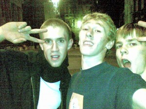

I'm currently sat in a pub called *The Eagle*, it's round the corner from King's College Chapel of
the University of Cambridge, I'm waiting for the food we just ordered. I'm writing this blog post on
my new mobile phone. Damn right – I'm on Blogger on my phone. I love technology. Anyway, here's my
story ... this morning my Mum woke me up to tell me she was going to Cambridge for a spot of
sightseeing, and did I want to come along? I thought, "I want to go to Cambridge", and so I went
along for the ride.

I thought it would be interesting to see the University (not in the way I was interested to see
Manchester Met and Leicester De Monfort earlier this month, I'm sorry to disappoint but I'm not in
the Oxbridge academic caliber), and have a look round the city I know to have an excellent parkour
scene and home of TCT (The Cambridge Traceurs), although with only having spontaneously arranged to
go on the spot this morning, I hadn't had time to arrange to meet up with anyone for training. We
had a bite to eat and a look round the shops before hopping on the open top tourist bus that took us
round all the colleges and other city sights. We had a great day learning about the history and
traditions of the University and got to see the beautiful city. As the trip was coming to an end, I
went into a public toilet in a shopping centre and as I went to wash my hands I noticed a guy who
entered sporting baggy jogging wear, I thought to myself "That guy looks like Owen" (one of the
Cambridge Traceurs, but continued to wash my hands as I dismissed the idea as a trick of the mind,
as I assumed I was seeing what I wanted to see due to the parkour mindset, but as I went to dry my
hands I caught a glimpse of his face, and I knew it was him.

**"Owen?"**, I said. He hadn't heard me but as he got closer my certainty rose.  
**"Owen? ... Owen?"** On the third time he looked up and removed his earphones.  
I said, **"Owen Covill, right? Parkour?"**  
**"Yeh"**, he replied, presumedly rather confused.  
**"I met you at the Trace Gathering. I'm from Sheffield. I'm a friend of Jin's"** He looked
surprised.  
**"Woah ... are you here training?"**, he asked,  
**"No, I'm just here with my parents checking out the city, just decided to come this morning"**  
**"Oh right, well I'm just meeting Phil, you remember Phil?"**  
**"Philly D, yeh."**  
**"Wanna come and join us for training?"**  
**"Love to"** I went to find my Dad and explained, I arranged to meet back with my parents in an
hour, went off with Owen and we warmed up round the corner and waited for Phil.

I had a great session, even though it was only an hour or so, we did some stuff on some scaffolding,
where a middle-aged woman looked shocked that I was about to jump accross some of it, and between us
we explained that even though it looked dangerous to her, we were well-practised and did things
safely, then thanked her for her concern and carried on. We moved on to the spot outside King's
College Chapel on Trinity Street, a famous (amongst practitioners) parkour spot, and conveniently
where I'd arranged to meet my parents, without knowing what or where it was. I noticed a nice
cat-pass precision that I recognised from Cambridge videos, and wanted to do it, and after a few
run-ups trying to get my head round it, my Dad turned up and said we were going for something to eat
before going home, so I asked Owen if he knew anywhere nice to eat nearby, and he directed us to The
Eagle, just around the corner. My parents set off but I'd asked for five more minutes to play. I had
to see if I could get the cat-precision. I weighed it up, conquered the mental barrier and knew I
could do it. I rather enjoyed it.

Before I left I got a picture of the three of us (for't blog):

<figure class="wp-block-image">

</figure>

So that's how I got to be sat in The Eagle, typing this blog post on my phone. I'm at home now
finishing it off and checking for spelling mistakes due to the predictive text...

Oh and Owen, my Mum says thanks for recommending *The Eagle*, she really enjoyed the meal!
