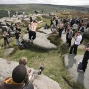
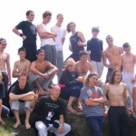
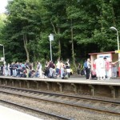
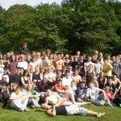
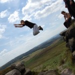
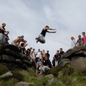
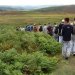

This week, Fieldhead Campsite in Edale in the Peak District held host to 115 or so traceurs for the
Trace (or TRACEur) Gathering 2007. An absolutely brilliant few days of hanging out with over a
hundred people who live for parkour – camping together, talking about parkour, and training in the
most amazing natural areas of the Peak District.

**Day One**, Tuesday, we all arrived at the campsite at different times, pitched up and then just
hung around playing catch with a ball, trying to catch frisbees in our mouths, etc. before all
heading to the local play park for some getting-to-know-each-other light training. It was great fun,
we had one of those "let's see who can make the cat pass past the line"-type exercises which are
always fun, and there was a tricking demonstration from [Daniel
Ilabaca](http://www.danielilabaca.co.uk/), who was watched by many awestruck contingents, often
interrupted by someone who would think "oh, I can do that trick almost a millionth as well as him,
I'll show him my feeble attempt".

**Day Two** was the first full day of training. My group, led by Daniel, started at Padley Gorge
(which, by the way, Jason told me last year he loves and thinks is better than Lisses!), and after
getting ice-cream (chocolate knickerbocker glories) moved onto Higger Tor and surrounding
peaks. Danny (Sheffield) and [Paul](http://www.obsidianpkav.blogspot.com/) (Manchester) were in my
group that day, which was cool.

On the long trek to Higger Tor a few of us listened to what Daniel had to say – it was so inspiring
hearing him talk about his philosophy on life, youth, and passing on the message of parkour to
anyone who was looking for the thing that was formerly missing from his life until he found it in
the art of movement and related activities. He's such a sound guy and I felt privileged to be
training with him and that I had the chance to listen to what he had to say.

The day finished by us being sorted into new groups for the following day and then a presentation by
Jin's Dad about their charity: [New Foundations](http://www.newfoundationsuk.com/), who provide
medical and surgical services to areas of the Niger Delta where there is currently no present
provision. We raised £581.76 for the cause.

**Day Three** started off with an oddly-coordinated warm-up led by Jason at Grindleford Station. Oh
and a few weeks previously I'd been asked about doing some filming for the BBC and I'd told the guy
about the gathering and he expressed interest in joining us and filming so I got him in touch with
Jason, and anyway, he turned up to meet us at the station, which was a promising start.

I was meant to be in a group
with [Shane](http://www.shanerounce.com/) and [Scott](http://scotts-way.blogspot.com/) (one of the
guys I'm going to Lisses with), but in deciding which way would be less boggy, two groups got mixed
up, and I was with no-one I knew, which sucked at first, as I was stuck with a big bunch of people
who interact with others on WorldWideJam, which for some unknown reason I've always been rather
skeptical towards, anyway, these guys all knew eachother and had no intention of including me in
their discussion, so I was doing my own thing on Higger Tor and then joined in with Blake (from
the [Saiyans](http://saiyangarden.blogspot.com/)), [Brad
Moss](http://parkourbrad.blogspot.com/) (the guy who was part of 'The Freerunners' on *Britain's Got
Talent*) and [Moses](http://www.parkour-austria.at/), who had travelled all the way from Austria
just to train with us, I got really into the stuff they were trying and we got on really well and I
ended up training with them for the rest of the day. The guys from the BBC found us up there and
filmed some parkour. We then headed back to Padley Gorge and had some fun on the rocks and in the
trees and headed back to the campsite.

I think it's worth mentioning that it was very useful getting on the train with over a hundred
traceurs, as the conductor has no chance of getting round you all, and often decided not to bother
charging anyone. What we did was wait to see which end the conductor was positioned, and get on at
the opposite doors and create a barrier of more gullible traceurs between ourselves and the
conductor in case he made the attempt of getting blood from a stone.

After tea and a rest at the campsite I headed to the park again to do some parkour with the
Manchester guys who had decided to drive home that night as no training was planned for the last
day. We got there and quickly realised we had neither the energy, manoeuvrability nor the motivation
to do any physical work so we went for a session of "let's film amusing things for Paul's video"
which mainly involved purpose bails. Then pretty much everyone from the campsite arrived at the park
for Jason and Dave's conditioning session, which turned out to consist of 30 push-ups followed by
"that's it for conditioning" and everyone pounding on Jason and almost successfully removing his
trousers.

**Day Four** consisted of nothing more than packing up our tents and stuff, saying goodbye and going
home. Shane had gone home the night before so me and Danny bode our farewells to those remaining,
mostly Trace Reps. I wished Jin an awesome year, as he's going to China as part of his Uni course in
a couple of weeks, I spoke to Moses about my plans to travel next Summer and hopefully pay him a
visit and train with him in Austria, I spoke to Blake as I had a great time training with him and
I'm certain it won't be the last time, I thanked Daniel, Dave and Jason and left for the station to
get the train back to Sheffield.

Many thanks to [Jason](http://www.tracehq.com/) and [Dave](http://www.northernparkour.com/) for
organising and running an awesome week of meeting people and training in a fantastic atmosphere.
Also thanks to all the Trace reps who made it what it was. Roll on TRACE 08!

Most of the photos courtesy of [Shane Rounce](http://www.shanerouce.com/). Check out his
photographic display at [Flickr](http://www.flickr.com/shanerounce).

There's more to come on TRACE 07 – there'll be a feature in the Sheffield Star soon and I should
have more info on the BBC thing – all I know at present is that it's for a programme called [Inside
Out](http://www.bbc.co.uk/insideout) and should be shown in September. They're also filming some
more parkour in Sheffield soon.

<dl class="gallery-item">
<dt class="gallery-icon portrait">

</dt></dl><dl class="gallery-item">
<dt class="gallery-icon landscape">

</dt></dl><dl class="gallery-item">
<dt class="gallery-icon landscape">

</dt></dl> <dl class="gallery-item">
<dt class="gallery-icon landscape">

</dt></dl><dl class="gallery-item">
<dt class="gallery-icon landscape">

</dt></dl><dl class="gallery-item">
<dt class="gallery-icon landscape">

</dt></dl> <dl class="gallery-item">
<dt class="gallery-icon landscape">

</dt></dl>
 

