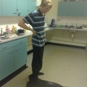

I'm now at the end of my third week of university. I've moved away from home and now live in halls
of residence in Manchester, which is a completely new experience for me. I can cook and generally
fend for myself but it's still very different from being at home. I'm having a wicked time out here
and loving the whole Manchester scene – the parkour's awesome, the bars and clubs are pretty cool,
my flatmates are a great bunch of people and I've also joined the [canoe
club](http://mmucanoe.co.uk/) which is brilliant.

There are ten of us living in my flat – five boys and five girls – which sounds a lot but I think it
works fine. We've each got our own room on the corridor and we share a sizey kitchen which we all
use at different times so there's only ever a maximum of two or three of us cooking at once. I
couldn't have asked for a nicer group of people to live with. We're all from different areas of the
country (even one girl from France) and we're all completely different in person which makes us gel
in that we all have something to bring to the group and there are plenty of questions bouncing off
each other about all our hobbies, interests and ways of living. We all went out together the first
few nights and got to know each other and the city, but now we're tending to do our own thing in
smaller groups (a few of us joined different union clubs) and we're all settling in to our own ways.

In Freshers' Week I had no lectures, just introductory sessions. So after two weeks of lectures I'm
feeling like I'm definitely on the right course; it's exactly what I was hoping for and I can see it
being challenging enough to be worth doing, I feel like I'll be learning useful things rather than
stuff that's pointless. My degree title will be *BSc (Hons) Mathematics and Computer Studies* – I
opted for the Combined Honours programme where you pick two separate subjects and do the core
modules of each rather than a single course where you do lots of extra modules. This was because I
wanted to keep my options open by doing a combination of two subjects and develop a wide range of
skills in two fields. Interestingly, the Maths course at my uni is very programming-oriented, and
the Computing course is very Maths-oriented, so they'll go together very well. I'm having to learn
two new programming languages: [MATLAB](http://en.wikipedia.org/wiki/MATLAB) and
[Java](http://en.wikipedia.org/wiki/Java_(programming_language)).

My modules this year are:

- Mathematical Fundamentals
- Programming (Java)
- Discrete Mathematics
- Linear Algebra
- Programming (MATLAB)
- Computer Platforms
- Statistics
- Learning & Employability (lol)

I have the option to select a major and minor next year (i.e. do more Maths modules and fewer
Computing, or vice-versa) or just leave it at 50-50. I'll see how I get on.

Maths started easy (C2) on Day One, then zoomed ahead to FP3 on Day Two, which is way more advanced
than I did at A-level, but I understood the lectures and managed to do the questions afterwards so
that's good. I did ICT at GCSE and A-level and learned nothing of any real use to me – everything
useful I can do on computers has been self-taught. Schools just don't teach anything that's useful
to people today. I'm glad to say that so far the Computing lectures and practical classes have been
interesting and I can see me getting a lot out of the course.

Yesterday evening I had the best midweek parkour training session for such a long time! There were
about 15 of us out, and even Sam Corbett had come over from Sheffield to see a Swiss guy called
Tobias who he had met in Lisses who was staying with Scott McQuade. We did some great training for
about three hours, we chatted about parkour and there was a brilliant atmosphere within the group.
Then Sam departed for his train home, which he missed and so ended up staying the night at mine. We
did some more jumps on Oxford Road on the way home and chilled out with a pizza and watched some
Futurama! Unfortunately Sam had to set off first thing in the morning to make it back for his
lectures but it was nice to have him round. The first overnight guest at my halls.

I absolutely love the location of my accommodation. It's a maximum of five minutes away from where
my lectures are, ten minutes from a massive ASDA and ten minutes from the parkour meet-up spot. Oh
and canoeing takes place every Wednesday evening at the Aquatics Centre across the road. I love how
I can nip home in between lectures for food or if I forget something – it's so convenient. I can't
imagine any other way now! I went on a beginners' river trip in Bury with the canoe club last
weekend to get the freshers started (in fact, due to my experience and qualifications they asked me
to help lead the trip) and I'm going on an advanced trip on the Kent this weekend! They've also
asked me to take one of the three places on a BCU Event where you learn how to run a uni canoe club,
which should be really informative and exciting! Tomorrow I'll be showing prospective students
around the halls of residence (like I looked round last year).

I can see it's going to be a wicked three years. Watch this space.

<dl class="gallery-item">
<dt class="gallery-icon landscape">

</dt></dl><dl class="gallery-item">
<dt class="gallery-icon portrait">

</dt></dl><dl class="gallery-item">
<dt class="gallery-icon landscape">

</dt></dl> <dl class="gallery-item">
<dt class="gallery-icon landscape">

</dt></dl><dl class="gallery-item">
<dt class="gallery-icon landscape">

</dt></dl>
 

