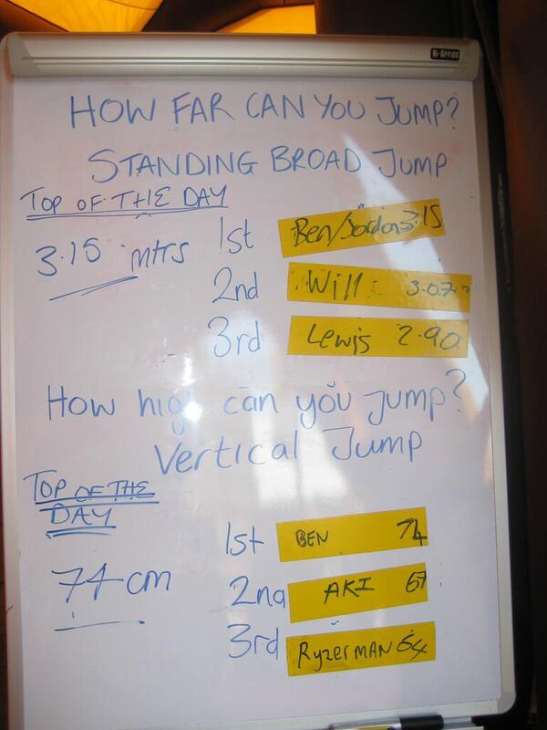
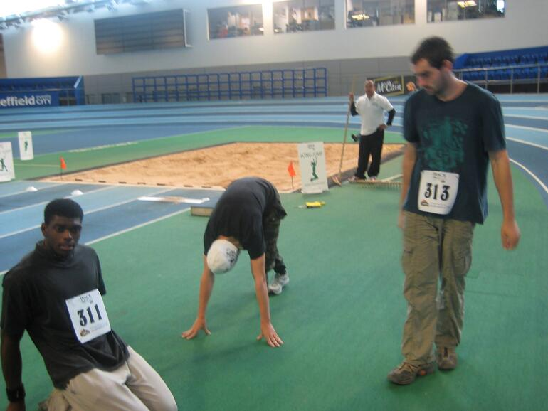

Yesterday was officially my last parkour jam in Sheffield. I'm moving to Manchester next Saturday so
I told the guys that it would be the last time I'd be training with them all before I go away to
uni, and we had a great day of training in Sheffield, starting at the university and working our way
down into town. When we got into town, we saw a big inflated dome at the top of fargate which turned
out to be a Track & Field area for people to try out their athletic skills and they'd been recording
times, distances and so on throughout the day, keeping track of the top 3 in each event on
whiteboards.

A few of us stepped up to have a go and we completely smashed all their records! It was fantastic.
We did the standing long jump first and cleared the leaderboard straight away, then had a few more
goes each and kept bettering ourselves. I did a 3.15 metre standing jump which was matched by
Jordan, seconded by Will (3.10) and then Lewis (2.90). Lewis and I beat the record for the sprint (I
can't remember the distance or time) then Lewis went on to beat it again by himself. I had a go at
the standing high jump (you strapped a thing round your wait and jumped vertically, allowing the
string attached to your wait to measure how far you pulled it and read the reading on the screen)
which was 70cm, which was the highest they'd had all day, then I got 74cm on my second go.

<figure class="wp-block-image">

<figcaption>Smashing the records</figcaption>
</figure>

The event staff were very impressed that we could jump so far, jump so high and run so fast and all
our training was done personally, self-taught in a group of teenagers. They invited us to come along
to the proper event at the [EIS (English Institute of
Sport)](http://en.wikipedia.org/wiki/English_Institute_of_Sport_-_Sheffield) in Sheffield, which is
a multi-sport facility which is where many GB Olympic squads train, such as the GB Volleyball 2012
hopefuls. My good friend [Rachel Colley](http://www.freewebs.com/cowsvolleyball/playerprofiles.htm)
is on the women's team and they train like mad at the EIS to get up to scratch for 2012.

We went along today and had a go at the running long jump into the sandpit, where we were helped out
with our techniques by a coach (the world record is 8.95 metres, our jumps were around 5m, with
Lewis peaking at 5.10m). We then went over to the [high
jump](http://en.wikipedia.org/wiki/High_jump) area where we were taught the [Fosbury
Flop](http://en.wikipedia.org/wiki/Fosbury_Flop) technique which we found awkward but got the hang
of, and I'm sure with much practise can prove to be a good method of gaining maximum height from
such a jump. The thing I find with a lot of athletic events is that they're mostly useless. The only
only only situation in the world where you would need to get over a pole with a one-footed take-off
and land on a super soft crash mat on your back is in this event - you couldn't possibly use it
anywhere else.

<figure class="wp-block-image">

<figcaption>Jordan, Lewis and Will at the EIS</figcaption>
</figure>

We also had a go at the hurdles with [Sally Gunnell
OBE](http://en.wikipedia.org/wiki/Sally_Gunnell), a former British Olympic Champion in the 400m
hurdles, who showed us the proper technique for getting over hurdles, which is unfortunately
something we rarely train for, because we usually overcome such obstacles using vaults (i.e. placing
a hand or two on the obstacle) but it is often the case that this is not possible, so I feel it is
something we should try to work on in future, and should be easy to simulate outdoors in the normal
environment. It was tricky to get a good take-off and landing as well as keeping the consistency of
speed in between each hurdle, but we definitely improved as we practised and got our techniques down
quite well for a first session.

The team of coaches running the event were very impressed with our abilities again and I had a chat
with them afterwards, they asked for my details to pass on to people who might want to get us
involved somehow. It's definitely something I'd like to pursue and will probably see if I can get
involved with the uni athletics club when I start. A quick bit of googling tells me there is a club
and their Wednesday night sessions start back up on 1st October. Excellent. I've no idea what'll
happen with this but I'll probably give it a go and see how I get on. Training this sort of thing
properly will probably benefit my parkour and it may be something I could take up as well.

I've just got back into kayaking after a 2-year absence from anything challenging. I've been doing a
bit of volunteer coaching and taking groups of kids down easy rivers which is rather dull, but after
a day trip to Holme Pierrepoint the other week, I've decided not to give it up but to join the uni
canoe club and get back into the swing of things.

Less than a week to go before I move out of my home in Sheffield and into halls of residence in the
heart of Manchester. I can't wait. I've been out to buy everything I need (which is considerably
more than I thought I would need) and was given some dishes, bowls and handy utensils by my cousin
Stephen who's moving to Canada this week!
