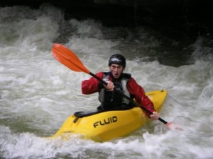

I was asked by the chairman of the [canoe club](http://mmucanoe.co.uk/) if I would like to attend
the [BCU](http://www.bcu.org.uk/) whitewater student safety seminar with him and the vice chairman,
being a fresher who is keen to commit to kayaking and to the club and likely to be seriously
involved in the club over the next few years. I jumped at the chance and we went last weekend and
had a great time – it was at a whitewater & mountaineering centre called Plas-y-Brenin in North
Wales, hosted by some of the greatest kayakers in the UK. It was a great experience for me to hear
the opinions about gear, techniques and advice from these well-accomplished paddlers, without it
being dictated to me like it has been in the past – it's great when someone can just give you their
personal opinion for what it's worth, explain and justify it and leave you to hear opposing views
and make sure you get the facts, rather than hammer it into you that their way is right.

We arrived at the centre before 9:00am (having got up at 5ish to set off by 6:00am). Not much to
report about the journey other than us finding the following joke hilarious at the time (mostly due
to lack of sleep):

> I spent all yesterday in the garden with my step-ladder; not my real ladder, my step-ladder...

On the Saturday we sat through a seminar with [Tom
Parker](http://www.tomparkercoaching.co.uk/) about the importance of safety and avoiding at all
costs the chance of an accident happening where you could be left to blame, by simply making using
common sense and being sure not to take inexperienced paddlers down rivers beyond their abilities
and leaving them in positions where they would be vulnerable to an accident. Then we did a session
on ropework where we tested some throwlines (bags of rope used for  rescues by pool lifeguards and
canoeists) to see how easily they break, which was interesting! Things like this are really worth
sparing no expense on to ensure you've got a good one. We did some work on how to manufacture a
harness from a short length of rope and use it to climb or abseil a vertical face to get to, our out
of, a river and manoeuvre boats in such a situation. Then I attended a talk on how to plan trips
abroad from your club, which I think I'm going to pursue this Summer, probably the Alps.

We ended up staying in a grotty bunkhouse with some paddlers from Birmingham University and on the
Sunday I put myself down for the session on how to lead and run steep river creeks, where we drove
out to some grade four sections of rivers and chucked ourselves off some mental waterfalls and
drops. The sort of experience where you do something, then look back on it and think "Woah ... that
was a bit mad" but it was cool 'cause the session was aimed on how to run it safely, so we got out
to inspect each difficulty when uncertainty laid ahead, and spend much time discussing our
strategies, choosing our own lines through the water and watching each other to learn from each
other's actions.

The quality (and presence) of safety equipment was very much stressed at this seminar; I now know I
need to go out and spend a lot of money on new gear. I underestimated the need for good shoes (yes,
canoeists need to wear shoes while boating) because you need to ensure you're safe when getting out
to inspect difficult unfamiliar sections of rivers, and also when getting from the car/van/minibus
to the river, and back again, as this can often prove difficult and may require a bit of climbing,
lifting boats and setting up rope & pulley systems to get the boats to where they need to be.
Another thing I'd overlooked was my helmet, which is perfectly suitable for paddling about on flat
water (where the only likely dangers are maybe banging your head on a boat, getty or paddle) but for
the sort of thing I'm doing these days I need a good quality full-protection one (not a full-face
helmet – but some paddlers do choose to). One of the guys on the course said he doesn't mind
spending £100 on a helmet because, quite frankly, his head is worth more than that. How true.

I haven't got any pictures from the seminar but here's one of me (looking rather angry for some
reason) on the River Kent in Kendal in the Lake District last weekend:

<figure class="wp-block-image">

</figure>

Plenty of trips planned for this year. I'm going to try to run as many beginner trips as I do
advanced in order to build the confidence in the less-experienced members of the club and get them
up to a higher standard so they can paddle higher class rivers. Teaching is just as important as
learning. This brings me onto the subject of the link I recently realised between my attitude to
parkour and my attitude to kayaking; in parkour I train individual moves and practise everything as
much as I can, trying to do vaults on both sides, always working on my weaknesses to try to improve
all-round, all this with the aim of linking each individual movement to another in order to execute
smooth parkour runs in any situation; in kayaking I train individual skills and practise them on
both sides, always working on my weaknesses to try to improve all-round, and then take this to a
river where thse skills become needed to execute lines through difficult rapids as well as falls and
drops. In both activities I thrive to experiment with different ways of moving, to demonstrate to
myself what happens when I make slight alterations in bodily positions and seeing for myself what
difference it makes. In both activities I tend to stick to pure methods which help me get from A to
B, occasionally dipping into more alternative ways of moving simply to experiment and see if I can
learn new moves.

I've treated parkour as a discipline over the last three years (my first year of parkour was more
about finding my way and realising what I wanted to do than actually training – how are you supposed
to train towards something if you don't know where you're going?) and now I've decided to treat
kayaking the same. I'll be training & coaching every Wednesday evening at the Aquatics Centre and
trying to do a river every weekend, sometimes I'll do a beginner trip on the Saturday and an
advanced trip on the Sunday.

I'll be updating this blog more frequently now and I've got my next post planned for after the
weekend, so watch this space. I'm seeing my parents when I go home on Friday and we're spending the
weekend in London which will be awesome. I'm also getting my new laptop when I go home – I'm sure
that ever since I confirmed purchase of the said laptop (using this desktop PC), and it realised it
was being made redundant and replaced by a younger slimmer more portable model, it has purposefully
and maliciously decided to boycott me and has been ever so slow. It's been great these last five
years – its spec isn't anything to shout about but it's done everything I've needed it to do and
it's brought you many blog posts and several videos! But it's the end of an era and I'm scarily
moving on to Vista (dual-boot Linux) and may the new era of portability live long (until it gets
replaced by the next technology, of course).
