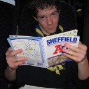
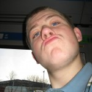
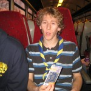
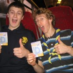
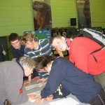
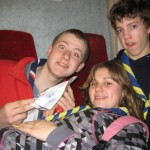
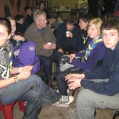
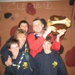
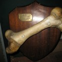

The Winter Runaround is a Scouting competition for 14-25s where teams of 4-7 travel across South
Yorkshire by means of public transport with pre-purchased travel passes, with the aim of competing
bases at Scout headquarters all over the county in order to earn points.

The Bone of Contention is a challenge trophy (a bone on a wooden plaque) which started as a Venture
Scout challenge whereby one Venture Unit (the challengers) would propose a challenge to the present
holders of the Bone in order to attempt to win it from them, and since it was won from my Venture
Unit about 5 years ago when I started, its location has been unknown.

This is the story of how these two pieces of information came together one Saturday in February
2008.

I entered the Winter Runaround with team mates David Webster, Rob Batley, Dom Sharpe and Andrew
Webster, and since more than one of our number are over 18 we had to enter the Network competition
(18-25) rather than the Explorer one (14-18). We were given our travel passes and at 08:00 we were
off! We started at Woodseats, our own HQ on Helmton Road, and completed the base there and earning
our first points before heading off to Tickhill via bus, train, bus. We completed the activity on
the base there and some more points and continued with our travels.

Throughout the day we visited bases in Sheffield, Rotherham, Barnsley and Doncaster. We caught
dozens of trains, buses and trams and sprinted between bus stops and bases at every opportunity in
order to be most efficient with our timing. We had the route planned out to-the-minute and allowed
for complications or changes of plan with alternative routes. Having an Internet-enabled phone was
very useful as we could check train and bus times with ease, plan the next move as we'd know what
time we got in and where we needed to be and at what time. All in all it was a very hectic day of
dashing off in all directions, sticking together as a team and solving problems (involving mental
and physical activity) at bases to earn points.

The highlight for me was when we caught a train to Barnsley, then a bus out to near where the base
was, sprinting down the road to the base and completing the task (getting the day's best score on
that base), sprinting back up the road and catching the same bus we'd just got off (the driver had
finished his route and turned back on the return journey), and the driver asked if we were lost but
we told him why we were heading back the way he had just brought us  
and he was rather impressed with the timing. We then arrived at the bus/train interchange with 20
minutes before our train to the very last base (having decided to miss out the other Barnsley one
due to us pushing for time) so we decided to risk it and sprint up to where the other Barnsley base
was and try and complete the task and make it back to the station in time, and we found it on very
vague directions, completed the task getting half the maximum points (and more than most on that
base) and rushing off with five minutes to get back for our train, and catching it to the next base.
We managed to complete the task on that base (which meant we'd made it to all ten bases over South
Yorkshire and earned points on each) and make it to the finish point in Chapeltown with an hour to
spare.

Then after a final activity at the finish point, gaining even more points, all the teams returned
(some late with points deducted) and were together for food and drink before the results were
confirmed.

Back to the Bone of Contention...

I've been trying to track the Bone for months now, and the last I heard it was in possession of a
guy called Charlie who ran a Unit somewhere. At one of the bases in Barnsley, I noticed that the
lads helping run the base were wearing hoodies depicting the name and nature of their Unit (as is
the trend) and I could see that they were members of Charlie's Angles Explorer Unit (that's Angles,
not Angels) and I knew that this was where the Charlie with the Bone was based, so I enquired as to
whether Charlie was there, and he was the guy I happened to ask, so I further enquired as the the
location of the Bone of Contention, and he said he gave it to Sharon (the organiser of the Winter
Runaround) that very morning, so I made a mental note to locate Sharon later on and ask her what was
what.

When we made it to the finish point and had eaten, I found Sharon and she told me that the Bone was
now a Network challenge and – most relevant of all – that she would be giving it to whichever
Network team won the Winter Runaround.

So there we were, part way through the reading out of the results of the day, our younger team, the
Explorers, had already found out that they had come 2nd in their competition, and there were 3
Network teams left to be read out (in reverse order, naturally), one went, it wasn't, another went,
that wasn't use either, then came our Unit's name ... "Woodseats Network – 1st Place!" and we were
presented with the trophy.

<dl class="gallery-item">
<dt class="gallery-icon portrait">

</dt></dl><dl class="gallery-item">
<dt class="gallery-icon portrait">

</dt></dl><dl class="gallery-item">
<dt class="gallery-icon landscape">

</dt></dl> <dl class="gallery-item">
<dt class="gallery-icon landscape">

</dt></dl><dl class="gallery-item">
<dt class="gallery-icon landscape">

</dt></dl><dl class="gallery-item">
<dt class="gallery-icon landscape">

</dt></dl> <dl class="gallery-item">
<dt class="gallery-icon landscape">

</dt></dl><dl class="gallery-item">
<dt class="gallery-icon landscape">

</dt></dl><dl class="gallery-item">
<dt class="gallery-icon landscape">

</dt></dl> 

