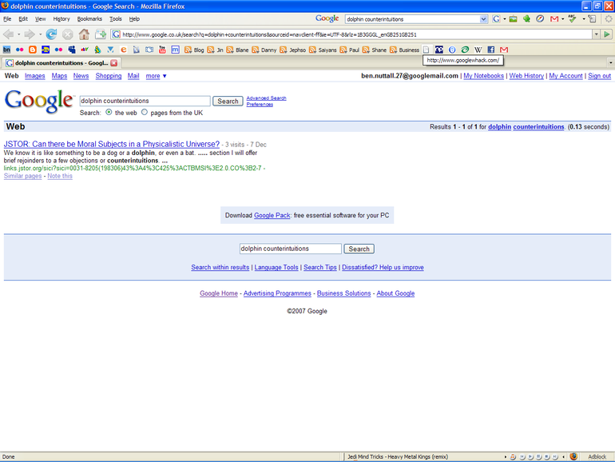
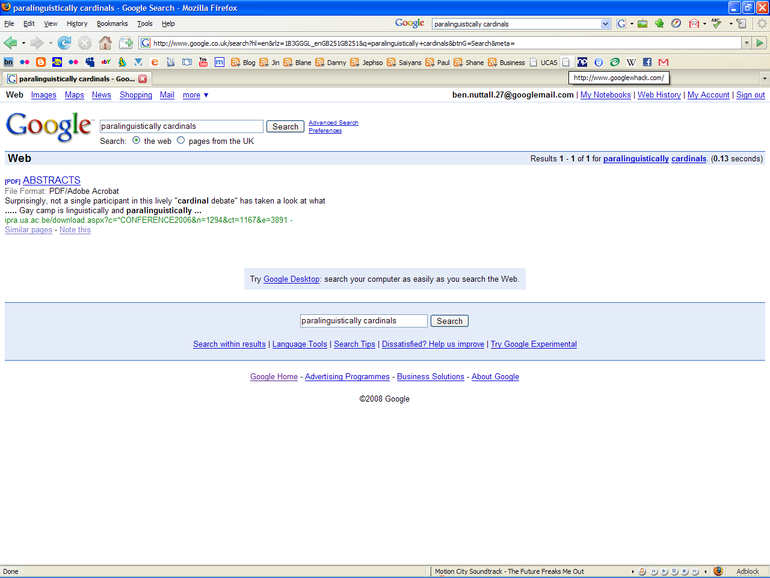

Googlewhacking is a game of finding two words which, when entered into Google, return a single
result. The words must exist in the dictionary (these are underlined in Google) and must not be in
quotes - so Google simply searches for pages containing both of these words. If there is only one
result, that means that only one page on the entire internet contains both of those words - and that
qualifies it as a Googlewhack.

I'll tell you how I came about this fascinating word game. There's a British comedian called Dave
Gorman who, without telling you his story, has a book and DVD by the name of *Dave Gorman's
Googlewhack Adventure*, which are both fantastic. The book follows him all over the world where he
meets dozens of Googlewhacks (people whose sites contain a Googlewhack) while trying to avoid
writing a novel he was being paid to write. The DVD is a live stand-up show of him telling the same
story to a Swansea audience.

The DVD and book (both of which I highly recommend) inspired me to have a go myself, and after a
couple of months of failure I'd pretty much given up, thinking that seeing as Dave's adventure was
back in 2003, and today's Internet is somewhat fuller than the old days and that Googlewhacks must
be near-impossible to find now. But there was light at the end of the tunnel, thanks to telling my
friend Mark about Googlewhacks, we had a go and within minutes, saw those magic words "Results 1 - 1
of 1 for...", and here it is:

<figure class="wp-block-image">

</figure>

I was over the moon with this! It's a beauty! It was my very first Googlewhack! It obeys all the
rules, it's 100% legit. I then went on to register it in the Whack Stack at googlewhack.com to get
it registered under my name and to make sure they recognised it as a real googlewhack.

A couple of days later I had another go and BANG! Another googlewhack! See for yourself:

<figure class="wp-block-image">

</figure>

And so I registered this one too. My name's in the Whack Stack twice now. My tactic is
word-disassociation. I choose a long uncommon word and stick another word in that I think is most
unlikely to appear in conjunction with the first word. It's not easy, though. Try it.