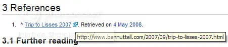

I'm back from the longest period of absence in the history of this blog. I've been busy preparing
for exams.

Unfortunately training doesn't come into it, seeing as I've hardly had time for it lately. I
do my best to get out and train whenever I can, but with my final exams coming up, it's been hard to
find time. I had my last exam earlier this week, immediately after which, I went to give blood (my
former IT teacher expressed her surprise that I'd have any left after the exam period) and went to
buy a book to add to my ever-growing 'to read' pile.

The reason for this post (other than to get back into the swing of things) was meant to be about
wikipedia, but it seems to have taken a minor segment of the post, but I'm not changing the title
now, I like it, it sounds cool! Anyway, I was doing some random browsing earlier and found that on
the Lisses article on wikipedia gives a source for its information, the source being a blog post
entitled Trip To Lisses 2007 written by Ben Nuttall. That's me.

<figure class="wp-block-image">

</figure>

I thought it was pretty cool how someone had come across my site in their research and thought that
it was a reasonable source of information. It's not like my site is the sole source of information
about lisses and parkour, so it's not like I could have written any old rubbish and someone would
have used it as the truth. It's also weird how I've had 3 people contact me in the last 2 weeks,
from 2 different continents, all asking me how to get from Paris to Lisses, which hotel to stay in
and for general information about Lisses. I've hardly had anyone ask me about that until the other
week, and then I get two more within a matter of days. Weird. I wrote an extensive reply and sent it
to the other two guys, I think I'll upload it as a web page and stick it in the site as a parkour
resource.

I have lots planned for this Summer. I go on holiday to the Spanish Pyrenees in about a month, which
I'm really looking forward to. But while I'm here at home (until I move out in September for uni), I
have plenty of tasks to be getting on with, including redesigning this site completely. Hopefully
I'll have a new site up and running by the end of Summer. As well as changing the layout of the
site, I intend to revolutionise the content by taking a leaf out of my friend Joe's book and try to
post at least once a week. So far I've been sticking to about one a month on average, only posting
when something amazing happens, but wouldn't it be nice if I could have something to write about
every week? I'll be keeping posts much shorter and much more to-the-point in the hope that more
people will actually read the posts. Please give feedback in comment or email form, I want to know
what you think of the site and I want to know when you read a post. Be back soon.