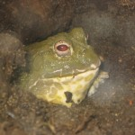
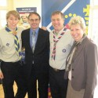

I'll try and be quick because I'm mega busy at the moment – got a massive week ahead of me and time
is precious but I'm trying to keep up the whole 'frequent blog post' thing I've mentioned in the
last few posts so here I am writing this from my brand new ASUS laptop which I set up last night.
It's always interesting to know what the first thing a person does when they get onto a brand new
computer; mine was to download [Google Chrome](http://www.google.com/chrome/) (a new web browser
made by Google – it's amazing – try it!) which since it was released last month has been my new
primary browser, knocking [Firefox](http://www.getfirefox.com/) down to second (followed
by [Safari](http://www.apple.com/safari/download/) then IE).

I had a great weekend in London with my parents, who I haven't seen since I moved out a month ago,
so it was nice to let them know what I've been up to and how my course lectures and my halls life
are going. The trip was primarily arranged due to my invitation to [London
Zoo](http://en.wikipedia.org/wiki/London_zoo) to be presented with my Queen's Scout Award but seeing
as it was my parents' wedding anniversary that weekend, we decided to make a weekend trip out of it.
I caught the train home after my computing lecture on Friday afternoon and spent the evening at home
and we got the coach from Sheffield to London early Saturday morning, a lovely four hour journey,
and checked in to our hotel and after a nap we spent the evening in London; we went on the London
Eye which I took many many pictures of (and from).

Sunday morning we got up early to get ready for the presentation, headed out for the tube in the
pouring rain and made our way to the Zoo! We checked in there and spent some time wandering about
checking out the animals and exhibits, then when it was time we went over to the Mappin Pavilion
which is where the presentation was held. I hadn't really any idea what the presentation was going
to be like – I hadn't really thought about it; all I knew was that I would be being presented with
my Queen's Scout Award certificate from [Peter
Duncan](http://en.wikipedia.org/wiki/Peter_Duncan_(actor)), the Chief Scout (head of the Scout
Association) and former Blue Peter presenter. Despite being bang on time, I was the last to arrive
(at this point I discover there were just four of us being presented at this time) and was
immediately ushered into a sofa while having my coat removed by some sort of organising person, and
before I had a chance to take in my surroundings I saw Peter Duncan just ahead of me, shuffling four
creamish certificates in his hand to see who was to be first. "Ben Nuttall" he called out, and asked
me to step up to join him at the front. I stood up and looked out at the dozens of people applauding
– I'm still not really sure why they were all there.

I was put on the spot and suddenly asked by Peter Duncan what I did to achieve my Queen's Scout
Award (for those that don't know, the [Queen's Scout
Award](http://en.wikipedia.org/wiki/Queen's_Scout) is the highest accomplishment in the Scout
movement, and is patroned by the Queen (formerly King's Scout Award) and achievement involves
completion of the [Duke of Edinburgh Gold
Award](http://en.wikipedia.org/wiki/The_Duke_of_Edinburgh's_Award) as well as various other tasks).
I completed mine over a year ago; with the most talkable bits happening over a year ad a half ago,
so having to reel off a nice little speech about a four-day walking expedition I did in April 2007
was rather awkward but with it being such a memorable four days I managed to share a few
entertaining short stories about the hike and mentioned what the purpose of the expedition was and
how we ended up finishing it at the pub from
ITV's [Heartbeat](http://en.wikipedia.org/wiki/Heartbeat_(TV_series)) while they were filming. Peter
asked me a few more questions, and we had a good chat about Scouting and the future of the world and
I was presented with my long-awaited and well-deserved certificate, photographed a few times, and I
took a seat to listen to the next three people and their adventures.

After this we got a chance for more photos and I had a good chat with Peter; I told him about my
Grandfather (94 next month!) who met the very first Chief Scout, the founder of the worldwide
movement, Lord Baden-Powell. We then talked about the media and their tendency to ruin good news
stories with silly headlines and pictures that make the articles lose their point about what
Scouting today is all about; outdoor pursuits, adventure, opportunities galore, making something of
your youth, preparing for adulthood and showing future employees and such that you have made the
most of your youthhood by getting out there and doing something.

We thanked Peter and the organisers for a great presentation and I was congratulated on my
achievement once again by those present as we departed. We had a look round the rest of the zoo
before heading back via tube to the coach station. Another four hour journey back to Sheffield and a
couple of hours chilling out at home before having to get the train back to Manchester, only to find
that it had been cancelled. I had to get a train out to Hope in the peak district, wait for a bus
there which took me to Stockport, then waited for a train to take me to Manchester (an hour later
than planned at quarter-past midnight). I had a maths test in uni at 9am this morning, so I had to
do a spot of last minute revision on the train, but without any spare paper I had to take notes on
the back of a bank statement I had in my bag!

So after my morning lectures and the maths test today I got my new laptop set up and here we are. I
took many photos in London at the weekend.

<dl class="gallery-item">
<dt class="gallery-icon portrait">

</dt></dl><dl class="gallery-item">
<dt class="gallery-icon portrait">

</dt></dl><dl class="gallery-item">
<dt class="gallery-icon portrait">

</dt></dl> <dl class="gallery-item">
<dt class="gallery-icon landscape">

</dt></dl><dl class="gallery-item">
<dt class="gallery-icon landscape">

</dt></dl><dl class="gallery-item">
<dt class="gallery-icon portrait">

</dt></dl> <dl class="gallery-item">
<dt class="gallery-icon landscape">

</dt></dl><dl class="gallery-item">
<dt class="gallery-icon landscape">

</dt></dl><dl class="gallery-item">
<dt class="gallery-icon landscape">

</dt></dl> <dl class="gallery-item">
<dt class="gallery-icon landscape">

</dt></dl><dl class="gallery-item">
<dt class="gallery-icon landscape">

</dt></dl><dl class="gallery-item">
<dt class="gallery-icon landscape">

</dt></dl> <dl class="gallery-item">
<dt class="gallery-icon landscape">

</dt></dl><dl class="gallery-item">
<dt class="gallery-icon portrait">

</dt></dl><dl class="gallery-item">
<dt class="gallery-icon landscape">

</dt></dl> <dl class="gallery-item">
<dt class="gallery-icon landscape">

</dt></dl>
 

