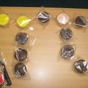
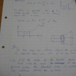

**Pi** – An irrational constant used to represent the ratio between a circle's circumference and its
diameter, symbolised by the [greek letter Pi](http://en.wikipedia.org/wiki/Pi_%28letter%29),
approximately 3.14159265358979323846264338327 (not rounded)

**Pi Day** – A geek holiday held to celebrate the mathematical constant Pi, observed on March 14 (3/14
in the American date format)

We celebrated Pi Day 2008 in style. My Maths class were particularly excited about it, and I'd
brought in some pies and cakes and other circular food, as well as a half-moon cake (because there
are Pi [radians](http://en.wikipedia.org/wiki/Radians) in half a circle) and we did some hardcore
integration involving Pi (not just for fun, it was on the course) and then paraded Pi around and
took pictures!

We had a medley of the Pi Song ([Mathematical
Pi](http://www.alltooflat.com/about/personal/ton/MathematicalPi.mp3) by Ken Ferrier and Antoni Chan)
– the song can be downloaded from [this page](http://www.alltooflat.com/about/personal/ton/) (I also
recommend [The Milk Song](http://www.alltooflat.com/about/personal/ton/TheMilkSong.mp3))

I know Pi to about 35 decimal places, thanks to the song (plus a few extra digits). The record is
100,000, which is pretty crazy. Pi presents us with the most incredible concept; the fact that its
decimal digits go on infinitely without any significant repeats, with no patterns emerging, it may
as well be random. We have always wished to learn from Pi and discover its secrets. Maybe one day
the numbers will be plotted on a graph in such a way that we will realise a connection with
something in nature, space, the truth about life ... who knows?

Read more about Pi on wikipedia: [http://en.wikipedia.org/wiki/Pi](http://en.wikipedia.org/wiki/Pi)

		

<dl class="gallery-item">
<dt class="gallery-icon portrait">

</dt></dl><dl class="gallery-item">
<dt class="gallery-icon landscape">

</dt></dl><dl class="gallery-item">
<dt class="gallery-icon landscape">

</dt></dl> <dl class="gallery-item">
<dt class="gallery-icon landscape">

</dt></dl><dl class="gallery-item">
<dt class="gallery-icon landscape">

</dt></dl><dl class="gallery-item">
<dt class="gallery-icon landscape">

</dt></dl> <dl class="gallery-item">
<dt class="gallery-icon landscape">

</dt></dl><dl class="gallery-item">
<dt class="gallery-icon portrait">

</dt></dl><dl class="gallery-item">
<dt class="gallery-icon landscape">

</dt></dl> <dl class="gallery-item">
<dt class="gallery-icon portrait">

</dt></dl><dl class="gallery-item">
<dt class="gallery-icon portrait">

</dt></dl><dl class="gallery-item">
<dt class="gallery-icon landscape">

</dt></dl> <dl class="gallery-item">
<dt class="gallery-icon portrait">

</dt></dl><dl class="gallery-item">
<dt class="gallery-icon portrait">

</dt></dl>
 

