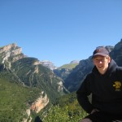
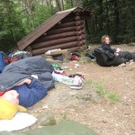
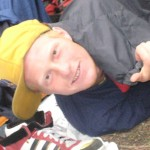
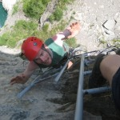
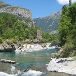

I have just returned from a WVU Summer Trip to the Pyrenees! The Pyrenees are the mountains that
border France and Spain – we were on the Spanish side, staying at a lovely campsite in the
picturesque town of [Torla](http://en.wikipedia.org/wiki/Torla) in a valley on the outskirts of the
[Ordesa National Park](http://en.wikipedia.org/wiki/Ordesa_y_Monte_Perdido_National_Park).

My journey there was rather easy-going; Neil and I caught the 6am coach from Sheffield to London
Stansted Airport and flew to Santander, then caught a bus to Bilbao, where we stayed the night in a
cheap hotel. A funny thing occurred when we got to the hotel; we checked in and got sorted
downstairs and got in the lift to the floor where our room was. The lift contained a sticker giving
the name of the Swiss engineering company that made the lift mechanism, a company called Schindler.
Neil cleverly pointed out that we were in [Schindler's
Lift](http://en.wikipedia.org/wiki/Schindler%27s_List). We had an excellent kebab each that night
for tea (nothing like the greasy ones we have in fish & chip shops at home!) and awoke the next
morning to find it pouring with rain! We had arranged to meet the rest of the group that morning
when their ferry got in, and they picked us up in our 60 year old ex-RAF minibus Spiney.

We drove across Spain for a few hours before getting to the campsite in Torla and pitched our tents
and rather than cook for ourselves we decided to go for pizza again (the village of Torla is rather
limited in what it can offer). The next day a group of us decided to check out the surrounding area
so we went for a walk up out of the valley. Later on in the afternoon we needed to take a rest from
walking and take shelter from the sun – this was the siesta! The Spanish always close their shops
and take a break from whatever they are doing for a few hours in the peak of the heat, and we could
see why! It was unbearable to walk in, especially with a rucksack. That night we decided to go for a
pizza because it was Harriet's birthday, and we gave her a surprise when we got back to the campsite
by laying out cake, candles and balloons!

That day we had been sat at the side of a river putting sun cream on, and then decided to go for a
swim in the river, and since I had my socks on when I put cream on, before we decided to go
swimming, I managed to burn my feet when stood on the island in the middle of the river, and the
next day they were raw red and sore! I was actually hobbling about for about four days, struggling
to walk properly and in pain when I did. I was constantly bathing them with moisturising aftersun
lotion. I've never been badly sunburnt and this really hurt – it felt like the skin was being
stretched across my feet.

We went swimming again the next day. The river was made up of water that had flowed directly from
the melted snow at the top of the mountains, so even in the heat of the Spanish sun, was absolutely
freezing! It was the coldest I've ever swam in and actually made you lose the ability to speak
clearly out of shock, it was so intense that when we jumped in we needed to swim straight to the
island and get out of the cold, but after a couple of minutes of major shivering you were ok again.
We tended to swim to the island and stay there for ages, which meant it was a horrible feeling
knowing the only way back was to swim again – there was actually no other way – I looked for an
alternative route back by stepping on smaller rocks but they were too far apart to step between and
too slippery to jump between, so you had to submerge yourself and bear the cold again! That night we
cooked for the first time, we made an awesome pasta dish with herby tomatoey sauce with chopped veg.

That night there was the worst storm I've ever witnessed. The rain was pelting down on the tent all
night, thunder was pounding away and lightning was striking immensely. At one point I looked out of
the tent and it was pitch black, all you could see was the street lamps down the road through the
middle of the campsite, and all of a sudden the lightning struck in the sky and you could see
everything as clear as day, but only for a split second. The next day my feet were still burnt and I
was still hobbling and we had quite a relaxing day and spent some time at the river again. The
coldness of the water became more bearable each time you went in, so we were more comfortable with
it now and less hesitant at getting in. We had meatballs and rice that night and had bought some
cubes of stock to add to the pot and for some reason Bob put in 8 cubes (the pan was for 3 of us) so
the meal was the saltiest thing I'd ever tasted – it was horrible but we needed to eat to keep our
strength up for the walking we'd planned for that night.

We headed up to the bus station in the village to catch a bus up to the higher part of the mountains
in the national park, where we planned to walk further up and spend a night in a hut, and we paid
and got on the bus with the driver ready to take us up, when some fat park ranger woman came and
shouted at the driver and told him he wasn't allowed to take us up at that time, so we had to ask
for our money back, but apparently this isn't possible so they sellotaped our tickets back together
and said we could use them another day. Not put off by this we changed our plans slightly and walked
to another hut we knew we could get to by walking.

There was just us (about a dozen from the group) and two American chaps on the bus, and they asked
if they could join us so we walked up to the hut with them. After a few hours' walking (by which
time it was getting late and rather dark) we arrived at a hut the size of a small garden shed, so we
had to sleep outside. We stayed up a while and had a chat with the Americans, who turned out to be
21-year-old backpackers called Brad and Hunter with no course of direction or plans for the next few
days. We enjoyed their company very much and asked the usual English-American questions (some
serious, some just taking the mick out of Americans or their accent). They suggested we play a game
where it had something to do with naming things in certain categories (we laughed at their
pronunciation of the word 'categories') such as breakfast cereals but Sasha pointed out that we
don't have the same cereal brands as them, and came out with "your cereals are probably called 'Dude
Flakes' or something" which we all thought was pretty funny. Later on when it was time to sleep we
set out our sleeping bags, thermarests, bivvy bags and suchlike, and they said they had brought
"towels, sheets and stuff" to sleep in/on. Oh dear. We ended up lending them bits of our kit to use
for the night. We had a really fun night, it was great hanging out with those guys. If you're
reading this now, Brad and/or Hunter, post a comment below or send me an email!

I went to the Tourist Information at one point as I needed to find out how I was to get from Torla
to Santander (the best part of 300 miles) on my own by public transport. The woman spoke a little
English and was baffled by the majority of my questions, but grasped that I was requesting bus
timetable information so she wrote down a single departure time from Torla to one of the nearby
towns. When she then realised I had found this information rather inadequate, she wrote down a few
more similar ones for buses to different nearby towns. Either she thought that's what I was trying
to find out or was just trying to get rid of me to one of the nearby towns. Maybe she was trying to
point me in the direction of people who spoke better English than she did in other Tourist
Information centres. Anyway, I finally got something useful out of her: a website for the bus
company, then and she wrote down a phrase in Spanish, pointed to it and said "Google". Now she was
talking my language! Luckily, and rather usefully, the TI had four computers for tourists to use. I
had to wait a while because they were always full of teenagers watching videos YouTube. During my
free 15 minutes I successfully managed to find out that the website she gave me was in Spanish (and
made in Flash so could not be translated using [Google
Translate](http://translate.google.com/translate_t)) and the Google phrase she gave me led to that
very same website and nothing else of any use to me whatsoever. Brilliant. I left it there for the
time being and thought I'd give it a few days.

The next few days we spent doing walks and treks in various places in the area. One day a group of
us drove round the windy roads in the valleys going right into the heart of the Pyrenesian mountain
ranges in Emma's ex- Post Office red van! It was a mission getting round the bends and down the
roads on the cliff faces that were scarcely big enough for a car, especially with me leaning over
Emma to take photos out of the window while she was driving! I've never seen so many photographic
opportunities in one place before! I was having a right time with my point-and-shoot (what an apt
description) camera leaning over left and right at every turn. Honestly, there were breathtaking
views every way you turned. It was unbelievable!

A few days had passed since my feeble attempt to plan my way home, so I decided to give it another
bash. I asked the woman for some help but that was hopeless yet again, so I went back on the
computer and did some of my own Googling, I found a site that listed the Summer timetable for one of
the journeys I wanted to take. I translated it using Google Translate (this one was text-only –
woo!) and found some bus times, and found some more for other journeys and worked out which route to
take back to Santander. I planned to get a lift to Jaca and get a bus from there to Pamplona, then
another bus to Santander. I got the times for these journeys and they were both rather infrequent
services so I had to get the one at 6:30am from Jaca, so I would either get a lift really early from
the campsite, or dropped off the night before. I told the TI woman that I had found buses I could
get and that I needed to make sure I got on these buses so that I was at the airport in time to
check in, but she had no idea what I was saying and thought I wanted to buy plane tickets from her.
I tried again and she got the gist and told me I could buy tickets at the bus stations. I wanted to
see if I could book them in advance (I couldn't afford to take any chances, I didn't want to risk
missing my plane!) but she just said to buy them at the station.

One day we decided to use the bus tickets we'd have left over (albeit sellotaped back together by
the ticket desk woman) and spend a day in the higher parts of the mountains in the national park,
which turned out to be good fun where we generally chilled out, had a picnic and messed around
taking pictures of us doing silly things. I did a few backflips off a thick log, we all jumped off
it together, then I climbed a big tree and the others followed me up there and I took photos from
high up.

We finished up at the river (as we did most days) and went for a swim. By this time we were much
more comfortable with the cold water and had got to the stage of jumping in off high rocky platforms
on the sides, and flipping off them! I did a few backflips and some others did some frontflips.

The following morning I woke up and got ready to go out for the day, and after breakfast (bread &
honey, which was pretty much all we ate for breakfasts and lunches each day – unless we pushed the
boat out and felt like doing some serious damage to the budget we were living on and opted for
salami instead of honey) I was told that the plan had changed for simplicity (this was the day
before I was due to fly home) – The new plan was to go out for the day, ending up at the French
border, then I was going to be driven to Jaca, spend the night there and catch my bus in the
morning. They said I had 20 minutes to pack my bags and take my tent down.

I got a bag ready with what I'd need to take home with me on the plane, and packed the rest into my
bags that would go in the trailer and come home the week after. I had to be quite selective with
what I would take on the plane because you're not allowed fluids over 100ml (as I found out on the
outward journey and was forced to throw away my bottles of shampoo, shower gel, sun cream, aftersun,
shaving foam and diaderent as well as razorblades...) and nothing sharp or potentially dangerous,
and my bag had to be under certain dimensions, so I was rather limited, and I needed quite a bit of
my gear when I got home because I was going to the Trace Gathering (see next post) and needed some
stuff for camping, but had to leave most of it behind and cope without. Anyway, I took my tent down
and loaded all my bags in the trailer and we headed off to the [Via
Ferrata](http://en.wikipedia.org/wiki/Via_ferrata) (literally the 'Iron Road' – a mountain route
which is equipped with fixed cables, ladders, and bridges) and had great fun on the course, where
you attached yourself (by means of a harness with a sling and a carabina) to a cable, climbed up the
vertical face of the mountain, sometimes with help of iron steps or ladder sections, until you
reached the end of that piece of cable and before unclipping the carabina, you would attach a second
carabina on the next cable, then unclip the one before (thus ensuring you were ALWAYS clipped on, to
ensure that if you fell off while switching cables you were still attached and would never be able
to fall completely, as your harness would hold you) and climb ahead. The cables were only ever a few
metres as most, so as to minimise the distance it was ever possible to fall in the event of you
slipping or falling back.

We had great fun doing the course and Richard attached the Unit's helmetcam to his helmet so it
would video record people ahead of him doing the route, and we filmed some cool stuff and some silly
stuff and he kept asking people questions about what they were doing in an interview-style manner,
which was quite funny. Unfortunately, he realised later on that the camera must have been knocked in
the bag and stopped recording right at the beginning, so we hadn't captured anything! Gutted!
Nevertheless, he caught some good footage of people jumping into the river at the end of the course
– there was a rock you could climb up to and jump off into a big deep stream, and we all jumped in.

After this we all drove to the French-Spanish border where we spent the afternoon together. A group
of us walked up a hillside to where the border line continued (it was marked out with stones all the
way along) and we messed around up there for a while, hopping into France and back into Spain. We
then walked down the hill to go to a shop where everyone else was, and on the way down I had laid
down in the long grass to take [this photo of a
flower](https://bennuttall.com/wp-content/uploads/2013/09/IMG_0880.resized-700x525.jpg) and got up
and jogged down to catch up with the others. When I got to the bottom I realised my wallet was
missing, it must have fallen out of my pocket either when I laid down to take the picture or as I
jogged down the banking. I panicked. Partly because it had a considerable sum inside (over €150) but
also because I hate the thought of losing my cards and stuff. I got stressed out looking for it
because I had no idea where to look, everywhere looked the same (long grass with purple flowers) and
I wasn't sure which way I walked down. The guys I was with asked me where I dropped it and what it
looked like, and the honest answer I gave couldn't have been more ridiculous: "It's either in France
or Spain and it's camouflage". I was thinking maybe I ought to buy a new wallet (hoping I
didn't have to) that was a more visible colour. Anyway, Bob found it so I hugged him and bought him
a big bottle of San Miguel.

After this I bid farewell to the group and got dropped off in Jaca. Luckily the bus station was
still open so I managed to buy a ticket for the bus to confirm the first step on the road to
Santander! I was ahead of the game. This was around 8pm and my bus wasn't till 6:30 the next morning
so I had some time to kill and to find somewhere to sleep. I wandered around the town for a bit to
see what was about. I ended up going into the cathedral, which was open to tourists, and taking a
look around the statues, paintings and ceilings for a while then just sat down in the pews, cleared
my mind and sat alone thinking deeply about life. Then I wandered down some streets to find some
food, most places I stopped at had menus full of dishes but all in Spanish so I had no idea what
they were (I know enough French and German to get by in these situations but was never taught
Spanish!) so I would take a peek and move on, confused. Around 10:00pm, I eventually found one, that
had pictures of plates of food on the wall outside (numbered), so I thought "perfect" and before I
had time to turn around, a waiter asked me politely, in English, if I would like to eat. He showed
me the choice inside and told me what they all were, in English, and gave me the price list, pointed
to show the different prices for indoor or outdoor (indoor was cheaper, which was my preference
anyway!) and gave me a minute to make my mind up. I ordered a "Number One / Número Uno" (I know that
much Spanish) and within two minutes I had a plate of pork chops, freshly-fried egg, chips and red
peppers and a coke in front of me. I was so very happy. This waiter treated me so well and made me
feel at home, when I was feeling rather alone and a little worried about how the next day would turn
out, whether or not I'd make it to the airport (250+ miles away) on time for my flight, all by
myself.

I ate my meal while watching some basketball, then the start of a football match between Barcelona
and Hibernian, then ordered a coffee and pulled out [my
book](http://en.wikipedia.org/wiki/The_Horse_and_His_Boy) and began to read. I continued to sit and
read for quite some time, and at 2:15am, the waiter apologised and politely informed me that it was
closing time, so I thanked him and put my book away and went to pay the bill, which was about €8
which was incredibly cheap for a full meal, a coke and a coffee, especially to say I had been there
for over four hours! He asked where in England I was from, what I had been doing on holiday, that
sort of thing. I told him I was from Sheffield, that I'd been in the Pyrenees and that I was flying
home the next day. He was very nice and we had a short chat and I left. I sat on a bench right
outside and finished my book (I was only a couple of chapters from the end). I'd not had much chance
to read while I was away, but I got through half of the book in that restaurant and was ready to
start [the next one](http://en.wikipedia.org/wiki/The_Magician%27s_Nephew) on the coach in about
four hours' time! I wandered around and found a place to fill my water bottle up; it was a grassy
area with weird statues and there was a water tap in the middle, so I went up to it and started
rummaging through my bag when I heard a noise getting progressively closer, I looked around to see a
rotating sprinkler getting towards the place I was standing, so I hopped out of its path, trying to
avoid the next one along, and quickly dived in and filled up in the 30 seconds before it got back to
me! Then I headed over to the bus station, hoping that it was still open so I would have somewhere
to kip for the next few hours, and it was – so I found myself a corner, got my sleeping bag out and
set about 5 alarms on my phone!

It was rather hard to get to sleep on the hard floor but I kept my eyes closed, and all of a sudden
I heard a car pull up just outside the sheltered section of the station I was laying in, I looked up
to see a police car with a couple of local bobbies staring at the heap in the corner, and when I
looked up they stared for a minute or two while saying something to each other but then seemed to be
ok with the situation and drove away. I think I eventually got to sleep at around 4:00am but made
sure I was awake and up at 6:00 and got ready for the bus. I started my book on that journey, and
took some cool sunrise pictures from the coach. I arrived in Pamplona just after 8am and I was
feeling a combination of sickness, tiredness and hunger, but with an overwhelming urgency to
purchase my bus ticket to Santander. I joined a queue that had no-one being served at the end of it,
waited there a while until the ticket desk woman opened up and gave the usual "Do you speak
English?" opener and received the usual negative response. The word "No" is common between the
English and Spanish languages. I had my intended journeys written down with the times of departure
and arrival underneath the place names, so I pointed to it as I had done the previous night in Jaca.
She knew what I was saying and told me, in Spanish, that the bus was fully booked. Oh dear.

From my research I knew that that service was rather infrequent and I knew the next one would get me
to Santander too late. I had to find another way to get there. By train, maybe? I needed to talk to
somebody English who could provide me with the information a person would need in my position. I
forgot all about the sickness, tiredness and hunger and made a sharp exit from the bus station. I
needed Tourist Information. Luckily I saw a sign just a couple of minutes out of the station that
vaguely pointed to the TI, so I took off in that general direction and walked for about 10 minutes,
just when I began to think that I was heading nowhere, I happened across another signpost to the TI!
I followed it further and saw the building – it had its shutters down. I went up to the shutters and
saw some information on the wall next to it. The opening times stated 10:00am. There was an
English-looking person with a large rucksack also looking at the very same piece of text. I said
hello and asked if he was English. He was Australian. Close enough. We had a chat and told each
other our stories. His name was Max and he had been travelling around Europe for a few months with
various family and friends and now he was on his own (just like me). He told me he was about to
start a pilgrimage which could be started at any point on this route marked out by signposts, with
hostels along the way for other pilgrims to meet up in the evenings and walk together during the
daytime. He was waiting for the TI to open so he could sign up to the pilgrimage (registered
pilgrims get discount at hostels along the way), so he had about 90 minutes to kill before he could
sign up. This was perfect. He was the friendliest guy I've ever met and he was ever so helpful to
me. It was great that he had all that time to kill and I was there to provide him with a way of
killing it! I informed him of my predicament and he was more than willing and able to offer me help.
I suggested we found out about trains, and since he had just come from the train station he led the
way. I was a little more calm now, and we had a great chat about our trips and our lives. We got to
the station and I asked the guy if he spoke English (I was wasting my time as usual) and simply said
the name of the place I wanted to get to: "Santander?". Apparently there are no trains from Pamplona
to Santander. I looked at the map and thought to ask if there was a train to Bilbao, which would be
a step in the right direction, at least. Apparently there are no trains from Pamlona to Bilbao.
Apparently there are no trains from Pamplona to anywhere to the West of it. I panicked. I had to try
the bus station again, to see of I could at least get to a place (preferably a bit closer to
Santander) with a reasonable hub for transport! We headed back and chatted some more. It was 9:30am
before we got there so Max left for the opening of the Tourist Information. If you're reading this,
Max, thanks ever so much for your help and I hope your pilgrimage went well and you had a great
trip! Leave a comment below or send me an email!

Luckily there was a bus to Bilbao at 11:15am so I had a fair wait, but at least I had a ticket. I
remembered I was hungry and went for a croissant and a coffee around the corner. I got my bus fine
and had a kip on the way to Bilbao. I arrived there at about 1:10pm and joined a queue to get a
ticket to Santander. The LED timetable board in the station said there was one at 2:00pm so I knew I
could be there in plenty of time. I was behind two German women who were also buying tickets to
Santander, so when they were refused tickets I got a little worried, but fortunately this was simply
because we had been in the wrong queue, the next queue was also the wrong queue but the third (it
was 1:30pm by this point) was the right queue! They bought their tickets and I was hoping they
hadn't just filled the coach and stranded me in Spain, but luckily they hadn't. The woman was
printing my ticket after taking my money, and I decided to ask if the bus stopped at the airport
(not in English or Spanish, but the universal language of silly hand signals – you should have been
my aeroplane signal!) and she suddenly stopped and exclaimed "You want airport!?" and told me that
was a different bus, the next one was at 3:30pm and arrived at 4:50pm, which was just about in time
for me to check-in. She ripped up my ticket and printed another. Sorted. I actually had a ticket in
my hand that would take me to the airport on time to catch my flight home. All day there had been
that air of uncertainty, but finally my fate was sealed. I was going to London! Maybe even
Sheffield, if things kept on working out!

I spent the next two hours wandering around Bilbao. There wasn't enough time to do anything fun, but
I occupied myself and took a few pictures around the city. I caught the bus and got off at the
airport. Then something hit me. My bag was considerably bigger than the one I had come in, because I
needed more of my gear and sets of clothes for the Trace Gathering. I couldn't check-in with a bag
that was bigger than the allowed dimensions, I needed to compress it somehow, but then there was the
question of weight – if they saw it and thought it looked too heavy they would weigh it and it would
probably be too heavy. I'm not sure what the procedure is for this; on the website it says they have
the right to refuse your admission to the plane if your hand luggage is too big or too heavy, but I
think it's more likely that they'll make you send it in as checked luggage and charge you for it. I
didn't want either of these things to happen to me. I had a plan. I went into the airport toilet
before I checked in. I emptied my bag and took all of the clothes and put them all on, on top of
what I was already wearing! Then I got hold of all the things I could pass off as things that people
would usually carry loose in their hands, like both of my books, my notepad, food, and suchlike,
shoved some in my pockets and carried the rest in my hands. I checked-in at the desk, then went
through the scanning machine wearing three pairs of socks, two pairs of boxer shorts, two pairs of
shorts, a pair of jogging bottoms, a t-shirt, two football shirts and a hoodie, nothing beeped (I'd
remembered to take my camera from around my neck, nothing beeped, no questions asked. As soon as I
got round the corner I took most of it off because I was boiling! I shoved everything back in my bag
and waited for passport control and then boarding.

The flight was fine and I arrived at Stanstead in good time. I got through immigration in no time
and went to the National Express coach place at the front of the airport. It was 7:55pm and I had
two hours to wait before my coach, but I managed to get on one at 8:00pm (I booked on a later one in
case I got held up). The coach took me to Golders Green in London, where I was to wait for the next
coach to take me to Sheffield. The one I had booked onto was at midnight, and I was there at 9:00pm.
I looked at the timetable and found that there was a more direct coach to Sheffield at 10:00pm so if
the coach had free seats and the driver was reasonable I'd be able to get on that one and be in
Sheffield by 1:00am, but otherwise I'd have to get the later one and not get to Sheffield till
4:00am! I waited and read some more of my book and at about 10:30pm the coach showed up and the
driver let me on. I read my book for most of the journey (and almost finished it, which was pretty
cool, starting and finishing a book in one day) I was at Sheffield station by 1:30am and got picked
up and took home, where I slept for a very long time. I chilled out at home for the weekend, sorted
the hundreds of photos I'd taken, and uploaded them to my Flickr. Then I got ready for the Trace
Gathering, with half of my kit still in Torla, so I was planning to borrow a tent, stove, etc. from
friends when I arrived!

<dl class="gallery-item">
<dt class="gallery-icon landscape">

</dt></dl><dl class="gallery-item">
<dt class="gallery-icon landscape">

</dt></dl><dl class="gallery-item">
<dt class="gallery-icon landscape">

</dt></dl><dl class="gallery-item">
<dt class="gallery-icon landscape">

</dt></dl> <dl class="gallery-item">
<dt class="gallery-icon landscape">

</dt></dl><dl class="gallery-item">
<dt class="gallery-icon landscape">

</dt></dl><dl class="gallery-item">
<dt class="gallery-icon portrait">

</dt></dl><dl class="gallery-item">
<dt class="gallery-icon landscape">

</dt></dl> <dl class="gallery-item">
<dt class="gallery-icon landscape">

</dt></dl><dl class="gallery-item">
<dt class="gallery-icon landscape">

</dt></dl><dl class="gallery-item">
<dt class="gallery-icon landscape">

</dt></dl><dl class="gallery-item">
<dt class="gallery-icon landscape">

</dt></dl> <dl class="gallery-item">
<dt class="gallery-icon portrait">

</dt></dl><dl class="gallery-item">
<dt class="gallery-icon portrait">

</dt></dl><dl class="gallery-item">
<dt class="gallery-icon portrait">

</dt></dl><dl class="gallery-item">
<dt class="gallery-icon landscape">

</dt></dl> <dl class="gallery-item">
<dt class="gallery-icon landscape">

</dt></dl><dl class="gallery-item">
<dt class="gallery-icon portrait">

</dt></dl><dl class="gallery-item">
<dt class="gallery-icon portrait">

</dt></dl><dl class="gallery-item">
<dt class="gallery-icon landscape">

</dt></dl> <dl class="gallery-item">
<dt class="gallery-icon landscape">

</dt></dl><dl class="gallery-item">
<dt class="gallery-icon portrait">

</dt></dl><dl class="gallery-item">
<dt class="gallery-icon landscape">

</dt></dl><dl class="gallery-item">
<dt class="gallery-icon portrait">

</dt></dl> <dl class="gallery-item">
<dt class="gallery-icon portrait">

</dt></dl><dl class="gallery-item">
<dt class="gallery-icon portrait">

</dt></dl><dl class="gallery-item">
<dt class="gallery-icon landscape">

</dt></dl><dl class="gallery-item">
<dt class="gallery-icon landscape">

</dt></dl> <dl class="gallery-item">
<dt class="gallery-icon landscape">

</dt></dl><dl class="gallery-item">
<dt class="gallery-icon landscape">

</dt></dl><dl class="gallery-item">
<dt class="gallery-icon portrait">

</dt></dl><dl class="gallery-item">
<dt class="gallery-icon portrait">

</dt></dl> <dl class="gallery-item">
<dt class="gallery-icon landscape">

</dt></dl><dl class="gallery-item">
<dt class="gallery-icon landscape">

</dt></dl><dl class="gallery-item">
<dt class="gallery-icon landscape">

</dt></dl><dl class="gallery-item">
<dt class="gallery-icon landscape">

</dt></dl> <dl class="gallery-item">
<dt class="gallery-icon portrait">

</dt></dl><dl class="gallery-item">
<dt class="gallery-icon landscape">

</dt></dl><dl class="gallery-item">
<dt class="gallery-icon portrait">

</dt></dl><dl class="gallery-item">
<dt class="gallery-icon landscape">

</dt></dl> <dl class="gallery-item">
<dt class="gallery-icon landscape">

</dt></dl><dl class="gallery-item">
<dt class="gallery-icon portrait">

</dt></dl><dl class="gallery-item">
<dt class="gallery-icon landscape">

</dt></dl><dl class="gallery-item">
<dt class="gallery-icon landscape">

</dt></dl> <dl class="gallery-item">
<dt class="gallery-icon landscape">

</dt></dl><dl class="gallery-item">
<dt class="gallery-icon portrait">

</dt></dl><dl class="gallery-item">
<dt class="gallery-icon landscape">

</dt></dl><dl class="gallery-item">
<dt class="gallery-icon portrait">

</dt></dl> <dl class="gallery-item">
<dt class="gallery-icon landscape">

</dt></dl><dl class="gallery-item">
<dt class="gallery-icon portrait">

</dt></dl><dl class="gallery-item">
<dt class="gallery-icon portrait">

</dt></dl><dl class="gallery-item">
<dt class="gallery-icon portrait">

</dt></dl> <dl class="gallery-item">
<dt class="gallery-icon landscape">

</dt></dl><dl class="gallery-item">
<dt class="gallery-icon portrait">

</dt></dl><dl class="gallery-item">
<dt class="gallery-icon landscape">

</dt></dl><dl class="gallery-item">
<dt class="gallery-icon landscape">

</dt></dl> <dl class="gallery-item">
<dt class="gallery-icon portrait">

</dt></dl><dl class="gallery-item">
<dt class="gallery-icon landscape">

</dt></dl><dl class="gallery-item">
<dt class="gallery-icon landscape">

</dt></dl><dl class="gallery-item">
<dt class="gallery-icon landscape">

</dt></dl> <dl class="gallery-item">
<dt class="gallery-icon landscape">

</dt></dl><dl class="gallery-item">
<dt class="gallery-icon landscape">

</dt></dl><dl class="gallery-item">
<dt class="gallery-icon landscape">

</dt></dl><dl class="gallery-item">
<dt class="gallery-icon landscape">

</dt></dl> <dl class="gallery-item">
<dt class="gallery-icon portrait">

</dt></dl><dl class="gallery-item">
<dt class="gallery-icon portrait">

</dt></dl><dl class="gallery-item">
<dt class="gallery-icon landscape">

</dt></dl><dl class="gallery-item">
<dt class="gallery-icon landscape">

</dt></dl> <dl class="gallery-item">
<dt class="gallery-icon portrait">

</dt></dl>
 

