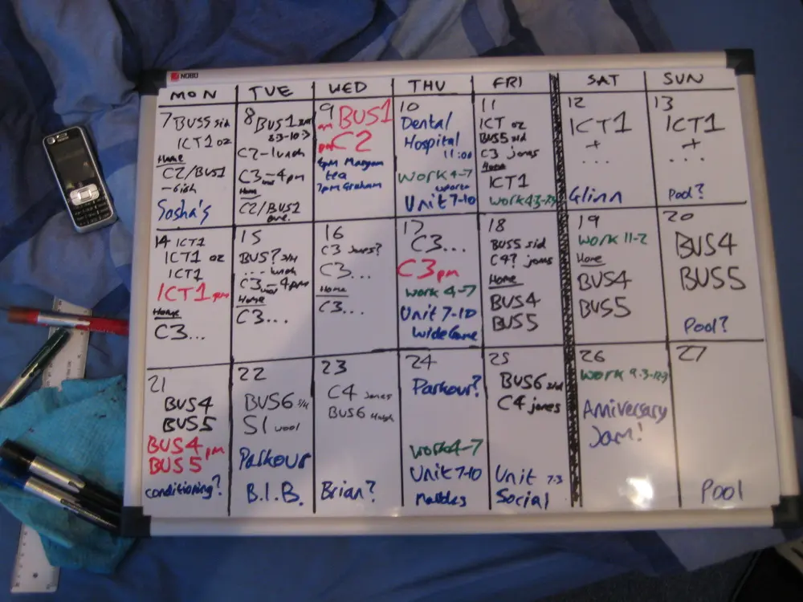
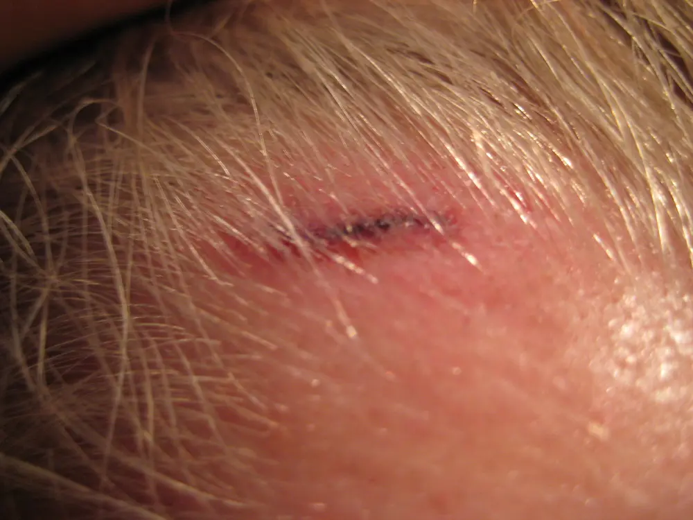
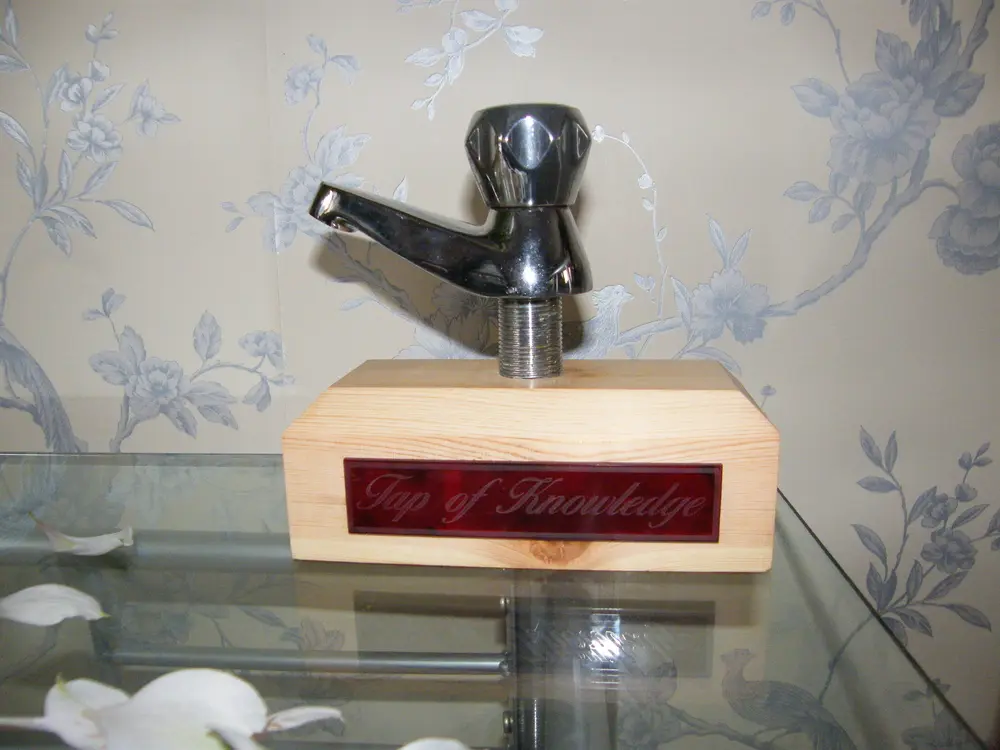

I spent the last day of the Christmas Holidays revising for upcoming exams and planning the next 3
weeks of hard revision and other things. Here's a picture of the timetable I drew up on my new
whiteboard:

<figure class="wp-block-image">

</figure>

Anyway I've been busy and I've not been feeling very well all week. Cold, sickness and I've been
well overtired. A couple of hours after drawing this madman schedule up I got a headrush and
fainted, fell into the bath, banged my head on the tap and knocked myself out.

I woke up, as if from a dream, shouting aloud to no-one "You've hit my head!", before realising I
was lying in the bath with a bleeding head. I scrambled up and told my Mum what had happened, she
sat me down and I started to feel very shaky and confounded, my head punding and I was rather
confused trying to work out what had happened in between the bits I could remember.

<figure class="wp-block-image">

</figure>

I was driven to Accident & Emergency at Casualty and after a bit of a wait they took me through to
see the nurse. They were thinking of keeping me in, and would have done if I lived on my own, but
they did a blood test and took my blood pressure about 5 times, each nurse that took it said "Do you
do a lot of sport?" when seeing my low blood pressure, and when I replied positively they said it
was good and healthy. I then had an X-ray on my chest to make sure there was no problem with my
heart but everything was fine so they were deduced to believe that it was just a faint and nothing
worrying. They told me to rest the next day so I have done.

Happy New Year to everyone, and best wishes in all your pursuits, parkour or otherwise, for 2008.
Have a good one!

Check out my new photos on Flickr: http://www.flickr.com/photos/bennuttall

**Update**: a few months later I was presented with this by my form tutor:

<figure class="wp-block-image">

</figure>

I had found the tap on the side of the river while kayaking, and taken it with me to show my form
tutor, off the back of a joke she'd made that banging my head on a bath tap might have given me
secret knowlege to help pass the exams. She had someone in the DT department mount it on a wood
block and enscribe it with "Tap of Knowledge". She kept it in her classroom (for kids to touch for
good luck) until she retired and then gifted it to me.