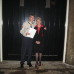
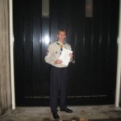
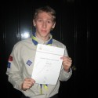
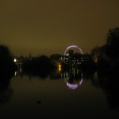

Being part of the most active [Scout Unit](http://www.woodseatsventureunit.com/) in South Yorkshire,
I was strongly encouraged to participate in the [Duke of Edinburgh's Award
Scheme](http://en.wikipedia.org/wiki/Duke_of_Edinburgh's_Award) and given every opportunity to
complete each section of it, with a decent amount of effort. I worked through the Bronze in my first
year when I was 14, went on to the Silver which took me about 18 months, then steadily completed
each part of the Gold over the course of about 2½ years while doing
my GCSEs and A-levels, finishing the award in September 2007.

For each award, the participant has to complete each of four sections (and a fifth\* for the Gold);

- Volunteering: undertaking service to individuals or the community
- Physical: improving in an area of sport, dance or fitness activities
- Skill: developing practical and social skills and personal interests
- Expedition: planning, training for and completion of an adventurous journey (2 days for Bronze, 3
  for Silver, 4 for Gold)
- \*Residential: staying and working away from home doing a shared activity

These things take a long time to process so despite the fact my forms were submitted in September
2007, it took till November 2008 for me to get my certificate. I also achieved the Queen's Scout
Award (which requires the completion of the D of E Gold amongst other accomplishments) at the same
time and finally received my certificate from the [Chief
Scout](http://en.wikipedia.org/wiki/Chief_Scout)[ Peter
Duncan](http://en.wikipedia.org/wiki/Peter_Duncan_(actor)) last month (see [this
post](/blog/2008/10/london-baby/ "London, baby!")).

The Bronze & Silver certificates are merely posted out but the Gold ones are presented at a special
ceremony with Prince Philip in presence. I had an invitation (the poshest invitation you've ever
seen) to go to [St. James' Palace](http://en.wikipedia.org/wiki/St_James'_Palace) in London to be
presented with my certificate, which I attended on Wednesday. I caught the train back to Sheffield
on Tuesday night after my lectures, got a coach down to London with my Mum and we made our way to
the palace where I saw my friend Annie in the queue to get in; I met Annie while doing my D of E,
coincidentally, on my Gold Residential Project where I helped out (as did she) on a kids' Summer
Camp in Huddersfield. I then also bumped into my friend Miles, who is in the same Scout Unit as me;
I had no idea he was going, as we're at different universities and haven't seen each other since
Summer. We were seated together as we were grouped by region (Yorkshire & Humberside II) and we sat
chatting about kayaking while waiting for things to begin.

We were given a speech from the guy in charge of the day, who told us all about St. James' Palace
and the room we were in, the Portrait Gallery, which contained dozens of portraits of monarchs. He
also gave us a brief history of the palace, telling us facts like King Charles spent his last night
in the palace before being beheaded, most of the things he said I'd found out on Wikipedia on my
phone on the coach on the way there (maybe that's what he did to prepare too). He then passed on
to [Steve Backshall](http://en.wikipedia.org/wiki/Steve_Backshall),
a TV presenter who makes shows about explorations
and expeditions such as Expedition Alaska, and also
presented [CBBC](http://en.wikipedia.org/wiki/CBBC)'s [The Really
Wild Show](http://en.wikipedia.org/wiki/The_Really_Wild_Show). Steve gave us a few stories of his
adventures and congratulated us all on our achievements before
handing back to the guy who told us what to do when Prince Philip entered.

Prince Philip entered the room and began to speak to the first of the four groups, we couldn't hear
what was being said until he got to the group before us, when he made a hilarious remark to some
girl; he tended to ask people individually what they did for a certain section of their award ("What
did you do for your service/skill?" or "Where did you go for your expedition?") and he asked this
one girl what she did for her skill, she replied "I was on the committee at my university" to which
he responded "That's a skill, is it?" which made everyone laugh – I guess it's only really funny if
you've done the award; you see, there's always debate about what constitutes a skill, and some
people sign things off claiming them to be a skill, which is cheating really. You're meant to do
something like learn a musical instrument or take up a new skillful hobby and show improvement over
time. He's perfectly right to have said that because she's clearly signed it off unlawfully, and
what a way to be told! There is no higher authority than Prince Philip himself! Miles & I thought it
was brilliant how he came out with it! Completely BURNED!

He got closer and as he moved on to our group, the last group, and he immediately spotted me and
Miles on the end; he asked us if we were from the same Scout group, and commented that he noticed we
were in the same uniform with the same necker colours
(the necker is a group identifier). He then noticed another lad
in Scout uniform and presumed aloud that he was from another group, and started to ask other people
where they did their award through, some did it through schools & colleges, one from the St. John's
Ambulance, but most of them seemed to be from Scouts. He asked a few more questions to the group,
asked if anyone had done their expedition abroad, which Miles had, so he told him that he'd done it
in [Slovenia](http://en.wikipedia.org/wiki/Slovenia), and explained that they
climbed [Triglav](http://en.wikipedia.org/wiki/Triglav) which he
described as "that big hill" which made everyone chuckle. Prince Philip then got hold of the pile of
certificates and said "Are there enough here? They must be very thin!" to which Miles' wit leaped
out as he said "It's that credit crunch" which was hilarious at the time, and had everyone laughing.

It was great to meet [Prince
Philip](http://en.wikipedia.org/wiki/Prince_Philip,_Duke_of_Edinburgh) (or to use his full title
since 1957: His Royal Highness The Prince Philip, Duke of Edinburgh
& Philippos of Greece and Denmark), and at age 87, is doing
great. He is the patron of the University of Cambridge, as well as the D of E Award and had a great
military career which he was forced to give up on becoming consort to Queen Elizabeth II when her
father George VI died (I read on wikipedia today that he was the
one who broke the news to her while on holiday in Kenya in 1951). With my Queen's Scout and D of E
certificates I now have the complete set! Signatures from them both.

I couldn't get any photos inside the palace as it wasn't allowed, but I got some just outside, and
there's a good one of the London Eye from the bridge in St. James' Park.

<dl class="gallery-item">
<dt class="gallery-icon landscape">

</dt></dl><dl class="gallery-item">
<dt class="gallery-icon portrait">

</dt></dl><dl class="gallery-item">
<dt class="gallery-icon landscape">

</dt></dl> <dl class="gallery-item">
<dt class="gallery-icon landscape">

</dt></dl>
 

