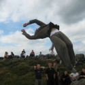
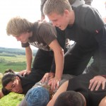
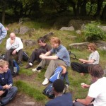

Trace is a Parkour gathering in the peak district organised by Jason Matten and Dave Sedgley. The
first proper one was last year ([Trace Gathering
2007](https://bennuttall.com/trace-gathering-2007/)) and we had a smaller one
the year before called the [Northern Parkour Gathering
2006](https://bennuttall.com/northern-parkour-gathering-2006/). I
came back a few days early from my trip to the [Spanish
Pyrenees](https://bennuttall.com/pyrenees-2008/) for this event and it was well
worth it. This year was HUGE as there were 250 places available as the entire campsite at Edale was
booked out for us, so there were about twice as many attendees as last year (and about 5 times more
than 06), which I felt played against us at times. It was too big. The rain fell throughout the week
which left us unable to perform the training we would like to be able to do, but nevertheless we had
a great gathering and did the best we could to train in the wet, which is simply a matter of working
on smaller-scaled jumps and making them much more controlled, which is an integral part of parkour
training. (What's the point only training in good weather? What if we needed to put our skills to
practice and it was raining?)

We all arrived on Monday to pitch our tents at Edale and meet and greet the traceurs who had mostly
come from around the UK but some from Europe, America, even Australasia! I made my way by train from
Sheffield and found a huge bunch of young people in tracksuit bottoms with big bags and camping
equipment that happened to be getting the very same train as me. While waiting at the station in
Sheffield the group were looking at a sizey precision jump across the single-train rail line which I
have been wanting to try for quite some time, and I decided to go for it. It's just about far enough
to push my comfort levels, but I found it was easily doable. I think it's about 11 feet.On the walk
from the station to the campsite I saw my good friend Jin, who recently returned from a year in
China, so we hugged and had a quick catch-up on the way to the gazebo that had been set up on
entrance, where my good friend Blake from South London's Saiyan Clan (see their
awesome-but-not-frequently-enough-updated [blog](http://saiyangarden.blogspot.com/)) was
ticking names off the list, and spotted me out of the crowd and came over to shake my hand and say
hello, it was great to see him again, so we had a chat once the crowd had died down. We trained a
bit on the park round the corner that night and got settled in before being grouped for the next two
days. I was to be in Jin and Liv's group with a mix of guys (and 3 girls) from all over the UK, none
of which I knew at that point.

The first day was a late start and we warmed up and trained on a wet and slippery Padley Gorge for a
few hours before heading to the other peaks in walking distance from Grindleford Station. We got the
train to Hope to go to the shop to stock up on supplies for the week, and with about 100 other
traceurs with the same idea, we packed the shop out and formed a queue that actually filled the
shop, so on entering the shop, you had joined the queue and basically had to pick things up on your
way to the front of the queue, which took about 45 minutes. We missed the train and a group of us
decided to walk back rather than waiting 2 hours for the train. It was only 1 stop on the train and
was a 7 minute journey that took well over an hour if you walked it.The next day was an early start
which began with us trekking all the way up Higger Tor in the pouring rain, where we ate some food
before doing some weaselling while the weather passed. Some of the gaps we had to force our bodies
through were incredibly small, some even crushed your chest making it hard to breathe in and out.
One of the guys there said that this was useful training as if you got caught in a building on fire
or under terrorist attack or something and needed to climb through a vent to get out, you might have
to force yourself through an awkward gap. This gave me reason to try some hard ones. One of them
made you force your chest through a gap and struggle through upwards with little to push off, you
got your skin caught at the front and back and had to relax as much as possible, breathe in and out
slowly and you had to breathe out massively in order for your chest to be small enough to fit
through, which was still a struggle, especially during shallow-breathing. I managed to squeeze
through to applaud from the motivating group led by Daniel Ilabaca (one of the things I love about
the way Danny trains with groups – he encourages people to work towards what they are trying to
achieve and applauds and congratulates them on completion or good attempt).

Once the weather had cleared up we did some parkour runs over the rocks. Danny came up with a run
with no preparation, he simply went forwards and came up with appropriate movements as he went
along, and got us all to try and follow suit – it turned out to be a great run that everybody could
do (some faster and smoother than others) and we had great fun fine-tuning and perfecting it. Later
on in the afternoon when everyone was starting to get tired out, Danny asked who wanted to do some
barefoot training, and those who did took off our shoes and socks and followed him on a course of
keeping to the rocks and off the grass, all round Carl Walk, until we jumped to a massive rock where
the path ended, and once three of us had got to where he was stuck, he asked the rest to find new
paths. Danny decided to come up with a team activity where the four of us helped each other to get
back from the big rock (impossible to do individually) so he formed himself into a bridge across the
gap and I had to climb up him to get to the next rock, then help the next person up and then between
us, pull Danny up to join us. We managed it and Danny asked for another team of four to work
together to do the same, and three or four groups had a go. I think all but one made it back, and
one with a little cheating, and Danny was trying to emphasise the importance of the task, to try and
make it more real and more desperate so that we should treat it like we had to do it without falling
and take it deadly seriously as if it was a matter of working together saving our lives. Some
disregarded this but some took it on board and took the exercise seriously.The fourth day, and third
full day of training, we had the choice to do what we wanted, so I trekked up to Higger Tor with a
small group of other traceurs (most people just stayed at Padley Gorge out of laziness, some because
they genuinely preferred it) and when we arrived there it chucked it down with rain and all we could
do was take shelter and wait for it to get better. It only got worse, and we were given warnings of
more bad weather, so we walked all the way back to the gorge where it was wet but some of the people
were training. I joined Will and Blake on a tree/rock manoeuvre and added my own ideas to the route
they were trying. They loved my idea (it was a sweet movement involving getting from one rock to
another by means of a dive to a branch, swinging to another branch and swinging off onto the landing
rock) and the three of us tried out our different techniques and took note of what we liked about
each other's way of moving and choices of methods, and were all getting close to landing it with
different methods, but then Blake swung from the first branch and it snapped off completely. It
looked as if he landed flat out on his back on a big rock, so I went over to see if his back was ok,
which it was, minus a bit of a scrape, but he'd actually taken a chuck out of his arm on the way
down! He had cut the skin on the inside of his arm at the elbow level, right where the bone sticks
out, and the skin had ripped apart and looked quite deep, maybe to the bone. I rushed to get my
first aid kit (the best of which is still making its way back in a trailer on a minibus from Spain
with the rest of my kit) and cleaned the wound up and bandaged it and used some of Will's tape to
hold the cut closed so it could heal easier. He was ok and will be getting it checked out when he
gets home.

Then we headed back to Edale and to the campsite where we had been informed flood warnings had been
issued, and Dave was making plans to move the group to the village hall for the night rather than
risk it at the campsite. Seeing as I live in Sheffield, I thought I may as well just pack up and go
home, since the gathering had finished and people were only staying to go home the next day. I
packed up quickly and found out the train times and just about had time to help Will pack away and
say goodbye to some people. It amazed me how many mini-Ilabacas there were at Trace. Soooo many
people with the same hairstyle and dressing habits. I actually witnessed (on several occasions)
people picking up tips from Danny and telling their mates about them, and trying to copy every
little thing that he did because they thought that it would make them better. One guy a few of us
were helping with his cat pass technique actually admitted that he wanted to do it a different way
just to be like Danny and that he thought it was justifiable to copy him merely because if Danny did
it then it must be the right way. Apparently Danny's years of practising and downright natural
ability and skill don't come in to it! I didn't get many photos as I was too busy training. Thanks
to Jason and Dave and all the reps for the event. And to Blake and Cable – please update your blog!
I look forward to reading your version of events at Trace soon! I also hope we can arranged to meet
up to train together soon. All the best, guys. Stay safe (and I hope your arm is ok, Blake!).

<dl class="gallery-item">
<dt class="gallery-icon landscape">

</dt></dl><dl class="gallery-item">
<dt class="gallery-icon portrait">

</dt></dl><dl class="gallery-item">
<dt class="gallery-icon landscape">

</dt></dl> <dl class="gallery-item">
<dt class="gallery-icon landscape">

</dt></dl><dl class="gallery-item">
<dt class="gallery-icon landscape">

</dt></dl><dl class="gallery-item">
<dt class="gallery-icon landscape">

</dt></dl> <dl class="gallery-item">
<dt class="gallery-icon portrait">

</dt></dl><dl class="gallery-item">
<dt class="gallery-icon landscape">

</dt></dl><dl class="gallery-item">
<dt class="gallery-icon landscape">

</dt></dl> <dl class="gallery-item">
<dt class="gallery-icon portrait">

</dt></dl><dl class="gallery-item">
<dt class="gallery-icon portrait">

</dt></dl><dl class="gallery-item">
<dt class="gallery-icon portrait">

</dt></dl> <dl class="gallery-item">
<dt class="gallery-icon landscape">

</dt></dl><dl class="gallery-item">
<dt class="gallery-icon portrait">

</dt></dl><dl class="gallery-item">
<dt class="gallery-icon landscape">

</dt></dl> 

