They say that you can learn more from two weeks in the [Alps](http://en.wikipedia.org/wiki/Alps)
than you can kayaking a whole year in the UK. I can vouch for that after 3,298.7 miles, 8 countries,
13 rivers, 5 mountain bike trails, 2 rafting trips and half a day at Fontainebleau.

Miles and I set off from Sheffield at about 1pm on the Monday, headed South for Dover, stopping off
at a guy called Ted Piper's house in Henley-on-Thames for a cup of tea and a chat. You know how they
say everyone knows everyone in the world through 6 people? Well there's a theory within the UK
kayaking community that everyone in kayaking knows Ted Piper through 1 person. There's a [thread on
UKRGB forums that proves it](http://www.ukriversguidebook.co.uk/forum/viewtopic.php?f=3&t=48440). By
the way, Ted Piper got really ill (viral meningitis) while kayaking in Northern Norway earlier this
year and had to be flown home immediately – without his car – so if anyone fancies driving it back
to the UK for him before the roads close for Winter, I'm sure he'd appreciate it.

Anyway, we got to Dover in perfect time for our 10pm crossing and were at Dunkirque (cheaper than
Dover-Calais) by midnight (now 11pm in France time, woah – time travel!) and on the aforementioned
Ted Piper's advice, planned to avoid the toll roads through France. This just happened to pass
through Belgium, Luxembourg, Germany, Switzerland and Italy. By about 6pm (with practically no
sleep) we were at our destination – [Bourg Saint
Maurice](http://en.wikipedia.org/wiki/Bourg_Saint_Maurice) in the South of France, near the Italian
boarder. We met up with the others who had been there a few days already: Mark, Sara, John & Nicola,
all of whom have been boating all around Europe (and some in Nepal) many times before. Miles has
only boated in New Zealand and the UK and I have never boated abroad!

The next day we did our first Alpine river, which was continuous class three/four whitewater. The
biggest and hardest I've ever paddled! We went down a gorge to a place you can only get to by kayak
(or raft) which was an interesting experience. The next few days we did some medium-hard stuff. In
the UK if we want to go kayaking we need high water levels, and for that to happen you need a lot of
rain and horrible weather, whereas in the Alps you need lots of sun and heat to cause the glaciers
to melt and pour down the mountains into the rivers! This also means that the water is clean and
pure! It's brilliant! UK rivers are horrible and full of guk, making them a murky brown colour.

It was immediately noticeable that the standard class of river was much higher and more consistent
than in the UK. Rivers are graded from one to six: one being still flat water; two is moving water
with few or no obstructions; three involves slight manoeuvring to avoid complications; four is
potentially dangerous water with complicated flow which can require inspection; five requires
inspection and mistakes will lead to severe danger and potential injury; and six is usually
unpaddleable where a mistake would certainly lead to severe danger, serious injury and possibly
death. It is possible for danger to occur on any class of water (even one – such as simply drowning)
and kayaking is certainly a dangerous activity at any level and precautions must be taken to prevent
danger, and where danger occurs, safety and rescue must be put into effect. It was apparent that
Alpine rivers were very fast flowing due to a higher gradient in the mountains and gorges and that
the class of water was consistent throughout. So in the UK, a class four river would most likely be
two/three for the majority with a few odd features at class four, whereas in the Alps it seemed that
the gradings were accurate for the whole river, so a class four might actually be 3+/4 throughout,
pushing on 4+.

One of the rivers we did towards the end of our first week, the Guisane, started off with a very
scary class four rapid section which we thoroughly inspected and almost decided to portage (walk
round and get on after it) but Miles & John ran it fine and we went for it. It actually tipped me
over towards the end and I went down the final wave upside-down but managed to roll back up fine.
The river continued to push my limits and was very continuous in its pace and difficulty, which
proved to be a bit much for me, especially on what seemed to be an off day for me. I got tipped
awkwardly and failed to roll back up and saw my boat get washed away downstream while I swam to the
side and got out. The boat luckily got pinned on a rock not far away, so we analysed the situation
and got Miles positioned downstream of it and we threw rocks at it to try and free it from being
pinned against the rock, which after a few good throws, worked! Unfortunately with the speed of the
water Miles was unable to stop it and it ended up drifting further. I climbed to the road side and
ran along to catch it up – after a good few minutes' jogging I spotted the green boat against the
clear water – it had got pinned on another rock so I got myself down to the side of the water and
waited for the others, in their boats, to catch up and get it free for me. John managed, after a few
attempts, to hook a line onto the grab handle and we set up a pulley system (with an actual pulley –
something I've never seen in kayak rescue! Brilliant!) to release the boat and reel it in, which
worked fine.

Just before the end of the river I went down a rapid at a slightly bad angle and got stuck in a hole
(note: holes are nasty bits of backwashing water caused by water pouring over a rock – if you get
stuck in they're hard to get out of whether you're in a boat or swimming, and should be avoided at
all costs!), flipped over a couple of times (that's what they do – they just flip your boat over
repeatedly – it's like being in a washing machine!) before popping my spraydeck and getting out –
fortunately I didn't get stuck in it after that and managed to swim to the side with my boat but my
paddles got thrown to the other side and got swept away. I saw Miles catch up with them and throw
them onto the side. I later found that they'd hit the side and fallen back into the water. He'd
tried a second time but they'd disappeared from view when they dropped. Hmm.

In rescue situations there's an order of priority: first comes yourself; second comes other people;
third comes boats; fourth comes paddles and other smaller equipment. I'd got myself out, there was
no-one else in danger, I'd got my boat out, then I started looking for my paddles (at this point I
was still under the presumption that they were on the side where Miles had thrown them) and when I
started asking the others I began to realise they were probably floating off down the river. Hmm.

I climbed up the side onto the road and dragged my boat up with a rope then ran down the road,
peering over the edge to the water to look for my paddles. I ran a fair distance without seeing
anything that resembled paddles. Luckily this was where the river smoothed out and became a lake so
the water was pretty much still which meant they would probably be floating here. They weren't. I
looked all around, even saw what I'm almost certain was the re-used coke bottle, half full of water,
I had loose in the back of my boat – it was floating in the lake, not moving, so I guessed my
paddles should be somewhere nearby. They weren't. Hmm.

It got to the point where I'd almost started mourning for them. I wasn't prepared to accept that
they were gone (sorry, did I mention they were brand new – I bought them for this trip – not cheap
at £130 although you can pay a lot more for paddles), but after a good search and people starting to
hint that they would be stuck under a rock somewhere and that I'd never find them, I'd just about
given up. I'd lost them. Brand new £130 paddles – my first decent set! And they'd lasted less than a
week! I was gutted. Mark started telling me about when he lost a set in Nepal and how annoying it
is, but these things happen. Thinking about that was the peak of my mourning – but I thought I'd
better just check one more time. I couldn't see anything (but the coke bottle) in the lake part so I
walked back up with John to where Miles had thrown them where they had first gone out of sight –
checking by the rocks on both sides. Nothing. It was annoying that they were completely black – if
the blades were bright coloured I may have been able to spot them better. I reached the point as far
upstream as they could have been, stopped, turned around and began to pace back with my head hung in
misery. John offered comforting words to try and soften the pain of my loss, which caused a pang
which was tantamount to the aforementioned peak of my mourning. John dipped his hand into a nearby
pool behind a big rock – and he pulled out my set of paddles – like they were being withdrawn from a
Mary Poppins-esque handbag of Alpine water. I was surprised to see them, but didn't let out any
emotion. I just stared at them in his hand. They were back! I hadn't lost them at all! This was
fantastic. I was relieved! But for some reason this situation called for some sort of humour – I
can't remember exactly what my confused brain conjured up at the time but I seem to remember it
being something along the lines "They're not mine, but they're sort of similar. They'll do." – I
thanked and congratulated John and we headed back up to where the others were stood. Phew!

That day shook me up a bit, but the next river we did in France was fairly easy-going, and the next
was big but not as scary. Then we had two days away from water as we headed up to [l'Alpe
d'Huez](http://en.wikipedia.org/wiki/L'alpe_d'huez) which is a ski resort in the Winter; mountain
biking in the Summer. The first day was mostly driving, and when we arrived late afternoon Miles
hired a downhill mountain bike – Miles is really into his biking so he knew which one he wanted
straight away – and paid €120 for a day and a half. He rode it on the purpose-built dirt track near
the centre for the rest of the afternoon (this involved him jumping it off the roof of a hut and
putting a few scratches in the protective body armour he'd been loaned). We were too tired from the
drive to bother putting up our tent that night. Mistake. The worst storm I've ever witnessed. We
thought we'd be ok under a tarpaulin shelter hung up from John's van. Mistake. We would have been ok
if it had been mild rain. It wasn't. We were ok while it was raining (at which point Miles decided
he was better off sleeping in the back of the van) but then it started pouring underneath the van
and wetting my sleeping bag and thermarest. Hmm. Time to join Miles in the van, I thought. But
unfortunately the back of the van was full of our stuff (literally full) so with a few things taken
out was just enough room to fit one person laid across the bags – this meant I was stuck with the
only available option – sleep across the two front seats. Brilliant. Whichever way I turned I had
something sticking in me – the gear nob or the hand brake or whatever. At least I was dry.

Anyway, morning came and it was time for me to hire a bike for the day. I wasn't as keen or extreme
as Miles so a simple cross-country bike was sufficient. I was hoping it wasn't going to be as much
as Miles' ... and when he said it was only €22 I jumped for joy (on the inside) and handed him the
tiny amount of mickey mouse money he demanded and feeling rather pleased for myself went to purchase
my gondola (ski lift) ticket. We decided to do an easy blue route to get started. It started with
going down a steep hill and immediately coming up the next hill. Sara said not to put my brakes on
while I was on the hill and to wait till I was over the other side, so I held the handlebars without
resting over the brakes – but when I got to the top on the other side I needed to brake quickly and
so reached for the left brake and slammed it on. Mistake. On bikes in the UK, the left brake is for
the back, the right for the front. I've only been on a bike once since I was a kid but my instinct
told me which brake was which. Unfortunately they have them on opposite sides in Europe. Crash! I
hit the wrong brake – the front – and went flying through the handlebars and skidded with the bike.
I cut my side up which stung a bit but I was more frustrated with the French than in pain. I got
back on and continued with the route. The next route we chose was marked as a red on the map, but
when we got up there (right up there, this one started much higher up the mountain) it was clear
that it had recently been downgraded from a black. Not good for a novice. We ran it anyway. I fell
off a lot.

Then we planned to do a longer route which was a concoction of several other red routes, on which we
somehow got very lost due to poor French mapping and ended up doing many more dodgy routes than
intended and ended up in a little French town in the wrong valley (Sardonne), and pushing for time
(we needed to get the last gondola back and return our bikes to the hiring shops by 5pm) we got onto
the right track, which turned out to be a really good one that ran through a dense woods! I had a
great time, rode hard and fell off even harder! In fact at one point I fell off and skidded down the
steep cliff away from the path, with my bike thrown even further down. It was impossible to get
myself back up it carrying my bike as I was knee-deep in leaves. The path continued to my right as I
looked back at it from below, so I edged my way to the side, trying with all my might to drag the
bike with me – and after a ten minute struggle I managed to get myself back on the path. The chain
had got caught up in branches or something and wouldn't go so I had to adjust it a few times to get
it to work, but then I was off – to catch up with the others. I'd been shouting them to let them
know I was stuck and that I'd be further behind, they'd been shouting back to me to ask if I was
alright, but neither of us had heard each other. Anyway I finally caught them up and they'd been
waiting for me (Sara worrying whether I was still alive or not) and started to walk back.

We were in a real rush now so Mark & Miles sped off towards the nearby village in attempt to make it
for the last bus back to the gondola which would take us back to where we started. Sara and I
continued on, stopping to ask for directions on the way. It's funny how Sara launched into her
only-slightly-broken French which only confused the (we think German) couple she was talking to, but
when I asked Sara something (obviously in English) they butted in and said "We speak English" which
made it a bit easier for us to communicate rather than us all trying to speak an unnatural language.
We eventually made it to the village, [Allemond](http://en.wikipedia.org/wiki/Allemond) (at this
point I was aching all over), and as Mark & Miles weren't waiting at the bus stop we presumed they
had made it in time for the bus and we had missed them. There was another bus about 45 minutes later
so we waited for that, knowing it wouldn't get us back in time for the last gondola, so we were
thinking we'd have to get a taxi or something back to our vans. With so much time to wait I wandered
into the town to find a boulangerie for what turned out to be the best two pastries (almond covered
and filled croissant & pain au chocolat) I've ever had!

I'd turned my phone on when we stopped, in case Mark got back to the van and tried to ring me, and
luckily he did. He'd seen a missed call on Sara's phone (which she'd left in the van – I was the
only one with a phone with me on the bike trip), which was from right at the beginning of the day
when I was waiting for them after hiring my bike, but he'd thought it was more recent. He phoned me
and I said we were at the bus stop in Allemond and could he come and pick us up. He arrived somewhat
later with Miles in the van and both their bikes on the back. This puzzled us as we thought they'd
got the bus and the gondola back and dropped Miles off to return his hired bike (as this was one of
the main timing issues), but when quizzed, Mark explained that they hadn't made it to Allemond as
they took a wrong turning and ended up in the wrong village! And that Mark had [hitched a
lift](http://en.wikipedia.org/wiki/Hitch_hike) from "some crazy-driving French guy" back up to
l'Alpe d'Huez, quickly ran back to the van, phoned me and come to collect us (picking Miles and the
two bikes up on the way). So when we finally all got back safely to l'Alpe d'Huez, we were a little
worried about the bike hire shops, presuming they'd be closed by that time (it was about 6:30).
Miles had promised to return his by 5pm, but my guy hadn't given a time (although I presumed it
would have been the same, and we presumed they would close soon after 5, maybe 6). Anyway, when we
got there we saw that both shops were still open, so that I would be fine as we hadn't agreed a
time, and Miles should be ok being a little bit late. Miles was hiding in the back of the van, and
got Sara to tell the guy he'd been in an accident and taken to hospital, which was why she was late
bringing it back for him. He was fine and didn't mind and gave her his driving license (Miles had
left his driving licence as deposit, but my cheaper bike hadn't required a deposit).

I took mine back, gave it to the guy, he didn't really say anything at first of acknowledge that I
was there. I pointed out that I was returning his bike and he took it from me, sill saying nothing.
I said "Ok?" and as he wheeled it off, still not really saying anything, I presumed everything was
ok and that I had been excused. I said "Ok then, thank you. Bye.", just to confirm that I was going
to go. He finally said "Ok. Bye bye." Then after a few seconds said "No wait ... no bye bye!" ... he
was calling me back. He pointed at the bike and said "Broken!" Hmm. I don't know much about bikes
but I was pretty sure that bike wasn't broken. I had just been riding it fine. "Sorry?? What's the
problem?" I asked. "Broken!" he said. I tried to convey my look of confusion to him in order to get
some more information out of him about his allegations, which seemed to work as he pointed to the
centre of the back wheel where the chain can be notched onto the gears. I gave him my confused look
again and he said "[Derailleur](http://en.wikipedia.org/wiki/Derailleur)!". At this point I urged
the others to join me to try to work out between us what he was trying to say. He pointed again and
repeated "Derailleur!" and the others knew what a derailleur was. I didn't. He was claiming it was
bent. I couldn't tell if it was or not. The others said it seemed to look a little bent but looked
ok, until he shifted it into a really high gear which when he demonstrated how the chain would
always fall off when the wheel span in this high gear, because the derailleur was bent. Miles
suggested bending it back but he explained how this was not possible. He wanted me to pay €32 for a
replacement derailleur. He hadn't taken a monetary deposit or kept my passport or anything, yet he
demanded a sum of money which was more than I had paid to hire the bike. I didn't think this was
fair. Surely it's part of the cost of having a hire business, that eventually the equipment
depreciates with use and needs fixing or replacing, and I think it's unfair to put blame for damage
on one person unless through reckless use. I wasn't going to pay him for a repair on something he'd
hired to many people before me. I told him this and said I was going to go. He said he was going to
phone the police. I went to sit in the van with Mark and the others to ask them what they thought.
John arrived on the scene and he said that derailers break really easily, if you hit a rock or
something they can break, and that he breaks two or three a year. Well I was still against the idea
of him charging me for wear-and-tear but thought that as it wasn't a huge sum of money, I'd probably
knocked it one of the many times I'd fallen off, and it was not worth the risk of any epic Alpine
police chases with us in our [Volkswagen
Transporter](http://en.wikipedia.org/wiki/Volkswagen_Transporter) with kayaks on the roof rack, so I
decided to pay up. I wasn't happy about it but even at €54, mine was still less than half the price
of Miles' bike so I could hardly complain. The annoying thing is I felt cheated. If he'd have
charged me €54 at the start of the day I'd have paid up and felt lucky it was much cheaper than
Miles', but the fact that he'd claimed damages and demanded a further payment put a downer on the
whole thing. But these things happen.

That night was our last night with the group as Miles and I were headed North-East to Austria while
the others headed home after a couple more days of biking. We went for a nice meal at the resort,
which we decided to splash out on. Miles and I opted for a two-person minimum set meal which turned
out to be a plate full of raw meat (chicken, duck and beef steak) which we hat to cook for ourselves
on a stove they provided us with. It came with a bowl of mashed potato and a load of veg and went
down well ... once we'd cooked it. The following morning, Miles and I bid farewell and headed to
Austria. We drove through Italy (Torino & Milano), witnessed the crazy drivers and paid the
expensive tolls and we finally made it to our destination: a campsite in Prutz, near Landeck in
Austria. The campsite was full of kayakers and we were greeted by one who was on his own looking for
people to go boating with. His name was Andy, he was from London and he took us down three local
rivers the next day which was brilliant! It was more independent learning as we were paddling as
peers, no-one in charge, just the three of us taking it one bend at a time, instead of the way we'd
been doing it so far where someone was leading and we were following – I actually had to consciously
look after myself now which is the best way to learn. We soon realised that the Austrian rivers were
massively high volume – big wide rivers with huge waves, which we're not used to in the UK as most
rivers are either big and wide but flat with no waves, or thin, steep and creeky. We met up with
some other UK guys for the third river that day and all went ok.

A couple of days later we headed to the Ötz valley to met up with a
[Bavarian](http://en.wikipedia.org/wiki/Bavaria) kayaker by the name of Bijon he met in New Zealand.
Bijon was working for German rafting company in Austria over the summer, taking groups of German
people rafting in Austria and Switzerland. We joined them at the rafting base for their BBQ and
chatted with the Germans. Our tactic: [Don't mention the
war](http://en.wikipedia.org/wiki/The_Germans). Miles mentioned it once but I think he got away with
it. Seriously though, we enjoyed their company and they seemed to enjoy ours, buying us drinks and
talking to us about all sorts. Obviously we don't speak German but they all speak English, so that's
the way it was. After the Germans went off we head upstairs for a little rafting guides' party – had
a great chat with a German guy called Norman. Then we had to sleep on the floor in the drying room
full of wetsuits and things, in the room with me was a New Zealander who we were told snores really
badly – I thought I'd risk it and be alright but by the early hours I couldn't believe the amount of
horrendous noise he was snorting – it was nothing like I'd ever witnessed before. I had to move, and
even when I did I couldn't sleep because I'd been woken up. The next morning I saw the guy I'd been
chatting to at the party, Norman. He saw I was wearing [my trademark Blogger
t-shirt](http://www.flickr.com/photos/shanerounce/1018974796/) and asked if I was a blogger. "Yes I
am" I said, beaming with pride. This reminded me of how I like to be thought of as a "Blogger". We
talked about blogs for a while and later on got on the office computer and showed each other our
respective blogs. His is [Norman-slow-motion](http://norman-slow-motion.blogspot.com/).

We drove to Switzerland the next day to tag along on two of their rafting journeys – Miles as the
safety kayaker, while I joined five of the Germans in the raft with Bijon yelling instructions at us
in German. This proved somewhat difficult as I didn't understand what he was saying unless I heard
the words for left, right, forwards and stop which were easy to remember once he told me – the more
complicated instructions (more urgent ones such as "Everyone get down in the raft and hold on
tight") were tricky so whenever everyone else would dive somewhere I would just copy their actions
which meant I was slightly delayed – this was rather problematic as these instructions carried a
matter of urgency and failure to comply often meant the risk of tipping the raft! I asked Bijon what
those instructions were in German so I would remember to do so when he shouted them, which helped a
lot – I managed to follow these orders without delay. I had a great time rafting, as it was a whole
new experience to be on the water in such a big inflatable craft with other people rather than
single man kayak where you are completely in control and responsible for yourself. The water was
much harder, higher and potentially problematic than I could probably deal with, so it was a good
option to go rafting instead that day.

That evening we attended a party at Bijon's house – not a cool rafting party full of drunk European
student girls, but a family party for his housemate's Dad's something's birthday party – a
middle-aged woman's birthday party. We ate their food and chatted with their family a bit (at this
point every Auntie and Uncle, Grandma and Grandpa, Niece and Nephew had turned up) before heading
off to a cool rafting party full of drunk European student girls. We chatted away and got speaking
to a range of different people from the local rafting companies and ended up in someone's
halls-of-residence-esque summer rafting guide accommodation where they proceeded to smoke lots of
weed while we tried not to look too out of place, although we certainly were. I was really tired at
this point from the lack of sleep the previous night and all the rafting of the day so being laid on
a bed in a room full of weed smoke, I was dozing off. We soon left and slept at Bijon's house.

The next morning we were awarded with Bijon's famous pancakes. This was something I'd been looking
forward to – the only thing I knew about Bijon was that, according to Miles, if you were on a night
out with Bijon, you could end up in the remotest field or desert and Bijon would somehow locate the
ingredients and make pancakes. I'd spent two or three days with Bijon and still no sign. The first
thing I saw of him that morning, Bijon was on the phone to one of his pancake contacts arranging for
the delivery of flour. Flour arrived shortly in the arms of another stoner. Here they were at last!
Bijon's pancakes! And they were fantastic. This day was our last day before heading back so we
decided to hook up with Norman and the flour guy to go kayaking. They took us for a run of the Oetz,
which was the scariest kayaking experience I've ever had. I was seriously terrified as it was
massive pushy water with hidden holes and all sorts – all immediately upon putting on to the river.
I've never been forced to use support strokes quite so frequently and urgently. I was having to work
my very hardest every second just to keep the boat upright! So many times I nearly went over. I got
through the worst of it to find there was a harder and more unpredictable section coming up. That's
pretty much how it was for the next three hours: me thinking "Phew, I'm glad I got out of that bit
alive" and then slowly discovering there was more around the next bend. We got to a rapid that the
guys we were with said was called the 'Constructa', named after a German washing machine brand –
because that's what it would feel like if you got stuck in it! We got out to portage a deathly weir
and were at the end before long. A huge sigh of relief. I'd wanted to do one last river before we
left, something that would push my limits. That was what I was looking for and I'm glad we did it.
We bid farewell to Norman and the Flour guy and headed to France!

We decided to stop at [Fontainebleau](http://en.wikipedia.org/wiki/Forest_of_Fontainebleau) on the
way back through France. Font is an amazing place – a vast forest full of bouldering opportunities,
it's just South of Paris. We drove there from Austria, passing through Switzerland and
Liechtenstein. We arrived at Font at about 4am, no idea where exactly we needed to be for the
bouldering, so we ended up sleeping in the McDonald's car park beside the van, with the intention of
using the free Wifi when it opened. We woke up at about 8, then realising that McDonald's didn't
open till 10 we stayed in the van and read our books for two hours. At 10 they opened up and we
hopped straight inside, checked online to see where the spots were and shortly after that we headed
off to find somewhere to climb. We stayed there a while, had a bit of a climb and I jumped around
the rocks a bit and then we headed off in plenty of time to catch our ferry. We ended up arriving at
Dunkerque (after popping into Belgium to look for war graves) seven hours early so it was worth us
paying a little extra to get on an earlier ferry. I finished my book on the ferry ([*America
Unchained*](http://www.davegorman.com/projects_america_unchained.html) by [Dave
Gorman](http://en.wikipedia.org/wiki/Dave_Gorman) – a fantastic story about a coast-to-coast road
trip across America, avoiding the chain stores and only buying from independent gas stations, shops
and hotels) and started my next one. We were home (as in Sheffield) an hour before we were supposed
to leave France, which was an achievement. What was even more of an achievement was that I returned
alive with all my kit in tact, albeit a little more second-hand-looking.

<dl class="gallery-item">
<dt class="gallery-icon landscape">
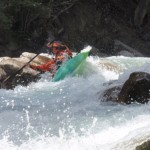
</dt></dl><dl class="gallery-item">
<dt class="gallery-icon landscape">
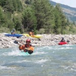
</dt></dl><dl class="gallery-item">
<dt class="gallery-icon landscape">
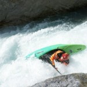
</dt></dl> <dl class="gallery-item">
<dt class="gallery-icon landscape">
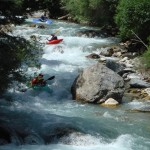
</dt></dl><dl class="gallery-item">
<dt class="gallery-icon landscape">
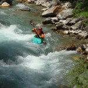
</dt></dl><dl class="gallery-item">
<dt class="gallery-icon portrait">
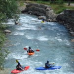
</dt></dl> <dl class="gallery-item">
<dt class="gallery-icon landscape">
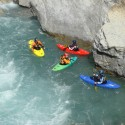
</dt></dl><dl class="gallery-item">
<dt class="gallery-icon landscape">
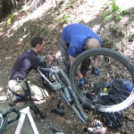
</dt></dl><dl class="gallery-item">
<dt class="gallery-icon landscape">
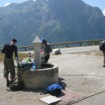
</dt></dl> <dl class="gallery-item">
<dt class="gallery-icon landscape">
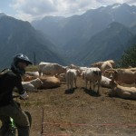
</dt></dl><dl class="gallery-item">
<dt class="gallery-icon landscape">
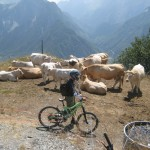
</dt></dl><dl class="gallery-item">
<dt class="gallery-icon landscape">
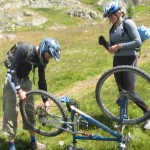
</dt></dl> <dl class="gallery-item">
<dt class="gallery-icon landscape">
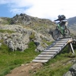
</dt></dl><dl class="gallery-item">
<dt class="gallery-icon landscape">
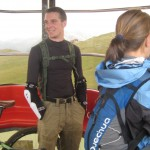
</dt></dl><dl class="gallery-item">
<dt class="gallery-icon landscape">
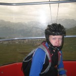
</dt></dl> 

