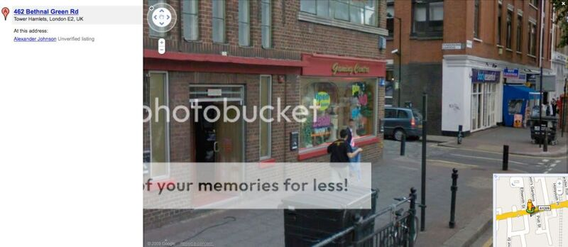

I've been blown away by so many things Google have done so far this year (and it's only March).
They've done loads of work on Gmail which has incredibly made it even better; Gmail was already the
best webmail service around, and it's been making life easier for millions of users all over the
world for a few years now, and still they're constantly making small improvements (mostly based on
the developers' own personal issues).

There is a section within Gmail called *Labs* which allows you to pick and choose which of their
extra features you wish to use; this has been amazing for me recently - they've made such brilliant
solutions to common problems with general email services. A good example is the 'forgotten
attachment detector' - how many times have you sent an email to someone saying "*...please find
attached my (CV/Document/Presentation)...*" and hit **Send** without remembering to actually attach
it? Well this labs feature detects if you mention the word 'attach' or 'attachment' and prompts you
if you haven't attached any files. Pure brilliance.

Another new feaure in Gmail is the ability to view all your email in your web browser while offline.
If you're not connected to the internet (or you temporarily lose your wireless signal) it will just
open your inbox where you can view all of your past emails and their attachments, and you can even
send new emails (which will send as soon as a connection is found). Once your connection is back it
will automatically download any new emails.

Next up, *[StreetView](http://en.wikipedia.org/wiki/Google_Street_View)* in [Google
Maps](http://maps.google.com/); it's been available in the US for a couple of years now and last
week it was launched in the UK! You can now go to ground level in the major cities and actually look
round 360° as if you were actually stood there. You can walk forward through a street, look round
and pick a street to go down and just wander through. Not only can you spin round on the spot but
also look 290° vertically, so you can look up at a tall building ahead.

I'm an avid reader of [Dave Gorman](http://www.davegorman.com/)'s
[blog](http://gormano.blogspot.com/). Last week he posted about how when he heard that StreetView
for UK was being released, it reminded him of "an incident from many moons ago" when he had been
walking down Bethnal Green and saw a bizarre sight - a small car mounted with a huge nest of
cameras - which he stopped to gawp at with curiousity, before seeing the Google logo on the side of
the car, which made him realise that they were photographing for the StreetView project. He then
realised that he would be shown in Bethnal Green looking stupid when they launched it. And he was
right, except that they have blurred everyone's faces out, so until he [announced it to the
world](http://gormano.blogspot.com/2009/03/wheres-wally.html), he would have been the only one to
know it was him. You can view it
[here](http://googlesightseeing.com/maps?p=&c=&t=h&hl=en&ll=51.527249,-0.057721&z=16&layer=c&cbll=51.527217,-0.05795&cbp=12,46.50137295077224,,2,6.8470114941454785).

> If you go to maps.google.co.uk and search for **462 Bethnal Green Rd, Tower Hamlets, London E2, UK**
> and then select 'Street view' it'll show you a view of the
> Shakespeare pub. I'm on the other side of the road so scroll round and you'll see me leaning
> against the wall of the Quicksilver Gaming Centre (boy, do I live in a classy part of the world!)
> It's probably not obvious to anyone else that it's me. But it is you know...

<figure class="wp-block-image">

</figure>

Lastly, [Chrome Experiments](http://www.chromeexperiments.com/) (I realise I talked about them in
reverse order of the title). [Google Chrome](http://www.google.com/chrome/) is a web browser made by
Google, which they decided to make using ideas based as if from scratch, so ignoring the concept of
current browsers (because they were created back when all we did on the internet was look at text
and images, and now it's all about applications and very interactive stuff), they came up with a
much more powerful engine to surfing the web. I started using it when it was launched in September,
but a few months later I was back to Firefox because it was a bit too BETA, especially with the slow
internet connection I'm on in halls. I decided to give it a try again when I [heard
about](http://googleblog.blogspot.com/2009/03/chrome-experiments-are-here.html) Chrome Experiments
(they removed the BETA tag a couple of months ago).

Chrome Experiments is a project which aims to demonstrate the power of the new Javascript engine,
V8, and allow outside innovation to do so. It just goes to show how the power of innovation is
changing the internet and the useful things we can do with the internet. This may be the dawn of Web
3.0 - it's just being demonstrated for fun at the moment but it could lead to a better way of
conveying information, which afterall is Google's world mission.

The experiments on the site include a page that renders the Google homepage and when anywhere is
clicked, all the elements drop to the bottom of the screen and bounce (and you can still type and
search, with all the elements laid out on each other at the bottom), another couple I've seen let
you pick up a ball with a mouseclick and you can throw it about within the browser box (one lets you
throw it between different browser boxes, the other has as many balls as you want, and they bounce
against each other), another lets you play Tetris (built using Javascript and DOM), another shows a
man's (or a pirate's) face and as you speak into your microphone, his mouth moves up and down as if
he's talking.

Here's a video showing a few examples:

<figure>
<iframe width="560" height="315" src="https://www.youtube.com/embed/aZo-Uv7TZs8?si=XxAJoQ9x0orlKkR3" title="YouTube video player" frameborder="0" allow="accelerometer; autoplay; clipboard-write; encrypted-media; gyroscope; picture-in-picture; web-share" referrerpolicy="strict-origin-when-cross-origin" allowfullscreen></iframe>
</figure>

> Not your mother's Javascript

I joined Twitter today. More to come on that in a new post on the next few days. Anyway, you can
follow me here: [twitter.com/Ben_Nuttall](http://www.twitter.com/Ben_Nuttall)
