I did quite a bit of kayaking in January; in Wales, the Lake District and more locally in the North
West of England. I think the first one of the new year was
the [Dee](http://www.ukriversguidebook.co.uk/nwales/dee.htm) in Llangollen in North Wales, which I
did a few years ago while doing my 4-star course. I was incredibly excited when we first got out to
look at the finish point, a series of falls called [Town
Falls](http://www.ukriversguidebook.co.uk/nwales/deetownfalls.htm) – you should have seen the look
on my face – it was just pure happiness. Anyway we got on the river a few miles up from there (this
is a big group from the club, including those who are brand new to canoeing), and immediately had a
swimmer (someone fell out of their boat and swam), who got back in (much colder) and drifted a bit
and fell in again, swam for ages, got even colder until she could find a suitable place to get out.
Meanwhile, a few of us at the other side of this particularly wide river, aimed to catch up, when
one of our number did the same and swam an awful long way, and during my attempt to give
instructions to her to grab hold of my boat so I could tow her to safety, she shouted "Ben – I can't
even see you – my contact lenses have come out!", but after much confusion and rapid coldness, on
her part, I got her out, where she laid curled up shivering. Like the first swimmer, she was
hyperthermic.

We got her wrapped in a space blanket and gave her some chocolate and after a while she came round
and was able to climb up to the road, with the help of three of us. We got them both to sit in the
group shelter to keep warm while we got someone to drive the vans round and they were fine once they
got into some warm clothes. The more observational of my readers will at this point be wondering
what happened to her boat as she swam – you see, in these situations, the person is the priority
over the boat, so we let it drift off while we ensured she was safely out of the water – well her
boat had drifted down a bit and got pinned on a rock right at the top of a fun section called
Serpent's Tail which is a section of the river which twists like a snake. Anyway, with her boat
going nowhere, pinned against a rock in the middle of a wide river, we had left it there until we
knew the casualties were ok. Once they were in the van, three of us got our heads together to work
out how to get the boat back. Between us we came up with an idea for a system that would enable us
to wade across the water safely, tied to each other using a rope and the harnesses on our buoyancy
aids, so that we could form a strong triangle and wade across without getting swept away; we managed
to reach the boat, clip a carabiner to it and wade back to the side, where we could tow it back,
which we pulled off without a hitch. We then went home which made the trip pretty much wasted, but
at least we had some practice at dealing with incidents, minor first aid and a boat rescue. I never
got to paddle Town Falls which was a shame, but I'm sure we'll be going back soon (maybe in lower
water if we take the freshers, or if we run an intermediate trip there).

The best river I did was the [Sprint](http://www.ukriversguidebook.co.uk/nwengland/sprint.htm) in
the Lakes, one Sunday a few weeks ago. We got out of the van and inspected the first section of
falls (Garnett Bridge Falls) from a bridge; I literally spent about 15 minutes looking at it,
deciding whether or not to run it or not, and if so, which line I would take. Of the three other
guys I was with, one said no, the others said yes and looked at it briefly, I just stood looking at
it, wondering whether it was time to say no.

I carefully picked my line and checked out what would happen if I went off-course, and decided that
I would do it but I would have to, without a shadow of doubt, make sure I would definitely get the
line I had planned, or I would be in some serious danger. We walked round to the get-in point a
little way up from the falls, and I said to he other two, Lewis and Cookie, "Right – who's going
first then?" ... they looked at me. Apparently that was the wrong thing to ask.

We got in our boats and waited for each other, I psyched myself up and started to head downstream.
The river was really quite strong, much stronger the ones I've been doing recently. I neared the top
of the falls that led under the bridge, thinking to myself that it looked completely different from
an in-boat perspective than how I inspected it from the bridge. I knew it started river-right so I
cautiously approached the first fall, which I hit but got slightly stuck in but managed to skull out
of, and proceed to the next. At this point I couldn't really tell which line I had planned, and
carried on even more cautiously, doubting myself but knowing I had to go on, and swept towards a
rock in the middle of the river, where I thought "I need to go to the left of this rock" and
immediately regretted it.

It swept me too far right (I was meant to go left at it to hit the only runnable line) and I tried
to paddle as hard as I could, facing 45 degrees towards where I should have been, trying desperately
to get back on track, when I hit a rock side-on, going pretty fast at the time, which tipped me over
from the front, sending me down a sharp creek on the left (upside down and facing backwards), where
I felt the rocks crashing against my helmet, then I remember being in the backwash of the fall
(that's where the water flushes back on itself, and if you get stuck in it, it doesn't let you out),
still upside-down at this point. I think I tried to roll up, but the stopper just took me back over
and knocked the paddle out of my hands, so I tried to handroll back up, but that didn't work as I
was still in the stopper, so I popped my deck (pulled off the spraydeck, the skirting covering the
cockpit of the boat to keep water out) and clambered out of the boat, but I was still in the
stopper, and it wasn't letting me go. I was struggling to catch my breath, and in desperate need to
get myself out of the stopper and into the calmer waters ahead. At on point I managed to take a
breath for a second, knowing I only had a second, and thought to myself of something I had heard
about stoppers like this – as I've already said, if you're stuck in them, they won't let you go, but
the water does flush out underneath, so if you tuck up and dive down underneath the bubbly white
part of the water (the bit that's back-washing), it should chuck you out from below. So that's what
I did – and it must have worked because I ended up in the calmer pool part that the falls poured out
to.

Lewis was facing me, still in his boat, telling me to get to the side. Cookie was at the other side,
shouting something about my boat. I took a minute to get myself back – the coldness and time without
oxygen does funny things to you. I was ok, just very shaken up. After a minute I got my boat out and
emptied it, taking my time getting ready to get back in to carry on. I knew I'd be ok but was shaken
up and gutted about breaking my 3 year no-swim record. But I guess it means I've finally been
tested.

We continued with the river, which was exciting and contained many further falls and unpredictable
sections of whitewater, which we had to inspect before running since only one of us had done the
river before, and that was quite some time ago. One of the falls saw another swimmer, Biddy, who was
the one who didn't run the first falls, and it turned out later on that he did some serious damage
to his ribs. I still felt very shaken up from my swim, as I'd got trashed and knocked about a bit,
came out with a bruised knee and a few scratches on my new £150 helmet (good job I had it, eh!) but
worst of all was the mental impact on the incident. I wasn't quite myself for the rest of the river,
although I did all the falls and drops, I still feel I would like to go back and do the river again
some time again – to have another go at Garnett Bridge Falls where I got trashed – I can't let it
defeat me!

Anyway here's a short video of me getting trashed – you only see how I picked the wrong line and me
getting tipped over badly, then the film cuts as the guy filming (broken ribs Biddy) runs round to
see if I'm alright:

<figure>
<iframe width="560" height="315" src="https://www.youtube.com/embed/oPTsIS-IJ6I?si=bRK0m92ozhnIBO1a" title="YouTube video player" frameborder="0" allow="accelerometer; autoplay; clipboard-write; encrypted-media; gyroscope; picture-in-picture; web-share" referrerpolicy="strict-origin-when-cross-origin" allowfullscreen></iframe>
</figure>

<dl class="gallery-item">
<dt class="gallery-icon landscape">
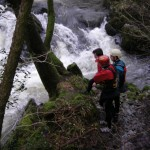
</dt></dl><dl class="gallery-item">
<dt class="gallery-icon landscape">
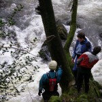
</dt></dl><dl class="gallery-item">
<dt class="gallery-icon portrait">
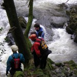
</dt></dl> <dl class="gallery-item">
<dt class="gallery-icon landscape">
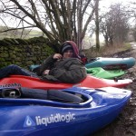
</dt></dl><dl class="gallery-item">
<dt class="gallery-icon landscape">
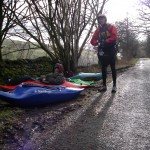
</dt></dl><dl class="gallery-item">
<dt class="gallery-icon landscape">
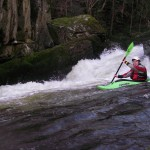
</dt></dl> <dl class="gallery-item">
<dt class="gallery-icon landscape">
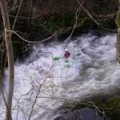
</dt></dl><dl class="gallery-item">
<dt class="gallery-icon landscape">
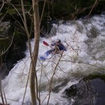
</dt></dl><dl class="gallery-item">
<dt class="gallery-icon landscape">
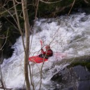
</dt></dl> <dl class="gallery-item">
<dt class="gallery-icon landscape">
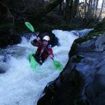
</dt></dl><dl class="gallery-item">
<dt class="gallery-icon landscape">
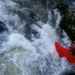
</dt></dl><dl class="gallery-item">
<dt class="gallery-icon landscape">
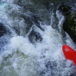
</dt></dl> 

