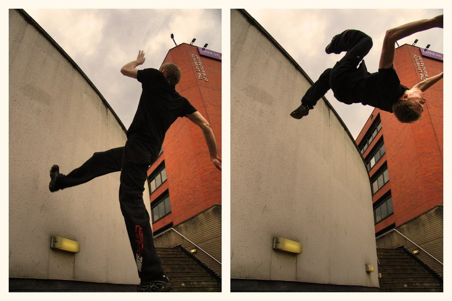

I've had a weekend full of training, which followed two days of programming with parkour training in
the afternoons, and today is my rest day. Thursday I went out training as a break from Java; Friday
I met up with my good friends Gordon & Scott for some afternoon parkour in the sun; Saturday I went
along to the usual jam and then attended a session with the BBC; Sunday was the monthly pole jam
followed by weekly gym (as is -nastics) session.

One of the things I've wanted to do for a while is to wallflip outside. I've done them in the gym on
at least one occasion but never bothered or had the guts do try them outside. During a gym session
back at home I tried them to see if I could pull one off first time, which I could. I practised for
a while and decided I was going to try them outside at first opportunity. This opportunity came to
me on Friday when I was at UMIST with Gordon & Scott. I did it fine. That was over grass, and at
first opportunity I tried it over concrete, also fine. It's not a huge achievement but I'm glad it's
out of the way. I can feel much more confident about them now. As most to you know I'm more into
pure parkour than flips, but I think it's important for everyone to have the capability to
comfortably perform the basic flip movements: front; back; side and wall flips.

I can do backflips (standing on floor and off smallish objects) fine, fronts I probably could do if
I tried but I've lost comfortability with them so it's a target to get them back. Sides I have only
ever done in the gym and I've not really any idea if I'm doing them right or not, but they seem to
be very comfortable when people do them, and seem to be a natural flip movement once familiar so
probably worth getting. Once my flips arsenal contains those four I'll be happy with them and will
ensure to maintain them. Some pictures of me wallflipping:

<figure class="wp-block-image">

</figure>

<figure class="wp-block-image">

</figure>

Then came the Saturday jam; Gordon & I arrived at Castlefield to find Dave leading the group through
an exhausting push-up exercise using triangle numbers (\*not *factorials!* as we sometimes call
them. Triangle numbers are simply a sequence of numbers starting at 1, increasing by 1 each time,
and used in such exercises in that you do 1 repetition of something, then 2, then 3, then 4, and so
on until you reach your physical limit. They'd done it slowly up to about 15 and ordered us to catch
up, so we got straight down to it and did 1 then 2 more then 3 more then 4 more, right up to about 8
without stopping (which would be 1+2+3+4+5+6+7+8=36), then I took a short rest before doing the 9th
set, then the 10th, then the 11th, and leaving it there.

\*Factorials are multiples, not sums. i.e. 5! (5 factorial) = 5x4x3x2x1 = 120

After the jam, five of us (Dave, Paul, Scott, Dean and myself) headed of to the McDonald Hotel in
Manchester to meet up with some people from the BBC who had contacted us the week before to see if
we would be interested in auditioning for a TV programme they were making. The programme would aim to
prove that intelligence comes in many forms, not just the Oxbridge / Rocket Science type, and that
people who practised parkour, for example, were intelligent in other ways to rocket scientists. They
were getting groups of people (some of the ones they mentioned were rocket scientists, hairdressers
and drag queens) to audition to see which groups they would like to take part in the programme
itself.

They filmed some interviews with us to try and get us to prove our intelligence in a variety of
forms: listing the similarities between a dog and a cat; giving advice in a hypothetical
relationship scenario; working out a problem-solving riddle; putting together a cardboard box from
flat; etc. It was clear that sme of us were very good at certain bits and not so good at others, for
instance Scott was spot-on with the problem-solving task, Scott & Dean were very quick with their
cardboard boxes, Scott, Dave and I seemed quite helpful with the relationship issue while the others
stayed quiet, and Paul & Dave were very imaginitive with listing the similarities between a dog and
a cat.

Then came the hardest bit, which turned out to be very interesting: we had to state the strengths
and weaknesses of each other in the group, so Paul listed Dean's, Scott's, mine and Dave's and we
would all, in turn, list each other's. It was very hard to think of something constructive for both
of these, but very interesting to hear what everyone had to say. My general stengths mentioned were
that I 'have my finger in many pies' (Dave) saying that I am keen to be involved in many things in
life and not just stick to one thing, that I make good websites (Paul - want to stick to your
judgement now you've seen this?), that I am generally good at certain movements in parkour.
Weaknesses were that I don't train hard enough (Scott), that I don't do enough variety of training
(Dave), that I am a stickler for spelling and punctuation (Paul), oh and Dean didn't like my shirt.
I did my best to say things that were constructive to people, and that were fair and just. Then they
asked us to say our own strengths and weaknesses and give ourselves a mark out of ten for
intelligence (1 being Paris Hilton; 10 being Stephen Hawking); I said that what I liked about myself
was that I never just concentrated one one thing in life and that I keep my options open and try to
be good at a wide range of things rather than just really good in one thing, and that my main
weakness was that I make excuses for things I know I ought to do, like if I know I ought to do some
conditioning I'll often find a lame excuse for not doing it, and explained that I am aware of this
and am working on it. As for the score out of ten, I hardly think of myself as a genius, and refused
to place myself anywhere near Stephen Hawking (I have so much respect for how intelligent he is) so
I put myself on 6, but Dave convinced me I had drawn myself short so I upped it to 6.5, which
probably should have been 7 really. We were all between 6 and 7 (except Dean who placed himself on
about 3). They filmed everything and will show all the footage to their executives for them to
decide who will be featured.

They also filmed a private interview with each of us individually where we were asked to give 3
words to describe ourselves (I really stuggled with this as I didn't like the idea of branding
myself so lavishly! Ended up going for Determined, motivating and dedicated), say the alphabet
backwards (I got stuck at t-s, or is it s-t?), but when I got stuck I said "Ok I can't, but I can
recite pi to 35 decimal places!" and she was like "What, really? Go on then - you mean like
pythagoras and that?" and I said it was Archimedes who really distinguished it, and then said "Ok,
pi is 3.14159265358979323846264338327950288" and she was astounded and said "So would you say you
were more mathematical than linguistic - but you're a stickler for spelling and punctuation! So are
you good at memorising things?" and I said "Not really, I was just determined, motivated and
dedicated enough to learn that!".

Then we had to fill out some questions and do an IQ test of which some parts were dead easy, others
were dead hard. One question was what is the missing number: 0,1,1,2,3,5,8,13,...,34 (It's the
[Fibonnacci Sequence](http://en.wikipedia.org/wiki/Fibonacci_number): a term is given by the sum of
the previous two terms, so the answer is 21 as 8+13=21 and 13+21=34).

Then on Sunday we went to the pole jam which was interesting as usual, followed by the gym session
which was fun. I'm going to try to make it to the gym every week now.

Hopefully the BBC executives will think we'll make a good match for rocket scientists and cast us
for the show, but who knows? It could be the drag queens or the hair dressers.
