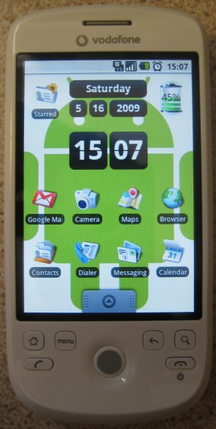

Two weeks ago I received my new HTC Magic smartphone - it's powered by Google's open-source
operating system, Android. This means the source code for the system the phone runs on is freely
available to download, which means any developer can write their own applications and tweaks for
Android phones.

With switching from mobile provider 3 to Vodafone, I managed to negotiate a good deal on the
contract - it's £40/month instore and I managed to get it for £20/month - that includes 600 minutes,
unlimited texts and internet, as well as the free phone (worth £500). Also I have the option of
starting a new contract after 15 months, obviously only if I stay with Vodafone (but my plan is to
do so, as they're probably the best provider and loyalty is rewarded in this economic crisis - or at
least if you tell them you're leaving it is!).

This is only the second Android phone on the market so far (with plans for about another 18 by the
end of the year), following the G1 (aka HTC Dream) which was exclusive to T-Mobile. I was going to
go for the G1 until I heard about its successor - a better phone on a better nework!

<figure class="wp-block-image">

</figure>

Within minutes of having the Magic perform simple tasks at the touch of my finger, I was enraptured
by its user interface and functionality. The first thing I was asked to do was sign into my Google
Account - this, I discovered a couple of minutes later, had automatically loaded my Gmail contact
list into the phonebook - not particularly handy as I had no phone numbers in there, only email
addresses - until I realised that once I transferred my numbers from my old SIM card - it
automatically synchronised my contacts! Say I had Joe Bloggs stored as a phone number in my old
nokia phone, and Joe Bloggs stored as an email address in my Gmail contacts - once I put them
together I had one entry for Joe Bloggs with a phone number and an email address! And best of all -
this contact list is constantly synchronised with my Gmail account so not only does it update both
if I update one or the other, but it also means that I can never lose my contacts as they're always
backed up automatically! It's the same for Google Calendar. Magic!

### Apps

Once I'd got my head round how amazing the usability of the phone was, it was time to dip into the
Android Market and see what apps were out there - I'd heard of a few good ones and wanted to see
what else was available. It came loaded with Gmail, Google Maps, YouTube, Google Calendar, Google
Talk and a bar code scanner (I'll come to that later) and these are the ones I've downloaded in the
last two weeks (all for free):

**Shazam** - Hear a song and want to know the name/artist/album - this recognises songs and shows
  you the info

**Bubble** - Spirit Level - hold the phone horizontally, vertically or flat on a surface and the
  on-screen bubble "floats" to the centre of gravity

**handyCalc** - Scientific calculator (damn right!)

**Compass** - A dynamic navigational compass

**Metal Detector** - Yes, you heard right. This app actually analyses what you place the phone
  near and buzzes more the closer it gets to metal. It's not practical at all, as you pretty much
  have to know where to position the phone in relation to the metallic object to get it to buzz, but it is novelty

**Google Sky Map** - Point the phone at a part of the sky and it shows you the stars, planets and
  constellations - you can also search for them and it tells you which way to point the phone to
  find it

**The Schwartz Saber** - A light saber that makes the noise when you move the phone

**0870** - Uses the database of [SayNoTo0870.com](http://www.saynoto0870.com/) to find
  geographical numbers to dial when you ring premium rate numbers

**My personal favourite - Where's My Android?** - You know when you misplace your phone, have to
ring it to find it, then realise it's on silent? Well
those days are over for Android users - with this app you set a particular word, and then when you
can't find your phone you text it that word, and when it receives the text it turns silent off and
starts ringing! Genius or what?

There are many more I have installed, little things like stopwatch, voice recorder, notepad, which
come with phones as standard - but this way you get to pick and choose which one you use (like I did
when I found out the standard calculator had only basic operations). There's also a good Facebook
mobile app, as there is for Twitter, and a good multi-account IM client - ebuddy.

I've also got a few games I downloaded from the app market - sudoku, solitaire, ping pong, air
hockey - the usual stuff - and also some brain training ones: MathPractice; Maths Workout; Iconic
Memory; Slide Puzzle.

There are also widget apps you can download for the home screen - time & date, calendar, battery
percentage, music player, etc.

### The camera

*How many mega pixels??* If I got a quid for every time I was asked that - as if the resolution of
the picture is the only feature you can judge a camera on. It's like when people compare a high-res
phone camera to a not-quite-so-high-res digital camera as if the phone will take a better quality
picture, which it won't because it's not got the quality lens and focus of a digital camera. Anyway,
rant aside, the camera's a 3.2mpx but it has a fantastic lens and focus! Nothing compared to a
decent digital camera but very good quality for a phone.

The camera's focus quality comes into play for the aforementioned bar code scanner app - you can use
the camera to scan the bar code of a product in a shop, research the product and compare prices
online! You literally see and hear the lens focus in on the bar code in order to read it - it does
the same when you're taking a normal photo - it adjusts focus automatically. If you scan a book, CD,
game or something like that, you can read reviews, research information about it, as well as compare
prices.

The video's ok. Nothing special but good enough (phone cameras are never going to replace digital
cameras - their only purpose is for taking a picture or video when you don't have your camera on
you).

### Touchscreen

I love it. You can literally 'throw' icons, menus and page content to where you want it to go. Say
with a web browser on a computer, to scroll down the page you would scroll down with the scroll bar
or the mouse scroller, but on the web browser on the Android, to go further down the page, you touch
the page and drag, or even flick, it upwards and out of view, bringing the below into view, as the
same for up, left and right.

There's a menu bar along the top of the screen all the time (except in apps that use the full
screen), this shows if you have any notifications (missed calls, texts, emails, downloads, etc.) on
one side, and the time, your battery level, phone signal, 3G signal, and wifi signal and sync status
when appropriate. If, say, you see you have a new text message, you touch the bar at the top and
drag or flick it downwards to open it up and reveal the details. As for the tab at the bottom of the
home screen, which you tap or drag/flick upwards to open, which shows all your installed apps.

When I talk about dragging or flicking things about, that's literally what it fells like when you
touch something and move it - it feels like you're actually physically moving it with your
fingertips, and when you drag the menu up or the notification bar down, it feels like you're
actually holding it, pulling it up or down. On the home screen you have a selection of app shortcuts
and widgets to start with, but this is 100% customisable - you can place icons wherever you want
(none are locked), remove them, add new ones and add widgets. You have three screens: one central
one, and one either side to the left and right. To get to each side you simply drag the screen to
one side like you would with web content, move it out of the way to access another area. Each of the
three screens has 4x4 grid for you to use as your canvas - icons take up a single 1x1 space and apps
take up varying rectangular areas.

There's an interesting innovative unlock feature - you set a 'pattern' by dragging your finger over
a sequence of nine pins on the screen, and you have to use that pattern/combination in order to
unlock and gain access to the phone - this is in place of a PIN or password.

### Google Maps

Google Maps on the Android is awesome. *My Location* shows you where you are when you open the map.
You can also give it permission to make your location publicly available online - at the bottom of
this website there is a Google Maps icon - click it and it takes you to a map showing you where I
am, based on the [location of my
phone](http://www.google.com/latitude/apps/badge/api?user=5033502728870755842&type=iframe&maptype=roadmap),
saying when it was last updated (usually every few minutes if it's doing it in the background). If
I'm in the car or on the train or otherwise on the move, looking at the map, it will dynamically
move my pointer on screen as I move - useful to show how close you're getting to a certain point.
You can search for directions to somewhere (from a given point or from your current location).

The cherry on the cake for me is Street View. You can view the street you are standing on in 3D as
you can on a computer in Street View, but the cherry on the cherry on the cake is this. If you turn
on 'Compass Mode' in Street View, it shows you the Street View angle from wherever you point the
phone, and moves the image in real-time as you move the phone. If you're stood in the right spot
it's almost as if you're looking through the camera (but obviously you see the archived images, not
what's actually in front of you). Truly amazing.

### Other bits

**Starred Contacts** - in my opinion this is a much better, easier and more flexible function
compared to standard Speed Dial, which requires you to assign up to 8 contacts to a number 2-9 (1 is
voicemail) and memorise them. This is just a feature which allows you to 'star' a contact - like
starring an email in Gmail, the empty star silhouette is there for you to tap to make them a starred
contact - and then you open your list of starred contacts and pick from the list. I have a shortcut
to my starred contacts on my home screen.

**Buttons** - this particular phone has 6 buttons on the front below the screen (green phone, red
phone, home, menu, back & search), a tracker ball for precision (e.g. go back two spaces in a block
of text while composing a text message), which is also a button (you can also use it to navigate but
that's no fun!), and there's a volume up/down long button along one side.

**Typing/Texting** - this phone's predecessor, the G1, had a slide-out QWERTY keyboard but this one
just has on-screen touch typing, which only took me a few days to get used to typing quickly on. I'm
not perfect yet, I sometimes hit the full stop key which is next to the space bar. Occasionally I'll
hit the wrong letter, where it'll usually pick up on the typo and automatically correct it. You can
either type with it up-right (compromising keyboard width for extra viewing space) or rotate the
screen to hold it horizontally in two hands like a PSP, using your thumbs to type).

It's good for suggesting/predicting words when you start typing them which is really useful for
longer words, just saves you typing them in full - and it gives as many suggestions as it can fit
along the screen (with an arrow to view the next ones). I was stumped for a few days on how to add
new words to the user dictionary while typing them so that it could predict them in future, but I
posted the question to the Android Community forum and the answer came within minutes - you just
long press the word and it saves it.

One of the best things about this phone as a phone (as apposed to a palmtop gadget) is its
conversation-view for text messages, similar to that of Gmail, whereby you see each part of a
conversation rather than one message at a time, so if there's a text conversation between me and Joe
Bloggs, it shows my message, then Joe's reply, then my reply, and back and forth following the
conversation.

**Menu Button & Long Press** - long press (pressing and holding) is a really useful way of adding
extra functionality without the use of buttons (on-screen or physical) - like if you're viewing a
text message conversation you can long press a text message and it shows you a menu of options
specific to the text message you pressed - call the sender, save the number, forward the text
message, copy the content of the message, view the time & date of the message, etc.

The menu button (a physical button) is there so you can view the menu or settings of whatever you're
viewing at the time (to save taking away space on the screen from what you're doing/viewing)

**Music Player** - the phone comes with a 1GB micro-SD card (which you can obviously replace with a
bigger one) which is the ideal medium for data storage for pictures and videos (taken with the
camera or transferred from your computer) and music. The music player is great as it organises your
music into artists, albums, etc. and you can easily search for an artist or song or whatever. It's
generally much more sophisticated than the previous generation of phone media players which usually
only let you play, pause and skip - whereas this phone lets you drag across the timer to manually
skip further on or back through the current song.

It comes with a nice smart little white leather case you can slip the phone in to to keep it
protected in your pocket. This is great except for one tiny flaw - if I want to simply check the
time (we all do it - who wears a watch these days?) I have to remove the phone from my pocket, slide
it all the way out of the leather case to touch the menu button to turn the screen on to see the
time.

For people like me, who use all the Google services anyway, and make full use of them - I can't see
us ever going back from Android. Now I've lived like this I can't imagine going back! Not having my
contacts synchronised with Gmail? Or my calendar? Or not being able to locate my phone with a single
text message when it's on silent? Or not being able to pull a light saber out of my pocket at any
time?

I've been following (in the Twitter sense as well as the normal sense) the development of Android
and what to expect next from the project. Loads of phone companies are realising its potential and
announcing launches of new Android-powered phones throughout 2009. Even some laptop manufacturers
are playing around with it is an operating system for mini-notebooks - and before long I imagine
we'll be seeing it on more powerful laptop machines. With any luck it could develop to much greater
things and, I may be getting way ahead of myself here, it could be the dawn of the overtake of
Microsoft Windows as the standard computer operating system, which would rid the world of dependency
on hidden-source bug-ridden corporate systems and programs and give us the option to use (and
develop) open source programs.

I've written about dozens of features of the phone but that's only a tiny proportion of what it can
do. I honestly could have written twice that much again and still not touch the limits of the phone!

...Oh and I almost forgot - it makes and receives phone calls too!
