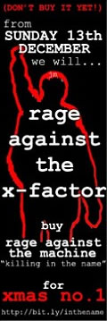
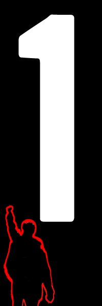

The X-Factor winner has won the Christmas Number One every year since 2005, and it would have been
the same this year if it hadn't been for one man. A guy called Jon Morter decided he was sick of
seeing people being spoon-fed what music they should like by Simon Cowell so he set up a [Facebook
group](http://www.facebook.com/group.php?gid=2228594104&ref=ts) and [Twitter
profile](http://twitter.com/RATM4Xmas) to get people to buy [Rage Against The
Machine](http://en.wikipedia.org/wiki/Rage_Against_The_Machine)'s 1992 single [*Killing In The
Name*](http://en.wikipedia.org/wiki/Killing_in_the_Name) in the hope that it would beat Joe
McElderry's *The Climb*. This caught on through early- and mid- December and so many people joined
the Facebook group that it was talked about on the radio and on television.

<figure class="wp-block-image">

</figure>

I joined the group and when it came to the time to buy it, I did! I've never paid for a download
before but this seemed a good enough cause to do so. I really wanted it to win because it
represented everything I hated about the X-Factor culture. Last week [Sting called the X-Factor a
televised karaoke contest](http://news.bbc.co.uk/1/hi/8355611.stm) and said "*I am sorry but none of
those kids are going to go anywhere, and I say that sadly*" which is completely true.

And last night the charts were announced – RATM won, with Joe in second place. Fantastic. The RATM
single was only available as a download, and not as a CD in shops, and it's the first time a
download-only song has made it to number one.

This truly represents the majority of the people in the UK – most people don't like the X-Factor but
there's never any one song in particular that they like which could overtake chart music. This
couldn't have happened without an effort to push something over the top. That kind of makes the
whole idea of having music charts pointless, because despite the fact that it shows that more people
buy one song more than any other song, it doesn't show that most people *don't* buy that one song.

I personally despise chart music. The majority of the music in my collection is either from decades
ago like The Beatles, Chuck Berry and Frank Sinatra, Run DMC, NWA and Michael Jackson or is more
recent but from the sort of genres that don't get a lot of attention in popular culture, like MC
Lars, Yellowcard, Less Than Jake. The only recent music I like that happens to be popular is music
from generally unpopular genres that have made a breakthrough. There are very few songs in the
current charts at any time that I will genuinely like.

Some people disagreed with the idea for two reasons: both singles were on Sony Records so all the
money was going to them anyway; and buying one particular record because we were being told to was
the opposite of the message it was trying to convey. But I think sometimes you have to do something
like that to prove a point. As for Sony making more money, that's not what it's about (and that's
just pure coincidence that they share a label) – because it's about demonstrating the strong feeling
against the manufactured so-called 'stars' setting the trends, as puppeteered by Simon Cowell.

Anyway, I think it's great that the people managed to voice their opinion by sticking two fingers up
at Simon Cowell and the X-Factor. RATM had promised a free gig in the UK if they won, and they
intend to honour this. Also, the group affiliated itself with a homeless charity Shelter, and have
raised over £80,000 for them to far, which is fantastic!

<figure class="wp-block-image">

</figure>

Read more on [BBC News](http://news.bbc.co.uk/1/hi/entertainment/8423340.stm).
