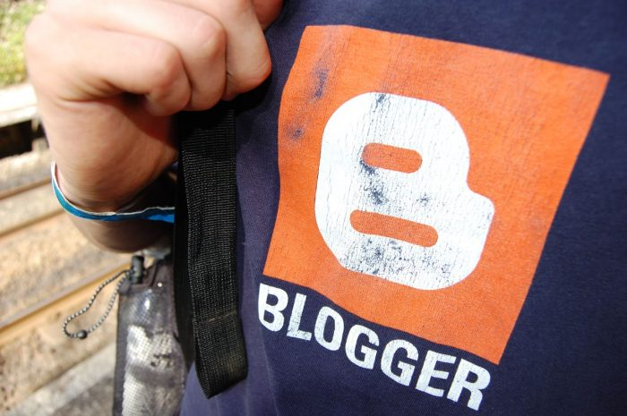

Blogger have announced that they will be discontinuing their FTP service, which means that users
will no longer be able to publish to their custom domains. This severely affects me as my blog is
powered by Blogger and I publish via FTP, which means I will have to come up with an alternative
solution to continue my blog.

Funnily enough, I'm quite glad of this announcement. Yes, it's forcing change up on me, but it's
change I've been considering for a little while now, without knowing I would actually have to. I've
started to notice the limitations and drawbacks of using Blogger to power my blog - things like its
annoying way of interpreting markup, and it being difficult to update the template (especially for
older posts) which makes it difficult to roll out template changes, minor or major. Also, I have
been learning PHP and now I power all my sites with it, so having pages controlled and restricted by
Blogger makes more work than necessary, which can be a pain to deal with.

Blogger does have some good purposes which do help me out, like its rendering of serveral pages
containing different blog posts - so say one post could be shown on the homepage (if it's one of the
latest 3 posts), it would also have its own permalink (a page containing that one post by itself),
and if it's been tagged with 'Parkour' then it would be viewable on the 'Parkour' tag page too. At
the moment I wouldn't be able to write self-updating functionality like this myself. I could do it
manually but this would just be time-consuming and very inefficient.

I have to make a series of decisions - where do I take the blog, and how do I get it there? Do I
migrate to another blogging service - and if so, temporarily or permanently? Do I write my own
temporary fix? Do I write my own blogging platform - and if so, would it work in the same way
Blogger did?

Ideally, in time, I will write my own Content Management System which will manage my entire site,
not just the blog. It will work exactly how I want it to, and it will be perfectly suited my own
personal requirements - bespoke for my own purposes. PHP may be the language I write this in - it 
may not. By the time I get round to doing it properly I might be writing in a completely different
language. If I do a proper CMS in PHP I will have to utilise a MySQL database to manage the content.

It'll be sad to leave Blogger - I've always been proud to say I use Blogger and described myself as
a blogger. I've been using it for nearly 5 years now, and I've even got the t-shirt:

<figure class="wp-block-image">

<figcaption>Photo by Shane Rounce</figcaption>
</figure>