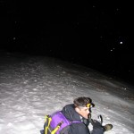
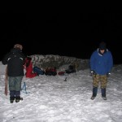

Some friends & I decided to make the most of the snow by heading to the Lake District for a midnight
mission up [Helvellyn](http://en.wikipedia.org/wiki/Helvellyn) one Friday evening in mid-January.

I was due to return to Manchester from spending the Christmas holidays at home, and as the mountain
passes over the peak district from Sheffield were closed due to snow, I was forced to get the train.
This meant I was restricted in what I could take with me, knowing it would be at least a week before
I could get the rest back. As I had planned to do the Helvellyn trek that evening, most of the stuff
I took was kit for the climb! I had two large rucksacks mostly full of kit & gear, and my laptop bag
with me on the train. I got off the train at Manchester and went straight to Gordon's flat to sort
out kit. We checked through what we had with us, trying to share kit evenly between the group,
making sure everyone would be sufficiently warm & safe. We nipped to a local outdoor shop to stock
up of a few bits & pieces and at about 8pm set off for Blackpool, which is where Gordon's brother
Alex lives.

We arrived at Alex's house, checked through kit, stocked up on food and ran over the routine in the
garden by practising the rope systems we might have been needing on the hills. After a couple of
hours of kitting up and getting ready for the ascent, we headed to the Lakes in the cars. Setting
off later than planned (around 11:30pm) meant we were starting the climb early Saturday morning. We
had a bit of an epic getting up one of the mountain passes to the place we were starting from, as
the snow was so deep on the road that our cars got stuck. We had to get the ice axes out early and
smash up the thick snow and shovel it to the sides for us to pass.

We parked up and began the trek. We started with only a few layers on, with several more packed away
in our bags as we would get hot & sweaty on the way up but knew as soon as we stopped higher up, we
would get very cold very quickly.

The night sky was clearer than I've ever seen it. You could make out several constellations and see
the North Star. The trek up was very hard to endure for our calves, and trekking through deep snow
made things difficult. We had two home contacts Gordon was keeping in touch with to let them know we
were on track – the situation was that we would text or call them at each checkpoint and if we were
more than an hour and a half behind schedule (which had been adjusted at our later-than-planned
start) and unreachable they were to call mountain rescue and give all the information they had about
our position and where we were headed.

Anyway, they say a picture is worth a thousand words so here's the rest of the story in several
thousand words' worth of photographs:

<dl class="gallery-item">
<dt class="gallery-icon landscape">

</dt></dl><dl class="gallery-item">
<dt class="gallery-icon landscape">

</dt></dl><dl class="gallery-item">
<dt class="gallery-icon landscape">

</dt></dl><dl class="gallery-item">
<dt class="gallery-icon landscape">

</dt></dl> <dl class="gallery-item">
<dt class="gallery-icon portrait">

</dt></dl><dl class="gallery-item">
<dt class="gallery-icon portrait">

</dt></dl><dl class="gallery-item">
<dt class="gallery-icon portrait">

</dt></dl><dl class="gallery-item">
<dt class="gallery-icon landscape">

</dt></dl> <dl class="gallery-item">
<dt class="gallery-icon portrait">

</dt></dl><dl class="gallery-item">
<dt class="gallery-icon landscape">

</dt></dl><dl class="gallery-item">
<dt class="gallery-icon landscape">

</dt></dl><dl class="gallery-item">
<dt class="gallery-icon landscape">

</dt></dl> <dl class="gallery-item">
<dt class="gallery-icon landscape">

</dt></dl><dl class="gallery-item">
<dt class="gallery-icon landscape">

</dt></dl><dl class="gallery-item">
<dt class="gallery-icon landscape">

</dt></dl><dl class="gallery-item">
<dt class="gallery-icon landscape">

</dt></dl> <dl class="gallery-item">
<dt class="gallery-icon portrait">

</dt></dl><dl class="gallery-item">
<dt class="gallery-icon portrait">

</dt></dl><dl class="gallery-item">
<dt class="gallery-icon portrait">

</dt></dl><dl class="gallery-item">
<dt class="gallery-icon landscape">

</dt></dl> <dl class="gallery-item">
<dt class="gallery-icon portrait">

</dt></dl><dl class="gallery-item">
<dt class="gallery-icon portrait">

</dt></dl><dl class="gallery-item">
<dt class="gallery-icon landscape">

</dt></dl><dl class="gallery-item">
<dt class="gallery-icon landscape">

</dt></dl> <dl class="gallery-item">
<dt class="gallery-icon landscape">

</dt></dl><dl class="gallery-item">
<dt class="gallery-icon landscape">

</dt></dl><dl class="gallery-item">
<dt class="gallery-icon landscape">

</dt></dl><dl class="gallery-item">
<dt class="gallery-icon landscape">

</dt></dl> <dl class="gallery-item">
<dt class="gallery-icon landscape">

</dt></dl><dl class="gallery-item">
<dt class="gallery-icon landscape">

</dt></dl><dl class="gallery-item">
<dt class="gallery-icon portrait">

</dt></dl><dl class="gallery-item">
<dt class="gallery-icon landscape">

</dt></dl> <dl class="gallery-item">
<dt class="gallery-icon landscape">

</dt></dl><dl class="gallery-item">
<dt class="gallery-icon portrait">

</dt></dl><dl class="gallery-item">
<dt class="gallery-icon landscape">

</dt></dl><dl class="gallery-item">
<dt class="gallery-icon landscape">

</dt></dl> <dl class="gallery-item">
<dt class="gallery-icon landscape">

</dt></dl>
 

P.S. Just so you know, we got home safely, although exhausted, with a touch of frostbite on Gordon's
part. Tip: never be the one everyone asks to open their food because you're only wearing one pair of
gloves at the top of a mountain.
