*This post is one of a series of articles adapted from my university dissertation on data
visualisation — see the [rest of the series](/blog/tags/datavis-project).*

Digitally, colour can be defined by a set of values defining the level of Red, Green and Blue in each
pixel. The number of values between "empty" and "full" denotes how many possible colours there can be
— HTML colour codes are six-digit, three-byte hexadecimal (RR GG BB) so each of the RGB components is
defined by two hex characters (0–9, a–f). For example Red is defined in hex as **FF 00 00** (maximum
red content, no green or blue). There are 2⁸ (given by hex as 16²: 16 "digits" in the hex numbering
system, and 2 bits in the block) = 256 values between "empty" and "full", so in decimal notation the
values range from 0 to 255. Black is defined as zero colour so the hex code for black is **00 00 00**.
White is defined as full RGB content so the hex code for white is **FF FF FF**. Here are some examples
of hex-defined colours with their decimal equivalents:

| Name    | Hex triplet | Red  | Green | Blue | Decimal        |
| ------- | ----------- | ---- | ----- | ---- | -------------- |
| White   | #FFFFFF     | 100% | 100%  | 100% | 255 255 255    |
| Silver  | #C0C0C0     | 75%  | 75%   | 75%  | 192 192 192    |
| Grey    | #808080     | 50%  | 50%   | 50%  | 128 128 128    |
| Black   | #000000     | 0%   | 0%    | 0%   | 0 0 0          |
| Red     | #FF0000     | 100% | 0%    | 0%   | 255 0 0        |
| Maroon  | #800000     | 50%  | 0%    | 0%   | 128 0 0        |
| Yellow  | #FFFF00     | 100% | 100%  | 0%   | 255 255 0      |
| Olive   | #808000     | 50%  | 50%   | 0%   | 128 128 0      |
| Lime    | #00FF00     | 0%   | 100%  | 0%   | 0 255 0        |
| Green   | #008000     | 0%   | 50%   | 0%   | 0 128 0        |
| Aqua    | #00FFFF     | 0%   | 100%  | 100% | 0 255 255      |
| Teal    | #008080     | 0%   | 50%   | 50%  | 0 128 128      |
| Blue    | #0000FF     | 0%   | 0%    | 100% | 0 0 255        |
| Navy    | #000080     | 0%   | 0%    | 50%  | 0 0 128        |
| Fuchsia | #FF00FF     | 100% | 0%    | 100% | 255 0 255      |
| Purple  | #800080     | 50%  | 0%    | 50%  | 128 0 128      |

Some data from [Wikipedia: Web colors](http://en.wikipedia.org/wiki/Web_colors).

Note that any colour code with equal Red, Green and Blue content is a type of grey:

```
Black  <-  Dark greys                  Light greys  ->  White
00 00 00   22 22 22   44 44 44   66 66 66   88 88 88   AA AA AA   CC CC CC   EE EE EE   FF FF FF
0 0 0      34 34 34   68 68 68   102 102 102 136 136 136 170 170 170 204 204 204 238 238 238 255 255 255
```

MATLAB is a useful tool for generating or processing digital images. Since MATLAB's primary function is
manipulating matrices, it stores pixel values in a matrix. The following is an example of a small
greyscale image:

```
0 0 0 0 0 0 0 0 0
0 0 0 184 196 177 0 0 0
0 0 186 188 196 182 172 0 0
0 188 177 204 204 182 180 188 0
0 162 186 176 175 174 176 180 0
0 160 168 187 170 199 187 196 0
0 0 170 178 168 174 185 0 0
0 0 0 184 170 177 0 0 0
0 0 0 0 0 0 0 0 0
```

This matrix of decimal values (2⁸ scale) represents a "disc" of grey pixels on a black background.
They are rendered as grey because no separate Red, Green and Blue values are given for each pixel, and
so the RGB components are considered equal — the value given. The image generated looks like:

<figure class="wp-block-image">
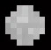
<figcaption>A small disc of grey pixels generated by a matrix of values</figcaption>
</figure>

Simple image manipulation of this image could be performed by simply modifying the values in this
matrix. Each element can be referred to by its element number (1 being the top-left element, 2 being
the 2nd row 1st column, and so on) or by its row and column number. For example if we wanted to view
the value of the centre point (the matrix is 9x9 so the centre point is row 5, column 5) we could call
to it. Say we entered the above matrix and stored it as `I`. We would call the mid point with the
following command (note that the `>>` is merely the command line prompt, not part of the command
itself):

```
>> I(5,5)
ans =
175
```

We can modify this value. Say we want to make this pixel black, we would type the command:

```
>> I(5,5) = 0;
```

The semicolon suppresses the output — without it the entire matrix would be printed to the screen. Now
let's view the modified image:

```
>> imshow(I)
```

<figure class="wp-block-image">
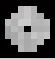
<figcaption>Modified image</figcaption>
</figure>

If we wanted to make a colour image, we would have to create a 3-dimensional matrix of values. This
would be comprised of a 2-D matrix of values (like the above example) for the Red values, another for
Green, and a third for Blue. A 3-D matrix in MATLAB is made up of a number of "layers" of 2D matrices:

<figure class="wp-block-image">
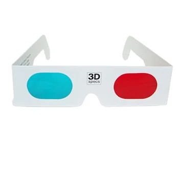
<figcaption>A 3D matrix is made up of layers of 2D matrices, one per colour channel</figcaption>
</figure>

```
M = zeros(9,9,3);
>> M(:,:,1) = I;
>> M(:,:,2) = I;
>> M(:,:,3) = I;
>> M = uint8(M);
```

So now each of the three "layers" of this 3-D matrix contains the values (and maintains the 9x9
structure of the previous image). Rendering this 3-D matrix as an image will yield the same greyscale
image as the 2-D version would, because the RGB values are the same for each pixel. We can colour this
by altering the values in each layer so that R ≠ G ≠ B, which would yield non-grey colour. If we
multiply each element by a random number, we will get an image of a disc containing random colours
(the black pixels will remain as they are zero so multiplying them by something will not affect them):

```
>> for i = 1:numel(M)
>>   M(i) = round(M(i) * rand);
>> end
>> imshow(M)
```

Note: `numel(X)` is a function which returns the number of elements in the matrix `X`, so the line
`for i = 1:numel(M)` generates a for loop running from i=1 to i=243 because there are 9×9×3 values in
`M` in total. `rand` is the random number function which produces random numbers between 0 and 1. This
means that when the element is multiplied by the random number it cannot go higher than it was
previously, so all values will remain between 0 and 255. `round()` is the rounding function, which
rounds decimal values to their nearest integer.

<figure class="wp-block-image">
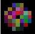
<figcaption>The randomly coloured image</figcaption>
</figure>

Because there are 256 levels of each of Red, Green and Blue, this means there are 16,777,216
combinations of Red, Green and Blue — the number of different colours it's possible to generate using
the scale from 0 to 255. It's possible to generate an image consisting of one pixel of every single
colour. A square containing all 16,777,216 colours would be 4096 x 4096, and its matrix would have to
be 4096 x 4096 x 3. First I initiated a matrix for each of the RGB channels and set the sizes:

```
size = 256^3;
msize = sqrt(size);
R = zeros(msize,msize);
G = zeros(msize,msize);
B = zeros(msize,msize);
```

In order to cover every single possible combination of Red, Green and Blue, I ran a for loop through
16,777,216 iterations (starting at 0 and terminating 1 less than the number of combinations). To
determine each of the RGB values at each pixel I needed to look at the 24-bit binary representation of
the iteration number, because 24 bits is the maximum number of bits needed to represent it:

```
>> length(dec2bin(256^3))
ans = 25
>> length(dec2bin(256^3-1))
ans = 24
```

Note that the `dec2bin()` function returns the binary representation as a string, so "length" refers
to the number of characters in the string. Looking at the 24-bit binary representations of these
numbers shows this:

```
dec2bin(256^3,24)
ans = 1000000000000000000000000
```

Note the second input argument, 24, forces a 24-bit minimum in the returned binary string. Without the
second argument the returned string will only be as long as it needs to be — unless it needs more bits
than specified. Let's inspect the binary representations of the lowest and highest iteration numbers:

```
i = 0
binary: 0000 0000 0000 0000 0000 0000

i = 16777216
binary: 1 0000 0000 0000 0000 0000 0000  (one more than the number we need)

i = 16777215
binary: 1111 1111 1111 1111 1111 1111
```

If we look at every iteration number in 24-bit binary form, we can split these 24 bits into 3 blocks of
8, letting each block of 8 bits represent the R, G and B component of each colour, so that every
possible combination will be covered. Note that 8 is the maximum number of bits required to express an
R, G or B value 0–255, because 256 requires 9 bits in binary and we only need to go up to 255 as we
start from 0. So on every loop iteration, I convert the decimal integer iteration number to 24-bit
binary and look at each 8-bit block separately. I then convert each 8-bit block back into decimal
(which will always be a value between 0 and 255) and add it to the R, G and B arrays:

```
for i = 0:size-1
  x = dec2bin(i,24);
  R(i+1) = bin2dec(x(1:8));
  G(i+1) = bin2dec(x(9:16));
  B(i+1) = bin2dec(x(17:24));
end
```

I then initiated a 3-D matrix and filled each layer with the R, G and B values, and converted to
`uint8` so that it would be recognised that the range of colour values is 8-bit (256 values from 0 to
255):

```
I = zeros(msize,msize,3);
I(:,:,1) = R;
I(:,:,2) = G;
I(:,:,3) = B;
I = uint8(I);
```

I also added a timer (`tic` to start and `toc` to stop) to record how long the for loop would take to
run. I left it going and put on an episode of *Monty Python's Flying Circus*, and eventually, after
16,777,216 iterations, it printed to the screen:

```
Elapsed time is 1950.769497 seconds
```

Which I then converted to minutes using Google Calculator:

<figure class="wp-block-image">
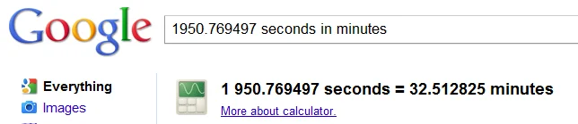
<figcaption><a href="http://www.google.co.uk/search?q=1950.769497+seconds+in+minutes">1950.769497 seconds in minutes</a></figcaption>
</figure>

And then I used the `imshow()` command to display the image:

```
>> imshow(I)
```

Which rendered:

<figure class="wp-block-image">
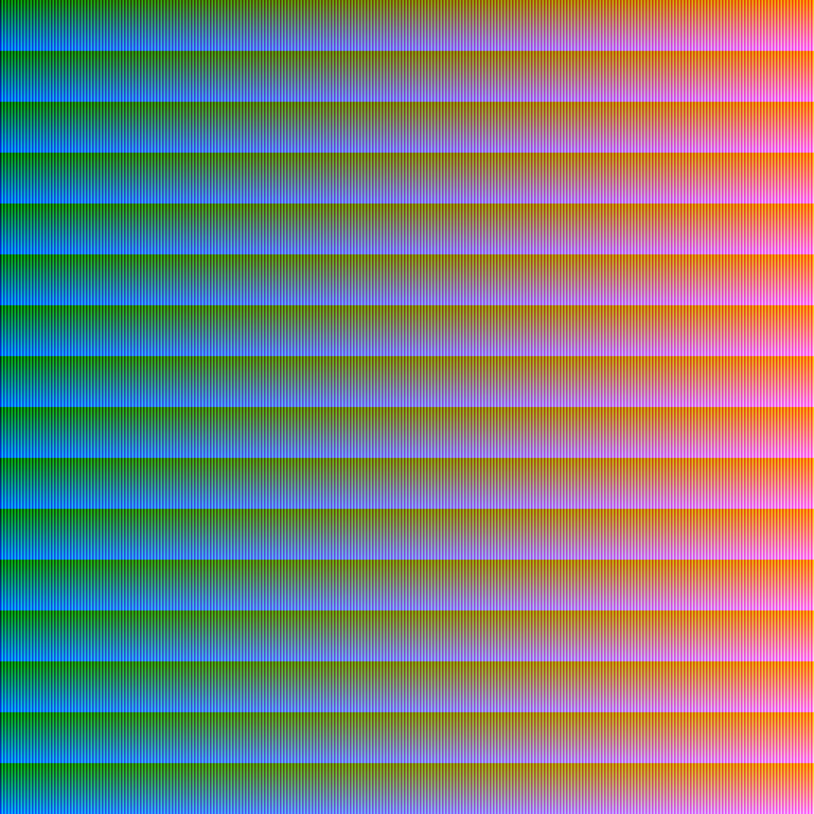
<figcaption>All colours — first export</figcaption>
</figure>

MATLAB can only display the image at 17% zoom to fit on my screen, so each individual pixel is not
viewable without zooming in to 100%. I remembered that the loop had added new values to the matrices
starting at the top left corner, working down the first column, and then down the second column, and
so on. I guessed that a better picture could be formed (less boxy) by transposing the matrices
(swapping rows for columns):

```
R2 = R';
G2 = G';
B2 = B';
I2 = zeros(msize,msize,3);
I2(:,:,1) = R2;
I2(:,:,2) = G2;
I2(:,:,3) = B2;
I2 = uint8(I2);
figure
imshow(I2)
```

Which rendered:

<figure class="wp-block-image">
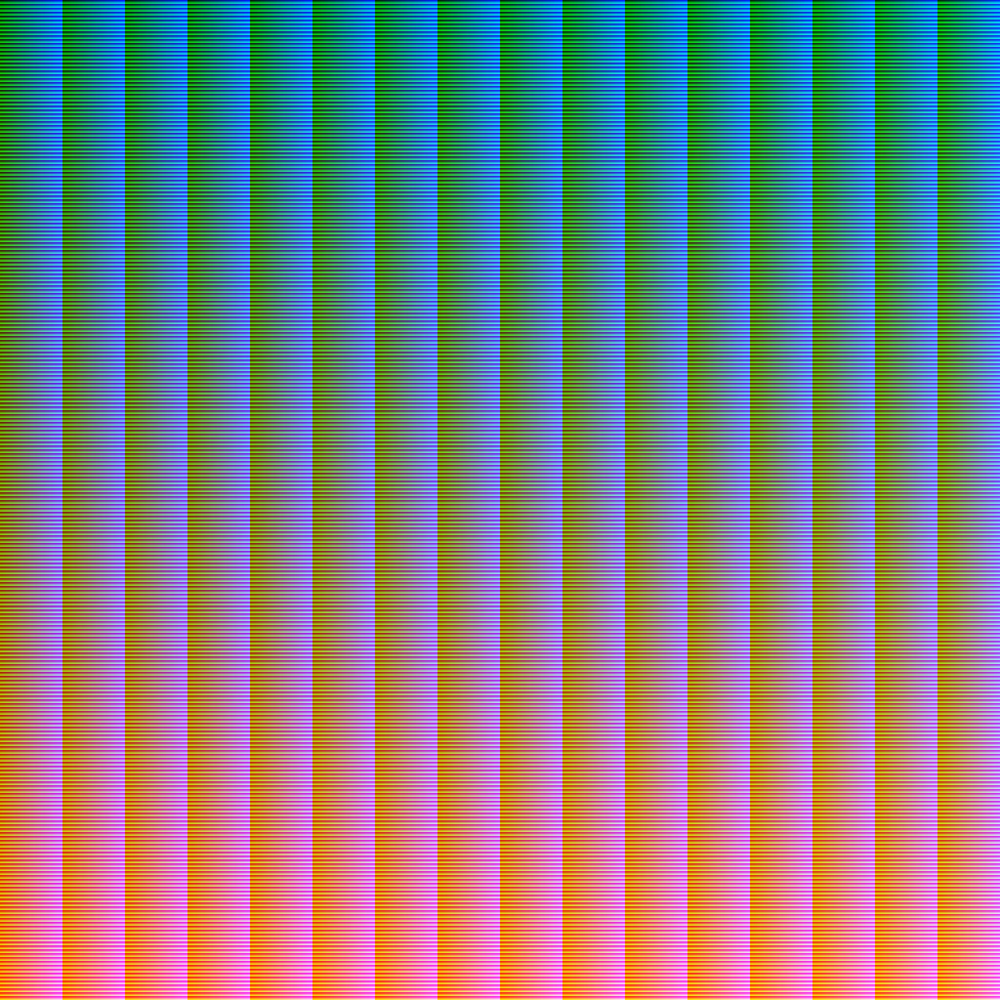
<figcaption>Transpose of original image</figcaption>
</figure>

The problem with these images is that, because of the way the colours fell, they are grouped together
in such a way that (at the low zoom) they appear to be a pattern of the same colours, and when zoomed
in to 100%:

<figure class="wp-block-image">
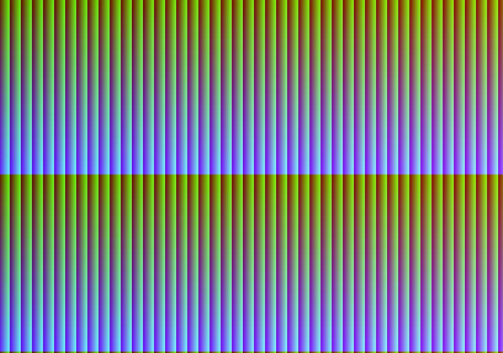
<figcaption>The original exported image at 100% zoom</figcaption>
</figure>

the colours are in vertical lines of gradients, which doesn't look as I would like it to. It doesn't
give a good representation of all the colours, because rather than the colours flowing into each
other, they are in blocks of slightly different tones. I then applied a sorting technique to arrange
the matrix elements in order:

```
R3 = sort(R);
G3 = sort(G);
B3 = sort(B);
I3 = zeros(msize,msize,3);
I3(:,:,1) = R3;
I3(:,:,2) = G3;
I3(:,:,3) = B3;
```

This rendered:

<figure class="wp-block-image">
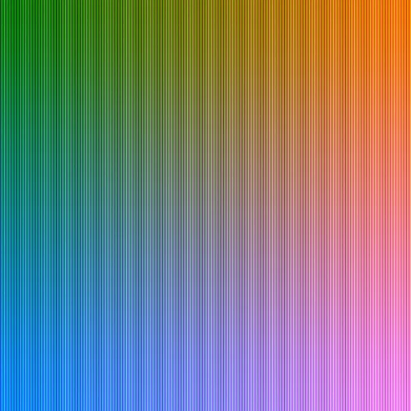
<figcaption>The third exported image</figcaption>
</figure>

This image was much more what I was hoping for. You can see the vertical lines of black running
through the image — the way the values are stored in this sorted version, each block (between the
vertical lines you can see) consists of a gradient between a dark, almost black colour to a light,
almost white colour, changing through each of the brighter colours along the way. I then zoomed out to
the extent that the dark lines were not visible, and only the true colours could be seen flowing into
one another, giving this sensational image:

<figure class="wp-block-image">
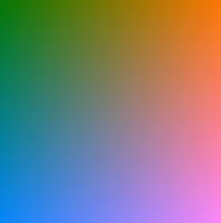
<figcaption>Export #3 at 7% zoom</figcaption>
</figure>

Finally! A beautiful image representing all the colours.

I then tried to see what other plots MATLAB could offer me to represent this image. The results for
`mesh` and `plot3` were interesting:

```
>> mesh(R3,G3,B3)
```

<figure class="wp-block-image">
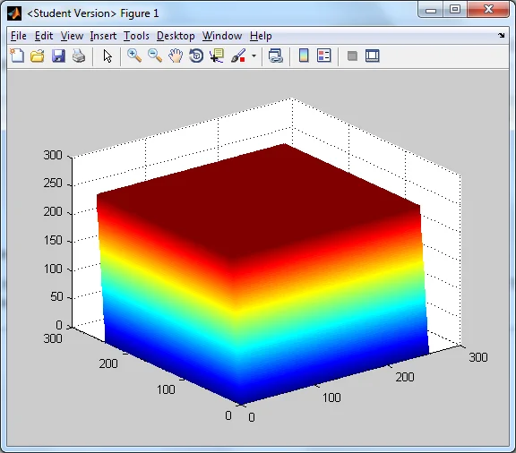
</figure>

```
>> plot3(R,G,B)
```

<figure class="wp-block-image">
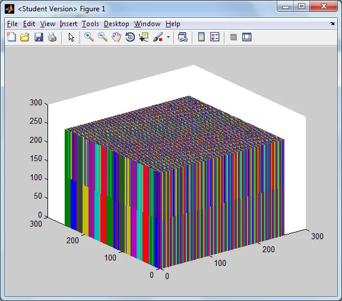
</figure>
