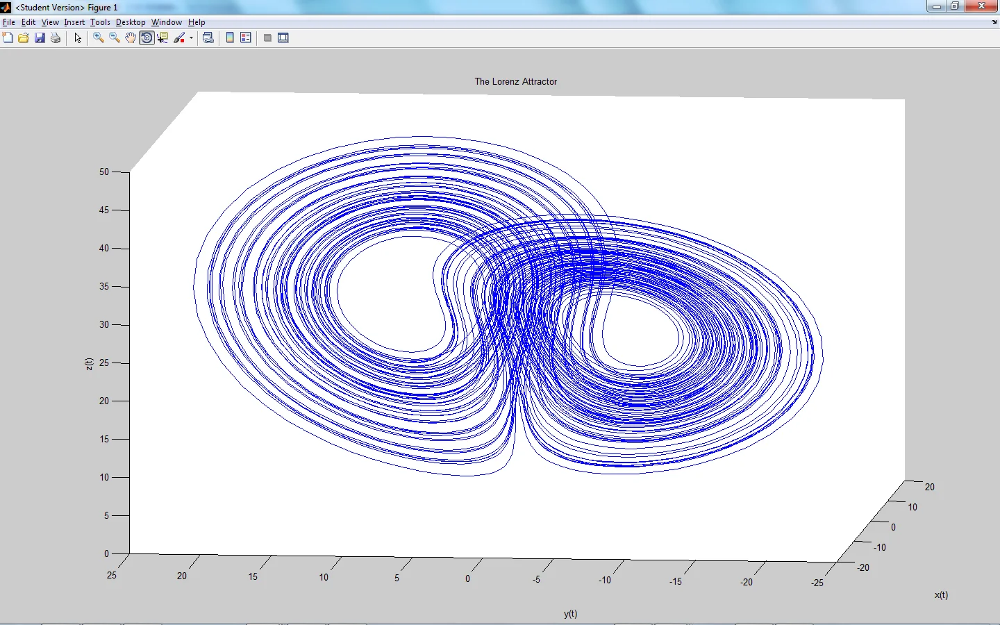
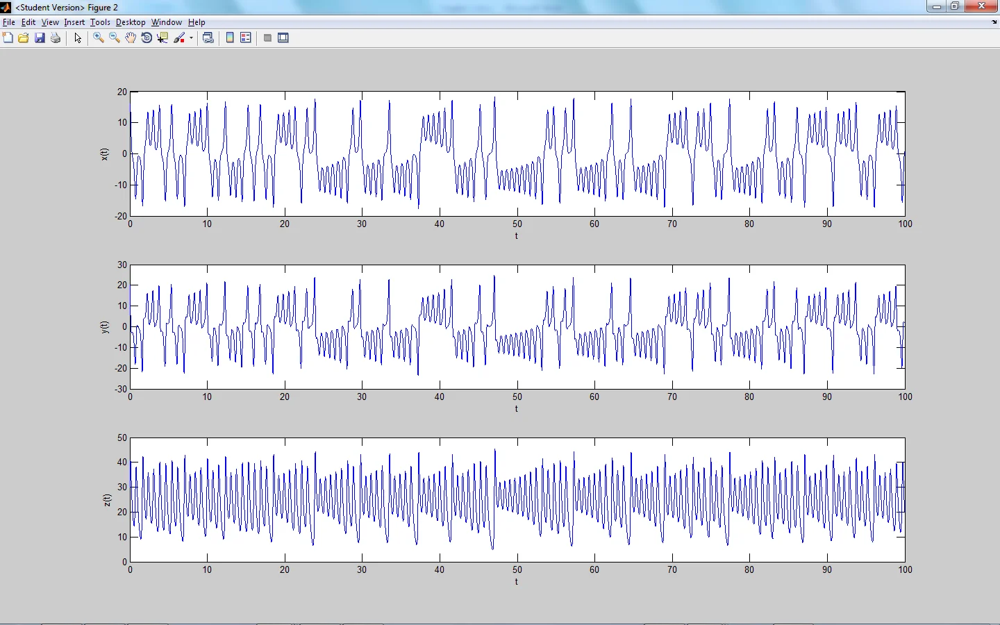

*This post is one of a series of articles adapted from my university dissertation on data
visualisation — see the [rest of the series](/blog/tags/datavis-project).*

For systems of 3 ODEs (Ordinary Differential Equations), there are two ways of plotting the results of
outcomes given initial conditions. The first is to plot each of the variables against each other (x
vs. y vs. z) in a 3D plot, as shown:

<figure class="wp-block-image">

<figcaption>3D plot of the Lorenz attractor</figcaption>
</figure>

This is a useful way of plotting such results, because you can see in 3-dimensional space how the
variables are acting upon each other in the differential equations. However it is also useful to look
at each of the variables on their own against time. This is called the time-series:

<figure class="wp-block-image">

<figcaption>Time series of each variable x, y and z plotted individually against time</figcaption>
</figure>

This allows us to see the pattern each variable is taking.

Original program written by Dr. S. Lynch, modified to add the time series:

```
lorenz = inline('[10*(x(2)-x(1));28*x(1)-x(2)-x(1)*x(3);x(1)*x(2)-(8/3)*x(3)]','t','x');
options = odeset('RelTol',1e-4,'AbsTol',1e-4);
[t,fx] = ode45(lorenz,[0 100],[15,20,30],options);

plot3(fx(:,1),fx(:,2),fx(:,3))
title('The Lorenz Attractor')
xlabel('x(t)');
ylabel('y(t)');
zlabel('z(t)');

figure % New figure window (don't replace previous plot)

% Vertical 3x1 subplots
subplot(3,1,1);
plot(t,fx(:,1))
xlabel('t')
ylabel('x(t)')

subplot(3,1,2);
plot(t,fx(:,2))
xlabel('t')
ylabel('y(t)')

subplot(3,1,3);
plot(t,fx(:,3))
xlabel('t')
ylabel('z(t)')
```
