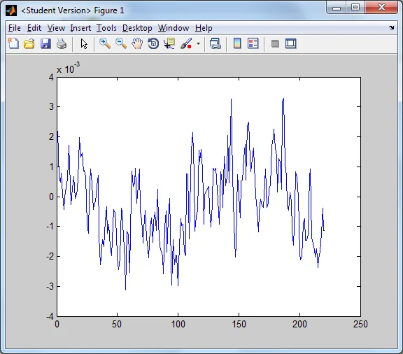
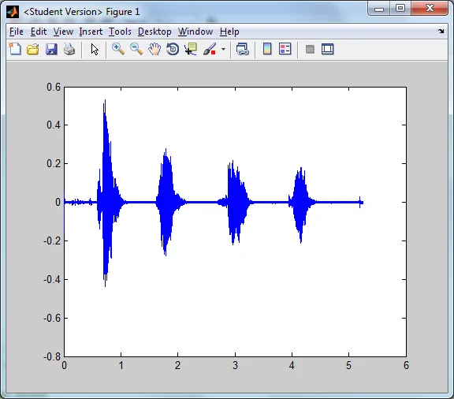
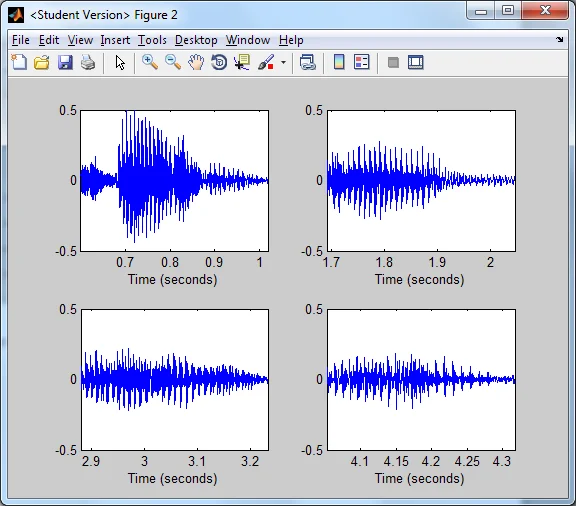
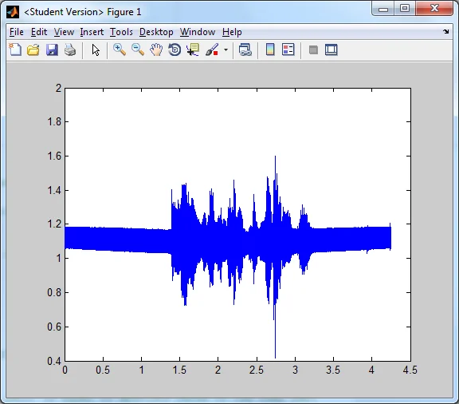
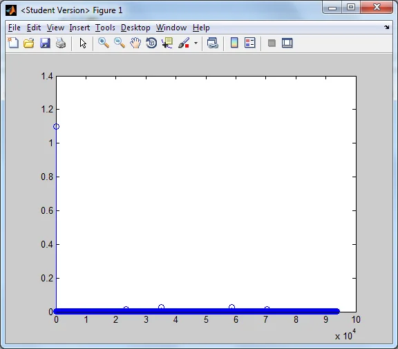
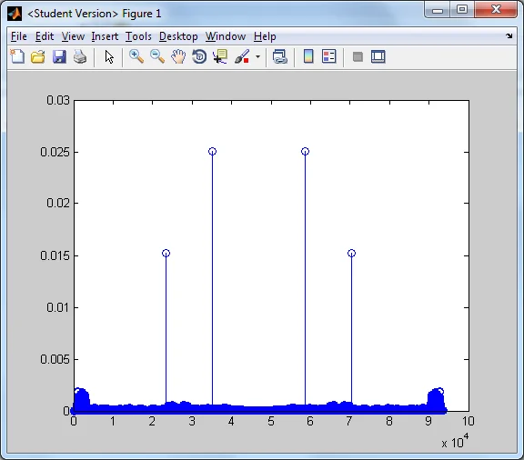
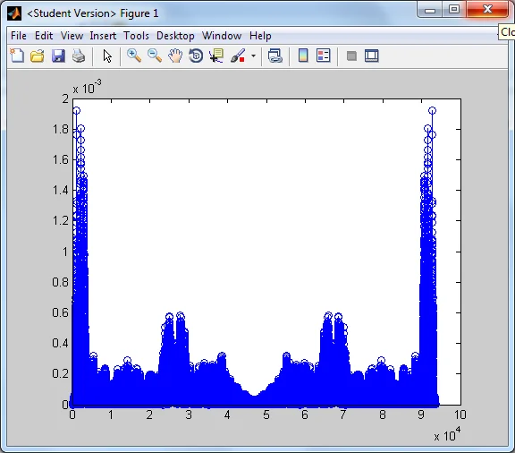

*This post is one of a series of articles adapted from my university dissertation on data
visualisation — see the [rest of the series](/blog/tags/datavis-project).*

Recorded sound is taken in analogue form, converted to digital form and stored as binary. The decimal
numeric representation of each of the samples can be used to process the sound, as they can be
manipulated as matrices in MATLAB. For example the sound file `numbers.wav` stored as a row vector in
MATLAB containing over 115,000 numeric values representing the samples making up the sounds. For
example a random segment of the sound file:

```
-0.001617431640625
-0.000732421875000
-0.000976562500000
-0.000915527343750
-0.001831054687500
-0.001983642578125
0.000762939453125
0.000732421875000
-0.001403808593750
-0.000335693359375
0.001525878906250
0.002136230468750
0.000762939453125
-0.001159667968750
-0.000671386718750
-0.000488281250000
0.001556396484375
0.001190185546875
0.001586914062500
0.000915527343750
-0.000915527343750
```

which can be plotted to see the frequencies (plotted 100 samples either side):

<figure class="wp-block-image">

<figcaption>A segment of samples from numbers.wav</figcaption>
</figure>

The entire sound file looks like this:

<figure class="wp-block-image">

<figcaption>numbers.wav plotted against time</figcaption>
</figure>

I wrote a program to detect the start and end of each word spoken in the sound file, and created plots
of each individual word:

<figure class="wp-block-image">

<figcaption>The four spoken words from numbers.wav plotted separately</figcaption>
</figure>

The words are "Two", "One", "Four" and "Three". From here we can see how each of these words is
spoken. The first actually seems to be made up of two separate sounds — this is because of the
physical act of saying the two sounds "T" and "Ooh", which when slowed down, sound like there was a
pause between them due to the change of oral position between sounds making up the word.

From these visual interpretations of the parts of the sounds we can study a sound file and see what is
happening.

Another example of useful visualisation in digital sound is when applying a Fast Fourier Transform to a noisy
sound file in order to locate the frequencies which are separate from the rest of the file. The file
`noiseysecret.dat` contains a spoken sentence with noise laid over the top, making the voice
inaudible. This is what the sound looks like with the noise:

<figure class="wp-block-image">

<figcaption>noiseysecret.dat with noise</figcaption>
</figure>

Applying a Fast Fourier Transform to this noisy sound file allows us to pinpoint any abnormalities on a stem
plot:

<figure class="wp-block-image">

<figcaption>Stem plot of Fourier transform of sound file</figcaption>
</figure>

This shows us that the vast majority of the sound is towards zero on the scale of 0 to 1.4, but there
is a definite inconsistency at around 1.1. Removing any values at this level will remove part of the
noise from the sound. Let's see what it looks like after that's removed:

<figure class="wp-block-image">

<figcaption>Second Fourier transform</figcaption>
</figure>

Now the scale has been restricted to 0.03, much lower than the previous plot, so we can see two other
sets of inconsistencies. These too can be eradicated, leaving only the wanted part of the file — the
spoken words (note the range of true sound values only goes up to 0.002):

<figure class="wp-block-image">

<figcaption>The Fourier transform of the sound with the noise eradicated</figcaption>
</figure>
