*This post is one of a series of articles adapted from my university dissertation on data
visualisation — see the [rest of the series](/blog/tags/datavis-project).*

The single pendulum is a simple system to model, as it is simply the force of the weight of the bob
acting with respect to gravity:

<figure class="wp-block-image">
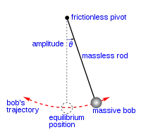
<figcaption>Simple gravity pendulum diagram, from Wikipedia</figcaption>
</figure>

The formula for the angular acceleration is simply given by:

```
d²θ/dt² = −g·sin(θ) / R
```

Where g is the gravitational constant, θ is the angle (0 = vertical), R is the length of the rod and
d²θ/dt² (the second derivative of θ with respect to time) is the angular acceleration. [Neumann, 2004]

However, the double pendulum (a second rod attached to the bob, with another bob on the end of that)
is a more complex system and is much more difficult to model:

<figure class="wp-block-image">
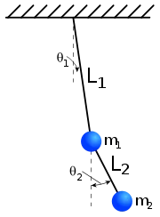
<figcaption>The double pendulum diagram, from Wikipedia</figcaption>
</figure>

This system requires a set of two second order ODEs (Ordinary Differential Equations):

<figure class="wp-block-image">
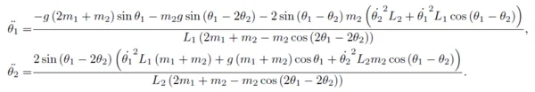
<figcaption>Second order ODEs for a double pendulum. This assignment is insane... (@danielcolquitt)</figcaption>
</figure>

It is possible to convert this system of two second order ODEs into four first order ODEs, so that
MATLAB can compute a numerical solution to model the motion of the double pendulum given a set of
initial conditions (rod lengths, bob weights, initial angles and angular velocities), and then plot
the path the pendulum takes in its motion under gravity (angle 1 vs. angle 2):

<figure class="wp-block-image">
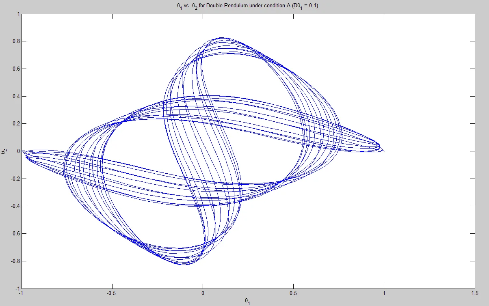
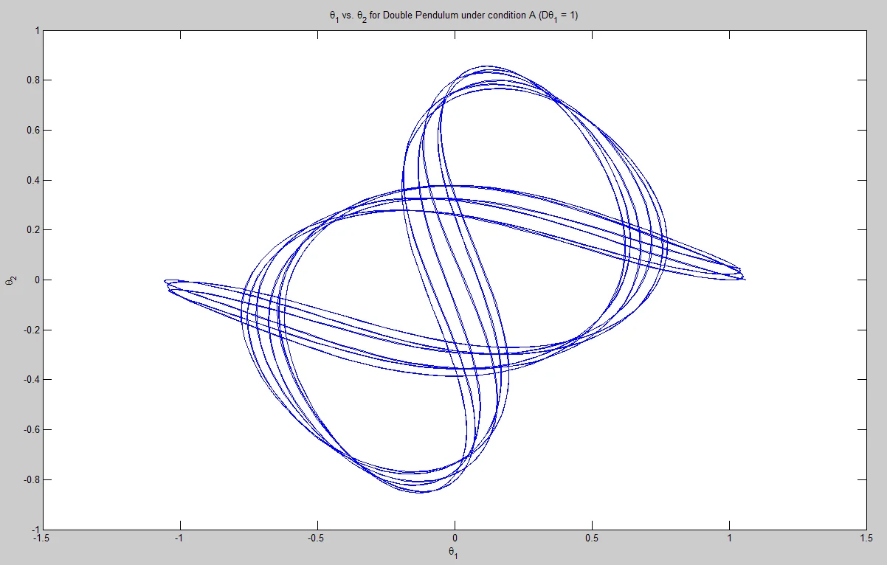
<figcaption>The motion of the double pendulum under two different small initial angular velocities</figcaption>
</figure>

<figure class="wp-block-image">
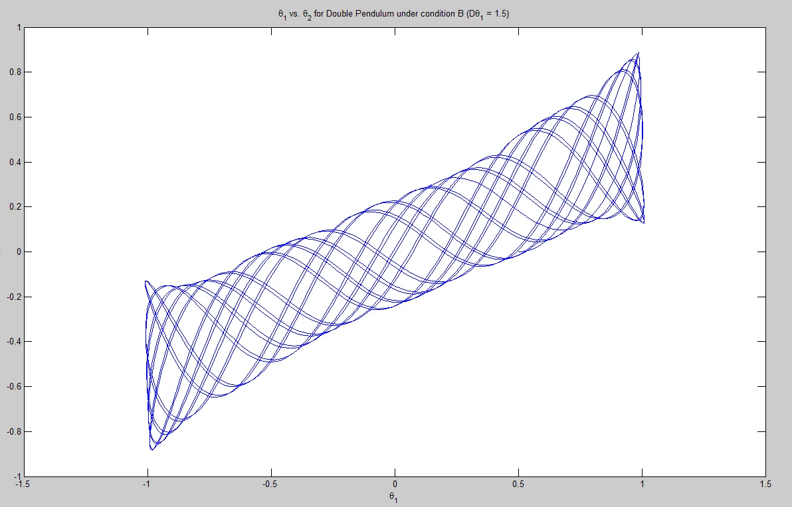
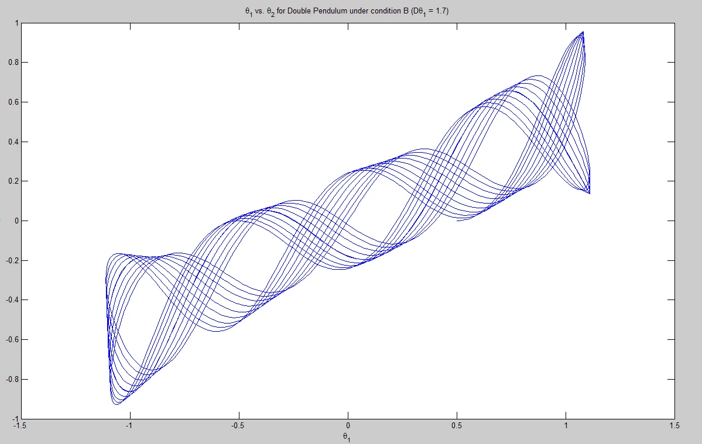
<figcaption>The motion of the double pendulum under two different small initial angular velocities
(different weights and rod lengths from the previous example)</figcaption>
</figure>

This behaviour of the two paths of motion can be described as quasiperiodic. Quasiperiodicity
describes a pattern which is *almost* periodic. Periodic would mean it would take the same path every
time, like the single pendulum:

<figure class="wp-block-image">
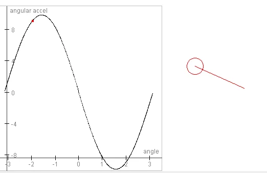
<figcaption>The periodic path of the single pendulum</figcaption>
</figure>

I feel that it's difficult to see how the quasiperiodicity occurs in the above double pendulum plots,
because all you see is a twisted continuous loop. In my experience mathematicians and physicists
studying systems such as these find it difficult to grasp the concept from these drawn-out plots.
Therefore I made a plan to help teach this concept.

Using the MATLAB program I wrote to model the double pendulum, which already plotted the motion of the
angles (seen above), I made a simple adjustment: rather than plotting all the data in one go, I ran a
for loop which plotted 1 point at a time, pausing for a tiny fraction of a second, so that the observer
would be able to see the motion being drawn out in real time. This way they get to see the path being
drawn, so they know where it went, the path that it took and exactly what happened.

In examples of quasiperiodicity this helps show how the path taken will differ ever so slightly from
the previous run, and then again, just cutting past the previous two paths, always slightly out of its
previous path. It's difficult for me to prove the usefulness of this approach on paper, but here are a
few plots with times given to give an impression of what the observer would see:

<figure class="wp-block-image">
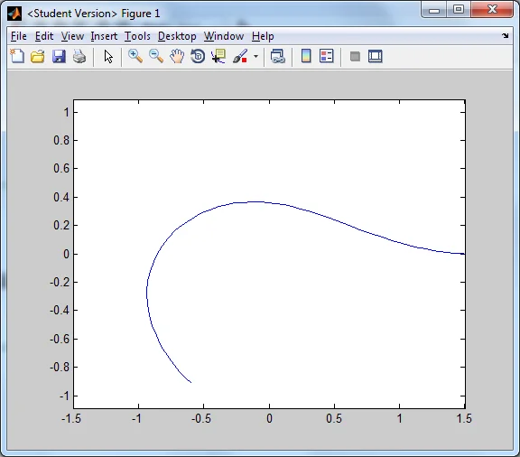
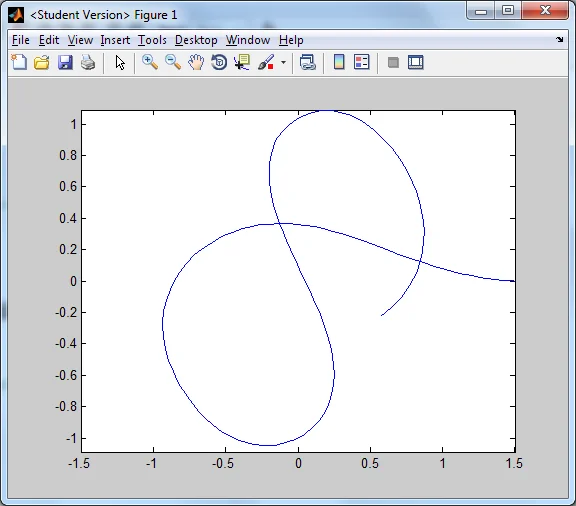
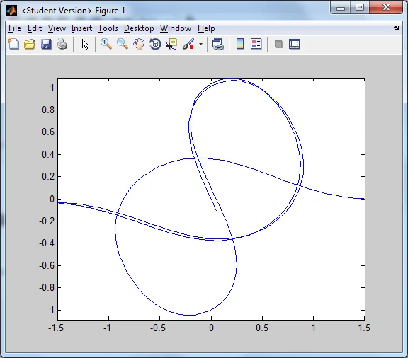
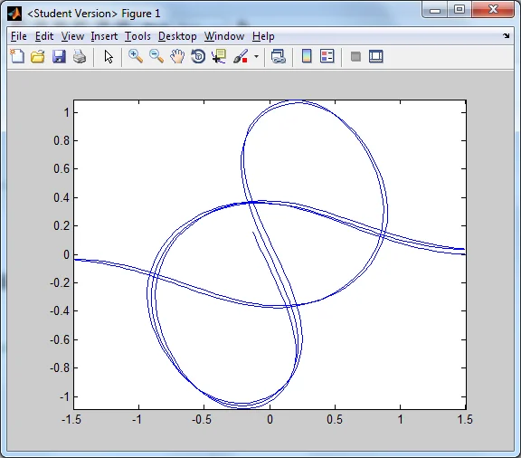
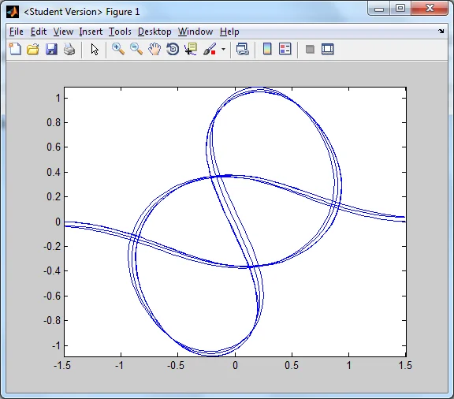
<figcaption>Screenshots of plots taken at 5 time intervals, showing how the path taken follows the
shape of the path of the previous, but slightly different in exact location</figcaption>
</figure>
