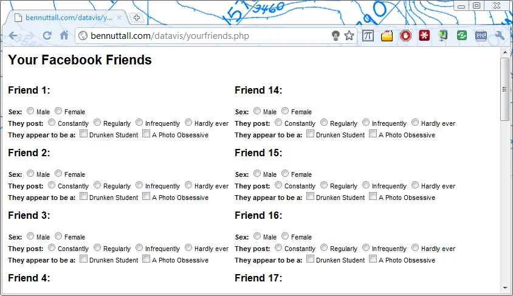
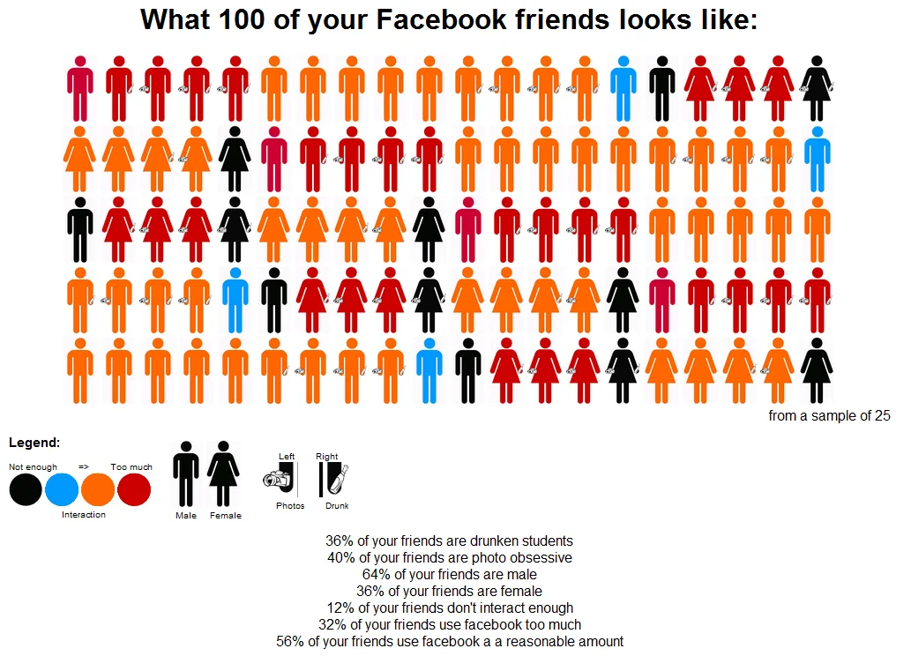

*This post is one of a series of articles adapted from my university dissertation on data
visualisation — see the [rest of the series](/blog/tags/datavis-project).*

I navigated to the list of my Facebook friends (facebook.com/friends.php) and removed the default
filtering (usually shows recently active friends) so that the list would be unbiased. I then opened a
couple of friends' profiles (in new tabs in the background) from each page — they were organised
alphabetically — selecting the profiles at random. 25 of my friends' profiles. I then inspected each of
these profiles and made a tally chart of certain attributes (opinion-based) to sort the full set of the
sample of 25 into sub groups based on their level of activity on Facebook, so that each friend fit into
one of the following four sub sets:

**{Posts constantly, Posts regularly, Posts infrequently, Hardly ever posts}**

This based on personal status updates and links posted, not on the activity they "receive" (from other
people), where the middle two groups are a level that I think is acceptable, the first is somewhat
overwhelming/irritating and the last is merely that person not being active (not annoying but not good
for the social network connection we share if they don't contribute).

I then added another two attributes, which could be applied to anyone in any subset (or not):

**{Appears to be a drunken student, Appears to be obsessed with self-photography}**

These attributes were based on my initial opinion when viewing the page (did I see immediate evidence
of student-like drink-related statuses or drunk photos? Did I see a great deal of self-photography and
a large number of personally-uploaded or tagged photos?) — generally not of my opinion of the person in
question. I also added a gender field and grouped the results accordingly.

I began to write an HTML form into which I could input these results, intending on getting a PHP
script to process the data. Since the form would consist of 25 repeated sets of fields, I got PHP to
generate it:

```
<?php
  $sample = 25;
  $h = round($sample/2);
  echo "<div style='width:800px;margin:0 auto;font-family:helvetica,tahoma,arial,sans-serif;font-size:11px;'>\n";
  echo "<h1>Your Facebook Friends</h1>\n\n";
  echo "<form method='post' action='yourfriends2.php'>\n";
  for ($i=1; $i<=$sample; $i++)
  {
    if ($i == 1)
    {
      echo "<div style='float:left;'>";
    }
    elseif ($i == $h+1)
    {
      echo "</div>\n\n<div style='float:left;margin-left:10px;'>";
    }
    echo "<h2>Friend $i:</h2>\n";
    echo "<b>Sex:</b> <input type='radio' name='sex[$i]' value='m' />Male <input type='radio' name='sex[$i]' value='f' />Female<br />\n";
    echo "<b>They post:</b> <input type='radio' name='post[$i]' value='3' />Constantly <input type='radio' name='post[$i]' value='2' />Regularly <input type='radio' name='post[$i]' value='1' />Infrequently <input type='radio' name='post[$i]' value='0' />Hardly ever<br />\n";
    echo "<b>They appear to be a:</b> <input type='checkbox' name='drunk[$i]' value='1' />Drunken Student <input type='checkbox' name='photo[$i]' value='1' />A Photo Obsessive<br />\n\n";
  }
  echo "</div>\n<br style='clear:both;' />\n";
  echo "<input type='submit' value='Submit' style='float:right;' />\n";
  echo "<br />\n</form>";
  echo "</div>";
?>
```

Which, when served, rendered the following HTML:

```
<div style='width:800px;margin:0 auto;font-family:helvetica,tahoma,arial,sans-serif;font-size:11px;'>
  <h1>Your Facebook Friends</h1>
  <form method='post' action='yourfriends2.php'>
    <div style='float:left;'>
      <h2>Friend 1:</h2>
      <b>Sex:</b> <input type='radio' name='sex[1]' value='m' />Male <input type='radio' name='sex[1]' value='f' />Female<br />
      <b>They post:</b> <input type='radio' name='post[1]' value='3' />Constantly <input type='radio' name='post[1]' value='2' />Regularly <input type='radio' name='post[1]' value='1' />Infrequently <input type='radio' name='post[1]' value='0' />Hardly ever<br />
      <b>They appear to be a:</b> <input type='checkbox' name='drunk[1]' value='1' />Drunken Student <input type='checkbox' name='photo[1]' value='1' />A Photo Obsessive<br />
      <h2>Friend 2:</h2>
      <b>Sex:</b> <input type='radio' name='sex[2]' value='m' />Male <input type='radio' name='sex[2]' value='f' />Female<br />
      <b>They post:</b> <input type='radio' name='post[2]' value='3' />Constantly <input type='radio' name='post[2]' value='2' />Regularly <input type='radio' name='post[2]' value='1' />Infrequently <input type='radio' name='post[2]' value='0' />Hardly ever<br />
      <b>They appear to be a:</b> <input type='checkbox' name='drunk[2]' value='1' />Drunken Student <input type='checkbox' name='photo[2]' value='1' />A Photo Obsessive<br />
      <h2>Friend 3:</h2>
      <b>Sex:</b> <input type='radio' name='sex[3]' value='m' />Male <input type='radio' name='sex[3]' value='f' />Female<br />
      <b>They post:</b> <input type='radio' name='post[3]' value='3' />Constantly <input type='radio' name='post[3]' value='2' />Regularly <input type='radio' name='post[3]' value='1' />Infrequently <input type='radio' name='post[3]' value='0' />Hardly ever<br />
      <b>They appear to be a:</b> <input type='checkbox' name='drunk[3]' value='1' />Drunken Student <input type='checkbox' name='photo[3]' value='1' />A Photo Obsessive<br />

      [FIELDS FOR FRIENDS 4 TO 24 NOT SHOWN]

    </div>
    <br style='clear:both;' />
    <input type='submit' value='Submit' style='float:right;' />
    <br />
  </form>
</div>
```

<figure class="wp-block-image">

<figcaption>The HTML form rendered as HTML</figcaption>
</figure>

I thought about ways to represent the processed information. I thought it would be sensible to scale
this sample of 25 up to 100 (so things could be referred to in percentages). I then decided to use
graphics representing each of these attributes (some with clearly overlapping traits). I started with
the simple male/female symbols:

<figure class="wp-block-image">


</figure>

I decided to let colour represent the original groups (by activity level):

Black = Low activity, Blue = Low-Medium activity, Orange = High-Medium activity, Red = High activity

So my figures were then:

<figure class="wp-block-image">


</figure>

Then I added icons to represent drink and photographs:

<figure class="wp-block-image">


</figure>

So now there were a total of 32 images representing different sets of people (2 genders, 4 colours,
with either, neither or both of 2 optional items). Once I was pleased with the images, I continued
writing the PHP script which processed the HTML form.

The pseudocode for the processing script:

```
Retrieve all values posted from the form
For each friend inputted, generate an appropriate image
Count number of instances of each attribute
Display images in a 20x5 grid
Display visualisation legend
Show statistics in percentages
```

The code itself:

```
<?php
  $sample = 25; // use a factor of 100
  $d = 100/$sample;
  $countd = 0;
  $countp = 0;
  $countm = 0;
  $countf = 0;
  $countbla = 0;
  $countblu = 0;
  $countora = 0;
  $countred = 0;
  $imgs = array();

  foreach ($_POST as $key => $var) // Convert all $_POST['var'] to $var
  {
    $$key = $var;
  }

  for ($i=1; $i<=$sample; $i++) // Process each friend to generate appropriate image
  {
    $img = '';
    if ($drunk[$i]) // if drunk
    {
      $img .= 'drunk-';
      $countd++;
    }
    if ($photo[$i]) // if photo
    {
      $img .= 'camera-';
      $countp++;
    }
    $sex[$i] == 'm' ? $img .= 'male-' : $img .= 'female-'; // shorthand for if A else B
    $sex[$i] == 'm' ? $countm++ : $countf++;
    switch ($post[$i]) // one of these options only
    {
      case 0:
        $img .= 'black';
        $countbla++;
        break;
      case 1:
        $img .= 'blue';
        $countblu++;
        break;
      case 2:
        $img .= 'orange';
        $countora++;
        break;
      case 3:
        $img .= 'red';
        $countred++;
        break;
    }
    $img .= '.png';
    $imgs[] = $img;
  }

  echo "<div style='width:1000px;margin:0 auto;text-align:center;font-family:helvetica,tahoma,arial,sans-serif;'>\n";
  echo "<h1>What 100 of your Facebook friends looks like:</h1>\n\n";

  $images = array();
  for ($i=1; $i<=$d; $i++) // Multiply all occurances to make total to 100
  {
    foreach($imgs as $img)
    {
      $images[] = $img;
    }
  }

  // Generate HTML image tags for each icon
  $count = 0;
  foreach($images as $img)
  {
    $count++;
    echo "\n";
    if ($count % 20 == 0) // After every 20 icons, send to a new line
    {
      echo "<br />";
    }
  }

  // Multiply all counts by the factor (to provide statistics in percentage form)
  $countd *= $d;
  $countp *= $d;
  $countm *= $d;
  $countf *= $d;
  $countbla *= $d;
  $countblu *= $d;
  $countora *= $d;
  $countred *= $d;
  $countmid = $countblu + $countora; // Middle two sets grouped together

  // Render HTML for output
  echo "<div style='text-align:right;'>from a sample of $sample</div>\n";
  echo "<div style='float:left;width:170px;text-align:left;font-size:10px;'>\n";
  echo "<h2>Legend:</h2>\n";
  echo "Not enough &nbsp;&nbsp;&nbsp;&nbsp;&nbsp;&nbsp; => &nbsp;&nbsp;&nbsp;&nbsp;&nbsp;&nbsp; Too much<br />\n";
  echo "   <br />\n";
  echo "<div style='text-align:center;'>Interaction</div><br />\n";
  echo "</div>\n";
  echo "<div style='float:left;width:90px;text-align:left;font-size:10px;margin:18px 0 0 10px;'>\n";
  echo " <br />\n";
  echo "<div>&nbsp;&nbsp; Male &nbsp;&nbsp;&nbsp; Female</div><br />\n";
  echo "</div>\n";
  echo "<div style='float:left;width:120px;text-align:center;font-size:10px;margin:30px 0 0 10px;'>\n";
  echo "<div>Left &nbsp;&nbsp;&nbsp;&nbsp;&nbsp;&nbsp; Right</div>\n";
  echo " &nbsp;&nbsp;&nbsp;&nbsp;&nbsp;&nbsp; <br />\n";
  echo "<div>&nbsp;&nbsp; Photos &nbsp;&nbsp;&nbsp;&nbsp;&nbsp;&nbsp; Drunk</div><br />\n";
  echo "</div>\n\n";
  echo "<div style='clear:both;'>\n";
  echo "$countd% of your friends are drunken students<br />\n";
  echo "$countp% of your friends are photo obsessive<br />\n";
  echo "$countm% of your friends are male<br />\n";
  echo "$countf% of your friends are female<br />\n";
  echo "$countbla% of your friends don't interact enough<br />\n";
  echo "$countred% of your friends use facebook too much<br />\n";
  echo "$countmid% of your friends use facebook a reasonable amount<br />\n";
  echo "</div>\n\n";
  echo "</div>\n";
?>
```

I then entered the data I had collected earlier, which yielded the following visualisation:

<figure class="wp-block-image">

<figcaption>The output from the data I entered</figcaption>
</figure>
