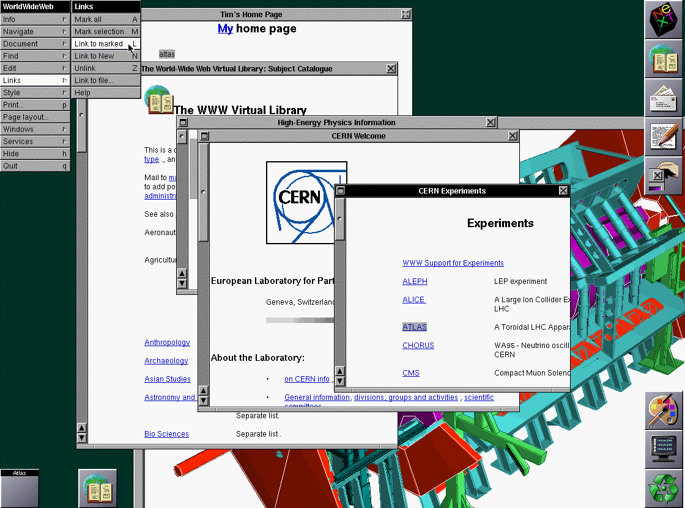
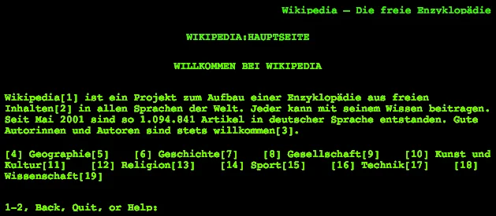
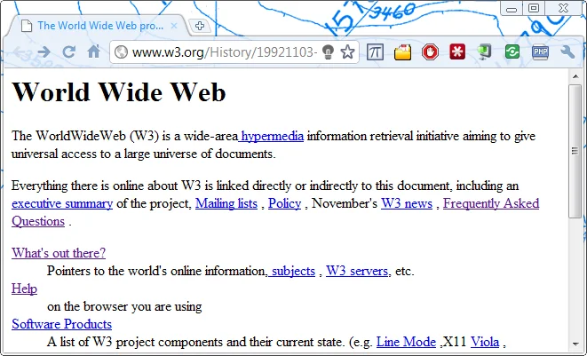

*This post is one of a series of articles adapted from my university dissertation on data
visualisation — see the [rest of the series](/blog/tags/datavis-project).*

**The Internet** is a global WAN (wide area network), connecting a system of computer networks all
operating under the same protocol, TCP/IP (Transmission Control Protocol / Internet Protocol). Among
the computers on these networks are servers holding information which can be accessed by users
geographically elsewhere. Upon this internet (note that *The Internet* is an internet, or
internetwork, which is the general term for a network of computers) is laid the **World Wide Web**,
which was developed by Tim Berners-Lee with a team at CERN (European Organization for Nuclear
Research) between 1989 (first proposal) and 1991 (launch).

The initiative behind this project was given in the abstract of Berners-Lee's 1990 proposal as a way
to access a wide range of information in numerous formats. He used the word "web" to describe the way
the information would be laid out and how the user would crawl from one node (a server containing
information) to another, to another, and so on. His vision was that there would be an interface to
this web, provided by the protocol of HyperText, which would allow content from the range of data
storage formats (reports, articles, databases, documentation and online help systems) to be displayed
in different ways within the boundaries of hypertext, in order for a universal system to maintain
order among this mass of information. He also beautifully described the WWW as a "wide-area
hypermedia information retrieval initiative aiming to give universal access to a large universe of
documents". More recently, the WWW has been said to be a pool of human knowledge and culture,
allowing users to collaborate and share ideas.

<figure class="wp-block-image">

<figcaption>Visualisation of the World Wide Web</figcaption>
</figure>

Berners-Lee formed the World Wide Web Consortium (W3C) in 1994, which became the main international
standards organisation for the web, as well as continuously developing web standards and fulfilling
its motto "Leading the web to its full potential" by enabling initiative to take place by users
around the world developing software, creating content, and creating the means for others to
contribute to the web under billions of projects of varying scales, as well as allowing the world of
business to take advantage of the opportunities provided by the internet as a platform for 24/7 sales
without need for physical shop space or payment for staff to deal with customers.

Since its launch in 1991, users of the Internet have been able to access information in HyperText
form by accessing so-called web-sites using a web browser, which is a piece of software which renders
HTML as readable interactive content. The first web browser was called WorldWideWeb (later renamed to
Nexus to avoid confusion) which was written by Berners-Lee in 1990 on his NeXTcube computer, now on
display in the CERN museum. At the time, this was the only way to access the content on the web.

<figure class="wp-block-image">

<figcaption>The WorldWideWeb browser (1993)</figcaption>
</figure>

Shortly after the first release of the WorldWideWeb browser, other members of the project team began
to develop a command-line based browser called Line Mode Browser, which was first released in
mid-1991. Several other browsers were developed in the mid-1990s — all very basic (clicking links,
which usually opened in new windows, or in some cases pressing numbers on the keyboard which were
associated with links) but they were capable of rendering markup suitably.

<figure class="wp-block-image">

<figcaption>Line Mode Browser</figcaption>
</figure>

Berners-Lee created a web page (now copied to the History section of the W3C website for archive
purposes) in order to explain his initiative and explain what the web could be used for, providing
documentation as to how people could use it to share information and access information themselves.

<figure class="wp-block-image">

<figcaption>An archived copy of the first web page, shown in a modern web browser</figcaption>
</figure>

He provided guidelines and an etiquette guide advising users to follow a certain convention to make
the process of surfing the web more usable and less confusing. These conventions involved:

- The author of a document signing it with their name, linking to a contact page
- Dating all documents
- Putting any disclaimers, copyright information or other "clutter" in separate documents and linking
  to them when necessary
- Giving the status of any document (complete/incomplete, in/out of date)
- Being aware that users can access any of your pages by being linked from elsewhere, and to assure
  the information is not written to be linear
- Mapping data structures
- Providing aliases for servers (i.e. web addresses not IP addresses) for portability

Berners-Lee also provided documentation to explain to web users how they could contribute to the web
project. He laid out an extensive but concise list of sub-projects which he envisaged would allow the
Internet to grow, become evermore useful and help people find what they were looking for.

The *How Can I Help?* document outlined:

- Putting up some data, stating "the web needs both raw data — fresh hypertext or old plain text
  files, or smart servers giving views of existing databases"
- Suggesting to people with useful software to make it available online
- Managing your subject area — if a user had information regarding the current state of a particular
  field of study, research or development, to put up relevant and useful information, sharing the
  latest information in an overview on their web server
- Sending in suggestions — "we love to get mail... www-bug@info.cern.ch"
- Telling other people and spreading the word

Among these points was one urging users to contribute by writing some software to help build the web.
He provided a link to another page listing all his ideas for things people could do to help improve
the web and progress the technologies. His projects outline and ideas for how the web would develop
were, looking back 20 years, surprisingly accurate in terms of preparation for the web being the
success it has been. He lists tasks — some specific, others more general, some with uncertainty as to
how they will work. Some examples:

- More web browsers for different platforms
- Search engines — "now the web of data and indexes exists, some really smart intelligent algorithms
  ('knowbots?') could run on it. Recursive index and link tracing, just think..."
- Making printing resources (as opposed to single documents) easier
- More servers, easier methods of upgrading servers and making the data held on servers more portable
- HTTP authorisation and better logging of actions for statistics
- Form processing, for use in search, admin processing, electronic voting, and so on
- Graphic overview — to display the web as a network of linked documents in graphical form
- Tutorials for using and contributing to the WWW (hypertext, audio and video)

It's amazing to read this document in 2011, twenty years since the problems were put forward! It's
like looking at the unsolved mathematical problems or the unanswered questions of physics regarding
the origin of the universe, except we're looking at the foundations of what was to become a worldwide
phenomenon — and pretty much all the problems have been dealt with, and they were mostly relevant to
the way we use the internet and the web today. He knew that users would need a tool to search the
mass of information to find what we want, and he had a good idea what would be required for this to
happen.
