*This is an extended version of an article I wrote for [*MSOR
Connections*](http://mathstore.ac.uk/) magazine – which you can [read
online](http://journals.heacademy.ac.uk/doi/abs/10.11120/msor.2011.11030010)*

During the final year of my combined honours degree in Mathematics and Computing at Manchester
Metropolitan University (MMU) I received an invitation to a two-day Student Mathematical Modelling
Workshop at the [University of Limerick](http://ul.ie/) in the Republic of Ireland, hosted by the
[Mathematics Application Consortium for Science and Industry](http://www.macsi.ul.ie/) (MACSI). The
workshop was followed by the [82nd European Study Group with
Industry](http://www.macsi.ul.ie/esgi82/). The maths course at MMU is highly oriented around real
world problem solving involving mathematical modelling, dynamical systems, numerical methods, ODEs &
PDEs and contains a strong programming element, so this was something I thought would be good to
attend.

My friend Chris and I applied for our places on the workshop and booked our flights. What better way
to unwind after completing a maths degree than being put to the test! While packing our shared
suitcase for the trip, we weighed the case and realised we were too heavy, so we repacked – some of
it crammed in to our backpacks, some we left behind. Arriving at the luggage check-in desk, the
suitcase was weighed and we were well under the limit. At this point we realised we had looked at
the wrong units on the weighing scales. Typical mathematical modelling error – how apt. We
reshuffled the contents of our cram-packed flight bags and put things back in to the suitcase,
thinking idiots of ourselves.

Not really knowing how useful we'd be in helping solve problems, nor which type of problems we would
like to tackle, we began by sizing up the problems set online while on the plane. I chose a problem
on Equity Options & CDS Risk Management because it seemed an interesting situation to work with. The
group consisted of both those who had studied financial mathematics and those who hadn't, so there
was a mix of abilities and understanding. The finance people got on with what they have done with
similar problems, explaining themselves along the way, and others found useful things to bring to
the group. I personally looked at the data we had been given, analysed the trends in the evolution
of option prices over time and ran a Monte Carlo simulation in MATLAB to demonstrate the
effectiveness of the strategy.

<dl class="gallery-item">
<dt class="gallery-icon landscape">

</dt></dl><dl class="gallery-item">
<dt class="gallery-icon landscape">

</dt></dl><dl class="gallery-item">
<dt class="gallery-icon landscape">
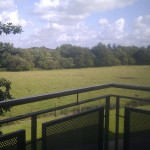
</dt></dl><dl class="gallery-item">
<dt class="gallery-icon landscape">

</dt></dl> <dl class="gallery-item">
<dt class="gallery-icon landscape">

</dt></dl><dl class="gallery-item">
<dt class="gallery-icon landscape">
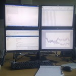
</dt></dl><dl class="gallery-item">
<dt class="gallery-icon landscape">
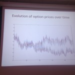
</dt></dl><dl class="gallery-item">
<dt class="gallery-icon portrait">
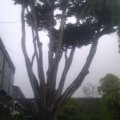
</dt></dl> 

The second week was the study group so the lecture theatre was filled out with academics as well as
the students who had stayed on. I chose to work on a problem in Electricity Prices and Demand Side
Management, looking at estimating usage for a company called [Crystal
Energy](http://www.crystalenergy.ie/) in Ireland who offer electricity to companies at variable
tariffs based on consumption. I worked with other members of my group on analysing the company's
data in MATLAB and Mathematica. We were able to produce useful information for the group, including
isolating volatile periods in the day (e.g. between 12-2am) and in the year (e.g. mid-late December)
by looking at the absolute difference (error) between corresponding timeslots and plotting contour
maps. A report explaining our findings has been submitted for publication. As the study group fell
after our final exams, it gave us a great insight in to the usefulness of what we had learned at
university, indicated gaps in our knowledge and inspired us to attempt to solve problems that arise,
small and simple or bigger and more complex problems alike. It gave us both the courage to realise
that this is something we could do with our lives, applying our skills in such a real and meaningful
way which could lead to significant results in personal, small or large scale industry problems.

<dl class="gallery-item">
<dt class="gallery-icon landscape">
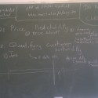
</dt></dl><dl class="gallery-item">
<dt class="gallery-icon landscape">
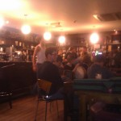
</dt></dl><dl class="gallery-item">
<dt class="gallery-icon landscape">
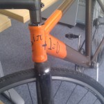
</dt></dl><dl class="gallery-item">
<dt class="gallery-icon landscape">
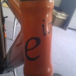
</dt></dl> <dl class="gallery-item">
<dt class="gallery-icon landscape">
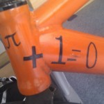
</dt></dl><dl class="gallery-item">
<dt class="gallery-icon landscape">

</dt></dl><dl class="gallery-item">
<dt class="gallery-icon landscape">

</dt></dl>
 

A couple of times during the trip, I arranged Skype calls with [Peter
Rowlett](http://twitter.com/peterrowlett), where he interviewed by about the study group and
conference for his [Math/Maths podcast](http://www.pulse-project.org/pulsemathsmaths), along with
his American co-host [Samuel Hansen](http://twitter.com/Samuel_Hansen). You can listen to these
here: [Episode 53](http://pulse-project.org/node/348), [Episode
55](http://pulse-project.org/node/354)

We had a fantastic time staying on the beautiful campus of the University of Limerick. We enjoyed
the food, drink and surroundings, but most of all, the company – everyone there was really
interesting, and it was great to share conversation with such an intelligent group of like-minded
mathematicians. Although the daytime was spent working on maths problems, the trip was very social –
we would move from a classroom or lecture theatre straight to the pub with the other students and
staff and carry on discussions from the problems of the day, and our approaches to solving them.
Also, during the second week, I received the results of our degrees – and I'd passed with second
class honours.

We also took the weekend at the end of the trip to travel to Dublin, where we stayed with the family
of one of the conference delegates we met. Dublin is a fantastic city, and we really enjoyed the
weekend. We visited the campus of [University College Dublin](http://www.ucd.ie/) and its [Maths
Society](http://www.ucd.ie/mathsoc/)'s room. I was shocked to see their Maths Society was so well
established that it had its own designated area of the Maths Department building! Last year I
founded the Maths Society at MMU and we had nothing at all. We hung out in the Maths Society room
for a while, looked at some books from their library and played on their N64! We also took a walk
through the Maths Department's own library, deep down in the basement of the building – where we
walked through about five big rooms full of books – and when we reached the end, I picked up a
magazine I saw on top of a box, turned it over to look at the back page, and spotted a review of a
book written by my lecturer [Stephen
Lynch](http://www.scmdt.mmu.ac.uk/staff/staffbiog/default.asp?StaffID=433) – [*Dynamical Systems
with Applications using
MATLAB*](https://www.mathworks.co.uk/matlabcentral/fileexchange/2374-dynamical-systems-with-applications-using-matlab).
Quite a coincidence!

<dl class="gallery-item">
<dt class="gallery-icon portrait">

</dt></dl><dl class="gallery-item">
<dt class="gallery-icon landscape">
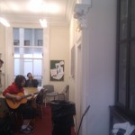
</dt></dl><dl class="gallery-item">
<dt class="gallery-icon landscape">

</dt></dl><dl class="gallery-item">
<dt class="gallery-icon landscape">
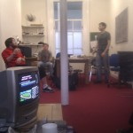
</dt></dl> <dl class="gallery-item">
<dt class="gallery-icon portrait">

</dt></dl><dl class="gallery-item">
<dt class="gallery-icon portrait">

</dt></dl><dl class="gallery-item">
<dt class="gallery-icon portrait">

</dt></dl><dl class="gallery-item">
<dt class="gallery-icon portrait">
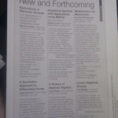
</dt></dl> <dl class="gallery-item">
<dt class="gallery-icon portrait">

</dt></dl><dl class="gallery-item">
<dt class="gallery-icon landscape">

</dt></dl><dl class="gallery-item">
<dt class="gallery-icon landscape">

</dt></dl><dl class="gallery-item">
<dt class="gallery-icon portrait">

</dt></dl> <dl class="gallery-item">
<dt class="gallery-icon landscape">

</dt></dl><dl class="gallery-item">
<dt class="gallery-icon portrait">

</dt></dl><dl class="gallery-item">
<dt class="gallery-icon landscape">
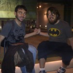
</dt></dl><dl class="gallery-item">
<dt class="gallery-icon landscape">

</dt></dl> <dl class="gallery-item">
<dt class="gallery-icon landscape">

</dt></dl><dl class="gallery-item">
<dt class="gallery-icon portrait">

</dt></dl><dl class="gallery-item">
<dt class="gallery-icon portrait">
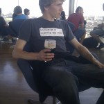
</dt></dl><dl class="gallery-item">
<dt class="gallery-icon landscape">

</dt></dl> <dl class="gallery-item">
<dt class="gallery-icon landscape">
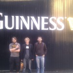
</dt></dl><dl class="gallery-item">
<dt class="gallery-icon landscape">
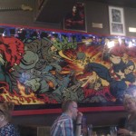
</dt></dl><dl class="gallery-item">
<dt class="gallery-icon portrait">
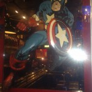
</dt></dl><dl class="gallery-item">
<dt class="gallery-icon landscape">
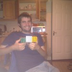
</dt></dl> 

Unfortunately I had some sad news on the night we left – a friend called to say one of my friends
from the university canoe club, Dave Evans, had died in a climbing accident on Mont Blanc. This was
devastating, and I found the news very difficult to take in. A hard thing to deal with – losing a
friend so young. Dave was just 24 and had been out of university less than a year. RIP.
