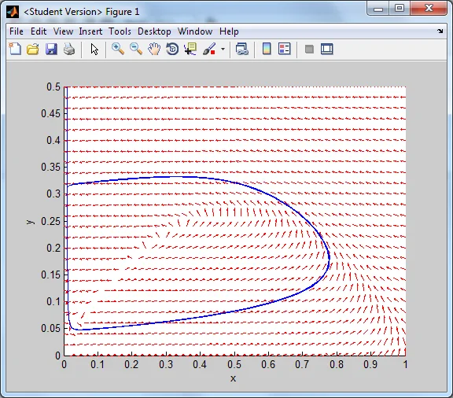
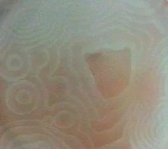

*This post is one of a series of articles adapted from my university dissertation on data
visualisation — see the [rest of the series](/blog/tags/datavis-project).*

Limit cycles are interesting systems whereby the solution to a set of differential equations produces
a phase portrait whose directional flow enters a cycle and gets stuck in it, so although the solution
is continuous, its solution stays within a particular boundary and cycles through it. A good example of
a limit cycle is the autocatalytic chemical reaction known as the Belousov-Zhabotinsky Reaction.

<figure class="wp-block-image">

<figcaption>The Belousov-Zhabotinsky Reaction (Bromous acid vs. Cerium)</figcaption>
</figure>

Note how the system starts at the top left of the graph and creeps down towards the origin and then
gets stuck in the cycle. This means that the drop in the level of concentration of the Cerium allows
the Bromous acid concentration to grow, up until a point where the Bromous content is sufficient to
cause a rise in Cerium which starts the cycle again. The two chemicals react with each other at
different levels of concentration in such a way that no matter what the concentration starts off as
(pick any position on the graph) it will end up in the limit cycle, and the concentrations will
fluctuate accordingly (note how all the arrows point at the cycle, or tend towards it).

<figure class="wp-block-image">

<figcaption>The Belousov-Zhabotinsky Reaction taking place</figcaption>
</figure>
