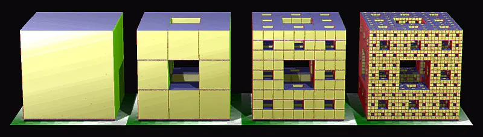
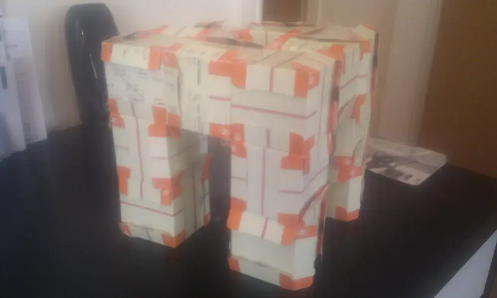
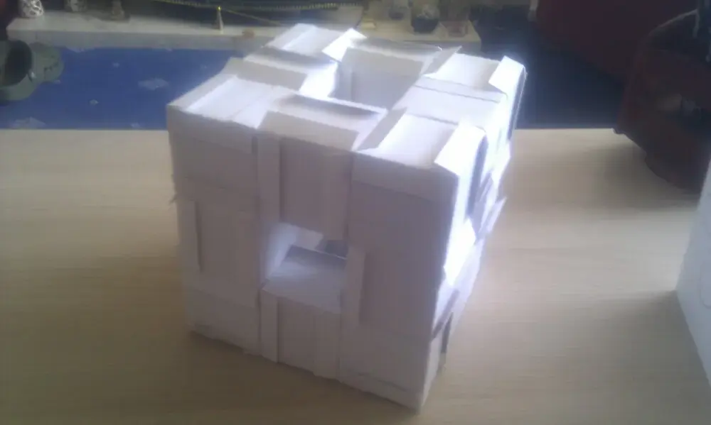
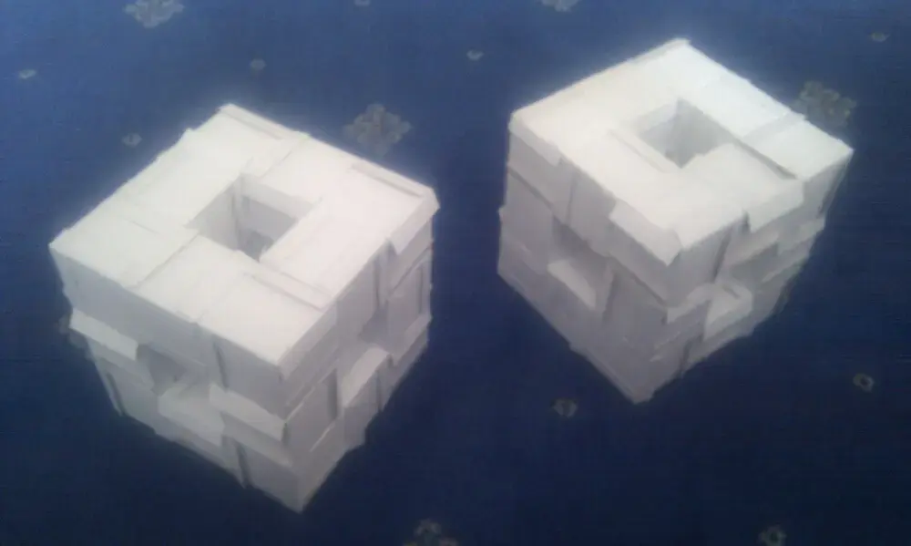
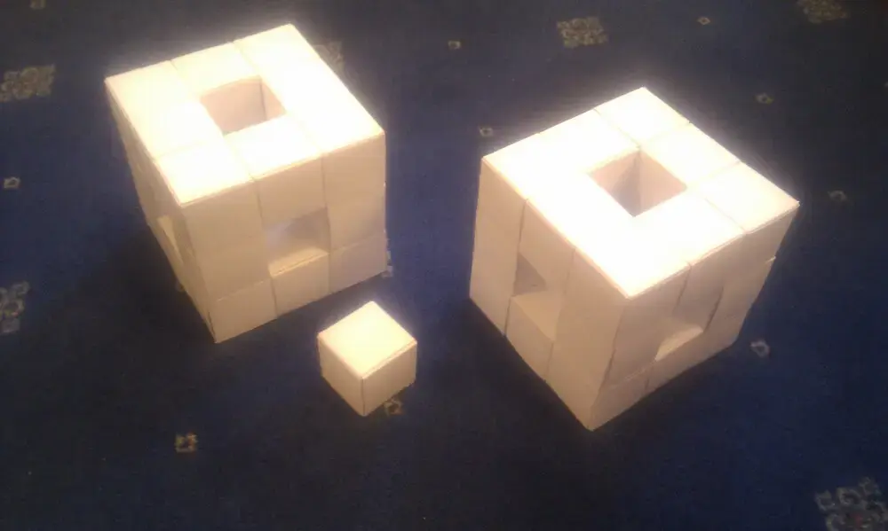
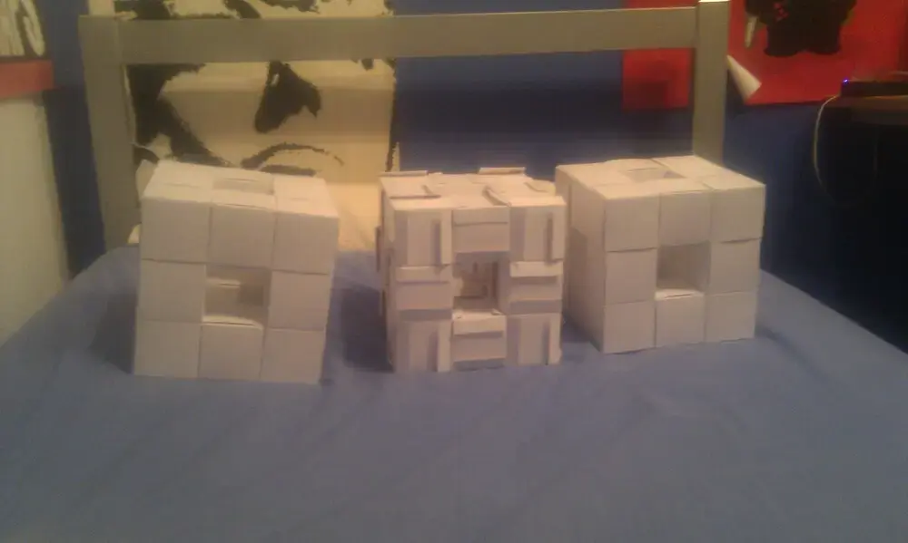
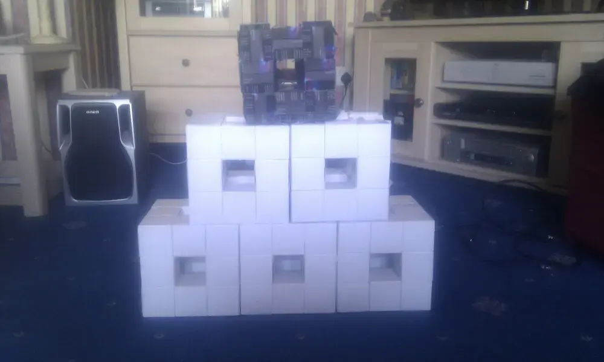

I'm supposed to be revising for my final year exams, and the Rubik's Cube isn't enough of a
distraction, apparently, so I've taken up the crafty mathsy hobby of constructing 3D fractals.

The [Menger Sponge](https://en.wikipedia.org/wiki/Menger_sponge) is a cube with a hole in the
middle, made up of smaller cubes, each with a hole in the middle. Depending on which way you look at
it, you either start with a cube and remove the hole, and repeat this forever, or you pick a level
of holiness (?) and build it with as many holes as would have been removed by now. Ok, I'm not
making sense.

<figure class="wp-block-image">

<figcaption>Menger sponge, levels 0 to 3</figcaption>
</figure>

There's not much fun in a level 0 menger sponge - this is simply a cube. But if we consider a cube
made up of 3x3 faces, like a Rubik's cube, and remove the centre square from each face, and hollow
it out, we get a quite near looking object. That's a stage 1 menger sponge.

The stage 1 is easy and fun to construct from uniform pieces of card, like train tickets or business
cards.

<figure class="wp-block-image">

<figcaption>Thank you to the train driver who gave me a handful of voided train tickets to pander to my nonsense</figcaption>
</figure>

The stage 2 (scaled up, where one stage 1 is used as a unit cube in a bigger object) is
significantly more work — we go from 20 cubes to 40 cubes, and from 120 cards to 2,400. I built
several stage 1 sponges from different types of cards — but didn't have enough to construct a stage
2 in full. So I just stacked them in a pyramid:

