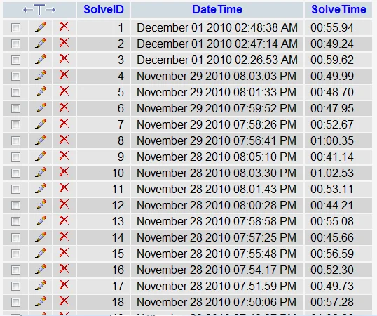
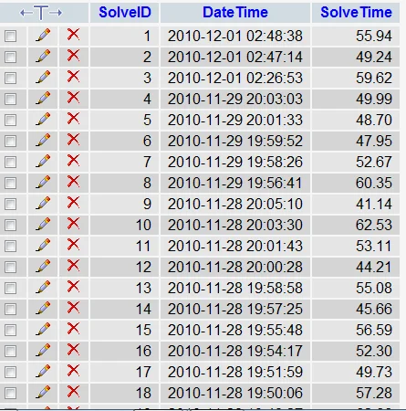
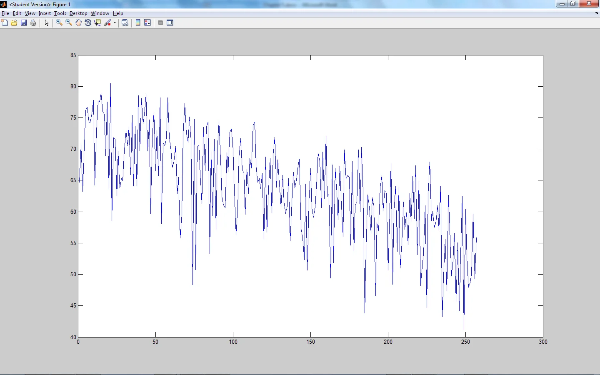
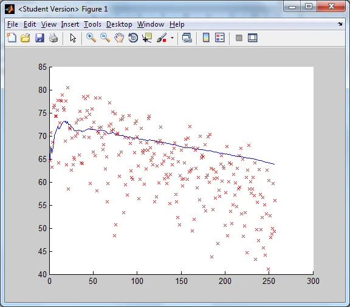

*This post is one of a series of articles adapted from my university dissertation on data
visualisation — see the [rest of the series](/blog/tags/datavis-project).*

Around the time I started this project I became an avid Rubik's Cube solver. I practised lots and used
to record my solve times using an Android app on my smartphone. One day I noticed that the app
developer had included the functionality for the user to export their saved data to a CSV file. I
exported mine, containing 257 solve times in the following format:

```
1,December 01 2010 02:48:38 AM,00:55.94
2,December 01 2010 02:47:14 AM,00:49.24
3,December 01 2010 02:26:53 AM,00:59.62
4,November 29 2010 08:03:03 PM,00:49.99
5,November 29 2010 08:01:33 PM,00:48.70
```

Although this particular date format wasn't standard, I knew it would be simple to convert to a
standard date/time format using PHP. I uploaded the CSV file to a database table:

<figure class="wp-block-image">

<figcaption>Database table 'Cubetimes' before reformatting of data</figcaption>
</figure>

Then I wrote a PHP script to convert the date/times to a more usable format, and to convert the solve
time MM:SS:mm format to just seconds and milliseconds (adding any minutes on as +60 seconds):

```
<?php
  if ($_GET['c'] == '1')
  {
    include ("../globals.php"); // connect to database
    $datetimes = mysql_query("
    SELECT *
    FROM Cubetimes
    ") or die('Error: ' . mysql_error());

    while ($row = mysql_fetch_assoc($datetimes))
    {
      $n = $row['SolveID'];
      $datetime = $row['DateTime'];
      $arr = explode(' ',$datetime);
      $time = explode(':',$arr['3']);
      if ($arr['4'] == 'PM' && $arr['3'] != 12) // if PM (and not 12 noon) convert to 24 hour
      {
        $arr['3'] = $time['0'] + 12;
      }
      else
      {
        $arr['3'] = $time['0'];
      }
      // Add remaining time variables (minutes and seconds) to the array
      $arr['4'] = $time['1'];
      $arr['5'] = $time['2'];
      // Convert month name to month number
      for ($i=1; $i<=12; $i++)
      {
        if (date("F", mktime(0, 0, 0, $i, 1, 0)) == $arr['0'])
        {
          $arr['0'] = $i;
          break;
        }
      }
      if (strlen($arr['0']) != 2)
      {
        $arr['0'] = "0" . $arr['0'];
      }
      // Convert to new date format YYYY-MM-DD HH:MM:SS
      $newdatetime = $arr['2'] . "-" . $arr['0'] . "-" . $arr['1'] . " " . $arr['3'] . ":" . $arr['4'] . ":" . $arr['5'];
      $update = mysql_query("
      UPDATE Cubetimes
      SET DateTime = '$newdatetime'
      WHERE SolveID = $n
      ") or die('Error: ' . mysql_error());
    }
    echo "$n times converted!<br />";

    $datetimes = mysql_query("
    SELECT *
    FROM Cubetimes
    ") or die('Error: ' . mysql_error());

    while ($row = mysql_fetch_assoc($datetimes))
    {
      $n = $row['SolveID'];
      $time = $row['SolveTime'];
      $arr2[$n][] = substr($time,0,2);
      $arr2[$n][] = substr($time,3,2);
      $arr2[$n][] = substr($time,6,2);
      $arr2[$n]['1'] = $arr2[$n]['1'] + 60 * $arr2[$n]['0'];
      $newtime = $arr2[$n]['1'] . "." . $arr2[$n]['2'];
      $update = mysql_query("
      UPDATE Cubetimes
      SET SolveTime = '$newtime'
      WHERE SolveID = $n
      ") or die('Error: ' . mysql_error());
    }
    echo "$n solve times converted!<br />";

    $changefieldtypes = mysql_query("
    ALTER TABLE Cubetimes
    CHANGE DateTime DateTime DATETIME NOT NULL,
    CHANGE SolveTime SolveTime DECIMAL(5,2) NOT NULL
    ") or die('Error: ' . mysql_error());
    echo "Field types altered!";
  }
  else
  {
    echo "You want to convert solve times? <a href='?c=1'>Yes</a>";
  }
?>
```

Once I had run this script the database contained properly formatted data:

<figure class="wp-block-image">

<figcaption>Formatted data in the database table 'Cubetimes'</figcaption>
</figure>

I then wrote a PHP script to extract this data from the database in a format I could put into MATLAB
and plot the results:

```
<?php
  include ("../globals.php");
  $solvetimes = mysql_query("
  SELECT SolveTime
  FROM Cubetimes
  ORDER BY SolveID DESC
  ") or die('Error: ' . mysql_error());

  while ($row = mysql_fetch_assoc($solvetimes))
  {
    echo $row['SolveTime'] . " ";
  }
  echo "<br /><br />";
?>
```

This output all the solve times in order (by date, descending) separated by a space, so I could copy
all the output data and enter it into a matrix in MATLAB, and plot to see a graph of my solve history:

<figure class="wp-block-image">

<figcaption>My solve history (257 solves)</figcaption>
</figure>

Then I adapted the script to calculate my "mean so far" (the average solve time at every given point):

```
$solvetimes = mysql_query("
SELECT SolveTime
FROM Cubetimes
ORDER BY SolveID DESC
") or die('Error: ' . mysql_error());

$times = array();
while ($row = mysql_fetch_assoc($solvetimes))
{
  $times[] = $row['SolveTime'];
}

$i = 0;
$cum = 0;
foreach ($times as $time)
{
  $i++;
  $cum = $cum + $time;
  $means[] = $cum/$i;
}
$means = implode(' ',$means);
echo "$means";
```

Then I plotted this alongside my actual solve times, scattered:

<figure class="wp-block-image">

<figcaption>My solve times (scattered red) over time, with moving average plotted in blue</figcaption>
</figure>
