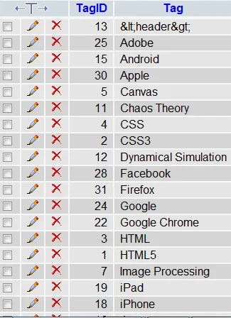
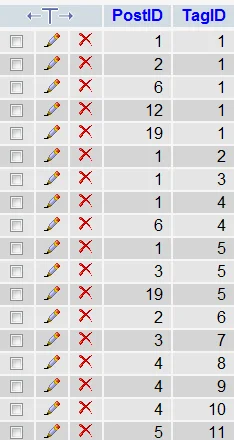

*This post is one of a series of articles adapted from my university dissertation on data
visualisation — see the [rest of the series](/blog/tags/datavis-project).*

Tag clouds are a great way of dynamically visualising the author-defined keyword content of a blog or
news feed. I created a system which would store tags linked to blog posts and display them at
different sizes according to the frequency of their appearance in the blog.

First of all I created the database tables. One to hold the list of all tags (new ones would be added
to this):

<figure class="wp-block-image">


<figcaption>Database tables 'Taglist' (left) and 'Tags' (right)</figcaption>
</figure>

The PHP script needed to scan the list of tags used and count how many times each one had been used,
and render some HTML giving each tag in a size proportionate to the number of posts that have been
tagged with it.

```
<?php
  include ("../globals.php"); // connect to database
  $count = mysql_query("
  SELECT TagID
  FROM Taglist
  ORDER BY TagID DESC
  LIMIT 1
  ") or die('Error: ' . mysql_error());
  $num = mysql_fetch_assoc($count);
  $num = $num['TagID'];

  for ($i=1; $i<=$num; $i++)
  {
    $tagcount = mysql_query("
    SELECT count(TagID) as count
    FROM Tags
    WHERE TagID = $i
    ") or die('Error: ' . mysql_error());
    $tag = mysql_fetch_assoc($tagcount);
    $tagsarray[$i]['Count'] = $tag['count'];

    $tagname = mysql_query("
    SELECT *
    FROM Taglist
    WHERE TagID = $i
    ") or die('Error: ' . mysql_error());
    $tag = mysql_fetch_assoc($tagname);
    $tagsarray[$i]['Tag'] = $tag['Tag'];
    $tagsarray[$i]['TagID'] = $tag['TagID'];
  }

  $max = 5;
  $min = 1;
  foreach ($tagsarray as $tag)
  {
    $size = round(10 + 30 * ($tag['Count'] - $min) / ($max - $min));
    echo "<a href='tags.php?tag=" . $tag['TagID'] . "'><span style='font-size:" . $size . "px;'>" . $tag['Tag'] . "</span></a> \n";
  }
?>
```

This rendered the following HTML:

```
<a href='tags.php?tag=1'><span style='font-size:40px;'>HTML5</span></a>
<a href='tags.php?tag=2'><span style='font-size:10px;'>CSS3</span></a>
<a href='tags.php?tag=3'><span style='font-size:10px;'>HTML</span></a>
<a href='tags.php?tag=4'><span style='font-size:18px;'>CSS</span></a>
<a href='tags.php?tag=5'><span style='font-size:25px;'>Canvas</span></a>
<a href='tags.php?tag=6'><span style='font-size:10px;'>JavaScript</span></a>
<a href='tags.php?tag=7'><span style='font-size:10px;'>Image Processing</span></a>
<a href='tags.php?tag=8'><span style='font-size:10px;'>MATLAB</span></a>

[abridged]
```

Which the browser rendered as:

<figure class="wp-block-image">

<figcaption>Rendered tags sized according to number of tags</figcaption>
</figure>
