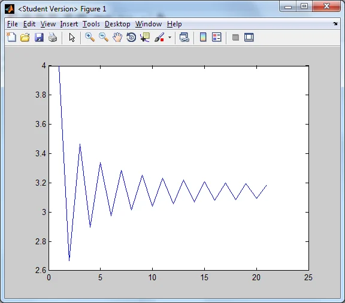
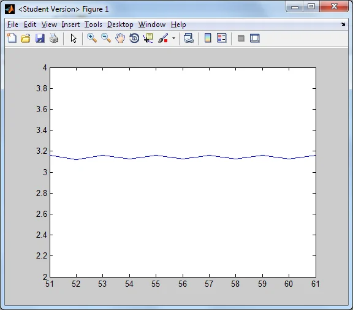
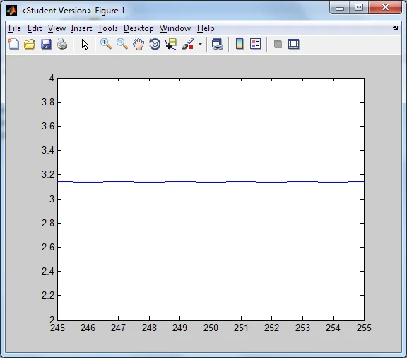

*This post is one of a series of articles adapted from my university dissertation on data
visualisation — see the [rest of the series](/blog/tags/datavis-project).*

Pi (π), the ratio of a circle's circumference to its diameter, is a mathematical phenomenon. It is
found in a massive variety of fields such as statistics, geometry, complex numbers, calculus and
physics. It is irrational, which means it cannot be expressed as the quotient of two whole numbers
(and therefore its decimal digits continue infinitely). Two fraction approximations are 22/7, which is
slightly larger than the exact value of π, and 355/113, which is somewhat more accurate but still
slightly larger than the true value.

<figure class="wp-block-image">

<figcaption>The symbol for Pi (the lower case Greek letter Pi: Π π)</figcaption>
</figure>

There are a number of methods to generate the stream of decimal digits in π. With a modern standard
computer it is fairly simple to write a program to calculate the digits. A formula I explored was
discovered by the German mathematician Gottfried Leibniz, whereby the value of a quarter of π could be
defined by the infinite series:

```
π/4 = 1 − 1/3 + 1/5 − 1/7 + 1/9 − ...
```

This can also be written as an infinite series using summation notation:

```
∑ (n=0 to ∞) [(−1)ⁿ / (2n + 1)] = π/4
```

Which can be formulated by proving that:

```
π/4 = arctan(1) = ∫₀¹ 1/(1 + x²) dx
```

And so I wrote a MATLAB program which ran iterations, giving a more accurate approximation for π on
each iteration. Note that to find π we can multiply both sides by 4.

```
p = 0;
i = 0;
while 1 == 1 % Infinite loop
  p = p + (4*((-1)^i))/(2*i + 1);
  fprintf('%7i Iterations: Pi is approximately equal to %1.16f...\n',i+1,p)
  i = i + 1;
end
```

This program printed the approximation generated after each iteration:

```
1 Iterations: Pi is approximately equal to 4.0000000000000000...
2 Iterations: Pi is approximately equal to 2.6666666666666670...
3 Iterations: Pi is approximately equal to 3.4666666666666668...
4 Iterations: Pi is approximately equal to 2.8952380952380956...
5 Iterations: Pi is approximately equal to 3.3396825396825403...
6 Iterations: Pi is approximately equal to 2.9760461760461765...
7 Iterations: Pi is approximately equal to 3.2837384837384844...
8 Iterations: Pi is approximately equal to 3.0170718170718178...
9 Iterations: Pi is approximately equal to 3.2523659347188767...
10 Iterations: Pi is approximately equal to 3.0418396189294032...
```

The first few iterations are very inaccurate. It takes 628 iterations to converge to 3.14 (2 decimal
places). An interesting visualisation is simply the printed lines of the approximations, as they are
printed to the screen in extremely quick succession, so you can literally see each digit in turn flick
between two values and then settle at the correct digit:

```
611 Iterations: Pi is approximately equal to 3.1432293137049125...
612 Iterations: Pi is approximately equal to 3.1399586677523370...
613 Iterations: Pi is approximately equal to 3.1432239738747860...
614 Iterations: Pi is approximately equal to 3.1399639901747047...
615 Iterations: Pi is approximately equal to 3.1432186687751931...
616 Iterations: Pi is approximately equal to 3.1399692780359567...
617 Iterations: Pi is approximately equal to 3.1432133980683981...
618 Iterations: Pi is approximately equal to 3.1399745316716370...
619 Iterations: Pi is approximately equal to 3.1432081614210308...
620 Iterations: Pi is approximately equal to 3.1399797514129597...
621 Iterations: Pi is approximately equal to 3.1432029585040153...
622 Iterations: Pi is approximately equal to 3.1399849375868794...
623 Iterations: Pi is approximately equal to 3.1431977889925018...
624 Iterations: Pi is approximately equal to 3.1399900905161586...
625 Iterations: Pi is approximately equal to 3.1431926525657983...
626 Iterations: Pi is approximately equal to 3.1399952105194355...
627 Iterations: Pi is approximately equal to 3.1431875489073047...
628 Iterations: Pi is approximately equal to 3.1400002979112887...
629 Iterations: Pi is approximately equal to 3.1431824777044470...
630 Iterations: Pi is approximately equal to 3.1400053530023024...
```

Notice how the second decimal place flicks between 3 and 4 before finally settling on 4. As you can
see, the value starts at 4 (too high), then subtracts 4/3 to land at 2.667 (too low), then adds 4/5 to
land on 3.467 (closer but still too high), then subtracts 4/7 to land on 2.895 (closer but still too
low), and so on, constantly adding too much on, then taking too much off, always getting closer. This
can be visualised by plotting a line going from iteration to approximation:

```
p = 0;
S = [];
for i = 0:20
  p = p + (4*((-1)^i))/(2*i + 1);
  S = [S p];
  plot(S)
  pause(0.1)
end
```

Which generates the plot:

<figure class="wp-block-image">

<figcaption>Iteration number vs. π approximation</figcaption>
</figure>

This gives a very good visualisation of how the Leibniz formula works, by adding on an amount, taking
off a smaller amount, then adding on a smaller amount, and taking off a smaller amount, getting ever
closer to the true value.

I also noticed that a better approximation could be made by taking an average after every 2
iterations:

```
(too high + too low) / 2 = about right
```

This "about right" value was always much closer, because we know that the value for π has to lie
somewhere in the middle of the last two approximations, due to the nature of the formulation method.
And the "about right" average will get much more accurate much quicker. I revised the program:

```
p = 0;
S = [];
i = 0;
while 1 == 1
  p = p + (4*((-1)^i))/(2*i + 1);
  if rem(i,2) == 0
    p1 = p;
    S = [S p1];
    try
      plot(length(S)-10:length(S),S(length(S)-10:end))
      axis([length(S)-10 length(S) 2 4])
      pause(0.1)
    end
  else
    p2 = p;
    S = [S p2];
    try
      plot(length(S)-10:length(S),S(length(S)-10:end))
      axis([length(S)-10 length(S) 2 4])
      pause(0.1)
    end
  end
  i = i + 1;
end
```

The iterations were now coming out as:

```
4.000000000000000
2.666666666666667
3.466666666666667
2.895238095238096
3.339682539682540
2.976046176046177
3.283738483738484
3.017071817071818
3.252365934718877
3.041839618929403
3.232315809405594
```

Which are obviously a lot more accurate more quickly. After 50 iterations the plot starts to lock in
on a much smaller margin between the upper and lower limit, and almost looks like a straight line
after 250 iterations:

<figure class="wp-block-image">


<figcaption>The convergence of π after 50–60 iterations (left) and after 245–255 iterations (right)</figcaption>
</figure>
