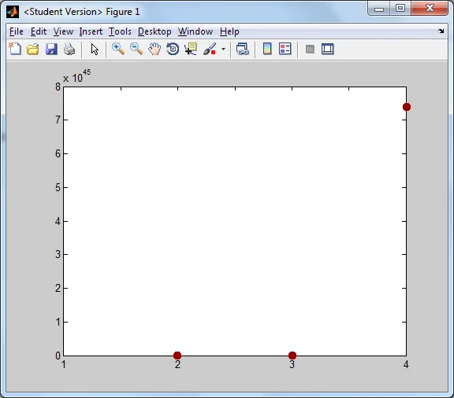
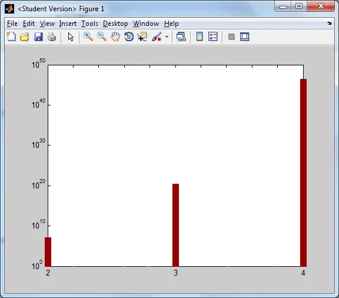
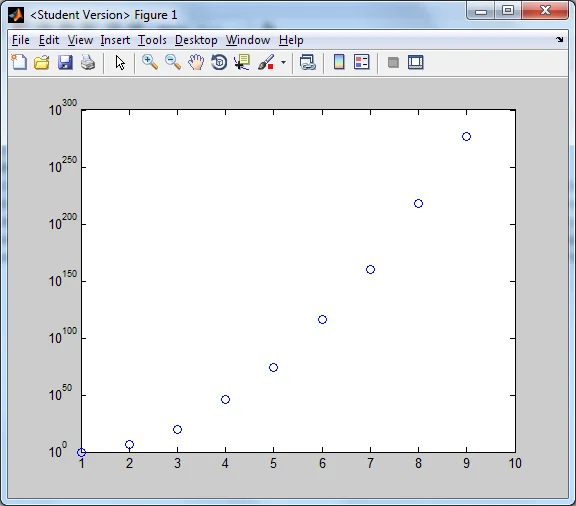
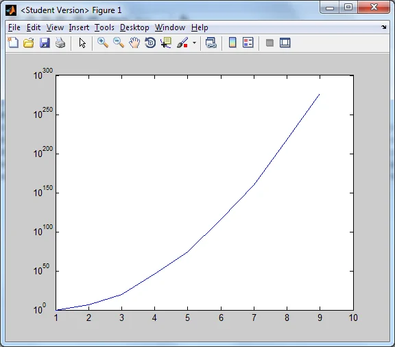

*This post is one of a series of articles adapted from my university dissertation on data
visualisation — see the [rest of the series](/blog/tags/datavis-project).*

School children are taught the order of the powers of ten the same way they are taught to count to
ten, say the alphabet or recite their times tables. There is barely a distinction between taking steps
of one in sequences such as counting from 1 to 10 and counting in steps of powers of ten (1, 10, 100,
1000...); in fact a lot of children tend to miss out the tens of thousands and hundreds of thousands
and seem to think that the hundreds become thousands and the thousands become millions — all because
they are seen to be the major milestones.

When talking about extremely large numbers, like the age of the universe (given by Wikipedia as 13.7
billion years, plus or minus 0.11 billion years), it's incredibly difficult to keep a sense of scale,
because the number is so large.

Somebody reciting a large number from vague memory could yield massive error ranges. "He won 32 or 3.2
million or something on the lottery" — a 28.8 million margin! Or: "Dinosaurs haven't been on Earth for
a million years." "Actually it's over 160 million years." A million years seems an eternity to most
people, so multiplying it by 160 doesn't have a significant impact — only scientifically is this
number actually important in its accuracy.

Rubik's Cubes (standard 3x3 cubes) are advertised as having "billions of combinations" when in actual
fact the number is significantly larger. It's calculated by:

```
8! × 3^7 × (12! / 2) × 2^11
```

This equals 43,252,003,274,489,856,000 (forty-three quintillion), which is 43 billion billion. If I
said a number was *x* billion you'd think it had to be big anyway — but the number of billions the
number actually is is over 43 billion times as big as 1 billion. That's how many billions it is. It's
an astonishingly huge number, especially for a small puzzle with 26 pieces! The next size cube up from
this, the 4x4, has 7,401,196,841,564,901,869,874,093,974,498,574,336,000,000,000 (7.4 quattuordecillion)
permutations, whereas the smaller 2x2 cube has 3,674,160.

A MATLAB plot of these three values is not an effective visualisation of the scale of comparison,
except that the 4x4 number is vastly larger than the other two — but that much is clear from the sheer
length in digits of the number!

<figure class="wp-block-image">

<figcaption>Plot of numbers of permutations by cube size</figcaption>
</figure>

This plot shows that the numbers of permutations on the 2x2 and 3x3 cubes are completely insignificant
in comparison to the 4x4. Since the y-axis has to go up to 8×10⁴⁵, the other numbers can't be
represented as they are smaller than can be seen on this scale.

However, if rather than plotting the actual values we plot what power of ten the number has to be
raised to, this is a much more measurable scale for vastly accelerating numbers. This practice is
called the log plot. There are a few variations: the log-log plot (log of x against log of y) for when
both sets of data are rising on the same scale; and the semi-log plot (log of one variable against the
actual number of the other). Here is a MATLAB semilog-y plot of the same data as the previous plot:

<figure class="wp-block-image">

<figcaption>Semi-log plot of numbers of permutations, given in powers of 10, by cube size</figcaption>
</figure>

<figure class="wp-block-image">



<figcaption>Semi-log plots of number of permutations by cube size (10x10 is beyond the scope of
MATLAB's memory)</figcaption>
</figure>

Getting the decimal point wrong when entering a customer's payment or transfer amount could cause huge
problems. A similar erroneous occurrence took place at an Asda petrol station recently, where customers
were granted cheap petrol (12.9p per litre) from a particular card payment pump. The fault was said to
have been due to the decimal place being put in the wrong place.

**So, what does 1 million look like?**

A way I like explaining the magnitude of large numbers is to show the difference between each power of
ten. To go from the 0th power of 10 to the 1st you must add 9, and so on:

| i (index or power) | 10^i           | Difference between current and previous |
| ------------------- | -------------- | ---------------------------------------- |
| 0                    | 1              | –                                         |
| 1                    | 10             | 9 = 9 × 10⁰                              |
| 2                    | 100            | 90 = 9 × 10¹                             |
| 3                    | 1,000          | 900 = 9 × 10²                            |
| 4                    | 10,000         | 9,000 = 9 × 10³                          |
| 5                    | 100,000        | 90,000 = 9 × 10⁴                         |
| 6                    | 1,000,000      | 900,000 = 9 × 10⁵                        |
| 7                    | 10,000,000     | 9,000,000 = 9 × 10⁶                      |
| 8                    | 100,000,000    | 90,000,000 = 9 × 10⁷                     |
| 9                    | 1,000,000,000  | 900,000,000 = 9 × 10⁸                    |
| 10                   | 10,000,000,000 | 9,000,000,000 = 9 × 10⁹                  |

On each iteration the new number is 10 times as big, obviously, but it is also 90% larger than the
previous number. For example, if a child has been saving up pennies for a month and at one point has
enough to say he has a whole pound, and is then given £10, this makes all the pennies he put towards
the pound somewhat insignificant because the £10 is so much more in comparison.

The way I explain the magnitude of increasing powers of ten is by starting with a single object — I'll
refer to it as a unit. To help visualise this, try to think of this unit as a real object, something
rather small, like a pound coin or a tennis ball.

In dimensional terms this unit — considered to have no width, height or depth, just a single unifying
point in space — has no dimension. No x, no y, no z.

<figure class="wp-block-image">
<svg viewBox="0 0 24 24" width="24" height="24" style="max-width:100%;height:auto;" xmlns="http://www.w3.org/2000/svg" role="img" aria-label="A single unit">
  <rect x="4" y="4" width="16" height="16" rx="3" fill="var(--accent)" />
</svg>
<figcaption>1 unit</figcaption>
</figure>

If we want to see 10 of these, we simply make a line of 10. We've had to obtain 9 additional units to
get here. This is a 1-dimensional line of points.

<figure class="wp-block-image">
<svg viewBox="0 0 204 24" width="204" height="24" style="max-width:100%;height:auto;" xmlns="http://www.w3.org/2000/svg" role="img" aria-label="A line of 10 units">
  <rect x="4" y="4" width="16" height="16" rx="3" fill="var(--accent)" />
  <rect x="24" y="4" width="16" height="16" rx="3" fill="var(--accent)" />
  <rect x="44" y="4" width="16" height="16" rx="3" fill="var(--accent)" />
  <rect x="64" y="4" width="16" height="16" rx="3" fill="var(--accent)" />
  <rect x="84" y="4" width="16" height="16" rx="3" fill="var(--accent)" />
  <rect x="104" y="4" width="16" height="16" rx="3" fill="var(--accent)" />
  <rect x="124" y="4" width="16" height="16" rx="3" fill="var(--accent)" />
  <rect x="144" y="4" width="16" height="16" rx="3" fill="var(--accent)" />
  <rect x="164" y="4" width="16" height="16" rx="3" fill="var(--accent)" />
  <rect x="184" y="4" width="16" height="16" rx="3" fill="var(--accent)" />
</svg>
<figcaption>10 units</figcaption>
</figure>

If we want to see 100 of these we must obtain an additional 90 (9 more lines of 10 units), which makes
a 10x10 square containing 100 units. This represents two dimensions of space, as it now exists in the
x and y plane.

<figure class="wp-block-image">
<svg viewBox="0 0 204 204" width="204" height="204" style="max-width:220px;width:100%;height:auto;" xmlns="http://www.w3.org/2000/svg" role="img" aria-label="A 10 by 10 square of 100 units">
  <rect x="4" y="4" width="16" height="16" rx="3" fill="var(--accent)" />
  <rect x="24" y="4" width="16" height="16" rx="3" fill="var(--accent)" />
  <rect x="44" y="4" width="16" height="16" rx="3" fill="var(--accent)" />
  <rect x="64" y="4" width="16" height="16" rx="3" fill="var(--accent)" />
  <rect x="84" y="4" width="16" height="16" rx="3" fill="var(--accent)" />
  <rect x="104" y="4" width="16" height="16" rx="3" fill="var(--accent)" />
  <rect x="124" y="4" width="16" height="16" rx="3" fill="var(--accent)" />
  <rect x="144" y="4" width="16" height="16" rx="3" fill="var(--accent)" />
  <rect x="164" y="4" width="16" height="16" rx="3" fill="var(--accent)" />
  <rect x="184" y="4" width="16" height="16" rx="3" fill="var(--accent)" />
  <rect x="4" y="24" width="16" height="16" rx="3" fill="var(--accent)" />
  <rect x="24" y="24" width="16" height="16" rx="3" fill="var(--accent)" />
  <rect x="44" y="24" width="16" height="16" rx="3" fill="var(--accent)" />
  <rect x="64" y="24" width="16" height="16" rx="3" fill="var(--accent)" />
  <rect x="84" y="24" width="16" height="16" rx="3" fill="var(--accent)" />
  <rect x="104" y="24" width="16" height="16" rx="3" fill="var(--accent)" />
  <rect x="124" y="24" width="16" height="16" rx="3" fill="var(--accent)" />
  <rect x="144" y="24" width="16" height="16" rx="3" fill="var(--accent)" />
  <rect x="164" y="24" width="16" height="16" rx="3" fill="var(--accent)" />
  <rect x="184" y="24" width="16" height="16" rx="3" fill="var(--accent)" />
  <rect x="4" y="44" width="16" height="16" rx="3" fill="var(--accent)" />
  <rect x="24" y="44" width="16" height="16" rx="3" fill="var(--accent)" />
  <rect x="44" y="44" width="16" height="16" rx="3" fill="var(--accent)" />
  <rect x="64" y="44" width="16" height="16" rx="3" fill="var(--accent)" />
  <rect x="84" y="44" width="16" height="16" rx="3" fill="var(--accent)" />
  <rect x="104" y="44" width="16" height="16" rx="3" fill="var(--accent)" />
  <rect x="124" y="44" width="16" height="16" rx="3" fill="var(--accent)" />
  <rect x="144" y="44" width="16" height="16" rx="3" fill="var(--accent)" />
  <rect x="164" y="44" width="16" height="16" rx="3" fill="var(--accent)" />
  <rect x="184" y="44" width="16" height="16" rx="3" fill="var(--accent)" />
  <rect x="4" y="64" width="16" height="16" rx="3" fill="var(--accent)" />
  <rect x="24" y="64" width="16" height="16" rx="3" fill="var(--accent)" />
  <rect x="44" y="64" width="16" height="16" rx="3" fill="var(--accent)" />
  <rect x="64" y="64" width="16" height="16" rx="3" fill="var(--accent)" />
  <rect x="84" y="64" width="16" height="16" rx="3" fill="var(--accent)" />
  <rect x="104" y="64" width="16" height="16" rx="3" fill="var(--accent)" />
  <rect x="124" y="64" width="16" height="16" rx="3" fill="var(--accent)" />
  <rect x="144" y="64" width="16" height="16" rx="3" fill="var(--accent)" />
  <rect x="164" y="64" width="16" height="16" rx="3" fill="var(--accent)" />
  <rect x="184" y="64" width="16" height="16" rx="3" fill="var(--accent)" />
  <rect x="4" y="84" width="16" height="16" rx="3" fill="var(--accent)" />
  <rect x="24" y="84" width="16" height="16" rx="3" fill="var(--accent)" />
  <rect x="44" y="84" width="16" height="16" rx="3" fill="var(--accent)" />
  <rect x="64" y="84" width="16" height="16" rx="3" fill="var(--accent)" />
  <rect x="84" y="84" width="16" height="16" rx="3" fill="var(--accent)" />
  <rect x="104" y="84" width="16" height="16" rx="3" fill="var(--accent)" />
  <rect x="124" y="84" width="16" height="16" rx="3" fill="var(--accent)" />
  <rect x="144" y="84" width="16" height="16" rx="3" fill="var(--accent)" />
  <rect x="164" y="84" width="16" height="16" rx="3" fill="var(--accent)" />
  <rect x="184" y="84" width="16" height="16" rx="3" fill="var(--accent)" />
  <rect x="4" y="104" width="16" height="16" rx="3" fill="var(--accent)" />
  <rect x="24" y="104" width="16" height="16" rx="3" fill="var(--accent)" />
  <rect x="44" y="104" width="16" height="16" rx="3" fill="var(--accent)" />
  <rect x="64" y="104" width="16" height="16" rx="3" fill="var(--accent)" />
  <rect x="84" y="104" width="16" height="16" rx="3" fill="var(--accent)" />
  <rect x="104" y="104" width="16" height="16" rx="3" fill="var(--accent)" />
  <rect x="124" y="104" width="16" height="16" rx="3" fill="var(--accent)" />
  <rect x="144" y="104" width="16" height="16" rx="3" fill="var(--accent)" />
  <rect x="164" y="104" width="16" height="16" rx="3" fill="var(--accent)" />
  <rect x="184" y="104" width="16" height="16" rx="3" fill="var(--accent)" />
  <rect x="4" y="124" width="16" height="16" rx="3" fill="var(--accent)" />
  <rect x="24" y="124" width="16" height="16" rx="3" fill="var(--accent)" />
  <rect x="44" y="124" width="16" height="16" rx="3" fill="var(--accent)" />
  <rect x="64" y="124" width="16" height="16" rx="3" fill="var(--accent)" />
  <rect x="84" y="124" width="16" height="16" rx="3" fill="var(--accent)" />
  <rect x="104" y="124" width="16" height="16" rx="3" fill="var(--accent)" />
  <rect x="124" y="124" width="16" height="16" rx="3" fill="var(--accent)" />
  <rect x="144" y="124" width="16" height="16" rx="3" fill="var(--accent)" />
  <rect x="164" y="124" width="16" height="16" rx="3" fill="var(--accent)" />
  <rect x="184" y="124" width="16" height="16" rx="3" fill="var(--accent)" />
  <rect x="4" y="144" width="16" height="16" rx="3" fill="var(--accent)" />
  <rect x="24" y="144" width="16" height="16" rx="3" fill="var(--accent)" />
  <rect x="44" y="144" width="16" height="16" rx="3" fill="var(--accent)" />
  <rect x="64" y="144" width="16" height="16" rx="3" fill="var(--accent)" />
  <rect x="84" y="144" width="16" height="16" rx="3" fill="var(--accent)" />
  <rect x="104" y="144" width="16" height="16" rx="3" fill="var(--accent)" />
  <rect x="124" y="144" width="16" height="16" rx="3" fill="var(--accent)" />
  <rect x="144" y="144" width="16" height="16" rx="3" fill="var(--accent)" />
  <rect x="164" y="144" width="16" height="16" rx="3" fill="var(--accent)" />
  <rect x="184" y="144" width="16" height="16" rx="3" fill="var(--accent)" />
  <rect x="4" y="164" width="16" height="16" rx="3" fill="var(--accent)" />
  <rect x="24" y="164" width="16" height="16" rx="3" fill="var(--accent)" />
  <rect x="44" y="164" width="16" height="16" rx="3" fill="var(--accent)" />
  <rect x="64" y="164" width="16" height="16" rx="3" fill="var(--accent)" />
  <rect x="84" y="164" width="16" height="16" rx="3" fill="var(--accent)" />
  <rect x="104" y="164" width="16" height="16" rx="3" fill="var(--accent)" />
  <rect x="124" y="164" width="16" height="16" rx="3" fill="var(--accent)" />
  <rect x="144" y="164" width="16" height="16" rx="3" fill="var(--accent)" />
  <rect x="164" y="164" width="16" height="16" rx="3" fill="var(--accent)" />
  <rect x="184" y="164" width="16" height="16" rx="3" fill="var(--accent)" />
  <rect x="4" y="184" width="16" height="16" rx="3" fill="var(--accent)" />
  <rect x="24" y="184" width="16" height="16" rx="3" fill="var(--accent)" />
  <rect x="44" y="184" width="16" height="16" rx="3" fill="var(--accent)" />
  <rect x="64" y="184" width="16" height="16" rx="3" fill="var(--accent)" />
  <rect x="84" y="184" width="16" height="16" rx="3" fill="var(--accent)" />
  <rect x="104" y="184" width="16" height="16" rx="3" fill="var(--accent)" />
  <rect x="124" y="184" width="16" height="16" rx="3" fill="var(--accent)" />
  <rect x="144" y="184" width="16" height="16" rx="3" fill="var(--accent)" />
  <rect x="164" y="184" width="16" height="16" rx="3" fill="var(--accent)" />
  <rect x="184" y="184" width="16" height="16" rx="3" fill="var(--accent)" />
</svg>
<figcaption>100 units</figcaption>
</figure>

If we want to see what 10 of these squares looks like, we must obtain 9 more squares of squares like
this one and lay them on top of the original square in the third dimension (the z plane):

<figure class="wp-block-image">
<svg viewBox="0 0 285 328" width="285" height="328" style="max-width:220px;width:100%;height:auto;" xmlns="http://www.w3.org/2000/svg" role="img" aria-label="A cube representing 1,000 units">
<defs>
  <symbol id="cube-1000" viewBox="-138.56 -160.00 277.13 320.00">
    <polygon points="0.00,-160.00 138.56,-80.00 138.56,80.00 0.00,160.00 -138.56,80.00 -138.56,-80.00" fill="var(--accent)" fill-opacity="0.85" />
    <g stroke="var(--bg)" stroke-width="1" stroke-opacity="0.55">
    <line x1="0.00" y1="-160.00" x2="-138.56" y2="-80.00" />
    <line x1="0.00" y1="-160.00" x2="138.56" y2="-80.00" />
    <line x1="138.56" y1="80.00" x2="138.56" y2="-80.00" />
    <line x1="138.56" y1="80.00" x2="0.00" y2="160.00" />
    <line x1="-138.56" y1="80.00" x2="-138.56" y2="-80.00" />
    <line x1="-138.56" y1="80.00" x2="0.00" y2="160.00" />
    <line x1="13.86" y1="-152.00" x2="-124.71" y2="-72.00" />
    <line x1="-13.86" y1="-152.00" x2="124.71" y2="-72.00" />
    <line x1="124.71" y1="88.00" x2="124.71" y2="-72.00" />
    <line x1="138.56" y1="64.00" x2="0.00" y2="144.00" />
    <line x1="-124.71" y1="88.00" x2="-124.71" y2="-72.00" />
    <line x1="-138.56" y1="64.00" x2="0.00" y2="144.00" />
    <line x1="27.71" y1="-144.00" x2="-110.85" y2="-64.00" />
    <line x1="-27.71" y1="-144.00" x2="110.85" y2="-64.00" />
    <line x1="110.85" y1="96.00" x2="110.85" y2="-64.00" />
    <line x1="138.56" y1="48.00" x2="0.00" y2="128.00" />
    <line x1="-110.85" y1="96.00" x2="-110.85" y2="-64.00" />
    <line x1="-138.56" y1="48.00" x2="0.00" y2="128.00" />
    <line x1="41.57" y1="-136.00" x2="-96.99" y2="-56.00" />
    <line x1="-41.57" y1="-136.00" x2="96.99" y2="-56.00" />
    <line x1="96.99" y1="104.00" x2="96.99" y2="-56.00" />
    <line x1="138.56" y1="32.00" x2="0.00" y2="112.00" />
    <line x1="-96.99" y1="104.00" x2="-96.99" y2="-56.00" />
    <line x1="-138.56" y1="32.00" x2="0.00" y2="112.00" />
    <line x1="55.43" y1="-128.00" x2="-83.14" y2="-48.00" />
    <line x1="-55.43" y1="-128.00" x2="83.14" y2="-48.00" />
    <line x1="83.14" y1="112.00" x2="83.14" y2="-48.00" />
    <line x1="138.56" y1="16.00" x2="0.00" y2="96.00" />
    <line x1="-83.14" y1="112.00" x2="-83.14" y2="-48.00" />
    <line x1="-138.56" y1="16.00" x2="0.00" y2="96.00" />
    <line x1="69.28" y1="-120.00" x2="-69.28" y2="-40.00" />
    <line x1="-69.28" y1="-120.00" x2="69.28" y2="-40.00" />
    <line x1="69.28" y1="120.00" x2="69.28" y2="-40.00" />
    <line x1="138.56" y1="-0.00" x2="0.00" y2="80.00" />
    <line x1="-69.28" y1="120.00" x2="-69.28" y2="-40.00" />
    <line x1="-138.56" y1="-0.00" x2="0.00" y2="80.00" />
    <line x1="83.14" y1="-112.00" x2="-55.43" y2="-32.00" />
    <line x1="-83.14" y1="-112.00" x2="55.43" y2="-32.00" />
    <line x1="55.43" y1="128.00" x2="55.43" y2="-32.00" />
    <line x1="138.56" y1="-16.00" x2="0.00" y2="64.00" />
    <line x1="-55.43" y1="128.00" x2="-55.43" y2="-32.00" />
    <line x1="-138.56" y1="-16.00" x2="0.00" y2="64.00" />
    <line x1="96.99" y1="-104.00" x2="-41.57" y2="-24.00" />
    <line x1="-96.99" y1="-104.00" x2="41.57" y2="-24.00" />
    <line x1="41.57" y1="136.00" x2="41.57" y2="-24.00" />
    <line x1="138.56" y1="-32.00" x2="0.00" y2="48.00" />
    <line x1="-41.57" y1="136.00" x2="-41.57" y2="-24.00" />
    <line x1="-138.56" y1="-32.00" x2="0.00" y2="48.00" />
    <line x1="110.85" y1="-96.00" x2="-27.71" y2="-16.00" />
    <line x1="-110.85" y1="-96.00" x2="27.71" y2="-16.00" />
    <line x1="27.71" y1="144.00" x2="27.71" y2="-16.00" />
    <line x1="138.56" y1="-48.00" x2="0.00" y2="32.00" />
    <line x1="-27.71" y1="144.00" x2="-27.71" y2="-16.00" />
    <line x1="-138.56" y1="-48.00" x2="0.00" y2="32.00" />
    <line x1="124.71" y1="-88.00" x2="-13.86" y2="-8.00" />
    <line x1="-124.71" y1="-88.00" x2="13.86" y2="-8.00" />
    <line x1="13.86" y1="152.00" x2="13.86" y2="-8.00" />
    <line x1="138.56" y1="-64.00" x2="0.00" y2="16.00" />
    <line x1="-13.86" y1="152.00" x2="-13.86" y2="-8.00" />
    <line x1="-138.56" y1="-64.00" x2="0.00" y2="16.00" />
    <line x1="138.56" y1="-80.00" x2="0.00" y2="-0.00" />
    <line x1="-138.56" y1="-80.00" x2="0.00" y2="-0.00" />
    <line x1="0.00" y1="160.00" x2="0.00" y2="-0.00" />
    <line x1="138.56" y1="-80.00" x2="0.00" y2="-0.00" />
    <line x1="0.00" y1="160.00" x2="0.00" y2="-0.00" />
    <line x1="-138.56" y1="-80.00" x2="0.00" y2="-0.00" />
    </g>
  </symbol>
</defs>
<use href="#cube-1000" x="4.0" y="4.0" width="277" height="320" />
</svg>
<figcaption>A cube of 10×10×10 units — 1,000 units</figcaption>
</figure>

This 3-dimensional array of arrays of units contains 1,000 of the original units — I'll call this the
cube. Note that we had to obtain a further 9 sets of squares of 100 to get this. As seen previously, to
get from 100 to 1,000 we multiplied by ten, but another way of looking at it is that we added 900. Now
if we treat our cube as a single point in a fourth, conceptual dimension, which has the same
properties as the dimension in which we started — to get from that dimension to the first, we created
a line of 10 single points. Likewise, if we line ten 3D cubes up to make a "4D line", we get a line of
10 stacks of cubes of squares of rows of units:

<figure class="wp-block-image">
<svg viewBox="0 0 405 48" width="405" height="48" style="max-width:260px;width:100%;height:auto;" xmlns="http://www.w3.org/2000/svg" role="img" aria-label="A row of 10 cubes, each representing 1,000 units — 10,000 in total">
<defs>
  <symbol id="cube-10000" viewBox="-17.32 -20.00 34.64 40.00">
    <polygon points="0.00,-20.00 17.32,-10.00 17.32,10.00 0.00,20.00 -17.32,10.00 -17.32,-10.00" fill="var(--accent)" fill-opacity="0.85" />
    <g stroke="var(--bg)" stroke-width="1" stroke-opacity="0.55">
    <line x1="0.00" y1="-20.00" x2="-17.32" y2="-10.00" />
    <line x1="0.00" y1="-20.00" x2="17.32" y2="-10.00" />
    <line x1="17.32" y1="10.00" x2="17.32" y2="-10.00" />
    <line x1="17.32" y1="10.00" x2="0.00" y2="20.00" />
    <line x1="-17.32" y1="10.00" x2="-17.32" y2="-10.00" />
    <line x1="-17.32" y1="10.00" x2="0.00" y2="20.00" />
    <line x1="8.66" y1="-15.00" x2="-8.66" y2="-5.00" />
    <line x1="-8.66" y1="-15.00" x2="8.66" y2="-5.00" />
    <line x1="8.66" y1="15.00" x2="8.66" y2="-5.00" />
    <line x1="17.32" y1="-0.00" x2="0.00" y2="10.00" />
    <line x1="-8.66" y1="15.00" x2="-8.66" y2="-5.00" />
    <line x1="-17.32" y1="-0.00" x2="0.00" y2="10.00" />
    <line x1="17.32" y1="-10.00" x2="0.00" y2="-0.00" />
    <line x1="-17.32" y1="-10.00" x2="0.00" y2="-0.00" />
    <line x1="0.00" y1="20.00" x2="0.00" y2="-0.00" />
    <line x1="17.32" y1="-10.00" x2="0.00" y2="-0.00" />
    <line x1="0.00" y1="20.00" x2="0.00" y2="-0.00" />
    <line x1="-17.32" y1="-10.00" x2="0.00" y2="-0.00" />
    </g>
  </symbol>
</defs>
<use href="#cube-10000" x="4.0" y="4.0" width="34.6" height="40.0" />
<use href="#cube-10000" x="44.2" y="4.0" width="34.6" height="40.0" />
<use href="#cube-10000" x="84.5" y="4.0" width="34.6" height="40.0" />
<use href="#cube-10000" x="124.7" y="4.0" width="34.6" height="40.0" />
<use href="#cube-10000" x="165.0" y="4.0" width="34.6" height="40.0" />
<use href="#cube-10000" x="205.2" y="4.0" width="34.6" height="40.0" />
<use href="#cube-10000" x="245.4" y="4.0" width="34.6" height="40.0" />
<use href="#cube-10000" x="285.7" y="4.0" width="34.6" height="40.0" />
<use href="#cube-10000" x="325.9" y="4.0" width="34.6" height="40.0" />
<use href="#cube-10000" x="366.2" y="4.0" width="34.6" height="40.0" />
</svg>
<figcaption>A line of ten 1,000-cubes — 10,000 units</figcaption>
</figure>

Next, we make 10 of these rows of cubes to get a square of 100 cubes, each one worth 1,000 units,
giving us 100,000 in total:

<figure class="wp-block-image">
<svg viewBox="0 0 405 458" width="405" height="458" style="max-width:260px;width:100%;height:auto;" xmlns="http://www.w3.org/2000/svg" role="img" aria-label="A 10 by 10 grid of cubes, each representing 1,000 units — 100,000 in total">
<defs>
  <symbol id="cube-100000" viewBox="-17.32 -20.00 34.64 40.00">
    <polygon points="0.00,-20.00 17.32,-10.00 17.32,10.00 0.00,20.00 -17.32,10.00 -17.32,-10.00" fill="var(--accent)" fill-opacity="0.85" />
    <g stroke="var(--bg)" stroke-width="1" stroke-opacity="0.55">
    <line x1="0.00" y1="-20.00" x2="-17.32" y2="-10.00" />
    <line x1="0.00" y1="-20.00" x2="17.32" y2="-10.00" />
    <line x1="17.32" y1="10.00" x2="17.32" y2="-10.00" />
    <line x1="17.32" y1="10.00" x2="0.00" y2="20.00" />
    <line x1="-17.32" y1="10.00" x2="-17.32" y2="-10.00" />
    <line x1="-17.32" y1="10.00" x2="0.00" y2="20.00" />
    <line x1="8.66" y1="-15.00" x2="-8.66" y2="-5.00" />
    <line x1="-8.66" y1="-15.00" x2="8.66" y2="-5.00" />
    <line x1="8.66" y1="15.00" x2="8.66" y2="-5.00" />
    <line x1="17.32" y1="-0.00" x2="0.00" y2="10.00" />
    <line x1="-8.66" y1="15.00" x2="-8.66" y2="-5.00" />
    <line x1="-17.32" y1="-0.00" x2="0.00" y2="10.00" />
    <line x1="17.32" y1="-10.00" x2="0.00" y2="-0.00" />
    <line x1="-17.32" y1="-10.00" x2="0.00" y2="-0.00" />
    <line x1="0.00" y1="20.00" x2="0.00" y2="-0.00" />
    <line x1="17.32" y1="-10.00" x2="0.00" y2="-0.00" />
    <line x1="0.00" y1="20.00" x2="0.00" y2="-0.00" />
    <line x1="-17.32" y1="-10.00" x2="0.00" y2="-0.00" />
    </g>
  </symbol>
</defs>
<use href="#cube-100000" x="4.0" y="4.0" width="34.6" height="40.0" />
<use href="#cube-100000" x="44.2" y="4.0" width="34.6" height="40.0" />
<use href="#cube-100000" x="84.5" y="4.0" width="34.6" height="40.0" />
<use href="#cube-100000" x="124.7" y="4.0" width="34.6" height="40.0" />
<use href="#cube-100000" x="165.0" y="4.0" width="34.6" height="40.0" />
<use href="#cube-100000" x="205.2" y="4.0" width="34.6" height="40.0" />
<use href="#cube-100000" x="245.4" y="4.0" width="34.6" height="40.0" />
<use href="#cube-100000" x="285.7" y="4.0" width="34.6" height="40.0" />
<use href="#cube-100000" x="325.9" y="4.0" width="34.6" height="40.0" />
<use href="#cube-100000" x="366.2" y="4.0" width="34.6" height="40.0" />
<use href="#cube-100000" x="4.0" y="49.6" width="34.6" height="40.0" />
<use href="#cube-100000" x="44.2" y="49.6" width="34.6" height="40.0" />
<use href="#cube-100000" x="84.5" y="49.6" width="34.6" height="40.0" />
<use href="#cube-100000" x="124.7" y="49.6" width="34.6" height="40.0" />
<use href="#cube-100000" x="165.0" y="49.6" width="34.6" height="40.0" />
<use href="#cube-100000" x="205.2" y="49.6" width="34.6" height="40.0" />
<use href="#cube-100000" x="245.4" y="49.6" width="34.6" height="40.0" />
<use href="#cube-100000" x="285.7" y="49.6" width="34.6" height="40.0" />
<use href="#cube-100000" x="325.9" y="49.6" width="34.6" height="40.0" />
<use href="#cube-100000" x="366.2" y="49.6" width="34.6" height="40.0" />
<use href="#cube-100000" x="4.0" y="95.2" width="34.6" height="40.0" />
<use href="#cube-100000" x="44.2" y="95.2" width="34.6" height="40.0" />
<use href="#cube-100000" x="84.5" y="95.2" width="34.6" height="40.0" />
<use href="#cube-100000" x="124.7" y="95.2" width="34.6" height="40.0" />
<use href="#cube-100000" x="165.0" y="95.2" width="34.6" height="40.0" />
<use href="#cube-100000" x="205.2" y="95.2" width="34.6" height="40.0" />
<use href="#cube-100000" x="245.4" y="95.2" width="34.6" height="40.0" />
<use href="#cube-100000" x="285.7" y="95.2" width="34.6" height="40.0" />
<use href="#cube-100000" x="325.9" y="95.2" width="34.6" height="40.0" />
<use href="#cube-100000" x="366.2" y="95.2" width="34.6" height="40.0" />
<use href="#cube-100000" x="4.0" y="140.8" width="34.6" height="40.0" />
<use href="#cube-100000" x="44.2" y="140.8" width="34.6" height="40.0" />
<use href="#cube-100000" x="84.5" y="140.8" width="34.6" height="40.0" />
<use href="#cube-100000" x="124.7" y="140.8" width="34.6" height="40.0" />
<use href="#cube-100000" x="165.0" y="140.8" width="34.6" height="40.0" />
<use href="#cube-100000" x="205.2" y="140.8" width="34.6" height="40.0" />
<use href="#cube-100000" x="245.4" y="140.8" width="34.6" height="40.0" />
<use href="#cube-100000" x="285.7" y="140.8" width="34.6" height="40.0" />
<use href="#cube-100000" x="325.9" y="140.8" width="34.6" height="40.0" />
<use href="#cube-100000" x="366.2" y="140.8" width="34.6" height="40.0" />
<use href="#cube-100000" x="4.0" y="186.4" width="34.6" height="40.0" />
<use href="#cube-100000" x="44.2" y="186.4" width="34.6" height="40.0" />
<use href="#cube-100000" x="84.5" y="186.4" width="34.6" height="40.0" />
<use href="#cube-100000" x="124.7" y="186.4" width="34.6" height="40.0" />
<use href="#cube-100000" x="165.0" y="186.4" width="34.6" height="40.0" />
<use href="#cube-100000" x="205.2" y="186.4" width="34.6" height="40.0" />
<use href="#cube-100000" x="245.4" y="186.4" width="34.6" height="40.0" />
<use href="#cube-100000" x="285.7" y="186.4" width="34.6" height="40.0" />
<use href="#cube-100000" x="325.9" y="186.4" width="34.6" height="40.0" />
<use href="#cube-100000" x="366.2" y="186.4" width="34.6" height="40.0" />
<use href="#cube-100000" x="4.0" y="232.0" width="34.6" height="40.0" />
<use href="#cube-100000" x="44.2" y="232.0" width="34.6" height="40.0" />
<use href="#cube-100000" x="84.5" y="232.0" width="34.6" height="40.0" />
<use href="#cube-100000" x="124.7" y="232.0" width="34.6" height="40.0" />
<use href="#cube-100000" x="165.0" y="232.0" width="34.6" height="40.0" />
<use href="#cube-100000" x="205.2" y="232.0" width="34.6" height="40.0" />
<use href="#cube-100000" x="245.4" y="232.0" width="34.6" height="40.0" />
<use href="#cube-100000" x="285.7" y="232.0" width="34.6" height="40.0" />
<use href="#cube-100000" x="325.9" y="232.0" width="34.6" height="40.0" />
<use href="#cube-100000" x="366.2" y="232.0" width="34.6" height="40.0" />
<use href="#cube-100000" x="4.0" y="277.6" width="34.6" height="40.0" />
<use href="#cube-100000" x="44.2" y="277.6" width="34.6" height="40.0" />
<use href="#cube-100000" x="84.5" y="277.6" width="34.6" height="40.0" />
<use href="#cube-100000" x="124.7" y="277.6" width="34.6" height="40.0" />
<use href="#cube-100000" x="165.0" y="277.6" width="34.6" height="40.0" />
<use href="#cube-100000" x="205.2" y="277.6" width="34.6" height="40.0" />
<use href="#cube-100000" x="245.4" y="277.6" width="34.6" height="40.0" />
<use href="#cube-100000" x="285.7" y="277.6" width="34.6" height="40.0" />
<use href="#cube-100000" x="325.9" y="277.6" width="34.6" height="40.0" />
<use href="#cube-100000" x="366.2" y="277.6" width="34.6" height="40.0" />
<use href="#cube-100000" x="4.0" y="323.2" width="34.6" height="40.0" />
<use href="#cube-100000" x="44.2" y="323.2" width="34.6" height="40.0" />
<use href="#cube-100000" x="84.5" y="323.2" width="34.6" height="40.0" />
<use href="#cube-100000" x="124.7" y="323.2" width="34.6" height="40.0" />
<use href="#cube-100000" x="165.0" y="323.2" width="34.6" height="40.0" />
<use href="#cube-100000" x="205.2" y="323.2" width="34.6" height="40.0" />
<use href="#cube-100000" x="245.4" y="323.2" width="34.6" height="40.0" />
<use href="#cube-100000" x="285.7" y="323.2" width="34.6" height="40.0" />
<use href="#cube-100000" x="325.9" y="323.2" width="34.6" height="40.0" />
<use href="#cube-100000" x="366.2" y="323.2" width="34.6" height="40.0" />
<use href="#cube-100000" x="4.0" y="368.8" width="34.6" height="40.0" />
<use href="#cube-100000" x="44.2" y="368.8" width="34.6" height="40.0" />
<use href="#cube-100000" x="84.5" y="368.8" width="34.6" height="40.0" />
<use href="#cube-100000" x="124.7" y="368.8" width="34.6" height="40.0" />
<use href="#cube-100000" x="165.0" y="368.8" width="34.6" height="40.0" />
<use href="#cube-100000" x="205.2" y="368.8" width="34.6" height="40.0" />
<use href="#cube-100000" x="245.4" y="368.8" width="34.6" height="40.0" />
<use href="#cube-100000" x="285.7" y="368.8" width="34.6" height="40.0" />
<use href="#cube-100000" x="325.9" y="368.8" width="34.6" height="40.0" />
<use href="#cube-100000" x="366.2" y="368.8" width="34.6" height="40.0" />
<use href="#cube-100000" x="4.0" y="414.4" width="34.6" height="40.0" />
<use href="#cube-100000" x="44.2" y="414.4" width="34.6" height="40.0" />
<use href="#cube-100000" x="84.5" y="414.4" width="34.6" height="40.0" />
<use href="#cube-100000" x="124.7" y="414.4" width="34.6" height="40.0" />
<use href="#cube-100000" x="165.0" y="414.4" width="34.6" height="40.0" />
<use href="#cube-100000" x="205.2" y="414.4" width="34.6" height="40.0" />
<use href="#cube-100000" x="245.4" y="414.4" width="34.6" height="40.0" />
<use href="#cube-100000" x="285.7" y="414.4" width="34.6" height="40.0" />
<use href="#cube-100000" x="325.9" y="414.4" width="34.6" height="40.0" />
<use href="#cube-100000" x="366.2" y="414.4" width="34.6" height="40.0" />
</svg>
<figcaption>Ten rows of ten 1,000-cubes — 100,000 units</figcaption>
</figure>

Going along with the idea that each level of stacking units, rows, squares and cubes enters a new
special dimension, we are now in the fifth. To get to the big 1 million, we must enter the sixth.
Following the pattern from previous steps, we must turn this square into a cube by stacking 9
duplicate squares of cubes on top of this one. We currently have 100,000 units, and to get to 1
million we are multiplying by 10, which is equivalent to adding 900,000. When we started this process,
multiplying by ten was equivalent to adding 9 — and now it's adding 900,000.

Remember, these units are representing a small object like a pound coin or a tennis ball. We can
easily comprehend 10 tennis balls, imagine 100 in a basket, maybe 1,000 in a large container, but any
more and it seems too much to picture, so this method of building up sets of smaller sets helps us
visualise it. If we can imagine 100 tennis balls in a basket, it's easy to imagine 10 baskets, then 10
rows of 10 baskets, maybe several of these rows of baskets ready to be loaded onto a truck, and so on.
Or with pound coins — anyone who has ever counted money for a shop, charity or other organisation will
be able to picture a row of stacks of ten £1 coins — that's £100! And 10 rows of these stacks is
£1,000. That's a lot of money, and yet we just imagined it sitting on a table in front of us.

**So, what *does* 1 million look like?**

It looks like this:

<figure class="wp-block-image">
<svg viewBox="-298 -344 597 688" width="597" height="688" style="max-width:320px;width:100%;height:auto;" xmlns="http://www.w3.org/2000/svg" role="img" aria-label="A cube of 10 by 10 by 10 units, each shown separated — 1,000,000 in total">
<polygon points="0.00,-336.60 23.56,-323.00 0.00,-309.40 -23.56,-323.00" fill="var(--accent)" fill-opacity="0.85" />
<polygon points="-29.44,-319.60 -5.89,-306.00 -29.44,-292.40 -53.00,-306.00" fill="var(--accent)" fill-opacity="0.85" />
<polygon points="-58.89,-302.60 -35.33,-289.00 -58.89,-275.40 -82.45,-289.00" fill="var(--accent)" fill-opacity="0.85" />
<polygon points="-88.33,-285.60 -64.78,-272.00 -88.33,-258.40 -111.89,-272.00" fill="var(--accent)" fill-opacity="0.85" />
<polygon points="-117.78,-268.60 -94.22,-255.00 -117.78,-241.40 -141.34,-255.00" fill="var(--accent)" fill-opacity="0.85" />
<polygon points="-147.22,-251.60 -123.67,-238.00 -147.22,-224.40 -170.78,-238.00" fill="var(--accent)" fill-opacity="0.85" />
<polygon points="-176.67,-234.60 -153.11,-221.00 -176.67,-207.40 -200.23,-221.00" fill="var(--accent)" fill-opacity="0.85" />
<polygon points="-206.11,-217.60 -182.56,-204.00 -206.11,-190.40 -229.67,-204.00" fill="var(--accent)" fill-opacity="0.85" />
<polygon points="-235.56,-200.60 -212.00,-187.00 -235.56,-173.40 -259.11,-187.00" fill="var(--accent)" fill-opacity="0.85" />
<polygon points="-265.00,-183.60 -241.45,-170.00 -265.00,-156.40 -288.56,-170.00" fill="var(--accent)" fill-opacity="0.85" />
<polygon points="29.44,-319.60 53.00,-306.00 29.44,-292.40 5.89,-306.00" fill="var(--accent)" fill-opacity="0.85" />
<polygon points="0.00,-302.60 23.56,-289.00 0.00,-275.40 -23.56,-289.00" fill="var(--accent)" fill-opacity="0.85" />
<polygon points="-29.44,-285.60 -5.89,-272.00 -29.44,-258.40 -53.00,-272.00" fill="var(--accent)" fill-opacity="0.85" />
<polygon points="-58.89,-268.60 -35.33,-255.00 -58.89,-241.40 -82.45,-255.00" fill="var(--accent)" fill-opacity="0.85" />
<polygon points="-88.33,-251.60 -64.78,-238.00 -88.33,-224.40 -111.89,-238.00" fill="var(--accent)" fill-opacity="0.85" />
<polygon points="-117.78,-234.60 -94.22,-221.00 -117.78,-207.40 -141.34,-221.00" fill="var(--accent)" fill-opacity="0.85" />
<polygon points="-147.22,-217.60 -123.67,-204.00 -147.22,-190.40 -170.78,-204.00" fill="var(--accent)" fill-opacity="0.85" />
<polygon points="-176.67,-200.60 -153.11,-187.00 -176.67,-173.40 -200.23,-187.00" fill="var(--accent)" fill-opacity="0.85" />
<polygon points="-206.11,-183.60 -182.56,-170.00 -206.11,-156.40 -229.67,-170.00" fill="var(--accent)" fill-opacity="0.85" />
<polygon points="-235.56,-166.60 -212.00,-153.00 -235.56,-139.40 -259.11,-153.00" fill="var(--accent)" fill-opacity="0.85" />
<polygon points="58.89,-302.60 82.45,-289.00 58.89,-275.40 35.33,-289.00" fill="var(--accent)" fill-opacity="0.85" />
<polygon points="29.44,-285.60 53.00,-272.00 29.44,-258.40 5.89,-272.00" fill="var(--accent)" fill-opacity="0.85" />
<polygon points="0.00,-268.60 23.56,-255.00 0.00,-241.40 -23.56,-255.00" fill="var(--accent)" fill-opacity="0.85" />
<polygon points="-29.44,-251.60 -5.89,-238.00 -29.44,-224.40 -53.00,-238.00" fill="var(--accent)" fill-opacity="0.85" />
<polygon points="-58.89,-234.60 -35.33,-221.00 -58.89,-207.40 -82.45,-221.00" fill="var(--accent)" fill-opacity="0.85" />
<polygon points="-88.33,-217.60 -64.78,-204.00 -88.33,-190.40 -111.89,-204.00" fill="var(--accent)" fill-opacity="0.85" />
<polygon points="-117.78,-200.60 -94.22,-187.00 -117.78,-173.40 -141.34,-187.00" fill="var(--accent)" fill-opacity="0.85" />
<polygon points="-147.22,-183.60 -123.67,-170.00 -147.22,-156.40 -170.78,-170.00" fill="var(--accent)" fill-opacity="0.85" />
<polygon points="-176.67,-166.60 -153.11,-153.00 -176.67,-139.40 -200.23,-153.00" fill="var(--accent)" fill-opacity="0.85" />
<polygon points="-206.11,-149.60 -182.56,-136.00 -206.11,-122.40 -229.67,-136.00" fill="var(--accent)" fill-opacity="0.85" />
<polygon points="88.33,-285.60 111.89,-272.00 88.33,-258.40 64.78,-272.00" fill="var(--accent)" fill-opacity="0.85" />
<polygon points="58.89,-268.60 82.45,-255.00 58.89,-241.40 35.33,-255.00" fill="var(--accent)" fill-opacity="0.85" />
<polygon points="29.44,-251.60 53.00,-238.00 29.44,-224.40 5.89,-238.00" fill="var(--accent)" fill-opacity="0.85" />
<polygon points="0.00,-234.60 23.56,-221.00 0.00,-207.40 -23.56,-221.00" fill="var(--accent)" fill-opacity="0.85" />
<polygon points="-29.44,-217.60 -5.89,-204.00 -29.44,-190.40 -53.00,-204.00" fill="var(--accent)" fill-opacity="0.85" />
<polygon points="-58.89,-200.60 -35.33,-187.00 -58.89,-173.40 -82.45,-187.00" fill="var(--accent)" fill-opacity="0.85" />
<polygon points="-88.33,-183.60 -64.78,-170.00 -88.33,-156.40 -111.89,-170.00" fill="var(--accent)" fill-opacity="0.85" />
<polygon points="-117.78,-166.60 -94.22,-153.00 -117.78,-139.40 -141.34,-153.00" fill="var(--accent)" fill-opacity="0.85" />
<polygon points="-147.22,-149.60 -123.67,-136.00 -147.22,-122.40 -170.78,-136.00" fill="var(--accent)" fill-opacity="0.85" />
<polygon points="-176.67,-132.60 -153.11,-119.00 -176.67,-105.40 -200.23,-119.00" fill="var(--accent)" fill-opacity="0.85" />
<polygon points="117.78,-268.60 141.34,-255.00 117.78,-241.40 94.22,-255.00" fill="var(--accent)" fill-opacity="0.85" />
<polygon points="88.33,-251.60 111.89,-238.00 88.33,-224.40 64.78,-238.00" fill="var(--accent)" fill-opacity="0.85" />
<polygon points="58.89,-234.60 82.45,-221.00 58.89,-207.40 35.33,-221.00" fill="var(--accent)" fill-opacity="0.85" />
<polygon points="29.44,-217.60 53.00,-204.00 29.44,-190.40 5.89,-204.00" fill="var(--accent)" fill-opacity="0.85" />
<polygon points="0.00,-200.60 23.56,-187.00 0.00,-173.40 -23.56,-187.00" fill="var(--accent)" fill-opacity="0.85" />
<polygon points="-29.44,-183.60 -5.89,-170.00 -29.44,-156.40 -53.00,-170.00" fill="var(--accent)" fill-opacity="0.85" />
<polygon points="-58.89,-166.60 -35.33,-153.00 -58.89,-139.40 -82.45,-153.00" fill="var(--accent)" fill-opacity="0.85" />
<polygon points="-88.33,-149.60 -64.78,-136.00 -88.33,-122.40 -111.89,-136.00" fill="var(--accent)" fill-opacity="0.85" />
<polygon points="-117.78,-132.60 -94.22,-119.00 -117.78,-105.40 -141.34,-119.00" fill="var(--accent)" fill-opacity="0.85" />
<polygon points="-147.22,-115.60 -123.67,-102.00 -147.22,-88.40 -170.78,-102.00" fill="var(--accent)" fill-opacity="0.85" />
<polygon points="147.22,-251.60 170.78,-238.00 147.22,-224.40 123.67,-238.00" fill="var(--accent)" fill-opacity="0.85" />
<polygon points="117.78,-234.60 141.34,-221.00 117.78,-207.40 94.22,-221.00" fill="var(--accent)" fill-opacity="0.85" />
<polygon points="88.33,-217.60 111.89,-204.00 88.33,-190.40 64.78,-204.00" fill="var(--accent)" fill-opacity="0.85" />
<polygon points="58.89,-200.60 82.45,-187.00 58.89,-173.40 35.33,-187.00" fill="var(--accent)" fill-opacity="0.85" />
<polygon points="29.44,-183.60 53.00,-170.00 29.44,-156.40 5.89,-170.00" fill="var(--accent)" fill-opacity="0.85" />
<polygon points="0.00,-166.60 23.56,-153.00 0.00,-139.40 -23.56,-153.00" fill="var(--accent)" fill-opacity="0.85" />
<polygon points="-29.44,-149.60 -5.89,-136.00 -29.44,-122.40 -53.00,-136.00" fill="var(--accent)" fill-opacity="0.85" />
<polygon points="-58.89,-132.60 -35.33,-119.00 -58.89,-105.40 -82.45,-119.00" fill="var(--accent)" fill-opacity="0.85" />
<polygon points="-88.33,-115.60 -64.78,-102.00 -88.33,-88.40 -111.89,-102.00" fill="var(--accent)" fill-opacity="0.85" />
<polygon points="-117.78,-98.60 -94.22,-85.00 -117.78,-71.40 -141.34,-85.00" fill="var(--accent)" fill-opacity="0.85" />
<polygon points="176.67,-234.60 200.23,-221.00 176.67,-207.40 153.11,-221.00" fill="var(--accent)" fill-opacity="0.85" />
<polygon points="147.22,-217.60 170.78,-204.00 147.22,-190.40 123.67,-204.00" fill="var(--accent)" fill-opacity="0.85" />
<polygon points="117.78,-200.60 141.34,-187.00 117.78,-173.40 94.22,-187.00" fill="var(--accent)" fill-opacity="0.85" />
<polygon points="88.33,-183.60 111.89,-170.00 88.33,-156.40 64.78,-170.00" fill="var(--accent)" fill-opacity="0.85" />
<polygon points="58.89,-166.60 82.45,-153.00 58.89,-139.40 35.33,-153.00" fill="var(--accent)" fill-opacity="0.85" />
<polygon points="29.44,-149.60 53.00,-136.00 29.44,-122.40 5.89,-136.00" fill="var(--accent)" fill-opacity="0.85" />
<polygon points="0.00,-132.60 23.56,-119.00 0.00,-105.40 -23.56,-119.00" fill="var(--accent)" fill-opacity="0.85" />
<polygon points="-29.44,-115.60 -5.89,-102.00 -29.44,-88.40 -53.00,-102.00" fill="var(--accent)" fill-opacity="0.85" />
<polygon points="-58.89,-98.60 -35.33,-85.00 -58.89,-71.40 -82.45,-85.00" fill="var(--accent)" fill-opacity="0.85" />
<polygon points="-88.33,-81.60 -64.78,-68.00 -88.33,-54.40 -111.89,-68.00" fill="var(--accent)" fill-opacity="0.85" />
<polygon points="206.11,-217.60 229.67,-204.00 206.11,-190.40 182.56,-204.00" fill="var(--accent)" fill-opacity="0.85" />
<polygon points="176.67,-200.60 200.23,-187.00 176.67,-173.40 153.11,-187.00" fill="var(--accent)" fill-opacity="0.85" />
<polygon points="147.22,-183.60 170.78,-170.00 147.22,-156.40 123.67,-170.00" fill="var(--accent)" fill-opacity="0.85" />
<polygon points="117.78,-166.60 141.34,-153.00 117.78,-139.40 94.22,-153.00" fill="var(--accent)" fill-opacity="0.85" />
<polygon points="88.33,-149.60 111.89,-136.00 88.33,-122.40 64.78,-136.00" fill="var(--accent)" fill-opacity="0.85" />
<polygon points="58.89,-132.60 82.45,-119.00 58.89,-105.40 35.33,-119.00" fill="var(--accent)" fill-opacity="0.85" />
<polygon points="29.44,-115.60 53.00,-102.00 29.44,-88.40 5.89,-102.00" fill="var(--accent)" fill-opacity="0.85" />
<polygon points="0.00,-98.60 23.56,-85.00 0.00,-71.40 -23.56,-85.00" fill="var(--accent)" fill-opacity="0.85" />
<polygon points="-29.44,-81.60 -5.89,-68.00 -29.44,-54.40 -53.00,-68.00" fill="var(--accent)" fill-opacity="0.85" />
<polygon points="-58.89,-64.60 -35.33,-51.00 -58.89,-37.40 -82.45,-51.00" fill="var(--accent)" fill-opacity="0.85" />
<polygon points="235.56,-200.60 259.11,-187.00 235.56,-173.40 212.00,-187.00" fill="var(--accent)" fill-opacity="0.85" />
<polygon points="206.11,-183.60 229.67,-170.00 206.11,-156.40 182.56,-170.00" fill="var(--accent)" fill-opacity="0.85" />
<polygon points="176.67,-166.60 200.23,-153.00 176.67,-139.40 153.11,-153.00" fill="var(--accent)" fill-opacity="0.85" />
<polygon points="147.22,-149.60 170.78,-136.00 147.22,-122.40 123.67,-136.00" fill="var(--accent)" fill-opacity="0.85" />
<polygon points="117.78,-132.60 141.34,-119.00 117.78,-105.40 94.22,-119.00" fill="var(--accent)" fill-opacity="0.85" />
<polygon points="88.33,-115.60 111.89,-102.00 88.33,-88.40 64.78,-102.00" fill="var(--accent)" fill-opacity="0.85" />
<polygon points="58.89,-98.60 82.45,-85.00 58.89,-71.40 35.33,-85.00" fill="var(--accent)" fill-opacity="0.85" />
<polygon points="29.44,-81.60 53.00,-68.00 29.44,-54.40 5.89,-68.00" fill="var(--accent)" fill-opacity="0.85" />
<polygon points="0.00,-64.60 23.56,-51.00 0.00,-37.40 -23.56,-51.00" fill="var(--accent)" fill-opacity="0.85" />
<polygon points="-29.44,-47.60 -5.89,-34.00 -29.44,-20.40 -53.00,-34.00" fill="var(--accent)" fill-opacity="0.85" />
<polygon points="265.00,-183.60 288.56,-170.00 265.00,-156.40 241.45,-170.00" fill="var(--accent)" fill-opacity="0.85" />
<polygon points="235.56,-166.60 259.11,-153.00 235.56,-139.40 212.00,-153.00" fill="var(--accent)" fill-opacity="0.85" />
<polygon points="206.11,-149.60 229.67,-136.00 206.11,-122.40 182.56,-136.00" fill="var(--accent)" fill-opacity="0.85" />
<polygon points="176.67,-132.60 200.23,-119.00 176.67,-105.40 153.11,-119.00" fill="var(--accent)" fill-opacity="0.85" />
<polygon points="147.22,-115.60 170.78,-102.00 147.22,-88.40 123.67,-102.00" fill="var(--accent)" fill-opacity="0.85" />
<polygon points="117.78,-98.60 141.34,-85.00 117.78,-71.40 94.22,-85.00" fill="var(--accent)" fill-opacity="0.85" />
<polygon points="88.33,-81.60 111.89,-68.00 88.33,-54.40 64.78,-68.00" fill="var(--accent)" fill-opacity="0.85" />
<polygon points="58.89,-64.60 82.45,-51.00 58.89,-37.40 35.33,-51.00" fill="var(--accent)" fill-opacity="0.85" />
<polygon points="29.44,-47.60 53.00,-34.00 29.44,-20.40 5.89,-34.00" fill="var(--accent)" fill-opacity="0.85" />
<polygon points="0.00,-30.60 23.56,-17.00 0.00,-3.40 -23.56,-17.00" fill="var(--accent)" fill-opacity="0.85" />
<polygon points="291.50,168.30 267.95,181.90 267.95,154.70 291.50,141.10" fill="var(--accent)" fill-opacity="0.85" />
<polygon points="291.50,134.30 267.95,147.90 267.95,120.70 291.50,107.10" fill="var(--accent)" fill-opacity="0.85" />
<polygon points="291.50,100.30 267.95,113.90 267.95,86.70 291.50,73.10" fill="var(--accent)" fill-opacity="0.85" />
<polygon points="291.50,66.30 267.95,79.90 267.95,52.70 291.50,39.10" fill="var(--accent)" fill-opacity="0.85" />
<polygon points="291.50,32.30 267.95,45.90 267.95,18.70 291.50,5.10" fill="var(--accent)" fill-opacity="0.85" />
<polygon points="291.50,-1.70 267.95,11.90 267.95,-15.30 291.50,-28.90" fill="var(--accent)" fill-opacity="0.85" />
<polygon points="291.50,-35.70 267.95,-22.10 267.95,-49.30 291.50,-62.90" fill="var(--accent)" fill-opacity="0.85" />
<polygon points="291.50,-69.70 267.95,-56.10 267.95,-83.30 291.50,-96.90" fill="var(--accent)" fill-opacity="0.85" />
<polygon points="291.50,-103.70 267.95,-90.10 267.95,-117.30 291.50,-130.90" fill="var(--accent)" fill-opacity="0.85" />
<polygon points="291.50,-137.70 267.95,-124.10 267.95,-151.30 291.50,-164.90" fill="var(--accent)" fill-opacity="0.85" />
<polygon points="262.06,185.30 238.50,198.90 238.50,171.70 262.06,158.10" fill="var(--accent)" fill-opacity="0.85" />
<polygon points="262.06,151.30 238.50,164.90 238.50,137.70 262.06,124.10" fill="var(--accent)" fill-opacity="0.85" />
<polygon points="262.06,117.30 238.50,130.90 238.50,103.70 262.06,90.10" fill="var(--accent)" fill-opacity="0.85" />
<polygon points="262.06,83.30 238.50,96.90 238.50,69.70 262.06,56.10" fill="var(--accent)" fill-opacity="0.85" />
<polygon points="262.06,49.30 238.50,62.90 238.50,35.70 262.06,22.10" fill="var(--accent)" fill-opacity="0.85" />
<polygon points="262.06,15.30 238.50,28.90 238.50,1.70 262.06,-11.90" fill="var(--accent)" fill-opacity="0.85" />
<polygon points="262.06,-18.70 238.50,-5.10 238.50,-32.30 262.06,-45.90" fill="var(--accent)" fill-opacity="0.85" />
<polygon points="262.06,-52.70 238.50,-39.10 238.50,-66.30 262.06,-79.90" fill="var(--accent)" fill-opacity="0.85" />
<polygon points="262.06,-86.70 238.50,-73.10 238.50,-100.30 262.06,-113.90" fill="var(--accent)" fill-opacity="0.85" />
<polygon points="262.06,-120.70 238.50,-107.10 238.50,-134.30 262.06,-147.90" fill="var(--accent)" fill-opacity="0.85" />
<polygon points="232.61,202.30 209.06,215.90 209.06,188.70 232.61,175.10" fill="var(--accent)" fill-opacity="0.85" />
<polygon points="232.61,168.30 209.06,181.90 209.06,154.70 232.61,141.10" fill="var(--accent)" fill-opacity="0.85" />
<polygon points="232.61,134.30 209.06,147.90 209.06,120.70 232.61,107.10" fill="var(--accent)" fill-opacity="0.85" />
<polygon points="232.61,100.30 209.06,113.90 209.06,86.70 232.61,73.10" fill="var(--accent)" fill-opacity="0.85" />
<polygon points="232.61,66.30 209.06,79.90 209.06,52.70 232.61,39.10" fill="var(--accent)" fill-opacity="0.85" />
<polygon points="232.61,32.30 209.06,45.90 209.06,18.70 232.61,5.10" fill="var(--accent)" fill-opacity="0.85" />
<polygon points="232.61,-1.70 209.06,11.90 209.06,-15.30 232.61,-28.90" fill="var(--accent)" fill-opacity="0.85" />
<polygon points="232.61,-35.70 209.06,-22.10 209.06,-49.30 232.61,-62.90" fill="var(--accent)" fill-opacity="0.85" />
<polygon points="232.61,-69.70 209.06,-56.10 209.06,-83.30 232.61,-96.90" fill="var(--accent)" fill-opacity="0.85" />
<polygon points="232.61,-103.70 209.06,-90.10 209.06,-117.30 232.61,-130.90" fill="var(--accent)" fill-opacity="0.85" />
<polygon points="203.17,219.30 179.61,232.90 179.61,205.70 203.17,192.10" fill="var(--accent)" fill-opacity="0.85" />
<polygon points="203.17,185.30 179.61,198.90 179.61,171.70 203.17,158.10" fill="var(--accent)" fill-opacity="0.85" />
<polygon points="203.17,151.30 179.61,164.90 179.61,137.70 203.17,124.10" fill="var(--accent)" fill-opacity="0.85" />
<polygon points="203.17,117.30 179.61,130.90 179.61,103.70 203.17,90.10" fill="var(--accent)" fill-opacity="0.85" />
<polygon points="203.17,83.30 179.61,96.90 179.61,69.70 203.17,56.10" fill="var(--accent)" fill-opacity="0.85" />
<polygon points="203.17,49.30 179.61,62.90 179.61,35.70 203.17,22.10" fill="var(--accent)" fill-opacity="0.85" />
<polygon points="203.17,15.30 179.61,28.90 179.61,1.70 203.17,-11.90" fill="var(--accent)" fill-opacity="0.85" />
<polygon points="203.17,-18.70 179.61,-5.10 179.61,-32.30 203.17,-45.90" fill="var(--accent)" fill-opacity="0.85" />
<polygon points="203.17,-52.70 179.61,-39.10 179.61,-66.30 203.17,-79.90" fill="var(--accent)" fill-opacity="0.85" />
<polygon points="203.17,-86.70 179.61,-73.10 179.61,-100.30 203.17,-113.90" fill="var(--accent)" fill-opacity="0.85" />
<polygon points="173.72,236.30 150.17,249.90 150.17,222.70 173.72,209.10" fill="var(--accent)" fill-opacity="0.85" />
<polygon points="173.72,202.30 150.17,215.90 150.17,188.70 173.72,175.10" fill="var(--accent)" fill-opacity="0.85" />
<polygon points="173.72,168.30 150.17,181.90 150.17,154.70 173.72,141.10" fill="var(--accent)" fill-opacity="0.85" />
<polygon points="173.72,134.30 150.17,147.90 150.17,120.70 173.72,107.10" fill="var(--accent)" fill-opacity="0.85" />
<polygon points="173.72,100.30 150.17,113.90 150.17,86.70 173.72,73.10" fill="var(--accent)" fill-opacity="0.85" />
<polygon points="173.72,66.30 150.17,79.90 150.17,52.70 173.72,39.10" fill="var(--accent)" fill-opacity="0.85" />
<polygon points="173.72,32.30 150.17,45.90 150.17,18.70 173.72,5.10" fill="var(--accent)" fill-opacity="0.85" />
<polygon points="173.72,-1.70 150.17,11.90 150.17,-15.30 173.72,-28.90" fill="var(--accent)" fill-opacity="0.85" />
<polygon points="173.72,-35.70 150.17,-22.10 150.17,-49.30 173.72,-62.90" fill="var(--accent)" fill-opacity="0.85" />
<polygon points="173.72,-69.70 150.17,-56.10 150.17,-83.30 173.72,-96.90" fill="var(--accent)" fill-opacity="0.85" />
<polygon points="144.28,253.30 120.72,266.90 120.72,239.70 144.28,226.10" fill="var(--accent)" fill-opacity="0.85" />
<polygon points="144.28,219.30 120.72,232.90 120.72,205.70 144.28,192.10" fill="var(--accent)" fill-opacity="0.85" />
<polygon points="144.28,185.30 120.72,198.90 120.72,171.70 144.28,158.10" fill="var(--accent)" fill-opacity="0.85" />
<polygon points="144.28,151.30 120.72,164.90 120.72,137.70 144.28,124.10" fill="var(--accent)" fill-opacity="0.85" />
<polygon points="144.28,117.30 120.72,130.90 120.72,103.70 144.28,90.10" fill="var(--accent)" fill-opacity="0.85" />
<polygon points="144.28,83.30 120.72,96.90 120.72,69.70 144.28,56.10" fill="var(--accent)" fill-opacity="0.85" />
<polygon points="144.28,49.30 120.72,62.90 120.72,35.70 144.28,22.10" fill="var(--accent)" fill-opacity="0.85" />
<polygon points="144.28,15.30 120.72,28.90 120.72,1.70 144.28,-11.90" fill="var(--accent)" fill-opacity="0.85" />
<polygon points="144.28,-18.70 120.72,-5.10 120.72,-32.30 144.28,-45.90" fill="var(--accent)" fill-opacity="0.85" />
<polygon points="144.28,-52.70 120.72,-39.10 120.72,-66.30 144.28,-79.90" fill="var(--accent)" fill-opacity="0.85" />
<polygon points="114.83,270.30 91.28,283.90 91.28,256.70 114.83,243.10" fill="var(--accent)" fill-opacity="0.85" />
<polygon points="114.83,236.30 91.28,249.90 91.28,222.70 114.83,209.10" fill="var(--accent)" fill-opacity="0.85" />
<polygon points="114.83,202.30 91.28,215.90 91.28,188.70 114.83,175.10" fill="var(--accent)" fill-opacity="0.85" />
<polygon points="114.83,168.30 91.28,181.90 91.28,154.70 114.83,141.10" fill="var(--accent)" fill-opacity="0.85" />
<polygon points="114.83,134.30 91.28,147.90 91.28,120.70 114.83,107.10" fill="var(--accent)" fill-opacity="0.85" />
<polygon points="114.83,100.30 91.28,113.90 91.28,86.70 114.83,73.10" fill="var(--accent)" fill-opacity="0.85" />
<polygon points="114.83,66.30 91.28,79.90 91.28,52.70 114.83,39.10" fill="var(--accent)" fill-opacity="0.85" />
<polygon points="114.83,32.30 91.28,45.90 91.28,18.70 114.83,5.10" fill="var(--accent)" fill-opacity="0.85" />
<polygon points="114.83,-1.70 91.28,11.90 91.28,-15.30 114.83,-28.90" fill="var(--accent)" fill-opacity="0.85" />
<polygon points="114.83,-35.70 91.28,-22.10 91.28,-49.30 114.83,-62.90" fill="var(--accent)" fill-opacity="0.85" />
<polygon points="85.39,287.30 61.83,300.90 61.83,273.70 85.39,260.10" fill="var(--accent)" fill-opacity="0.85" />
<polygon points="85.39,253.30 61.83,266.90 61.83,239.70 85.39,226.10" fill="var(--accent)" fill-opacity="0.85" />
<polygon points="85.39,219.30 61.83,232.90 61.83,205.70 85.39,192.10" fill="var(--accent)" fill-opacity="0.85" />
<polygon points="85.39,185.30 61.83,198.90 61.83,171.70 85.39,158.10" fill="var(--accent)" fill-opacity="0.85" />
<polygon points="85.39,151.30 61.83,164.90 61.83,137.70 85.39,124.10" fill="var(--accent)" fill-opacity="0.85" />
<polygon points="85.39,117.30 61.83,130.90 61.83,103.70 85.39,90.10" fill="var(--accent)" fill-opacity="0.85" />
<polygon points="85.39,83.30 61.83,96.90 61.83,69.70 85.39,56.10" fill="var(--accent)" fill-opacity="0.85" />
<polygon points="85.39,49.30 61.83,62.90 61.83,35.70 85.39,22.10" fill="var(--accent)" fill-opacity="0.85" />
<polygon points="85.39,15.30 61.83,28.90 61.83,1.70 85.39,-11.90" fill="var(--accent)" fill-opacity="0.85" />
<polygon points="85.39,-18.70 61.83,-5.10 61.83,-32.30 85.39,-45.90" fill="var(--accent)" fill-opacity="0.85" />
<polygon points="55.95,304.30 32.39,317.90 32.39,290.70 55.95,277.10" fill="var(--accent)" fill-opacity="0.85" />
<polygon points="55.95,270.30 32.39,283.90 32.39,256.70 55.95,243.10" fill="var(--accent)" fill-opacity="0.85" />
<polygon points="55.95,236.30 32.39,249.90 32.39,222.70 55.95,209.10" fill="var(--accent)" fill-opacity="0.85" />
<polygon points="55.95,202.30 32.39,215.90 32.39,188.70 55.95,175.10" fill="var(--accent)" fill-opacity="0.85" />
<polygon points="55.95,168.30 32.39,181.90 32.39,154.70 55.95,141.10" fill="var(--accent)" fill-opacity="0.85" />
<polygon points="55.95,134.30 32.39,147.90 32.39,120.70 55.95,107.10" fill="var(--accent)" fill-opacity="0.85" />
<polygon points="55.95,100.30 32.39,113.90 32.39,86.70 55.95,73.10" fill="var(--accent)" fill-opacity="0.85" />
<polygon points="55.95,66.30 32.39,79.90 32.39,52.70 55.95,39.10" fill="var(--accent)" fill-opacity="0.85" />
<polygon points="55.95,32.30 32.39,45.90 32.39,18.70 55.95,5.10" fill="var(--accent)" fill-opacity="0.85" />
<polygon points="55.95,-1.70 32.39,11.90 32.39,-15.30 55.95,-28.90" fill="var(--accent)" fill-opacity="0.85" />
<polygon points="26.50,321.30 2.94,334.90 2.94,307.70 26.50,294.10" fill="var(--accent)" fill-opacity="0.85" />
<polygon points="26.50,287.30 2.94,300.90 2.94,273.70 26.50,260.10" fill="var(--accent)" fill-opacity="0.85" />
<polygon points="26.50,253.30 2.94,266.90 2.94,239.70 26.50,226.10" fill="var(--accent)" fill-opacity="0.85" />
<polygon points="26.50,219.30 2.94,232.90 2.94,205.70 26.50,192.10" fill="var(--accent)" fill-opacity="0.85" />
<polygon points="26.50,185.30 2.94,198.90 2.94,171.70 26.50,158.10" fill="var(--accent)" fill-opacity="0.85" />
<polygon points="26.50,151.30 2.94,164.90 2.94,137.70 26.50,124.10" fill="var(--accent)" fill-opacity="0.85" />
<polygon points="26.50,117.30 2.94,130.90 2.94,103.70 26.50,90.10" fill="var(--accent)" fill-opacity="0.85" />
<polygon points="26.50,83.30 2.94,96.90 2.94,69.70 26.50,56.10" fill="var(--accent)" fill-opacity="0.85" />
<polygon points="26.50,49.30 2.94,62.90 2.94,35.70 26.50,22.10" fill="var(--accent)" fill-opacity="0.85" />
<polygon points="26.50,15.30 2.94,28.90 2.94,1.70 26.50,-11.90" fill="var(--accent)" fill-opacity="0.85" />
<polygon points="-291.50,168.30 -267.95,181.90 -267.95,154.70 -291.50,141.10" fill="var(--accent)" fill-opacity="0.85" />
<polygon points="-291.50,134.30 -267.95,147.90 -267.95,120.70 -291.50,107.10" fill="var(--accent)" fill-opacity="0.85" />
<polygon points="-291.50,100.30 -267.95,113.90 -267.95,86.70 -291.50,73.10" fill="var(--accent)" fill-opacity="0.85" />
<polygon points="-291.50,66.30 -267.95,79.90 -267.95,52.70 -291.50,39.10" fill="var(--accent)" fill-opacity="0.85" />
<polygon points="-291.50,32.30 -267.95,45.90 -267.95,18.70 -291.50,5.10" fill="var(--accent)" fill-opacity="0.85" />
<polygon points="-291.50,-1.70 -267.95,11.90 -267.95,-15.30 -291.50,-28.90" fill="var(--accent)" fill-opacity="0.85" />
<polygon points="-291.50,-35.70 -267.95,-22.10 -267.95,-49.30 -291.50,-62.90" fill="var(--accent)" fill-opacity="0.85" />
<polygon points="-291.50,-69.70 -267.95,-56.10 -267.95,-83.30 -291.50,-96.90" fill="var(--accent)" fill-opacity="0.85" />
<polygon points="-291.50,-103.70 -267.95,-90.10 -267.95,-117.30 -291.50,-130.90" fill="var(--accent)" fill-opacity="0.85" />
<polygon points="-291.50,-137.70 -267.95,-124.10 -267.95,-151.30 -291.50,-164.90" fill="var(--accent)" fill-opacity="0.85" />
<polygon points="-262.06,185.30 -238.50,198.90 -238.50,171.70 -262.06,158.10" fill="var(--accent)" fill-opacity="0.85" />
<polygon points="-262.06,151.30 -238.50,164.90 -238.50,137.70 -262.06,124.10" fill="var(--accent)" fill-opacity="0.85" />
<polygon points="-262.06,117.30 -238.50,130.90 -238.50,103.70 -262.06,90.10" fill="var(--accent)" fill-opacity="0.85" />
<polygon points="-262.06,83.30 -238.50,96.90 -238.50,69.70 -262.06,56.10" fill="var(--accent)" fill-opacity="0.85" />
<polygon points="-262.06,49.30 -238.50,62.90 -238.50,35.70 -262.06,22.10" fill="var(--accent)" fill-opacity="0.85" />
<polygon points="-262.06,15.30 -238.50,28.90 -238.50,1.70 -262.06,-11.90" fill="var(--accent)" fill-opacity="0.85" />
<polygon points="-262.06,-18.70 -238.50,-5.10 -238.50,-32.30 -262.06,-45.90" fill="var(--accent)" fill-opacity="0.85" />
<polygon points="-262.06,-52.70 -238.50,-39.10 -238.50,-66.30 -262.06,-79.90" fill="var(--accent)" fill-opacity="0.85" />
<polygon points="-262.06,-86.70 -238.50,-73.10 -238.50,-100.30 -262.06,-113.90" fill="var(--accent)" fill-opacity="0.85" />
<polygon points="-262.06,-120.70 -238.50,-107.10 -238.50,-134.30 -262.06,-147.90" fill="var(--accent)" fill-opacity="0.85" />
<polygon points="-232.61,202.30 -209.06,215.90 -209.06,188.70 -232.61,175.10" fill="var(--accent)" fill-opacity="0.85" />
<polygon points="-232.61,168.30 -209.06,181.90 -209.06,154.70 -232.61,141.10" fill="var(--accent)" fill-opacity="0.85" />
<polygon points="-232.61,134.30 -209.06,147.90 -209.06,120.70 -232.61,107.10" fill="var(--accent)" fill-opacity="0.85" />
<polygon points="-232.61,100.30 -209.06,113.90 -209.06,86.70 -232.61,73.10" fill="var(--accent)" fill-opacity="0.85" />
<polygon points="-232.61,66.30 -209.06,79.90 -209.06,52.70 -232.61,39.10" fill="var(--accent)" fill-opacity="0.85" />
<polygon points="-232.61,32.30 -209.06,45.90 -209.06,18.70 -232.61,5.10" fill="var(--accent)" fill-opacity="0.85" />
<polygon points="-232.61,-1.70 -209.06,11.90 -209.06,-15.30 -232.61,-28.90" fill="var(--accent)" fill-opacity="0.85" />
<polygon points="-232.61,-35.70 -209.06,-22.10 -209.06,-49.30 -232.61,-62.90" fill="var(--accent)" fill-opacity="0.85" />
<polygon points="-232.61,-69.70 -209.06,-56.10 -209.06,-83.30 -232.61,-96.90" fill="var(--accent)" fill-opacity="0.85" />
<polygon points="-232.61,-103.70 -209.06,-90.10 -209.06,-117.30 -232.61,-130.90" fill="var(--accent)" fill-opacity="0.85" />
<polygon points="-203.17,219.30 -179.61,232.90 -179.61,205.70 -203.17,192.10" fill="var(--accent)" fill-opacity="0.85" />
<polygon points="-203.17,185.30 -179.61,198.90 -179.61,171.70 -203.17,158.10" fill="var(--accent)" fill-opacity="0.85" />
<polygon points="-203.17,151.30 -179.61,164.90 -179.61,137.70 -203.17,124.10" fill="var(--accent)" fill-opacity="0.85" />
<polygon points="-203.17,117.30 -179.61,130.90 -179.61,103.70 -203.17,90.10" fill="var(--accent)" fill-opacity="0.85" />
<polygon points="-203.17,83.30 -179.61,96.90 -179.61,69.70 -203.17,56.10" fill="var(--accent)" fill-opacity="0.85" />
<polygon points="-203.17,49.30 -179.61,62.90 -179.61,35.70 -203.17,22.10" fill="var(--accent)" fill-opacity="0.85" />
<polygon points="-203.17,15.30 -179.61,28.90 -179.61,1.70 -203.17,-11.90" fill="var(--accent)" fill-opacity="0.85" />
<polygon points="-203.17,-18.70 -179.61,-5.10 -179.61,-32.30 -203.17,-45.90" fill="var(--accent)" fill-opacity="0.85" />
<polygon points="-203.17,-52.70 -179.61,-39.10 -179.61,-66.30 -203.17,-79.90" fill="var(--accent)" fill-opacity="0.85" />
<polygon points="-203.17,-86.70 -179.61,-73.10 -179.61,-100.30 -203.17,-113.90" fill="var(--accent)" fill-opacity="0.85" />
<polygon points="-173.72,236.30 -150.17,249.90 -150.17,222.70 -173.72,209.10" fill="var(--accent)" fill-opacity="0.85" />
<polygon points="-173.72,202.30 -150.17,215.90 -150.17,188.70 -173.72,175.10" fill="var(--accent)" fill-opacity="0.85" />
<polygon points="-173.72,168.30 -150.17,181.90 -150.17,154.70 -173.72,141.10" fill="var(--accent)" fill-opacity="0.85" />
<polygon points="-173.72,134.30 -150.17,147.90 -150.17,120.70 -173.72,107.10" fill="var(--accent)" fill-opacity="0.85" />
<polygon points="-173.72,100.30 -150.17,113.90 -150.17,86.70 -173.72,73.10" fill="var(--accent)" fill-opacity="0.85" />
<polygon points="-173.72,66.30 -150.17,79.90 -150.17,52.70 -173.72,39.10" fill="var(--accent)" fill-opacity="0.85" />
<polygon points="-173.72,32.30 -150.17,45.90 -150.17,18.70 -173.72,5.10" fill="var(--accent)" fill-opacity="0.85" />
<polygon points="-173.72,-1.70 -150.17,11.90 -150.17,-15.30 -173.72,-28.90" fill="var(--accent)" fill-opacity="0.85" />
<polygon points="-173.72,-35.70 -150.17,-22.10 -150.17,-49.30 -173.72,-62.90" fill="var(--accent)" fill-opacity="0.85" />
<polygon points="-173.72,-69.70 -150.17,-56.10 -150.17,-83.30 -173.72,-96.90" fill="var(--accent)" fill-opacity="0.85" />
<polygon points="-144.28,253.30 -120.72,266.90 -120.72,239.70 -144.28,226.10" fill="var(--accent)" fill-opacity="0.85" />
<polygon points="-144.28,219.30 -120.72,232.90 -120.72,205.70 -144.28,192.10" fill="var(--accent)" fill-opacity="0.85" />
<polygon points="-144.28,185.30 -120.72,198.90 -120.72,171.70 -144.28,158.10" fill="var(--accent)" fill-opacity="0.85" />
<polygon points="-144.28,151.30 -120.72,164.90 -120.72,137.70 -144.28,124.10" fill="var(--accent)" fill-opacity="0.85" />
<polygon points="-144.28,117.30 -120.72,130.90 -120.72,103.70 -144.28,90.10" fill="var(--accent)" fill-opacity="0.85" />
<polygon points="-144.28,83.30 -120.72,96.90 -120.72,69.70 -144.28,56.10" fill="var(--accent)" fill-opacity="0.85" />
<polygon points="-144.28,49.30 -120.72,62.90 -120.72,35.70 -144.28,22.10" fill="var(--accent)" fill-opacity="0.85" />
<polygon points="-144.28,15.30 -120.72,28.90 -120.72,1.70 -144.28,-11.90" fill="var(--accent)" fill-opacity="0.85" />
<polygon points="-144.28,-18.70 -120.72,-5.10 -120.72,-32.30 -144.28,-45.90" fill="var(--accent)" fill-opacity="0.85" />
<polygon points="-144.28,-52.70 -120.72,-39.10 -120.72,-66.30 -144.28,-79.90" fill="var(--accent)" fill-opacity="0.85" />
<polygon points="-114.83,270.30 -91.28,283.90 -91.28,256.70 -114.83,243.10" fill="var(--accent)" fill-opacity="0.85" />
<polygon points="-114.83,236.30 -91.28,249.90 -91.28,222.70 -114.83,209.10" fill="var(--accent)" fill-opacity="0.85" />
<polygon points="-114.83,202.30 -91.28,215.90 -91.28,188.70 -114.83,175.10" fill="var(--accent)" fill-opacity="0.85" />
<polygon points="-114.83,168.30 -91.28,181.90 -91.28,154.70 -114.83,141.10" fill="var(--accent)" fill-opacity="0.85" />
<polygon points="-114.83,134.30 -91.28,147.90 -91.28,120.70 -114.83,107.10" fill="var(--accent)" fill-opacity="0.85" />
<polygon points="-114.83,100.30 -91.28,113.90 -91.28,86.70 -114.83,73.10" fill="var(--accent)" fill-opacity="0.85" />
<polygon points="-114.83,66.30 -91.28,79.90 -91.28,52.70 -114.83,39.10" fill="var(--accent)" fill-opacity="0.85" />
<polygon points="-114.83,32.30 -91.28,45.90 -91.28,18.70 -114.83,5.10" fill="var(--accent)" fill-opacity="0.85" />
<polygon points="-114.83,-1.70 -91.28,11.90 -91.28,-15.30 -114.83,-28.90" fill="var(--accent)" fill-opacity="0.85" />
<polygon points="-114.83,-35.70 -91.28,-22.10 -91.28,-49.30 -114.83,-62.90" fill="var(--accent)" fill-opacity="0.85" />
<polygon points="-85.39,287.30 -61.83,300.90 -61.83,273.70 -85.39,260.10" fill="var(--accent)" fill-opacity="0.85" />
<polygon points="-85.39,253.30 -61.83,266.90 -61.83,239.70 -85.39,226.10" fill="var(--accent)" fill-opacity="0.85" />
<polygon points="-85.39,219.30 -61.83,232.90 -61.83,205.70 -85.39,192.10" fill="var(--accent)" fill-opacity="0.85" />
<polygon points="-85.39,185.30 -61.83,198.90 -61.83,171.70 -85.39,158.10" fill="var(--accent)" fill-opacity="0.85" />
<polygon points="-85.39,151.30 -61.83,164.90 -61.83,137.70 -85.39,124.10" fill="var(--accent)" fill-opacity="0.85" />
<polygon points="-85.39,117.30 -61.83,130.90 -61.83,103.70 -85.39,90.10" fill="var(--accent)" fill-opacity="0.85" />
<polygon points="-85.39,83.30 -61.83,96.90 -61.83,69.70 -85.39,56.10" fill="var(--accent)" fill-opacity="0.85" />
<polygon points="-85.39,49.30 -61.83,62.90 -61.83,35.70 -85.39,22.10" fill="var(--accent)" fill-opacity="0.85" />
<polygon points="-85.39,15.30 -61.83,28.90 -61.83,1.70 -85.39,-11.90" fill="var(--accent)" fill-opacity="0.85" />
<polygon points="-85.39,-18.70 -61.83,-5.10 -61.83,-32.30 -85.39,-45.90" fill="var(--accent)" fill-opacity="0.85" />
<polygon points="-55.95,304.30 -32.39,317.90 -32.39,290.70 -55.95,277.10" fill="var(--accent)" fill-opacity="0.85" />
<polygon points="-55.95,270.30 -32.39,283.90 -32.39,256.70 -55.95,243.10" fill="var(--accent)" fill-opacity="0.85" />
<polygon points="-55.95,236.30 -32.39,249.90 -32.39,222.70 -55.95,209.10" fill="var(--accent)" fill-opacity="0.85" />
<polygon points="-55.95,202.30 -32.39,215.90 -32.39,188.70 -55.95,175.10" fill="var(--accent)" fill-opacity="0.85" />
<polygon points="-55.95,168.30 -32.39,181.90 -32.39,154.70 -55.95,141.10" fill="var(--accent)" fill-opacity="0.85" />
<polygon points="-55.95,134.30 -32.39,147.90 -32.39,120.70 -55.95,107.10" fill="var(--accent)" fill-opacity="0.85" />
<polygon points="-55.95,100.30 -32.39,113.90 -32.39,86.70 -55.95,73.10" fill="var(--accent)" fill-opacity="0.85" />
<polygon points="-55.95,66.30 -32.39,79.90 -32.39,52.70 -55.95,39.10" fill="var(--accent)" fill-opacity="0.85" />
<polygon points="-55.95,32.30 -32.39,45.90 -32.39,18.70 -55.95,5.10" fill="var(--accent)" fill-opacity="0.85" />
<polygon points="-55.95,-1.70 -32.39,11.90 -32.39,-15.30 -55.95,-28.90" fill="var(--accent)" fill-opacity="0.85" />
<polygon points="-26.50,321.30 -2.94,334.90 -2.94,307.70 -26.50,294.10" fill="var(--accent)" fill-opacity="0.85" />
<polygon points="-26.50,287.30 -2.94,300.90 -2.94,273.70 -26.50,260.10" fill="var(--accent)" fill-opacity="0.85" />
<polygon points="-26.50,253.30 -2.94,266.90 -2.94,239.70 -26.50,226.10" fill="var(--accent)" fill-opacity="0.85" />
<polygon points="-26.50,219.30 -2.94,232.90 -2.94,205.70 -26.50,192.10" fill="var(--accent)" fill-opacity="0.85" />
<polygon points="-26.50,185.30 -2.94,198.90 -2.94,171.70 -26.50,158.10" fill="var(--accent)" fill-opacity="0.85" />
<polygon points="-26.50,151.30 -2.94,164.90 -2.94,137.70 -26.50,124.10" fill="var(--accent)" fill-opacity="0.85" />
<polygon points="-26.50,117.30 -2.94,130.90 -2.94,103.70 -26.50,90.10" fill="var(--accent)" fill-opacity="0.85" />
<polygon points="-26.50,83.30 -2.94,96.90 -2.94,69.70 -26.50,56.10" fill="var(--accent)" fill-opacity="0.85" />
<polygon points="-26.50,49.30 -2.94,62.90 -2.94,35.70 -26.50,22.10" fill="var(--accent)" fill-opacity="0.85" />
<polygon points="-26.50,15.30 -2.94,28.90 -2.94,1.70 -26.50,-11.90" fill="var(--accent)" fill-opacity="0.85" />
</svg>
<figcaption>Ten stacks of 100,000-unit squares — 1,000,000 units</figcaption>
</figure>
