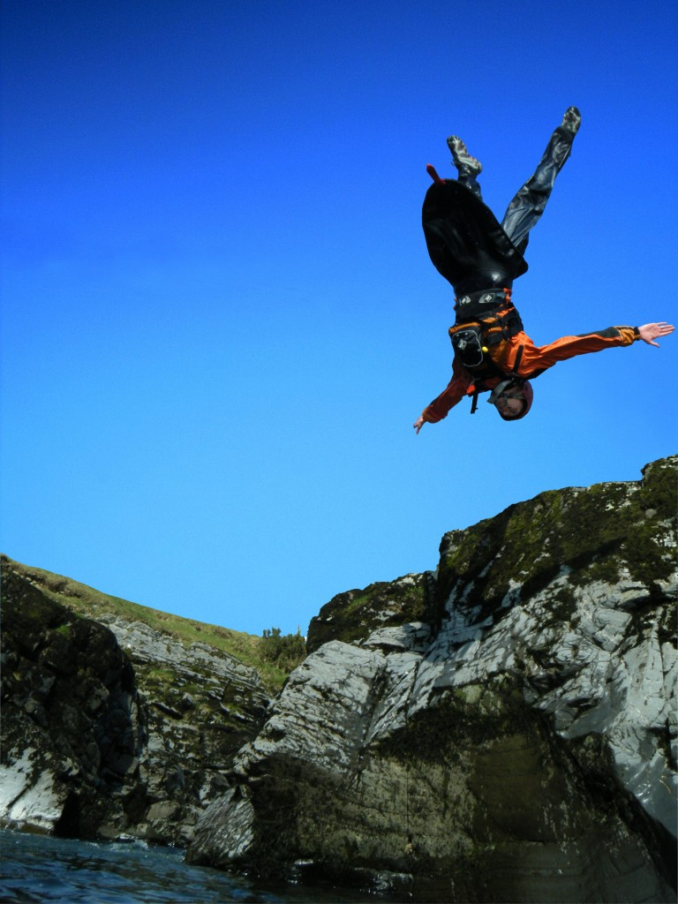

<figure class="wp-block-image">

</figure>

I did a backflip off a rock in to a river on a kayaking trip one day. My friend Leif took this
picture using my cheap point-and-shoot camera, he somehow managed to capture this perfectly. The sky
is photoshopped but the rest is true.
<a href="https://bennuttall.com/wp-content/uploads/2012/09/DSCF0203.jpg">Original here</a>. It was
on the River Lune in the Lake District in March 2012.
