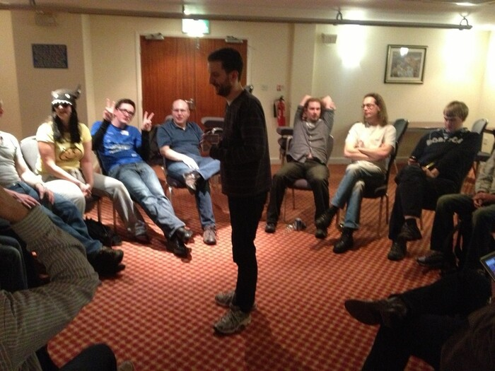

This weekend was [Barcamp Blackpool](http://barcampblackpool.com/) – held at the Norbreck Castle
Hotel in North Blackpool. It's the fourth event they've run since it kicked off in 2009 – and the
second I've attended. Last year was great fun but I only stayed for the day – this time I stayed the
night before and the night after, which exponentially increased the level of fun!

The pre-barcamp social was held at the West Coast Rock Café, where
[Robie](http://twitter.com/robiebasak) and I had a "Big Pig" Burger and
[Ash](http://twitter.com/wisemonkeyash) had a 20oz steak. Don't believe me? Here it is:

<figure class="wp-block-image">

</figure>

We had some laughs and I discussed music with [Alex](http://twitter.com/alexturgid) (aka "The Error
Messages Guy"), which led to me debating with [Mike](http://twitter.com/mheap) about which [Tony
Hawk's Pro Skater](http://en.wikipedia.org/wiki/Tony_Hawk_(series)) soundtrack featured the
[NOFX](http://en.wikipedia.org/wiki/NOFX) song *[The Separation Of Church And
Skate](http://www.youtube.com/watch?v=krZyeldj7tQ).*

In the morning we strolled downstairs for breakfast and headed over to the event where people
started to congregate. Seeing the familiar faces and a few new ones, I chatted away. I noticed
[Freaky Clown](http://twitter.com/__FreakyClown__) had arrived, so I went over to introduce myself.
I saw him speak at Hack To The Future and we've chatted via email and twitter but never properly
met. He's a very interesting guy – a grey hat hacker who goes by an alias. He works in penetration
testing and computer security and takes an interest in lock picking. He blogs about his findings at
[The Grey Hats](http://thegreyhats.blogspot.co.uk/). He had been observing me throughout the day and
watched me enter my phone's unlock pattern, and told me he had. He also went round stealing people's
identities:

<figure class="wp-block-image">

</figure>

Following an intro talk from the utterly amazing organisers [Lally](http://twitter.com/lallyd) and
[Les](http://twitter.com/biglesp), the board kicked off and began to fill up. Failure on the part of
Ash, Robie and me meant that none of us had, as we intended to, prepared a talk to give, so we just
waited to see what other people were talking about. I browsed the board and saw a few interesting
topics but with getting tied up in conversation with various people – including my old friends from
[Magma](http://twitter.com/magma_digital), I didn't make it along to any talks in the morning. While
chatting with [Jack](http://twitter.com/JackWeirdy), I spontaneously decided to put down a talk I'd
given at the first [Manchester Raspberry
Jam](https://bennuttall.com/manchester-raspberry-jam/ "Manchester Raspberry Jam"), but unfortunately
I didn't have the slides with me – so I'll save it for another time. While chatting,
[Martin](http://twitter.com/martinrue) brought up the fact that (in his opinion) I want to swap my
Android phone for an iPhone, and I explained to the group that it wasn't true, and obviously they
all played along saying I had an iPhone.

In fact in the end I only made it along to two talks – both by Freaky Clown. The first about image
manipulation (detecting nippes in a folder of photos, etc.) and how easy it is to find out where
someone lives by the [EXIF](http://en.wikipedia.org/wiki/Exchangeable_image_file_format) data
embedded in the photo file; the second on how he hacked the world in 7 seconds. Both excellent talks
– I highly recommend you go see him talk if you ever get the chance. During his first talk my phone
bleeped and he jokingly referred to it being my iPhone. Hilarious, FC. Following the closing remarks
where I picked out raffle tickets for prizes (Android phone holders) and
[Gemma](http://twitter.com/ruby_gem) (who was the previous organiser) thanked Les and Lally, we
headed to the bar. Drinking commenced, followed by dinner.

During Alex's comedy act in the evening (involving vintage computer games) I was asked to go up to
the front to demo a game of music management game [Rock Star Ate My
Hamster](http://en.wikipedia.org/wiki/Rock_Star_Ate_My_Hamster) on his [ZX
Spectrum](http://en.wikipedia.org/wiki/ZX_Spectrum) – a game brought out the year I was born – 1988!
I got up to the front to play on it, sat down at the keyboard and realised I'd left my phone, tablet
and netbook on the table. I had been sitting next to Freaky Clown. He'd seen me enter my unlock
patterns and passwords that day so he could probably get in to them with ease. I was somewhat
concerned. When I got back I expressed my concern (admitting my foolishness) and he said he wouldn't
do anything like that...

> I love my new iPhone
>
> — Ben Nuttall (@Ben_Nuttall) <a href="https://twitter.com/Ben_Nuttall/status/252139633759105024"
> data-datetime="2012-09-29T20:15:47+00:00">September 29, 2012</a>

This was followed by more drinking and a couple of games of [Werewolf](http://werewolv.es/):

<figure class="wp-block-image">

</figure>

I've never played Werewolf before, and the rules weren't explained before we started playing, so I
had a really weird experience. Things happened, I didn't really follow why. People accused each
other of being werewolves, rapists and other things, and some people seemed to get voted out of the
game. Every time I shut my eyes I had no idea what, if anything, was supposed to happen. It reminded
me of the sorts of games we played in Cub Scouts (wink murder, that sort of thing) but because
things happened when my eyes were shut I couldn't really figure it out. Every time I shut my eyes I
had to convince myself this wasn't some elaborate trick where I was being trolled by Ash, Martin and
the others. I was eventually "killed" and left the game at that point. I went over to
[Tim](http://twitter.com/timhastings) to demonstrate my Rubik's Cube solving ability, and went on to
rejoin the group for a second game. I kept quiet most of the game while I tried to work out what was
going on. It got down to there being four of us and I felt like I had to say something, so I sounded
my view that of the two other people than Ash and me, one of them had aired deductive reasoning and
the other only spoken up with jokes and messing around, but said it in a really vague way that Ash
didn't get, so they ended up voting to out the other one and if I'd have managed to get my point
across I'd have been proved right and we'd have won. I understand the game better now and look
forward to playing again. After that, I had my sexuality questioned by Martin's girlfriend and we
talked about [Adventure Time](http://en.wikipedia.org/wiki/Adventure_Time). I then solved the
Rubik's Cube so fast it fell apart in my hands:

<figure class="wp-block-image">

</figure>

A few people asked me what the reason behind the emerging micro meme 'MORNING BEN' they had
witnessed on Twitter. I explained the full story to a few people over the weekend – it starts with a
few of us noticing that someone, who shall remain anonymous, always taking the opportunity to put me
down and correct me over the tiniest detail, and us joking that if I were to say 'Good morning' and
it was 12.00 or 12.01 this person would leap at the chance to say I was wrong. So
[Farkie](http://twitter.com/farkie) started saying 'MORNING BEN' to me at 12.00 every day. And then
Martin saw it, and did the same (not knowing the in-joke), and other people would see one of the
tweets, at various times of the day, and do the same. Then a few more people tagged on, assuming the
joke was just to say good morning to me in the morning. So now, most days, I get a bunch of tweets
with 'MORNING BEN'. Usually in the morning, which is ironic. And with the iPhone thing that's now
caught on, why not add that in? And call me a
[hero](https://bennuttall.com/wp-content/uploads/2012/10/hero.jpg), like the [papers did last
week](https://bennuttall.com/hero-kayakers/ "Hero Kayakers Rescue Whitewater Dinghy Man"):

> [#Morning](https://twitter.com/search/%23Morning) [#Hero](https://twitter.com/search/%23Hero)
> @[ben_nuttall](https://twitter.com/ben_nuttall) ! How is your
> [#iPhone](https://twitter.com/search/%23iPhone) doing after
> [#bcblackpool](https://twitter.com/search/%23bcblackpool)?
>
> — Kian Ryan (@kianryan) <a href="https://twitter.com/kianryan/status/252319792659300352"
> data-datetime="2012-09-30T08:11:41+00:00">September 30, 2012</a>

Had a fantastic weekend – great to catch up with friends and meet new people. I really feel at home
at places like Barcamp, where people share my sense of humour and geekery! Where would I be without
it? Probably [here](http://www.youtube.com/watch?v=gWJIQm9qH-w).

<dl class="gallery-item">
<dt class="gallery-icon portrait">

</dt></dl><dl class="gallery-item">
<dt class="gallery-icon landscape">

</dt></dl><dl class="gallery-item">
<dt class="gallery-icon landscape">

</dt></dl> <dl class="gallery-item">
<dt class="gallery-icon landscape">

</dt></dl><dl class="gallery-item">
<dt class="gallery-icon landscape">

</dt></dl><dl class="gallery-item">
<dt class="gallery-icon landscape">

</dt></dl> <dl class="gallery-item">
<dt class="gallery-icon landscape">

</dt></dl><dl class="gallery-item">
<dt class="gallery-icon portrait">

</dt></dl><dl class="gallery-item">
<dt class="gallery-icon landscape">

</dt></dl> <dl class="gallery-item">
<dt class="gallery-icon landscape">

</dt></dl><dl class="gallery-item">
<dt class="gallery-icon landscape">

</dt></dl><dl class="gallery-item">
<dt class="gallery-icon portrait">

</dt></dl>
 

