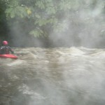

Last Wednesday, 26th September 2012, two friends and I took advantage of the rainfall and headed to
the River Irwell in Bury to paddle from *Nuttall Park* to the Burrs Activity Centre. Upon arrival at
the park the rain began again, and as we approached the bank to put on, the water was extremely high
and running very fast:

<figure class="wp-block-image">

</figure>

We got on and within a couple of minutes we hit the gorge section, which I would say was pushing
grade four. Not particularly technical, but rather severe in its volume, with very big waves and
rapids:

<figure class="wp-block-image">

</figure>

<figure class="wp-block-image">

</figure>

About half way through the gorge we spotted something orange ahead, as we got closer we noticed it
was a person wearing a life jacket, clinging to a branch. We immediately got out to see what we
could do to get to him. I paddled over in front of him and got out as close as I could. One of my
fellow paddlers, Louis, had run around (there was a bridge ahead) and got to a position above the
man. He set up a rope from above and I clipped myself to a tree with a sling. Louis threw the rope
to him which he caught, but kept hold of the tree until we instructed him to get hold of the rope
with two hands (he also appeared to be pinned against a rock, which made it hard for him to get out
of where he was) – once he let go and freed himself, keeping hold of the rope, we guided him to the
bank and I stepped out to pull him in (the sling restricting me from getting dragged out in to the
flow), and between us we managed to get him safely on the bank. Meanwhile our other paddler Liam had
called for the emergency services.

I stayed with the casualty, waiting for assistance while Louis
went to get a jacket for him to keep warm. The man was bare legged (just in underpants) and barefoot
as his trousers and shoes had been swept off him. His legs and feet were cut and very bruised. I
spoke to him once I got him seated safely, ensuring he stayed put and not try to stand up. I asked
what he was doing, he said "rafting", I said who was he with, he said by himself. I asked how long
he'd been stuck where we found him, he said about half an hour (it was probably less). I asked his
name, where he lived and if anyone knew he was out, stuff like that. I reassured him we would get
him out soon (we were stuck on the steep rocky bank at this point, with need of assistance to get
him up to the path). He kept muttering things like "I'm too old for this" and "I'm not doing this
again" – he told me he was nearly 50 (though the papers said 55). He was extremely cold, somewhat
bruised and battered (though no serious cuts or gashes) and obviously very shaken up. I also noticed
he had a scratch on his head (at this point it occurs to me he wasn't wearing a helmet!) – he said
he'd done it last week, on another river.

Shortly after, some rescue workers arrived on the path
above and I signalled to them where I was. There were a few minutes of deliberation before they
threw a throwline (Palm, might I add – the same ones we all had) down to me and instructed me to
wrap it around both of us a few times – I did so, and they sent another one down telling me to do
the same – so the two of us were now roped together with the ends tied to trees above. We heard and
saw a helicopter above us, and more and more rescuers appeared above the bank. A few times they
shouted things down to me, one of which was whether he could walk out. I didn't think so but asked
him, he said yes, so I relayed and added that he was barefoot.

Some time later a couple of them
(from Fire & Rescue) approached us from the side. They asked him his name and asked if he thought he
could walk out if they guided him – he said yes but that he was concerned about sharp rocks, and
complained of hypothermia. They shouted up to see if they could get him some shoes but didn't in the
end. They helped me unravel the ropes around us and said to leave them to walk him out. I was with
him for about 40 minutes from getting him out of the water to leaving him in the hands of the rescue
people. I went round to where it was easier to walk up the bank, and was asked to relay the
information I knew to the police and the rescue team. There were about 30 people from the police,
fire brigade, paramedics and such – all standing by on the path above, and then I noticed the array
of their vehicles along the narrow road! They managed to get him out ok and sent him to hospital.
The rescue people told us he had described his craft as an "inflatable dinghy". We were thanked by
the team and eventually we headed back to our car.

<figure class="wp-block-image">

</figure>

Thanks a lot to the fire service who really helped us get this man to safety. Excellent service and
fast response. I was impressed with how quickly they started to review the situation and analyse how
they could have improved coordination of getting their vehicles to the right place.

> The three kayakers had every piece of equipment going, including ropes, wet suits, helmets and
> mobile phones, and without them and their equipment the man would almost certainly have died – the
> water was staggeringly fast. When crews arrived, the kayakers were in the water with the man and
> he was up against the bank, practically unconscious. The crews secured him using rope lines to
> stop him going down into the water while the water rescue boat made its way to the scene. He was
> suffering from hypothermia and some cuts to his legs and was taken to hospital for treatment.

~ Station Manager Kev O'Connor, Greater Manchester Fire Service

The man was very foolish to be out
on his own in an inflatable dinghy in flood without a helmet. (four no-no's for me!) The annoying
thing is this sort of thing gives paddlesport a bad name – when it's not even real paddlesport. We
were definitely in the right place at the right time – and just as importantly – with the right kit.
It's amazing how useful a few slings, carabiners and throwline can be. We could have easily said "we
won't have chance to throwline each other on this river" and not taken them, but we did by habit. To
be honest I didn't take everything I would if I was leading a larger group – no first aid kit, no
spare clothes, etc. This has reminded me it's important to carry emergency kit. It's unlikely that
anyone would have seen him to call for help. If we hadn't have been there he'd have probably
drowned, and then the papers would have said "canoeist dies in accident" – so at least we were there
to turn the headlines around as well as rescue the guy.

> Thankfully, some well-prepared kayakers were brilliant in helping the man and got our crews to the
> scene quickly and, with the professionalism and training of the firefighters, they were able to
> rescue this man. We hope he makes a speedy recovery from his ordeal.

~ Councillor David Acton, Chair of Greater Manchester Fire and Rescue Authority

Here are some links to articles covering the incident:

- [Man in dinghy rescued from flooded river in
  Ramsbottom](http://www.bbc.co.uk/news/uk-england-manchester-19735175) – BBC News
- [Canoeists help rescue man, 55, with hypothermia and leg injuries from River Irwell after rafting
  mishap](http://menmedia.co.uk/manchestereveningnews/news/s/1589763_canoeists-help-rescue-man-55-with-hypothermia-and-leg-injuries-from-river-irwell-after-rafting-mishap) – Manchester
  Evening News
- [Fire fighters warn of dangers of rivers swollen by
  rain](http://www.itv.com/news/granada/update/2012-09-26/fire-fighters-warn-of-dangers-of-rivers-swollen-by-rain/) – ITV
  News
- [Man rescued from River Irwell after getting into trouble while
  rafting](http://www.manchesterfire.gov.uk/updates/incidents/26september2012_man_rescued_from_irwell.aspx) – Greater
  Manchester Fire & Rescue Service
- [Raft man rescued from raging River
  Irwell](http://www.lancashiretelegraph.co.uk/news/9952316.Raft_man_rescued_from_raging_River_Irwell/) – Lancashire
  Telegraph
- [Firefighters rescue rafter from
  river](http://www.prestwichandwhitefieldguide.co.uk/news/burynews/9950735.Firefighters_rescue_rafter_from_river/) – Prestwich
  and Whitefield Guide
- [Firefighters rescue rafter from
  river](http://www.burytimes.co.uk/news/9950735.Firefighters_rescue_rafter_from_river/) – Bury
  Times
- [Hero students hailed by fire chiefs](http://www.mmu.ac.uk/news/news-items/1652/) – Manchester
  Metropolitan University
- [Award for brave kayakers who saved man's
  life](http://www.manchestereveningnews.co.uk/news/greater-manchester-news/award-brave-kayakers-who-saved-3414694)
  – Manchester Evening News
- [River rescuers presented with bravery
  award](http://www.manchesterfire.gov.uk/updates/news/09may2013_brave_river_rescue_commendation.aspx)
  – Greater Manchester Fire & Rescue Service
- [Chief Officer's Activity
  Report](http://authority.manchesterfire.gov.uk/Published/C00000121/M00000462/AI00002275/132050913CFOACTIVITYREPORTQ1201314Authority.pdf)
  – Greater Manchester Fire & Rescue Service

Also here's a photo of today's Manchester Evening News with the picture the fire service took of the
three of us:

<figure class="wp-block-image">

</figure>

<dl class="gallery-item">
<dt class="gallery-icon landscape">

</dt></dl><dl class="gallery-item">
<dt class="gallery-icon landscape">

</dt></dl><dl class="gallery-item">
<dt class="gallery-icon landscape">

</dt></dl> <dl class="gallery-item">
<dt class="gallery-icon landscape">

</dt></dl><dl class="gallery-item">
<dt class="gallery-icon landscape">

</dt></dl><dl class="gallery-item">
<dt class="gallery-icon landscape">

</dt></dl> <dl class="gallery-item">
<dt class="gallery-icon landscape">

</dt></dl><dl class="gallery-item">
<dt class="gallery-icon landscape">

</dt></dl><dl class="gallery-item">
<dt class="gallery-icon landscape">

</dt></dl> <dl class="gallery-item">
<dt class="gallery-icon landscape">

</dt></dl><dl class="gallery-item">
<dt class="gallery-icon portrait">

</dt></dl><dl class="gallery-item">
<dt class="gallery-icon landscape">

</dt></dl> <dl class="gallery-item">
<dt class="gallery-icon landscape">

</dt></dl><dl class="gallery-item">
<dt class="gallery-icon landscape">

</dt></dl><dl class="gallery-item">
<dt class="gallery-icon landscape">

</dt></dl> 

Update 9th May 2013: We received an award from the fire service.

<figure class="wp-block-image">

<figcaption>Receiving the Chief Fire Officer's Commendation for bravery at a presentation in the Ramsbottom Fire Station</figcaption>
</figure>

- [River rescuers presented with bravery
award](http://www.manchesterfire.gov.uk/updates/news/09may2013_brave_river_rescue_commendation.aspx)
