I've now hosted four Raspberry Jams in Manchester. I [posted about the first and
second](https://bennuttall.com/manchester-raspberry-jam), here's a summary of what went on at III &
IV.

The August Manchester Raspberry Jam kicked off when [Kat](http://twitter.com/BinaryKitten) opened up
the [Madlab](http://www.madlab.org.uk/) and I gave an opening talk about what had been going on in
the news in the [Raspberry Pi](http://www.raspberrypi.org/) community, featuring announcements like
[Raspbian](http://www.raspbian.org/) and the [Gertboard](http://www.raspberrypi.org/archives/1734),
and showed examples of what people have been doing with their Pis – including [Freaky Clown ruinning
Metasploit](http://thegreyhats.blogspot.co.uk/2012/08/metasploit-on-raspbian-raspberry-pi.html) (a
pen testing tool) to the Pi and my personal favourite, [Pi in the
Sky](http://www.raspberrypi.org/archives/1620) – the first Raspberry Pi to visit near space. I then
got people to write down what they wanted to learn, or what they needed help with, and then what
they would be able to help others with, and tried to pair or group people together to work on
things.

Kat and Alex got straight on with playing Quake on the big TV, which was pretty cool. Meanwhile
visiting newcomer [Simon](http://twitter.com/cymplecy) – who was shocked when the taxi driver who
shuttled him from the station said he'd never heard of the supposedly world famous Madlab – got out
his lego-built Pi/breadboard stand and demonstrated his [Scratch/Python/GPIO hybrid
project](http://cymplecy.wordpress.com/2012/08/07/gpio-pins-on-raspberrypi/) which involved a
program built in Scratch which would run through the traffic lights sequence on screen when the
space bar was pressed, and also feed the same sequence through to the LEDs on his breadboard.
Amazing stuff  – if you're interested in this sort of thing drop him a line on
[twitter](http://twitter.com/cymplecy), or take a look at the [questions he's
posted](http://www.raspberrypi.org/phpBB3/memberlist.php?mode=viewprofile&u=11888) to the Raspberry
Pi forums to see if you can help.

We also had [Paul](http://twitter.com/WodgeyBoy) helping his daughter built a game in Scratch, we
saw a [Motorola Atrix
dock](http://www.motorola.com/Consumers/GB-EN/Consumer-Products-and-Services/Mobile+Phone+Accessories/Docking-Stations/Atrix-Laptop-Dock-GB-EN)
powered by the Pi, we even VNC'd in to a Pi using an Android app on my mobile phone and then from my
Nexus 7 tablet! Around 5pm once people had helped my carry my 3 monitors, TV, laptop, netbook and
bag full of cables back to my flat, we headed to the pub where we stayed for several hours, and
where Simon kept his pink lego Pi kit out on the table. During this time we witnessed HacMan move in
to their new hackspace premises just a couple of doors down from Madlab. The phrase "How many geeks
does it take to network a hackspace?" was brought up and probably tweeted, as we watched them run a
patch cable across the outside wall from Madlab over the café next door. The following day I got my
Pi out at home (I never get to play at the Jam – I just end up running around making sure
everything's running smoothly, and in any case all my kit gets handed out and all the screens tend
to be in use) and installed [OpenElec](http://openelec.tv/) on a spare SD Card (keeping Raspbian on
another), which runs [XBMC](http://xbmc.org/) – a fantastic media centre which I easily managed to
use to stream high definition video over the local network from my NAS. I tested it out with X-Men:
First Class (720p) which played no problem – looks great on monitor or big TV! I've since installed
the [XBMC Android
app](https://play.google.com/store/apps/details?id=org.xbmc.android.remote&feature=nav_result#?t=W251bGwsMSwxLDMsIm9yZy54Ym1jLmFuZHJvaWQucmVtb3RlIl0.)
on my phone and tablet and I can select something to watch on either device and tell it to play on
the TV, then use as a remote control. The future is here.

A month later and we're back in Madlab for Manchester Raspberry Jam IV – again I begin with a recap
of the news: [Revision 2.0](http://www.raspberrypi.org/archives/1929), [Made In the
UK](http://www.raspberrypi.org/archives/1925) and [Make Your Own
PiOS](http://www.cl.cam.ac.uk/freshers/raspberrypi/tutorials/os/), and move on to skill share
pairing! As usual we get a couple of people who need help setting up their SD card so I volunteered
to show them get them up and running, and everybody else just picks something and starts hacking!
Simon fires up his pink lego kit again (and eventually ends up blowing it up somehow...), and a
newcomer called [Ian](https://twitter.com/istacey) started work on a project which would allow the
[Pi to work as Time Machine](https://twitter.com/istacey/status/244841519239028736) to back up his
Mac!

Later on in the morning a 10 year old kid came up to me and asked if I could teach him some Python
(I'd put that up as a sharable skill on the wall) – I said I'd love to, and asked what he wanted to
learn, and he said anything to get him started. His Dad sat next to us an observed, saying it
reminded him of learning BASIC when he was at school. I started with printing a string, then storing
a string in a variable, printing it from its stored value, then storing integers. We then looked at
the difference between assignment (x = 1) and comparison (x == 1), and the first idea that came to
mind for implementing some of this in a program was checking an entered PIN number against a set
value. While showing him the syntax of things like if statements, I let the kid type away, letting
him make mistakes if I thought he would learn from the error messages, sometimes asking him what he
thought it would do (he would often spot a flaw immediately), sometimes just reminding him to go on
to a new line or whatever. But he was doing great. Whenever we completed adding a new feature, I'd
ask him what we could do next, so at this point he'd say, "Why don't we give them 3 chances to get
the PIN right?" and we'd look at how to implement that. We'd start by copying the code that asked
for the PIN the first time, and sticking it in the 'else', so the user would be prompted a second
time if (and only if) they got it wrong the first time.

Once we had that working, I introduced the while loop, and explained a simple use case whereby it
would count the number of attempts made, and keep running over the same code in the loop until the
number of attempts reached 3. Then while adding feedback "Your card is locked" if they were
incorrect 3 times, I noted that we could make the number of tries a variable, so that we could
change it once at the top and not everywhere in the code. He got that. Then we made it tell you how
many attempts you had remaining, by subtracting the number of attempts from the number of attempts
allowed. And then he said he thought if he learned any more he might forget what I'd taught him, so
he wanted to stop and practise that at home. I emailed the file to his Dad and suggested he might
want to try adding something that calculates the balance if they withdrew money.

We finished with a short presentation from a young lad called Barney, who had built a Morse code
device with his Dad – you type in a word on the keyboard and the LED on the breadboard flashed
according to the Morse codes for the letters in that word. Brilliant! Then we cleared up (and hauled
the vast array of monitors to my flat again) and went on to the pub. Everyone always has great fun
at the Jams, and everyone's got something different they want to get out of it. Some just come and
take notes and listen to people, some bring their kids to get them excited about computers, some
bring crazy contraptions they hope to get working on the Pi with the support of the group, some –
like me – just like being there! It's a great atmosphere and it's fantastic to see kids and adults
playing away, learning and having fun! I don't generally get much chance to do much myself, but it's
always nice to pass on some python knowledge and help out where possible – and to witness amazing
things happening all around me! The Pi is a wonder and we all thank the foundation for all their
work in getting it to where it is – and look forward to see where it goes next! Thanks again also to
Madlab for hosting the events. I really don't know how we'd do this if the space wasn't available.

<dl class="gallery-item">
<dt class="gallery-icon landscape">
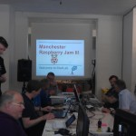
</dt></dl><dl class="gallery-item">
<dt class="gallery-icon landscape">
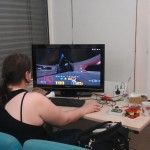
</dt></dl><dl class="gallery-item">
<dt class="gallery-icon landscape">
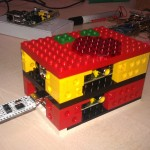
</dt></dl> <dl class="gallery-item">
<dt class="gallery-icon landscape">
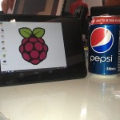
</dt></dl><dl class="gallery-item">
<dt class="gallery-icon landscape">
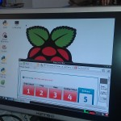
</dt></dl><dl class="gallery-item">
<dt class="gallery-icon landscape">
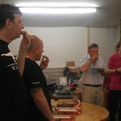
</dt></dl> <dl class="gallery-item">
<dt class="gallery-icon landscape">
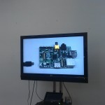
</dt></dl><dl class="gallery-item">
<dt class="gallery-icon landscape">
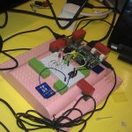
</dt></dl><dl class="gallery-item">
<dt class="gallery-icon landscape">
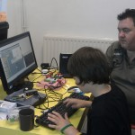
</dt></dl> <dl class="gallery-item">
<dt class="gallery-icon portrait">
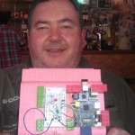
</dt></dl><dl class="gallery-item">
<dt class="gallery-icon landscape">

</dt></dl><dl class="gallery-item">
<dt class="gallery-icon landscape">
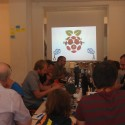
</dt></dl> <dl class="gallery-item">
<dt class="gallery-icon landscape">
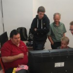
</dt></dl><dl class="gallery-item">
<dt class="gallery-icon landscape">
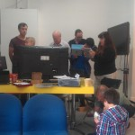
</dt></dl><dl class="gallery-item">
<dt class="gallery-icon landscape">
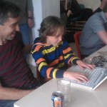
</dt></dl> <dl class="gallery-item">
<dt class="gallery-icon landscape">
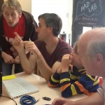
</dt></dl><dl class="gallery-item">
<dt class="gallery-icon landscape">
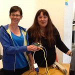
</dt></dl><dl class="gallery-item">
<dt class="gallery-icon landscape">

</dt></dl> 

