I've now run two Raspberry Pi events in Manchester, affectionately known as the Raspberry Jam. The
first in June, which was the first Raspberry Jam in the UK, and which [featured on the Raspberry Pi
Foundation's website](http://www.raspberrypi.org/archives/1396) where we gained recognition for
getting people together to share ideas, demonstrate what we've been doing with the Pi, and getting
kids interested in building games and writing code as well as inspiring people all over the UK (and
the world) to set up their own groups. Continuing the success of the Jam, our second event took
place a month later in July, which was equally enjoyable. The July event took place on the same day
as the first Cambridge Raspberry Jam – a huge event attended by 300 people and hosted by the
Raspberry Pi Foundation at Cambridge University. A number of the attendees from the first Manchester
Jam went along to the Cambridge for this, so we look forward to hearing from them about what went on
there.

I opened the first event with an introductory talk about my experience with the various computer
systems in use in education as I progressed through school. This covered me playing on [Granny's
Garden](http://en.wikipedia.org/wiki/Granny's_Garden) on the [BBC
Micro](http://en.wikipedia.org/wiki/BBC_Micro) and word processing on an [Acorn
Computer](http://en.wikipedia.org/wiki/Acorn_Computers) before moving on to [Windows
95](http://en.wikipedia.org/wiki/Windows_95) PCs, battling with this
'[Internet](http://en.wikipedia.org/wiki/Internet)' thing we'd begun to hear about – wondering what
the word '[Yahoo](http://en.wikipedia.org/wiki/Yahoo!)' that often appeared was supposed to mean,
and my first delivered tech solution at age 11 involving a series of coloured [floppy
disks](http://en.wikipedia.org/wiki/Floppy_disk#3+1.E2.81.842-inch_floppy_disk_.28.22Microfloppy.22.29).

I kicked things off by initialising a barcamp-style talks grid, and encouraged people to give talks
or demos – we had a Python tutorial, talks on Linux for beginners and 3D printing a RasPi case, and
a demo of a Raspberry Pi / [Arduino](http://www.arduino.cc/) hybrid implementation of the game
*[Operation](http://en.wikipedia.org/wiki/Operation_(game))* using a live-size manikin! Talks were
optional and there was plenty else going on alongside this – with people demonstrating the likes of
[XBMC](http://xbmc.org/) on the Pi, chatter over the distributions in use, people learning Python,
and most notably [Dan Hett](http://blog.danhett.com/) from [Manchester Game
Jam](http://madlab.org.uk/content/announcing-the-manchester-game-jam/) teaching 13 year old girl
geek [Amy](http://twitter.com/MiniGirlGeek) how to get started building games using
[Scratch](http://scratch.mit.edu/) – before long she had drawn up some characters for her game,
implemented them as sprites in her [Pacman](http://www.google.com/pacman/) clone and started using
the drag-and-drop constructs in Scratch to control the actions in the game – it was really
impressive how she was thinking like a professional developer – understanding the problems that
arose with laying out the behaviour of the objects and their interactions during gameplay. Not only
did she understand what these problems were and why they were problems, but she actually thought
hard about how she could overcome them, without giving up on it being too difficult. Within a couple
of hours or so she had built a Pacman clone with her own drawings as characters and built another
game involving flying bats – which I noticed she had instructed to keep track of high scores!

Amy showed me how she had done all this in Scratch (I have not used this before) and it looked to me
like lines of programming code – just with each construct in different coloured blocks. I told her
if she could read that she would find Python no problem so I asked her if she wanted to watch the
Python tutorial – she watched it quietly for about 15 mins, then walked off when the adults started
debating over [Python 2.7 vs. Python 3.2](https://www.google.co.uk/search?q=python+2.7+vs+3.2), and
just went back to her Pi and started typing away. She'd remembered all the things shown in the
tutorial, and tried to recreate the examples shown. With a little help from me (syntax only) she
managed to build a command line based 'game' making use of user input and randomly generated
numbers. These kids have serious potential. When given the opportunity, they make awesome stuff.

Once we packed everything away I got together with the guys from the [Blackpool Linux User
Group](http://blackpoollug.blogspot.co.uk/) and we began recording for the [Full Circle
Podcast](http://fullcirclemagazine.org/2012/07/04/fullcircle-podcast-episode-29-the-great-train-poddery/)
– generally covering the events of the day, discussing the potential of the Pi and the future of
such events.

The second event was much like the first, except I introduced an idea I saw at another event I
attended at MadLab recently – [LAMP & Beyond](http://madlab.org.uk/content/lamp-and-beyond-2/) – run
by Jeremy of [PHPNW](http://conference.phpnw.org.uk/) / [Magma
Digital](http://www.magmadigital.co.uk/), whereby attendees were asked to contribute post-it notes
of skills they had to share and skills they wanted to attain – with the intention of matching groups
of people up with a person to lead them in learning a new skill, be it language, development tool,
source control package or the latest hipster technology! This worked really well and everyone got a
lot out of it. With the Raspberry Jam I hoped this would allow beginners to get started, others to
share ideas and help each other with a leg-up without having to figure everything out for themselves
and overcome initial issues and get on with something cool. A few people wanted to learn Python so I
tutored a few people through some basic constructs of the language compared to what they're used to
in their own languages. Some people needed an OS image loaded on to their SD cards so we had a few
people helping them with that, others were making games again (Amy returned to continue with her
projects) and some others had the Pi running on an old serial terminal! Towards the end I finally
got chance to do something for myself – I got my Pi talking to a breadboard using the PyPi GPIO
library! We figured out which pins were which and hooked up an LED with a resistor and controlled
its on/off status with a Python command – followed by a few functions (let_there_be_light() and
such) which could be called to turn the light on or have it flash. A pretty cool start to external
hardware controlled by the Pi. The interesting thing about this ability is that it would be possible
to program the Pi to do something and have it do it without use of an external display – just listen
to events happen and do things according to the state of those inputs – anything from controlling
water sprinkler systems based on soil moisture to ... well, anything!

I think it's fair to say that everyone who comes to one of these events finds something out about
the Pi they didn't know before – the skills sharing nature of the Jam is to be praised and I would
encourage anyone of any age or experience to attend one – or start their own!

Update: a few pictures from Jams I & II:

<dl class="gallery-item">
<dt class="gallery-icon landscape">
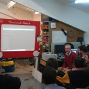
</dt></dl><dl class="gallery-item">
<dt class="gallery-icon landscape">
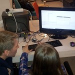
</dt></dl><dl class="gallery-item">
<dt class="gallery-icon landscape">
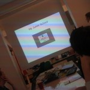
</dt></dl> <dl class="gallery-item">
<dt class="gallery-icon landscape">
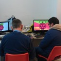
</dt></dl><dl class="gallery-item">
<dt class="gallery-icon portrait">
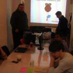
</dt></dl><dl class="gallery-item">
<dt class="gallery-icon landscape">
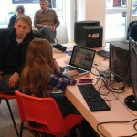
</dt></dl> <dl class="gallery-item">
<dt class="gallery-icon portrait">
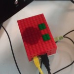
</dt></dl><dl class="gallery-item">
<dt class="gallery-icon landscape">
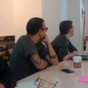
</dt></dl><dl class="gallery-item">
<dt class="gallery-icon landscape">
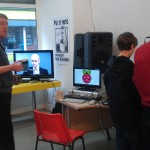
</dt></dl> <dl class="gallery-item">
<dt class="gallery-icon landscape">
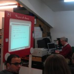
</dt></dl><dl class="gallery-item">
<dt class="gallery-icon portrait">
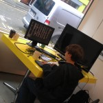
</dt></dl><dl class="gallery-item">
<dt class="gallery-icon landscape">
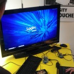
</dt></dl> <dl class="gallery-item">
<dt class="gallery-icon landscape">
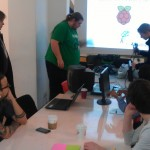
</dt></dl><dl class="gallery-item">
<dt class="gallery-icon landscape">
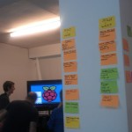
</dt></dl><dl class="gallery-item">
<dt class="gallery-icon landscape">
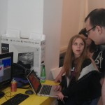
</dt></dl> 

Photos courtesy of [Les Pounder's Flickr](http://www.flickr.com/photos/45703688@N07/sets/72157630039787875/)
and [Dan Hett's blog](http://blog.danhett.com/)
